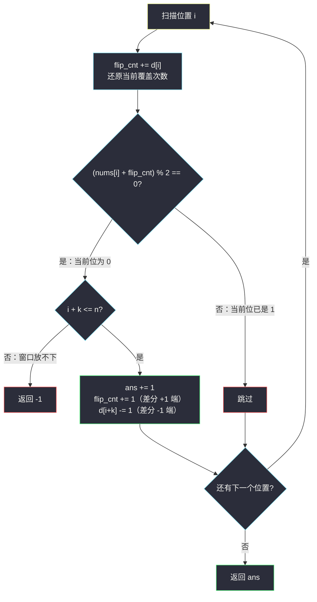

# K 连续位的最小翻转次数（一维差分 · 翻转奇偶）

## 一、问题描述

给定一个二进制数组 `nums`（只含 `0` 和 `1`）和一个整数 `k`。

**K 位翻转**是一次操作：选择一个长度为 `k` 的**连续子数组**，同时把子数组中的每个 `0` 翻转为 `1`，每个 `1` 翻转为 `0`。

返回使数组中**不存在 0**（全部变为 1）所需的最小 K 位翻转次数。如果不可能，返回 `-1`。

> 🔗 LeetCode 995：https://leetcode.cn/problems/minimum-number-of-k-consecutive-bit-flips/
>
> 数据范围：`1 <= nums.length <= 10^5`，`1 <= k <= nums.length`。
>
> 📚 灵茶题单 **§2.1 一维差分**。

**示例 1**

```
输入：nums = [0,1,0], k = 1
输出：2
解释：翻转 nums[0]，再翻转 nums[2]，数组变为 [1,1,1]。
```

**示例 2**

```
输入：nums = [1,1,0], k = 2
输出：-1
解释：无论怎么翻转右边 2 个元素都不会使数组变为 [1,1,1]。
```

**直观理解**

翻转是**可交换**的（异或顺序无关）：同一个窗口翻两次等于白翻。于是真正有信息量的只是「每个长度为 `k` 的窗口被翻了奇数次还是偶数次」。从左到右扫描时，最左边那个还是 `0` 的位置，**只有**以它开头的窗口能救它——决策是被迫的，一条路走到底，走不通就是 `-1`。难点只剩一个工程问题：`O(1)` 地知道「当前位置已被翻了多少次」，这正是差分数组的主场。

---

## 二、暴力解法

最直接的模拟：从左到右扫，遇到当前位是 `0`（与目标 1 不符）就把窗口 `nums[i..i+k-1]` 整段真的异或一遍：

```python
class Solution:
    def minKBitFlips(self, nums: List[int], k: int) -> int:
        n = len(nums)
        ans = 0
        for i in range(n):
            if nums[i] == 0:                     # 当前位是 0，必须翻
                if i + k > n:                    # 窗口放不下
                    return -1
                for j in range(i, i + k):        # 物理翻转整个窗口
                    nums[j] ^= 1
                ans += 1
        return ans
```

这个做法**结果正确**（贪心唯一性的直接体现，见 3.2 节），但每次翻转都扫 `k` 个格子：

### 复杂度

- **时间**：最坏 `O(n · k)`。交错长串配大 `k` 时（如 `n = 10^5`、`k = 5 × 10^4`）高达 `5 × 10^9` 次异或，超时。
- **空间**：`O(1)` 额外（原地修改输入；若不破坏输入则 `O(n)`）。

### 🔴 瓶颈在哪里

我们关心的从来不是窗口里每个格子的具体值，而是**「当前位置累计被翻了几次」的奇偶性**。窗口 `[i, i+k-1]` 的翻转让区间 `[i, i+k-1]` 的计数整体 `+1`——「区间加、单点实时查」正是差分的招牌场景，两端记账即可。

---

## 三、优化探索（核心章节）

> 📚 本题在灵茶题单中属于 **§2.1 一维差分**。灵神的讲法：翻转长度 `k` 的子数组 = 差分数组上 `d[i] += 1、d[i+k] -= 1`；从左到右扫描时用「差分前缀和」实时还原出当前位置被翻转的次数，其奇偶决定当前位的真实值。这道题把差分从「最后统一还原」升级成「边扫边还原」，是差分数组动态用法的教科书。

### 3.1 把「翻转」翻译成计数语言

设窗口 `[s, s+k-1]` 被翻转的次数为 `flip(s)`（同一个窗口翻两次相互抵消，可只关心 `flip(s) mod 2`）。位置 `i` 的最终值是：

```
nums[i] XOR (覆盖 i 的翻转总次数 mod 2)
覆盖 i 的窗口起点 s 满足：i-k+1 <= s <= i
```

目标「全 1」翻译过来：`nums[i] = 0` 的位置要被覆盖**奇数次**，`nums[i] = 1` 的位置要被覆盖**偶数次**。

### 3.2 贪心为什么对：决策被唯一确定，贪心即唯一解

从 `i = 0` 开始逐位分析，关键观察是**因果单向**：

- 位置 `i` 只被起点 `s ∈ [i-k+1, i]` 的窗口覆盖；
- 从左到右处理时，`s < i` 的 `flip(s)` 已全部敲定（它们都是为了救更左的位置被迫做的）；
- 于是位置 `i` 的奇偶方程里，**唯一还没定的变量只剩 `flip(i)`**——它的取值被直接解出，没有选择余地。

归纳下去：**每一个 `flip(i)` 都被唯一确定**。换句话说，可行解（若存在）只有这一个，贪心找到的就是唯一解，自然也是次数最少的。「最少」二字在这个结构里其实是句安慰——根本没有第二个解可比。

- 若解出 `flip(i) = 1`（当前位置仍为 0）但 `i + k > n`（窗口放不下）→ 无解，返回 `-1`；
- 顺带一提：把 `flip(i)` 从「被迫的 0」改成「多余的 1」只会把后续奇偶搅乱、逼出更多翻转，绝不会更省。

### 3.3 用差分实时维护「覆盖次数」

判定「位置 `i` 当前真实值」只需两个量：

- `d[0..n]`：差分数组。决定翻窗口 `[i, i+k-1]` 时 `d[i+k] -= 1`（`d[i]` 处的 `+1` 直接并进下面的累加器，不必落盘）；
- `flip_cnt`：扫描到 `i` 时先 `flip_cnt += d[i]`，它就是「起点 ≤ i 的翻转中仍覆盖 `i` 的个数」——先前 `+1` 进来的都会在 `i+k` 处被 `-1` 及时收回。

当前真实值 = `(nums[i] + flip_cnt) % 2`。为 `0`（与目标 1 不符）就翻：`ans += 1`、`flip_cnt += 1`、`d[i+k] -= 1`。



### 3.4 空间优化：deque 只留「活着的」翻转

`d[i+k] -= 1` 的意义是「窗口 `i` 的翻转在位置 `i+k` 失效」。既然失效时间严格递增，用**单调队列**（deque）存每个翻转的失效位置 `i+k`，到位置 `i` 时把队头 `≤ i` 的都弹出，队长即 `flip_cnt`——空间降到 `O(min(n, k))`，完全不需要数组。

### 3.5 与差分家族其他成员的分工

| 题 | 差分的角色 |
|----|-----------|
| [#1109 航班预订统计](https://leetcode.cn/problems/corporate-flight-bookings/) | 静态：全部记账完再统一还原 |
| [#3914 使数组非递减](minimum-operations-to-make-array-non-decreasing.md) | 计数：数差分数组的负部之和 |
| [#1526 形成目标数组](minimum-number-of-increments-on-subarrays-to-form-a-target-array.md) | 计数：数差分数组的正部之和 |
| 本题 #995 | **动态状态机**：边扫边还原奇偶，驱动决策 |

### 3.6 一句话核心

> **每个窗口翻不翻被从左到右唯一确定；当前位置真实值 = `nums[i] XOR (覆盖次数奇偶)`，覆盖次数用差分 `d[i+k] -= 1` 两端记账、`flip_cnt` 边扫边还原，整体 `O(n)`。**

---

## 四、代码实现

### Python（主解：差分数组版）

```python
class Solution:
    def minKBitFlips(self, nums: List[int], k: int) -> int:
        n = len(nums)
        d = [0] * (n + 1)                 # 差分数组，d[i+k] 存 -1 收账标记
        flip_cnt = 0                      # 当前位置被覆盖的翻转次数
        ans = 0
        for i in range(n):
            flip_cnt += d[i]              # 进账（通常是 0 或 -1）
            if (nums[i] + flip_cnt) % 2 == 0:   # 当前位为 0，必须翻
                if i + k > n:             # 窗口放不下
                    return -1
                ans += 1
                flip_cnt += 1             # 差分 +1 端直接并入累加器
                d[i + k] -= 1             # 差分 -1 端挂账，i+k 处收回
        return ans
```

**变量含义**

| 变量 | 含义 |
|------|------|
| `d[i + k]` | 窗口 `i` 的翻转在位置 `i+k` 失效的收账标记（`-1`） |
| `flip_cnt` | 覆盖当前位置 `i` 的活跃翻转个数（起点 ≤ i 且未失效） |
| `(nums[i] + flip_cnt) % 2` | 位置 `i` 的当前真实值（被翻了奇数次则取反） |
| `ans` | 已执行的翻转次数 |

**循环不变式**：进入第 `i` 轮、完成 `flip_cnt += d[i]` 之后，`flip_cnt` = 所有起点 `s ≤ i` 的翻转中覆盖 `i` 的个数；因此 `(nums[i] + flip_cnt) % 2` 恰为位置 `i` 当前的真实位值。

### Python（deque 优化版：`O(min(n, k))` 空间）

```python
from collections import deque

class Solution:
    def minKBitFlips(self, nums: List[int], k: int) -> int:
        n = len(nums)
        expires = deque()                 # 每个“活跃翻转”的失效位置 i+k，严格递增
        ans = 0
        for i in range(n):
            while expires and expires[0] <= i:   # 失效时间到了，弹出
                expires.popleft()
            if (nums[i] + len(expires)) % 2 == 0:  # len(expires) 即 flip_cnt
                if i + k > n:
                    return -1
                ans += 1
                expires.append(i + k)
        return ans
```

### Java（最优解同款）

```java
class Solution {
    public int minKBitFlips(int[] nums, int k) {
        int n = nums.length;
        int[] d = new int[n + 1];          // 差分收账标记
        int flipCnt = 0, ans = 0;
        for (int i = 0; i < n; i++) {
            flipCnt += d[i];
            if (((nums[i] + flipCnt) & 1) == 0) {  // 当前位为 0
                if (i + k > n) return -1;          // 窗口放不下
                ans++;
                flipCnt++;
                d[i + k]--;
            }
        }
        return ans;
    }
}
```

**验证正确性的对拍脚本（可选练习）**：小规模用 BFS 枚举所有翻转序列求精确最优，与贪心对拍：

```python
from collections import deque

def bfs(nums, k):
    n = len(nums)
    start, seen, q = tuple(nums), {tuple(nums)}, deque([(start, 0)])
    while q:
        st, steps = q.popleft()
        if all(st):                        # 全 1
            return steps
        for i in range(n - k + 1):
            t = list(st)
            for j in range(i, i + k): t[j] ^= 1
            t = tuple(t)
            if t not in seen:
                seen.add(t); q.append((t, steps + 1))
    return -1

# for _ in range(3000): 随机 nums/k 对拍 assert 一致 —— 实测全部吻合
```

---

## 五、具体例子演示

### 例 1：nums = [0,1,1,0,1,1], k = 2（链式传播，3 次翻转）

这是最能看到「被迫决策」的形态：翻一个窗口，把需要修复的 `0` 往右推一格。

**第一步：差分版逐轮跟踪（每步给出差分数组与覆盖计数的当前值）**

`n = 6`，`d` 长度 `n+1 = 7`，初始全 0。

| i | flip_cnt（进账后） | 当前真实值 `(nums[i]+flip)%2` | 动作 | d 状态（索引 0..6） | ans |
|---|--------------------|------------------------------|------|---------------------|-----|
| 0 | 0 | 0 | 翻 [0,1]：`flip=1`、`d[2]-=1` | `[0,0,-1,0,0,0,0]` | 1 |
| 1 | 1 | `(1+1)%2 = 0` | 翻 [1,2]：`flip=2`、`d[3]-=1` | `[0,0,-1,-1,0,0,0]` | 2 |
| 2 | 2-1 = 1 | `(1+1)%2 = 0` | 翻 [2,3]：`flip=2`、`d[4]-=1` | `[0,0,-1,-1,-1,0,0]` | 3 |
| 3 | 2-1 = 1 | `(0+1)%2 = 1` | 跳过 | 不变 | 3 |
| 4 | 1-1 = 0 | `(1+0)%2 = 1` | 跳过 | 不变 | 3 |
| 5 | 0 | `(1+0)%2 = 1` | 跳过 | 不变 | 3 |

看点在第 1、2 行：原数组里 `nums[1] = nums[2] = 1` 本不需要动，但前一个窗口把它们翻成了 0，于是被迫接着翻——`0` 就这样被一步步推到数组右端滑出去。

**第二步：物理对照（验证差分账本没记错）**

| 轮次 | 翻转窗口 | 数组状态 |
|------|----------|----------|
| 初始 | — | `[0,1,1,0,1,1]` |
| 1 | [0,1] | `[1,0,0,0,1,1]` |
| 2 | [1,2] | `[1,1,1,0,1,1]` |
| 3 | [2,3] | `[1,1,1,1,1,1]` ✓ |

差分账本与物理翻转全程一致；窗口 `[0,1]` 在位置 2 失效（`d[2]`）、`[1,2]` 在位置 3 失效（`d[3]`）、`[2,3]` 在位置 4 失效（`d[4]`），`flip_cnt` 相应从 2 递减回 0。

### 例 2：nums = [0,1,0], k = 1（官方示例 1，答案 2）

| i | flip_cnt | 当前真实值 | 动作 | ans |
|---|----------|-----------|------|-----|
| 0 | 0 | 0 | 翻 [0,0]，`d[1] -= 1` | 1 |
| 1 | 0（窗口 [0,0] 已收账） | 1 | 跳过 | 1 |
| 2 | 0 | 0 | 翻 [2,2] | 2 |

输出 2 ✓。

### 例 3：nums = [1,1,0], k = 2（官方示例 2，答案 -1）

| i | flip_cnt | 当前真实值 | 动作 |
|---|----------|-----------|------|
| 0 | 0 | 1 | 跳过 |
| 1 | 0 | 1 | 跳过 |
| 2 | 0 | **0** | 需翻 [2,3]，但 `2 + 2 = 4 > 3 = n` → **返回 -1** |

位置 2 的 `0` 只能由窗口 [1,2] 救，但那会把位置 1 翻成 0、位置 2 翻成 1，之后位置 1 再无窗口可救——本质原因是「覆盖位置 2 的需求与 `k` 的边界冲突」，差分版在越界检查处直接判死。

---

## 六、复杂度分析

| 方法 | 时间 | 空间 | 说明 |
|------|------|------|------|
| 物理翻转模拟 | `O(n · k)` | `O(1)` 额外 | 正确但慢 |
| 差分数组 | `O(n)` | `O(n)` | 两端记账 + 边扫边还原 |
| deque 滑窗 | `O(n)` | `O(min(n, k))` | 只保留活跃翻转的失效位置 |

- **时间**：每个位置一次判定；每次翻转 `O(1)` 记账。deque 版每个元素至多进出队一次。
- **空间**：差分数组 `n+1` 个整数；deque 版至多同时存活 `k` 个翻转（窗口起点互异且失效时间递增）。

---

## 七、对比总结

**一维差分家族的四种用法（灵神 §2.1 全景）**

| 用法 | 代表题 | 一句话 |
|------|--------|--------|
| 静态区间加 + 统一还原 | #1109 航班预订统计 | 记完账做一遍前缀和 |
| 数差分正部 | #1526 形成目标数组 | 上坡总量 |
| 数差分负部 | #3914 使数组非递减 | 下坡总量 |
| 动态状态机 | 本题 #995 | 边扫边还原奇偶，驱动贪心 |

**易错点**

1. **判定式与目标对齐**：目标是全 1，所以「当前位为 0」即 `(nums[i] + flip_cnt) % 2 == 0` 时才翻；若目标口径是全 0，判定条件取反。先想清楚目标再写条件。
2. **越界检查的时机**：只在「需要翻转」时检查 `i + k > n`；当前位已符合目标时位置可以合法地靠近末尾。
3. **收账顺序**：先 `flip_cnt += d[i]` 再判定；颠倒会把已失效的翻转算进来。
4. **`+1` 端不落盘**：`flip_cnt += 1` 直接并入累加器、只有 `-1` 端挂账 `d[i+k]`——若老老实实写 `d[i] += 1`，本轮还得记得给自己进账一次，容易漏。
5. **deque 版弹出条件**：失效位置 `≤ i` 都要弹（窗口 `[s, s+k-1]` 覆盖到 `s+k-1` 为止，位置 `i >= s+k` 即失效）。

**模板（差分维护区间翻转奇偶，Python 版）**

```python
def flip_windows(nums, k):              # 目标：全 1；当前位为 0 则翻
    n = len(nums)
    d = [0] * (n + 1)
    flip = ans = 0
    for i in range(n):
        flip += d[i]
        if (nums[i] + flip) % 2 == 0:   # 当前位与目标不符
            if i + k > n:
                return -1
            ans += 1
            flip += 1
            d[i + k] -= 1
    return ans
```

---

## 八、举一反三

| 题目 | 关系 |
|------|------|
| [832. 翻转图像](https://leetcode.cn/problems/flipping-an-image/) | 翻转的热身款：整体翻转 + 取反，无窗口限制 |
| [598. 区间加法 II](https://leetcode.cn/problems/range-addition-ii/) | 一维差分最简形态（区间加、问公共区域） |
| [1109. 航班预订统计](https://leetcode.cn/problems/corporate-flight-bookings/) | §2.1 入门：区间加 + 统一前缀还原 |
| [1252. 奇数值单元格的数目](https://leetcode.cn/problems/cells-with-odd-values-in-a-matrix/) | 行列差分计数，奇偶判定与本题同款 |
| [2132. 用邮票贴满网格图](https://leetcode.cn/problems/stamping-the-grid/) | 窗口覆盖计数的二维 Hard 版，见同目录 `increment-submatrices-by-one.md` |
| [3914. 使数组非递减需要的最小累计值](https://leetcode.cn/problems/minimum-operations-to-make-array-non-decreasing/) | 同小节姊妹篇（数差分负部），见 `minimum-operations-to-make-array-non-decreasing.md` |
| [1526. 形成目标数组的子数组最少增加次数](https://leetcode.cn/problems/minimum-number-of-increments-on-subarrays-to-form-a-target-array/) | 同小节姊妹篇（数差分正部），见 `minimum-number-of-increments-on-subarrays-to-form-a-target-array.md` |

**思想迁移**

- 「操作可交换 + 只关心奇偶」→ 先把问题压缩到 0/1 决策层，再从左到右因果单向地解方程，贪心往往是被**唯一确定**的——此时「最优性证明」退化为「唯一性证明」。
- 「区间加、单点实时查」是差分数组的动态形态；静态版「最后统一查」是它的退化情形。deque 存失效事件是通用套路（与滑动窗口最大值同款骨架）。
- 口诀：**「左位是零必开窗，差分记账奇偶通；越界即死返回负一，边扫边收账目清。」**
