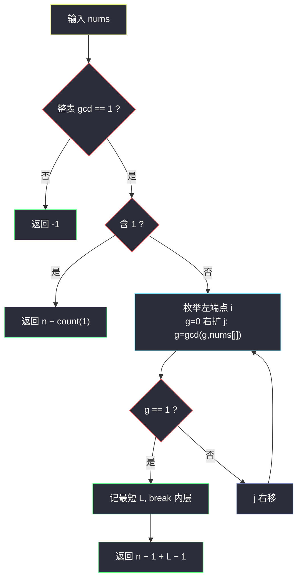

# 2654. 使数组所有元素变成 1 的最少操作次数（Minimum Number of Operations to Make Array Elements Equal to 1）

> 题目来源：[https://leetcode.cn/problems/minimum-number-of-operations-to-make-all-array-elements-equal-to-1/](https://leetcode.cn/problems/minimum-number-of-operations-to-make-all-array-elements-equal-to-1/)
>
> 灵茶题单小节定位：§1.6 最大公约数（GCD）

## 一、问题描述

给你一个下标从 0 开始的**正**整数数组 `nums`。你可以对数组执行以下操作**任意次**：

选择一个满足 `0 <= i < n - 1` 的下标 `i`，将 `nums[i]` 或者 `nums[i+1]` 两者**之一**替换成它们的最大公约数。

请你返回使数组 `nums` 中所有元素都等于 `1` 的**最少**操作次数。如果无法让数组全部变成 `1`，请你返回 `-1`。

两个正整数的最大公约数指的是能整除这两个数的最大正整数。

**数据范围**：

- `2 <= nums.length <= 50`
- `1 <= nums[i] <= 10⁶`

**示例 1**：

```text
输入：nums = [2,6,3,4]
输出：4
解释：
- 选下标 i=2，nums[2] ← gcd(3,4) = 1，得 [2,6,1,4]
- 选下标 i=1，nums[1] ← gcd(6,1) = 1，得 [2,1,1,4]
- 选下标 i=0，nums[0] ← gcd(2,1) = 1，得 [1,1,1,4]
- 选下标 i=2，nums[3] ← gcd(1,4) = 1，得 [1,1,1,1]
```

**示例 2**：

```text
输入：nums = [2,10,6,14]
输出：-1
解释：无法将所有元素都变成 1。
```

**核心思考点**：能否全变 1 取决于**整个数组的 gcd 是否为 1**（gcd 只会传递、不会凭空产生 1 之外的因子）；一旦第一个 1 诞生，每个 1 都能在一次操作里「传染」给相邻元素，还需 `n − 1` 次。造出第一个 1 的最少代价 = **gcd 恰好为 1 的最短连续子数组的长度 − 1**。

## 二、暴力解法

### 思路

按题意模拟搜索：状态是整个数组，每次操作选相邻一对、把其中一个换成 gcd——状态空间爆炸，不可行。退而求其次的「暴力」是：**枚举所有连续子数组**，对每个子数组求整体 gcd，看哪些子数组 gcd 为 1，取最短者。这部分本来就是主解的核心，真正多出来的暴力成分是「枚举子数组时每个都重新算一遍 gcd」。

### 代码

```python
from math import gcd

def minOperationsBrute(nums: list[int]) -> int:
    n = len(nums)
    if 1 in nums:                       # 已有 1：每个非 1 元素一次操作
        return n - nums.count(1)
    best = float("inf")
    for i in range(n):                  # 暴力枚举子数组, 逐个求 gcd
        for j in range(i, n):
            g = 0
            for k in range(i, j + 1):
                g = gcd(g, nums[k])
            if g == 1:
                best = min(best, j - i + 1)
    return -1 if best == float("inf") else n - 1 + best - 1
```

### 复杂度

- 时间：`O(n³ log V)`——`n²` 个子数组、每个 `O(n)` 次 gcd。`n = 50` 时约 `1.25×10⁵` 次 gcd，可过。
- 空间：`O(1)`。

## 三、优化探索

### 3.1 可行性判定：整表 gcd 为 1 ⇔ 能全变 1 ⭐

一次操作把某个元素替换为相邻两数的 gcd，操作前后**整个数组的 gcd 不变**（`gcd(a,b)` 与 `a,b` 有相同公因子集）。反过来，整表 gcd 为 1 时，取任一最短的 gcd=1 子数组，总能在子数组内逐步「压」出一个 1：

- 子数组 `[x₁..x_L]` 的 gcd 是 1，说明存在操作序列让某个中间结果变成 1——具体做法是从左到右滚动求 gcd，一旦前缀 gcd 与剩余部分的 gcd 互补出 1……

更构造性的论证：设子数组整体 gcd 为 1。先在子数组内做「`nums[j] ← gcd(nums[j−1], nums[j])`」的**前缀滚动**：`g₁ = x₁`，`g₂ = gcd(g₁, x₂)`，……`g` 值不增且最终 `g_L = 1`。而每个 `g_t` 都能通过「左侧元素携带 `g_{t-1}` 与 `x_t` 做 gcd」一步得到——恰好 `L − 1` 次操作把某个位置变成 1（滚动 gcd 第一次出现 1 的位置，至多 L−1 步）。之后第一个 1 用 `n − 1` 次传染全表。总操作数 = `(L − 1) + (n − 1)`。

下界也是它：造第一个 1 至少要在某条「链」上混合 `L` 个元素（gcd 为 1 的最小窗口），此后每个非 1 至少一次操作。故最优 = `n − 1 + min{L − 1 : gcd(子数组) = 1}`。

### 3.2 已有 1 的捷径 ⭐

若数组里本来就有 `cnt` 个 1，不需要「造 1」阶段：每个非 1 元素挨着一个 1 一次变 1，答案 `n − cnt`（每个 1 自己不用动）。

### 3.3 枚举优化：固定左端点右扩 gcd，提前终止 ⭐

`n = 50` 暴力已过，但标准姿势是：固定左端点 `i`，`j` 右扩时**增量维护** `g = gcd(g, nums[j])`；`g == 1` 时记录 `j − i + 1` 并 `break`（`g` 单调不增，之后不可能再 < 1，更长的窗口只会更差）。`O(n² log V)`。



## 四、代码实现

### 主解：gcd 为 1 的最短子数组 + 传染

```python
from math import gcd

class Solution:
    def minOperations(self, nums: List[int]) -> int:
        n = len(nums)
        cnt = nums.count(1)
        if cnt:                          # 已有 1，直接传染
            return n - cnt
        total = 0
        for x in nums:
            total = gcd(total, x)
        if total != 1:                   # 整表 gcd != 1，永远造不出 1
            return -1
        best = n + 1
        for i in range(n):
            g = 0
            for j in range(i, n):
                g = gcd(g, nums[j])
                if g == 1:
                    best = min(best, j - i + 1)
                    break                # g 单调不增，更长的窗口必更差
        return n - 1 + best - 1
```

### 细节说明

- **先判 `-1` 再找窗口**：整表 gcd ≠ 1 时不存在 gcd=1 的子数组，两层循环会白跑；先算 `total` 提前拦截（也可以靠 `best` 仍为 `n+1` 兜底判 `-1`，两种写法等价）。
- **`break` 的正确性**：固定 `i` 时 `g` 随 `j` 增大单调不增，首次到 1 就是最短；不 break 也不会错，只是浪费。
- **`n − 1 + L − 1` 的两段拆分**：`L − 1` 造第一个 1（滚动 gcd 的步数），`n − 1` 让其余 `n − 1` 个元素逐个变 1（每个挨着已变 1 的邻居操作一次）。注意**不是** `n − 1 + L − 1 − 1`——第一个 1 诞生在窗口内的某位置，它本身无需再传染自己，但窗口内其余 `L − 1` 个非 1 元素仍各需一次操作，加上窗外 `n − L` 个，共 `n − 1` 次，与拆分一致。
- **单元素窗口不存在**：`cnt = 0` 时窗口长度 ≥ 2；若某 `nums[i] = 1` 已被前面分支拦截。
- **Java 版（可选）**：`gcd` 用辗转相除，`n ≤ 50` 无溢出顾虑。

## 五、例子演示

**示例 1 端到端：nums = [2,6,3,4]**

| 步骤 | 内容 |
|---|---|
| 含 1？ | 无 |
| 整表 gcd | `gcd(2,6,3,4) = 1` → 可行 |
| 找最短 gcd=1 窗口 | `[2,6]` gcd=2；`[2,6,3]` gcd=1 → L=3（i=0）；`[6,3]` gcd=3；`[3,4]` gcd=1 → **L=2**（i=2 最短）|
| 答案 | `n − 1 + L − 1 = 3 + 1 = 4` ✅ |

操作序列印证（题面给出）：`[3,4]` 窗口一步造出 1（`gcd(3,4)=1`），再 3 次传染其余三个元素——恰好 `1 + 3 = 4`。

**示例 2：nums = [2,10,6,14]**：整表 `gcd = 2 ≠ 1`，返回 `-1` ✅——全是偶数，任何 gcd 操作只产生偶数，1 永不出现。

**含 1 的自造例子：nums = [1, 5, 7]**：`cnt = 1`，答案 `3 − 1 = 2`（`gcd(1,5)=1` 覆盖 5、`gcd(1,7)` 链式覆盖 7，各一次）。

**滚动 gcd 逐步跟踪（窗口 [2,6,3]，展示「L−1 步造 1」）**：

| 步 | 操作 | 数组状态 | 说明 |
|---|---|---|---|
| 1 | `nums[1] ← gcd(2,6) = 2` | [2,2,3] | 前缀 gcd 2 |
| 2 | `nums[2] ← gcd(2,3) = 1` | [2,2,1] | 第一个 1 诞生，共 L−1 = 2 步 |

若用窗口 `[3,4]` 更短：一步 `nums[3] ← gcd(3,4) = 1`，L−1 = 1 步——印证取最短窗口的意义。

## 六、复杂度分析

设 `n = len(nums)`，`V = max(nums)`：

- **时间复杂度：`O(n·(n + log V))`**——整表 gcd 一遍 `O(n log V)`；双循环每步一次 gcd，`O(n² log V)` 量级里 gcd 高度摊薄（`g` 每变小至少减半，实际每个 `i` 平均只做常数次「有效」gcd，其余是整除直落）。工程上记 `O(n² log V)` 保守上界，`n = 50` 毫秒级。
- **空间复杂度：`O(1)`**。

## 七、对比总结

| 维度 | 暴力（重算子数组 gcd） | 主解（增量右扩 + 提前 break） |
|---|---|---|
| 时间 | `O(n³ log V)` | `O(n² log V)` |
| 空间 | `O(1)` | `O(1)` |
| n=50 | 可过 | 可过（n=2000 也稳） |
| 思想 | 定义直译 | gcd 随右扩单调不增 |

**套路归纳**：「gcd 传染」类题的通用框架——①可行性看**整表 gcd**（gcd 是操作不变量）；②造第一个目标值（这里是 1）找**最短 gcd 达标子数组**，固定左端点增量右扩 + 单调性 break；③之后每个元素一次操作线性传染。`gcd(a, b)` 只依赖因子集合这一「不变量思维」，是数论操作题的破题钥匙。

## 八、举一反三

1. **[914. 卡牌分组](https://leetcode.cn/problems/x-of-a-kind-in-a-deck-of-cards/)**：所有计数的 gcd 是否 ≥ 2，整表 gcd 判定的直接应用。
2. **[2447. 最大公因数等于 K 的子数组数目](https://leetcode.cn/problems/number-of-subarrays-with-gcd-equal-to-k/)**：本站 `number-of-subarrays-with-gcd-equal-to-k.md`（GCD LogTrick），「右端点固定、gcd 段列表」的进阶维护方式，本题的下一步。
3. **[1819. 序列中不同最大公约数的数目](https://leetcode.cn/problems/number-of-different-subsequences-gcds/)**：子数组 gcd 能取多少不同值，gcd 单调性的 Hard 应用。
4. **[878. 第 N 个神奇数字](https://leetcode.cn/problems/nth-magical-number/)**：gcd/lcm 容斥计数，数论家族的经典搭配。
5. **[365. 水壶问题](https://leetcode.cn/problems/water-and-jug-problem/)**：倒水操作的不变量也是 gcd——「操作保持 gcd、目标须是 gcd 的倍数」，与本题「gcd 不变、1 须被 gcd 包含」逻辑同构。

**同族互引**：本批 `minimum-deletions-to-make-array-divisible.md`（#2344，Hard）同样以「整表 gcd 的因子」为核心，两题一求「最少操作」一求「最少删除」，对照刷完 gcd 小节收官。
