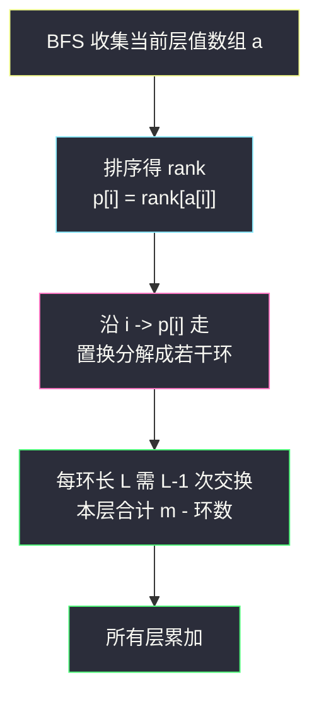
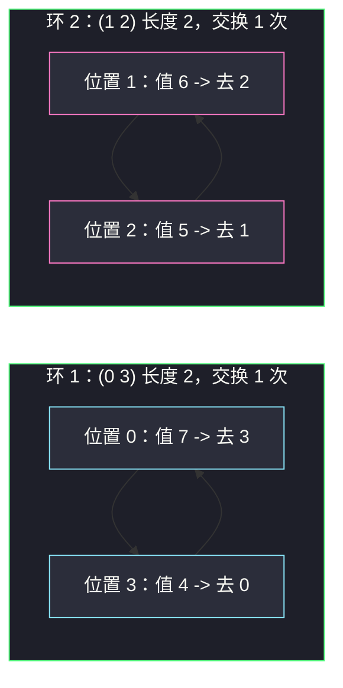

# 逐层排序二叉树所需的最少操作数目（BFS 分层 + 置换环分解）

## 一、问题描述

给你一棵根为 `root` 的二叉树，节点值**互不相同**。一次**操作**定义为：选择**同一层**的任意两个节点，**交换它们的值**。

「二叉树有序」的定义是：**每一层的值从左到右严格递增**。返回使二叉树有序的最少操作数目。

> 🔗 LeetCode 2471：https://leetcode.cn/problems/minimum-number-of-operations-to-sort-a-binary-tree-by-level/
>
> 数据范围：树中节点数目范围 `[1, 10^5]`，`1 <= Node.val <= 10^5`，且树中所有值**互不相同**。

**示例 1**

```
输入：root = [1,4,3,7,6,8,5,null,null,null,null,9,null,10]
输出：3
解释：
- 交换第 1 层的 4 和 3，该层变为 [3,4]
- 交换第 2 层的 7 和 5，该层变为 [5,6,8,7]
- 交换第 2 层的 8 和 7，该层变为 [5,6,7,8]
共 3 次操作。
```

**示例 2**

```
输入：root = [1,3,2,7,6,5,4]
输出：3
解释：第 1 层 [3,2] 交换 1 次；第 2 层 [7,6,5,4] 交换 2 次。
```

**示例 3**

```
输入：root = [1,2,3,4,5,6]
输出：0
解释：每层已经有序。
```

**直观理解**

操作只允许在**同一层**内交换，因此**层与层之间完全独立**——第 0 层怎么换都碰不到第 2 层。于是整道题被 BFS 分层后**降维**成一个纯数组问题：

> 给一个值互不相同的乱序数组，每次交换任意两个元素，把它变成升序，最少交换几次？

答案是经典的**置换环分解**：`数组长度 - 环的个数`。

---

## 二、暴力解法

BFS 收集每一层的值，排序后知道每个值的**目标位置**；然后做「归位式模拟」：对每个位置 `i`，线性扫描右边找「应该放到 i 的元素」，找到就交换一次。

```python
class Solution:
    def minimumOperations(self, root: Optional[TreeNode]) -> int:
        ans = 0
        q = [root]
        while q:
            vals = [x.val for x in q]                    # 当前层的值
            q = [c for x in q for c in (x.left, x.right) if c]
            rank = {v: i for i, v in enumerate(sorted(vals))}  # 值 -> 目标下标
            cur = [rank[v] for v in vals]                # cur[i] = 位置 i 上的元素想去哪
            m = len(cur)
            for i in range(m):                           # 逐位归位
                if cur[i] != i:
                    for j in range(i + 1, m):
                        if cur[j] == i:                  # 线性找该归位到 i 的元素
                            cur[i], cur[j] = cur[j], cur[i]
                            ans += 1
                            break
        return ans
```

### 复杂度

- **时间**：`O(Σ m²)` 最坏 `O(n²)`——每层每个位置都要线性扫找目标元素。`n = 10^5` 时（极端退化成一条链之外的宽层）会超时。
- **空间**：`O(n)`（整树最宽一层 + 排序副本）。

### 🔴 瓶颈在哪里

交换次数本身是对的（见 3.3 的论证：这种归位式交换恰好沿环走），**慢在找元素靠线性扫**。要加速，就得看清交换的结构本质——元素的去向构成一个**置换**，而置换会自然分解成环。

---

## 三、优化探索（核心章节）

> 📚 本题在灵茶题单中属于 **§7.2 进阶**（常用数据结构 B · 并查集），核心考点是**排序最小交换 = 置换环分解**：`m - 环个数`。它与并查集家族的深层联系见 3.4。

### 3.1 观察特征

| 特征 | 说明 |
|------|------|
| 操作限制在同一层 | 层间独立，BFS 分层后逐层求解 |
| 节点值互不相同 | 排序后每个值的目标位置**唯一**，才能定义置换 |
| 每层目标是「升序」 | 目标序列 = 该层排序后的结果 |

### 3.2 从「数组」到「置换」

对某一层值数组 `a[0..m-1]`，设排序后 `a[i]` 应该去的位置为 `p[i]`（即 `p[i] = rank(a[i])`）。由于值互不相同，`p` 是 `0..m-1` 的一个**置换**。

把 `i -> p[i]` 画成有向边，置换会分解成若干个**互不相交的环**（自环表示元素已就位）。

### 3.3 关键结论：最少交换 = m - 环数

以下例 `a = [7,6,5,4]`（排序目标 `[4,5,6,7]`，`p = [3,2,1,0]`）为例：

**下界**：任何一次交换作用于置换上，环数**至多增加 1**（对换要么把两个环接成一个，要么把一个环拆成两个）。初始有 `c` 个环，全归位（`m` 个自环）至少需要 `m - c` 次交换。

**构造可达**：对每个长度为 `L` 的环，沿环换 `L - 1` 次：每次把位置 `i` 上的元素送到它该去的 `j = p[i]`，同时 `j` 上的元素来到 `i`。每次交换恰让**一个元素归位**且环缩短一格，`L - 1` 次后整个环全部归位。

于是每层贡献 `m - c`，总答案 `Σ (m - c)`。有趣的是，第二章暴力里的「找该归位到 i 的元素再交换」恰好就是这种沿环交换，只是它找元素花了 `O(m)`。



### 3.4 与并查集的联系（为什么挂在并查集章节）

把 `i -> p[i]` 视作连边，**每个环恰好是这张置换图的一个连通分量**。于是：

> 每层答案 = 层大小 - 置换图的连通分量数

这与 #947「答案 = n - 连通块数」（见同批 `most-stones-removed-with-same-row-or-column.md`）在计数形式上**完全同构**——都是「元素数 - 分量数」。数分量既可以用 `visited` 数组沿环跳转标记（本篇主解，`O(m)`），也可以把边丢进并查集数根（`O(m α(m))`），两者等价。

### 3.5 一句话核心

> **分层独立，各排序；`p[i] = rank(a[i])` 造置换；环数一减，`m - c` 即答案。**

---

## 四、代码实现

### Python（主解：BFS + 置换环计数）

```python
class Solution:
    def minimumOperations(self, root: Optional[TreeNode]) -> int:
        ans = 0
        q = [root]
        while q:
            vals = [x.val for x in q]                    # 当前层的值
            q = [c for x in q for c in (x.left, x.right) if c]   # 下一层
            m = len(vals)
            target = sorted(range(m), key=lambda i: vals[i])  # 按值排序的原位置
            p = [0] * m
            for new, old in enumerate(target):           # old 上的元素 -> 新位置 new
                p[old] = new
            visited = [False] * m
            cycles = 0
            for i in range(m):
                if visited[i]:
                    continue
                cycles += 1                              # 发现一个新环
                j = i
                while not visited[j]:                    # 沿环标记整圈
                    visited[j] = True
                    j = p[j]
            ans += m - cycles                            # 本层贡献
        return ans
```

**变体（沿环直接模拟交换，更直观）**

```python
# 把「数环」换成「真的换」：在 p 上自模拟，一步计数一次
for i in range(m):
    while p[i] != i:
        j = p[i]
        p[i], p[j] = p[j], p[i]      # 位置 i 的元素送去 j，j 的元素来到 i
        ans += 1
```

交换后 `p[j] = j`（归位成自环），`p[i]` 变为原 `p[j]`，环缩短一格——与 3.3 的构造完全一致。

**变量含义**

| 变量 | 含义 |
|------|------|
| `vals` | 当前层从左到右的值序列 |
| `target` | 按值升序排好的**原位置**序列 |
| `p[old] = new` | 原位置 old 上的元素应去的新位置 |
| `visited[i]` | 位置 i 是否已被某个环标记过 |
| `cycles` | 本层置换的环个数（含自环） |

**循环不变式**：外层 `for i` 扫到位置 `i` 时，`0..i-1` 中所有与它们同环的位置都已被标记；因此 `not visited[i]` 意味着发现了**尚未见过的新环**，`cycles` 计数无重无漏。

### Java（最优解）

```java
// 逐层排序二叉树所需的最少操作数目
// 测试链接 : https://leetcode.cn/problems/minimum-number-of-operations-to-sort-a-binary-tree-by-level/
class Solution {
    public int minimumOperations(TreeNode root) {
        int ans = 0;
        List<TreeNode> q = new ArrayList<>(List.of(root));
        while (!q.isEmpty()) {
            int m = q.size();
            int[] a = new int[m];
            for (int i = 0; i < m; i++) a[i] = q.get(i).val;
            Integer[] idx = new Integer[m];              // 按值排序的位置
            for (int i = 0; i < m; i++) idx[i] = i;
            Arrays.sort(idx, (u, v) -> a[u] - a[v]);
            int[] p = new int[m];
            for (int k = 0; k < m; k++) p[idx[k]] = k;
            boolean[] vis = new boolean[m];
            int cycles = 0;
            for (int i = 0; i < m; i++) {
                if (vis[i]) continue;
                cycles++;
                for (int j = i; !vis[j]; j = p[j]) vis[j] = true;
            }
            ans += m - cycles;
            List<TreeNode> nxt = new ArrayList<>();
            for (TreeNode x : q) {
                if (x.left != null) nxt.add(x.left);
                if (x.right != null) nxt.add(x.right);
            }
            q = nxt;
        }
        return ans;
    }
}
```

---

## 五、具体例子演示

以示例 2 `root = [1,3,2,7,6,5,4]` 端到端走一遍。树形：

```text
            1
          /   \
         3     2
        / \   / \
       7   6 5   4
```

**BFS 分层与每层置换环分解表**

| 层 | 收集到的值 | 排序目标 | 环分解 | 本层交换 = m - c |
|----|-----------|----------|--------|------------------|
| 0 | `[1]` | `[1]` | 自环 (0) | `1 - 1 = 0` |
| 1 | `[3,2]` | `[2,3]` | 环 (0 1) | `2 - 1 = 1` |
| 2 | `[7,6,5,4]` | `[4,5,6,7]` | 环 (0 3)、环 (1 2) | `4 - 2 = 2` |

**第 2 层置换环分解明细**（`p[i] = rank(a[i])`）：

| 原位置 i | 值 a[i] | 目标位置 p[i] |
|----------|---------|----------------|
| 0 | 7 | 3 |
| 1 | 6 | 2 |
| 2 | 5 | 1 |
| 3 | 4 | 0 |

| 环 | 位置序列 | 环长 L | 消耗交换 L-1 |
|----|----------|--------|----------------|
| (0 3) | `0 -> 3 -> 0` | 2 | 1 |
| (1 2) | `1 -> 2 -> 1` | 2 | 1 |



**第 2 层逐步交换跟踪**（沿环交换的构造过程）：

| 步骤 | 操作 | 数组状态 | 说明 |
|------|------|----------|------|
| 1 | swap(0, 3) | `[7,6,5,4]` -> `[4,6,5,7]` | 7 去 3、4 回 0，环 (0 3) 消掉 |
| 2 | swap(1, 2) | `[4,6,5,7]` -> `[4,5,6,7]` | 6 去 2、5 回 1，环 (1 2) 消掉 |

**第 1 层**：`[3,2]`，`p = [1,0]`，单环 (0 1)，交换一次得 `[2,3]`。

**汇总**：`0 + 1 + 2 = 3`，与示例输出一致。

**示例 1 快速验证** `root = [1,4,3,7,6,8,5,null,null,null,null,9,null,10]`：

| 层 | 值 | 环分解 | 交换 |
|----|----|--------|------|
| 0 | `[1]` | (0) | 0 |
| 1 | `[4,3]` | (0 1) | 1 |
| 2 | `[7,6,8,5]`，`p = [2,1,3,0]` | 环 (0 2 3) 长 3、自环 (1) | `4 - 2 = 2` |
| 3 | `[9,10]` | (0)(1) | 0 |

合计 `1 + 2 = 3` ✓。

---

## 六、复杂度分析

| 方法 | 时间 | 空间 | 说明 |
|------|------|------|------|
| 归位式模拟（暴力） | `O(Σ m²)` 最坏 `O(n²)` | `O(n)` | 每位置线性找目标元素 |
| BFS + 置换环（主解） | `O(n log n)` | `O(n)` | 排序主导；环遍历每层 `O(m)` |

---

## 七、对比总结

**「元素数 - 分量数」家族**——不同外壳，同一计数骨架：

| 题 | 分量含义 | 答案 |
|----|----------|------|
| #2471 本篇 | 置换 `i -> p[i]` 的环 | `Σ (m - 环数)`，最少交换次数 |
| #947 移除最多的同行或同列石头 | 同行/同列关系下的连通块 | `n - 连通块数`，最多可删石头 |
| #3873 添加一个点后可激活的最大点数 | 坐标中介图连通块 | 取最大两块点数拼和（Hard） |

**易错点**

1. **`p` 的方向别搞反**：`p[i]` 是「位置 i 上的元素**想去哪**」，不是「位置 i 上**应该放**谁」。沿 `j = p[j]` 跳转才能走完一个环；方向反了跳的是逆置换，环结构其实相同（逆置换与原置换环划分一致），但配合「沿环交换」的变体代码时必须用「想去哪」这个方向。
2. **值互不相同是前提**：有重复值时「目标位置」不唯一，`rank` 映射失效（本题数据保证互异，可以放心）。
3. **visited 标记别漏**：跳环的 `while not visited[j]` 必须先标记再跳，否则死循环。
4. **BFS 建层时过滤空节点**：`(x.left, x.right)` 里的 `None` 要剔除，否则 `vals` 里混进空值排序报错。

**模板（分层 + 置换环，Python）**

```python
q = [root]
ans = 0
while q:
    vals = [x.val for x in q]
    q = [c for x in q for c in (x.left, x.right) if c]
    m = len(vals)
    target = sorted(range(m), key=lambda i: vals[i])
    p = [0] * m
    for new, old in enumerate(target):
        p[old] = new
    visited = [False] * m
    cycles = sum(not visited[i] and mark(i) for i in range(m))  # 伪码示意
    ans += m - cycles
```

---

## 八、举一反三

| 题目 | 关系 |
|------|------|
| [765. 情侣牵手](https://leetcode.cn/problems/couples-holding-hands/) | 最少交换次数的置换环经典变体（贪心/环分解两种做法） |
| [102. 二叉树的层序遍历](https://leetcode.cn/problems/binary-tree-level-order-traversal/) | 本篇 BFS 分层模板的来源 |
| [969. 煎饼排序](https://leetcode.cn/problems/pancake-sorting/) | 受限交换（前缀翻转）下的排序模拟 |
| [1051. 高度检查器](https://leetcode.cn/problems/height-checker/) | 排序对照统计错位元素，本题的零交换亲戚 |
| [3011. 判断一个数组是否可以变为有序](https://leetcode.cn/problems/find-if-array-can-be-sorted/) | 分组边界 + 有序性判定 |
| [947. 移除最多的同行或同列石头](https://leetcode.cn/problems/most-stones-removed-with-same-row-or-column/) | 同批 `most-stones-removed-with-same-row-or-column.md`，「n - 分量数」思想同构 |

**思想迁移**

- 「每步操作收益有限、求最少步数」先想**下界论证 + 构造**：本题下界来自「一次交换至多增加一个环」，构造来自「沿环归位」。
- 看到「把乱序数组排成特定顺序的最少交换」，条件反射**置换环**：`长度 - 环数`；只允许相邻交换时才是逆序对/冒泡计数。
- 口诀：**「分层各自排，rank 造置换；环数一相减，最少交换现。」**
