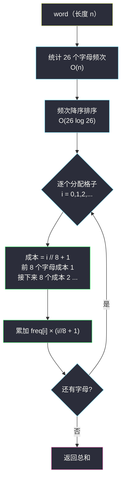

# 输入单词需要的最少按键次数 II（排序不等式 · 频次降序配成本升序）

## 一、问题描述

给你一个字符串 `word`，由小写英文字母组成。

电话键盘上的按键与**不同**小写英文字母集合相映射，可以通过按压按键来组成单词。例如按键 2 对应 `["a","b","c"]`：输入 `"a"` 需按 1 次、`"b"` 需按 2 次、`"c"` 需按 3 次——**按键次数 = 字母在该键序列中的位次**。

现在允许你将编号为 **2 到 9** 的按键重新映射到不同字母集合：每个按键可以映射到任意数量的字母，但每个字母必须**恰好映射到一个按键上**。求输入 `word` 所需的**最少**按键次数。

> 🔗 LeetCode 3016：https://leetcode.cn/problems/minimum-number-of-pushes-to-type-word-ii/
>
> 数据范围：`1 <= word.length <= 10^5`，`word` 仅由小写英文字母组成。
>
> 注：I 版（#3014）仅数据范围更小（`word.length <= 26`），解法完全相同。

**示例 1**

```
输入：word = "abcde"
输出：5
解释：a/b/c/d/e 各占一个键的第 1 位，每个字母按 1 次，总成本 5。
```

**示例 2**

```
输入：word = "xyzxyzxyzxyz"
输出：12
解释：x/y/z 各占一键第 1 位，每个出现 4 次：4 + 4 + 4 = 12。
（不必让每个按键都有字母，但每个字母必须落在某个键上。）
```

**示例 3**

```
输入：word = "aabbccddeeffgghhiiiiii"
输出：24
解释：a..g 与 i 各占一键第 1 位（成本 1），h 只能屈居某键第 2 位（成本 2）：
7 × (2×1) + 1 × (2×2) + 6×1 = 14 + 4 + 6 = 24。（下文详算）
```

**直观理解**

8 个键、26 个字母，每个字母都要占一个「键 × 位次」的格子，格子的**成本就是位次**：第 1 位的格子有 8 个（成本 1），第 2 位 8 个（成本 2），第 3 位 8 个（成本 3），第 4 位只剩 2 个（8×3 = 24 < 26 ≤ 8×4）。字母在 `word` 里出现的**频次**各不相同——当然是把最常用的字母塞进最便宜的格子。这两个序列一个想升、一个想降，「谁配谁」的问题正是灵茶题单 §4.3 **排序不等式**的主场。

---

## 二、暴力解法

把问题看成「26 个字母分进 4 个成本档（容量 8 / 8 / 8 / 2）」：同档内的格子完全等价（成本只由位次决定），于是对每个出现过的字母枚举它进哪一档，带容量约束做 DFS，取总成本最小的方案：

```python
def minimum_pushes_brute(word: str) -> int:
    from collections import Counter
    freq = Counter(word)
    letters = list(freq)                      # 出现过的字母
    caps = [8, 8, 8, 2]                       # 成本 1..4 档的格子数
    best = float('inf')

    def dfs(i: int, cost: int):
        nonlocal best
        if cost >= best:                      # 剪枝：已不优
            return
        if i == len(letters):
            best = cost
            return
        f = freq[letters[i]]
        for j in range(4):                    # 枚举该字母进哪个成本档
            if caps[j] > 0:
                caps[j] -= 1
                dfs(i + 1, cost + f * (j + 1))
                caps[j] += 1

    dfs(0, 0)
    return best
```

### 复杂度

- **时间**：`O(4^d)`（`d` = 出现的字母种数），`d = 26` 时约 `4.5 * 10^15`，天文数字；只有 `word` 里字母种数很少（`d <= 12` 左右）时才能跑完，可用于对拍。
- **空间**：递归深度 `O(d)`。

### 🔴 瓶颈在哪里

DFS 把「哪个字母进哪档」当成彼此独立的自由选择，但成本结构是**完全单调**的：便宜的格子永远该给高频字母。一旦想通「配对只需要决定相对次序」，指数级的搜索空间就会被一次排序碾平。

---

## 三、优化探索（核心章节）

> 📚 本题在灵茶题单中属于 **§4.3 排序不等式**。模板要点：**两个序列的配对和，在「同序配对」时最大、「逆序配对」时最小**；要最小化「频次 × 成本」的总和，就把频次降序与成本升序配对——排序不等式（逆序和最小）一步给出结构。

### 3.1 成本结构的展开：格子阶梯

按位次把所有格子摊开，得到一条**非降的成本阶梯**：

```
成本 1 的格子 ×8：  键2[1] 键3[1] ... 键9[1]
成本 2 的格子 ×8：  键2[2] 键3[2] ... 键9[2]
成本 3 的格子 ×8：  键2[3] 键3[3] ... 键9[3]
成本 4 的格子 ×2：  剩下 26 − 24 = 2 个字母挤第 4 位
```

键与键之间完全对称（每个键都能放任意字母），所以**「哪个键」根本不重要，重要的只有「第几位」**。26 个字母恰好把前四层阶梯填满，问题净化为：

> 把 26 个字母的频次 `f1, f2, ..., f26` 与成本序列 `1,1,...,1(8 个),2,2,...,2(8 个),3,...,3(8 个),4,4` 做配对，最小化 `Σ 频次 × 成本`。

### 3.2 排序不等式：逆序和最小

**交换论证**：设某方案中，频次 `fa ≥ fb` 的两个字母分别拿到了成本 `ca > cb`。交换两者的格子，总成本变化量为：

```
(fa·cb + fb·ca) − (fa·ca + fb·cb) = (fa − fb)·(cb − ca) ≤ 0
```

即交换后**不增**。因此任何方案都能经过若干次交换变成「频次降序 ↔ 成本升序」的形态而不变差——最优结构唯一确定：

> **频次从高到低排序，第 `i` 个（0 下标）字母的成本为 `i // 8 + 1`，答案 = `Σ freq_desc[i] × (i // 8 + 1)`。**

这正是排序不等式的逆序形态：一个序列升序、一个降序时的配对和最小（顺序和最大、乱序和居中）。与贪心①里 [优势洗牌](advantage-shuffle.md) 的「我方升序配对方降序」是同一条定理的两面：那题要**最大化**优势计数，本题要**最小化**加权成本，配对方向因此相反。



### 3.3 为什么不用担心「每键字母数」

题目并未限制每个键最多放几个字母，是否可能出现「某个键放 9 个字母、深度换宽度」的更优方案？不会：成本只由位次决定，第 `j` 位成本就是 `j`，与键无关。把 26 个格子按位次分层后，任何合法分配都对应「26 个频次填入 8+8+8+2 的档位」，而 §3.2 已证明降序填入最优——**没有任何深藏的第五层结构**（26 个字母最多用到第 4 位）。

### 3.4 一句话核心

> **频次降序、成本升序，逆序配对和最小：第 i 高频的字母按 `i // 8 + 1` 次。**

---

## 四、代码实现

### Python（主解：计数 + 排序 + 配对）

```python
from collections import Counter

class Solution:
    def minimumPushes(self, word: str) -> int:
        freq = sorted(Counter(word).values(), reverse=True)   # 频次降序
        return sum(f * (i // 8 + 1) for i, f in enumerate(freq))
```

**变量含义**

| 变量 | 含义 |
|------|------|
| `freq` | 各字母出现次数，降序排列（长度 ≤ 26） |
| `i // 8 + 1` | 第 `i` 个字母所在格子的成本（位次） |
| 返回值 | `Σ freq[i] × (i // 8 + 1)`，即排序不等式的逆序和 |

**教学向等价写法：真的把 8 个键建出来**。下面这段代码把「格子分配」显式化——每个键一个列表，新字母总是接到**最浅的键**后面，与 `i // 8 + 1` 的数学式子一字不差地等价，适合用来向别人讲清楚「成本为什么是除以 8」：

```python
class Solution:
    def minimumPushes(self, word: str) -> int:
        from collections import Counter
        freq = sorted(Counter(word).values(), reverse=True)
        keys = [[] for _ in range(8)]        # 键 2..9 各自的字母序列
        ans = 0
        for i, f in enumerate(freq):
            keys[i % 8].append(f)            # 轮流放到最浅的空位上
            ans += f * (len(keys[i % 8]))    # 位次 = 该键当前长度
        return ans
```

### Java（最优解同款写法）

```java
class Solution {
    public int minimumPushes(String word) {
        int[] freq = new int[26];
        for (char c : word.toCharArray()) freq[c - 'a']++;
        Arrays.sort(freq);                          // 升序
        int ans = 0;
        for (int i = 25; i >= 0; i--) {             // 从高频往低频配
            if (freq[i] == 0) break;                // 没有字母了
            ans += freq[i] * ((25 - i) / 8 + 1);    // (25-i) = 降序名次
        }
        return ans;
    }
}
```

---

## 五、具体例子演示

以示例 3 端到端走一遍：`word = "aabbccddeeffgghhiiiiii"`（长度 22）。

**第①步：统计频次（决策依据 = 每个字母被按的总次数只由频次决定）**

```
a:2  b:2  c:2  d:2  e:2  f:2  g:2  h:2  i:6      （其余字母 0 次）
```

**第②步：频次降序排序**

```
[6, 2, 2, 2, 2, 2, 2, 2, 2]
```

**第③步：逐格子配对（排序配对表，每行给出「字母—频次—格子—成本—贡献」）**

| 名次 i | 字母 | 频次 | 键位（示意） | 位次 | 成本 i//8+1 | 贡献 |
|--------|------|------|--------------|------|-------------|------|
| 0 | i | 6 | 键 2 第 1 位 | 1 | 1 | 6 |
| 1 | a | 2 | 键 3 第 1 位 | 1 | 1 | 2 |
| 2 | b | 2 | 键 4 第 1 位 | 1 | 1 | 2 |
| 3 | c | 2 | 键 5 第 1 位 | 1 | 1 | 2 |
| 4 | d | 2 | 键 6 第 1 位 | 1 | 1 | 2 |
| 5 | e | 2 | 键 7 第 1 位 | 1 | 1 | 2 |
| 6 | f | 2 | 键 8 第 1 位 | 1 | 1 | 2 |
| 7 | g | 2 | 键 9 第 1 位 | 1 | 1 | 2 |
| 8 | h | 2 | 键 9 第 2 位 | 2 | **2** | 4 |

**决策依据**：前 8 名（名次 0..7）恰好填满成本 1 的 8 个格子；第 9 名 `h` 只能落到成本 2 的格子——即使它频次与 a..g 相同，排序的并列顺序不影响总和。

**第④步：求和**

```
6 + 2×7 + 4 = 6 + 14 + 4 = 24 ✓
```

与官方解释一致（`1*2 × 8 + 2*2 + 6*1 = 24`，只是官方让 i 和 h 共享键 9——键的具体归属不影响成本）。

**对照演示（错误配对的代价）**：若把 `h` 放进第 1 位、把 `i` 挤到第 2 位：`2×7 + 2×1 + 6×2 = 28 > 24`。高频字母每被降一档，就多付 `(6 − 2) × 1 = 4` 次按键——交换论证 `(fa − fb)(cb − ca)` 的实感。

**再加深一层：若 word 里字母种类超过 16 个会怎样？** 第 17~24 名落进成本 3 档、第 25~26 名落进成本 4 档。本题 `26 = 8 + 8 + 8 + 2` 恰好用满四层阶梯——公式 `i // 8 + 1` 自动处理所有分层，无需特判。

**示例 1 / 2 速览**：`"abcde"` 只有 5 种字母，全部落在成本 1 档 → `5 × 1 = 5` ✓；`"xyzxyzxyz"` 三种字母各 4 次 → `3 × 4 × 1 = 12` ✓。

---

## 六、复杂度分析

| 方法 | 时间 | 空间 |
|------|------|------|
| DFS 枚举档位分配 | `O(4^d)`，`d = 26` 时不可行 | `O(d)` |
| 计数 + 排序 + 配对 | `O(n + 26 log 26)` | `O(26)` |

计数扫一遍 `word` 是 `O(n)`；排序只针对 26 个频次，`26 log 26` 是常数级。**总时间 `O(n)`，额外空间 `O(26) = O(1)`**。

---

## 七、对比总结

**排序不等式家族**（贪心② §4.3 与贪心①配对系对照）：

| 题 | 配对的两个序列 | 方向 | 结论 |
|----|----------------|------|------|
| #3016 本篇 | 频次 × 位次成本 | 逆序（降配升） | 逆序和最小 |
| #870 优势洗牌 | 我方马力 × 对方马力 | 升配降（见 `advantage-shuffle.md`） | 最大化胜场 |
| #455 分发饼干 | 孩子胃口 × 饼干尺寸 | 同序双指针 | 大饼干喂大胃口 |
| #1005 K 次取反后最大化的数组和 | 元素符号 × 取反收益 | 排序贪心 | 负数优先反转 |

**易错点**

1. **成本公式是 `i // 8 + 1` 不是 `i % 8 + 1`**：每 8 个字母一档，除法分层；取模会把第 9 个字母送回成本 1。
2. **别把「8 个键」错当「9 个键」**：数字键 2..9 共 8 个，`1 / 0 / * / #` 不映射字母。
3. **键的对称性**：不需要真的模拟键——只统计位次成本，这是把问题从「组合分配」降维成「排序配对」的关键一步。
4. 频次并列时怎么排都行：并列元素之间的交换不改变总和（`(fa − fb) = 0`）。
5. II 与 I（#3014）完全同解，只是数据范围放大——`O(n)` 计数天然兼容 `10^5`。

---

## 八、举一反三

| 题目 | 关系 |
|------|------|
| [3014. 输入单词需要的最少按键次数 I](https://leetcode.cn/problems/minimum-number-of-pushes-to-type-word-i/) | 同题小数据版，题解代码可直接复用 |
| [870. 优势洗牌](https://leetcode.cn/problems/advantage-shuffle/) | 同目录 `advantage-shuffle.md`（贪心①§1.3）：排序不等式的最大化形态，双序列配对经典 |
| [2587. 重排数组以得到最大和](https://leetcode.cn/problems/rearrange-array-to-maximize-sum/) | 顺序和最大化的直接应用：给次数多的元素配大系数 |
| [826. 安排工作以达到最大收益](https://leetcode.cn/problems/most-profit-assigning-work/) | 同序配对：能力升序对难度升序，双指针 / 二分收尾 |
| [455. 分发饼干](https://leetcode.cn/problems/assign-cookies/) | 双序列同序配对的最简形态：排序后双指针，大饼干喂大胃口 |
| [1005. K 次取反后最大化的数组和](https://leetcode.cn/problems/maximize-sum-of-array-after-k-negations/) | 排序贪心近亲：按绝对值分配「取反」名额，与本题同属「好东西优先给高频/高收益对象」 |

**思想迁移**

- 看到「**多个槽位 + 位置成本 + 使用频次**」的分配题，第一反应应当是排序不等式：**频次降序配成本升序**，一次排序替代一切搜索。
- 交换论证 `(fa − fb)(cb − ca) ≤ 0` 是排序不等式的两行证明，也是这类题在面试中的标准正确性叙述——比背结论更稳。
- 对称性是降维利器：本题 8 个键彼此等价，抹掉「键身份」后才看清「只有位次重要」；与 `maximum-spending-after-buying-items.md`（§5.2 堆进阶）里「商店对称、只有天数重要」的化归思路同源。
- 口诀：**「高频配浅键，逆序和最小；八格一台阶，除八加一算。」**
