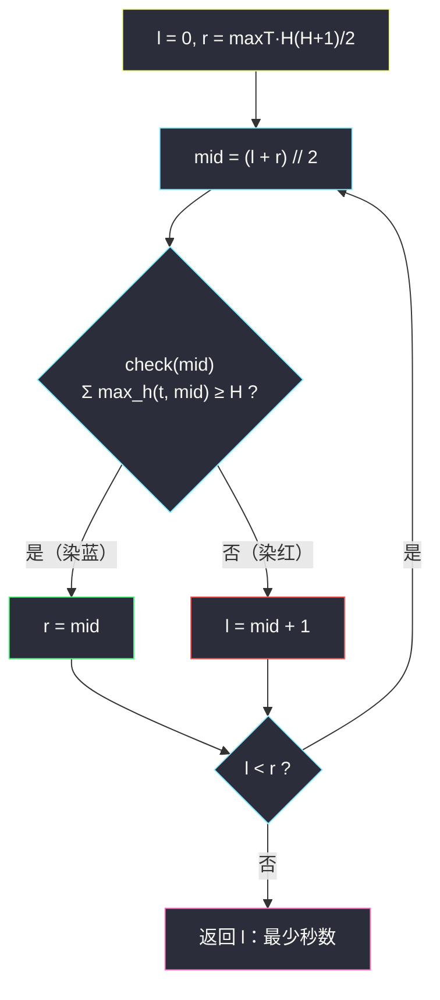

# 移山所需的最少秒数（二分答案 · 求最小）

## 一、问题描述

一座山高 `mountainHeight` 个单位，`workerTimes[i]` 是第 `i` 个工人的耗时系数：

- 工人 `i` 降低第 1 个单位高度耗时 `workerTimes[i] * 1` 秒，第 2 个单位耗时 `workerTimes[i] * 2` 秒，……第 `x` 个单位耗时 `workerTimes[i] * x` 秒；
- 因此工人 `i` 连续降低 `x` 个单位，总耗时 `workerTimes[i] * (1 + 2 + … + x) = t·x(x+1)/2` 秒；
- 多个工人**并行**工作（可同时作用于这座山），每个工人独立选择自己降低多少个单位；
- 总耗时 = 所有工人耗时的**最大值**。

求把山的高度降到 0 所需的**最少秒数**。

> 🔗 LeetCode 3296：https://leetcode.cn/problems/minimum-number-of-seconds-to-make-mountain-height-zero/
>
> 数据范围：`1 <= mountainHeight <= 10^5`，`1 <= workerTimes.length <= 10^4`，`1 <= workerTimes[i] <= 10^4`。

**示例**

```
输入：mountainHeight = 4, workerTimes = [2,1,1]
输出：3
解释：工人0 降低 1 单位（耗时 2），工人1 降低 1 单位（耗时 1），
      工人2 降低 2 单位（耗时 1 + 2 = 3）；max(2,1,3) = 3。

输入：mountainHeight = 5, workerTimes = [1]
输出：15
解释：唯一工人降低 5 单位，耗时 1+2+3+4+5 = 15。
```

**直观理解**

问的不是「谁干哪段」，而是「最少需要多少秒」——答案是一个**数值**，取值范围 `[0, 某个巨大上界]`。这正是灵神 §2.1 的招牌场景：**二分答案**。每猜一个总时间 `m`，就问一个判定问题：「`m` 秒内所有工人一起上，能不能把山铲平？」——而「时间越多铲得越多」的单调性，天然保证这个问题左假右真。

---

## 二、暴力解法

从 `m = 1` 开始逐秒枚举，每个 `m` 都算一遍「`m` 秒内总铲除量」，第一次达标即答案：

```python
class Solution:
    def minNumberOfSeconds(self, mountainHeight: int, workerTimes: List[int]) -> int:
        def work(t: int, m: int) -> int:        # 工人 t 在 m 秒内最多降几个单位
            h, cost = 0, 0
            while cost + t * (h + 1) <= m:       # 逐单位模拟
                h += 1
                cost += t * h
            return h

        m = 1
        while True:
            if sum(work(t, m) for t in workerTimes) >= mountainHeight:
                return m
            m += 1
```

### 复杂度

- **时间**：答案上界可达 `10^4 × 10^5 × (10^5+1) / 2 ≈ 5*10^13`，逐秒枚举直接天文数字，必然超时。
- **空间**：`O(1)`。

### 🔴 瓶颈在哪里

「m 秒够不够」这个判定本身很便宜，贵的是**线性地从小到大试探**。可行性与否在时间轴上一刀两断（左假右真），完全配得上一场二分。

---

## 三、优化探索（核心章节）

> 📚 本题在灵茶题单中属于 **§2.1 求最小**（二分答案），与同小节的 `koko-eating-bananas.md`、`minimum-time-to-complete-trips.md` 一脉相承。check 方向与 #2187 相同（`>=` 型），但反解工人产量时出现了**开平方**，是这一小节里数学味最重的一道。

### 3.1 关键观察：check 关于 m 单调

设 `f(m) = Σ 工人 i 在 m 秒内最多能降的单位数`：

- `m` 越大 → 每个工人能降的单位数**单调不减** → `f(m)` 单调不减；
- 于是「`f(m) >= mountainHeight`」在时间轴上**左假右真**：时间太少铲不平（红），时间够多铲得平（蓝）。

**要的答案 = 最小的蓝色 m**——标准的「求满足 check 的最小值」。


对照 #875 珂珂（check 是 `Σ⌈p/k⌉ <= h` 的 `<=` 型）：本题 check 是 `>=` 型——**判定方向相反，但「求最小」模板一行不改**，变的只是染色的语义。

### 3.2 check 怎么写：反解工人的产量

工人 `i`（系数 `t`）在 `m` 秒内能降多少单位？即解最大的 `h` 使：

```
t + 2t + 3t + … + ht = t·(1+2+…+h) = t·h(h+1)/2  <=  m
```

这是关于 `h` 的一元二次不等式，直接用求根公式反解：

```
h(h+1)/2 <= m/t   =>   h^2 + h - 2m/t <= 0   =>   h <= (√(8m/t + 1) - 1) / 2
```

于是 `h = ⌊(√(8m/t + 1) - 1) / 2⌋`（向下取整）。

**精度陷阱（本题最大的坑）**：`m` 可达 `5*10^13`，`8m/t` 可达 `4*10^17`，已经**超过 double 的精确整数范围 `2^53 ≈ 9*10^15`**，浮点 `math.sqrt` 可能差 1 导致答案错位。正解用整数平方根 `math.isqrt`，再向两侧微调兜底：

```python
def max_h(t: int, m: int) -> int:
    x = (math.isqrt(8 * m // t + 1) - 1) // 2   # 初值（可能偏差 <= 1）
    while t * (x + 1) * (x + 2) // 2 <= m:      # 偏小：右移
        x += 1
    while x > 0 and t * x * (x + 1) // 2 > m:   # 偏大：左移
        x -= 1
    return x
```

`isqrt` 只做整数运算，两次微调把整除误差彻底焊死，结果绝对精确。

于是：

```python
def check(m: int) -> bool:
    return sum(max_h(t, m) for t in workerTimes) >= mountainHeight
```

（实现时在 `sum` 循环里一旦累加达标就提前 `return True`，省下后半段工人的开方。）

### 3.3 上下界的选取

- **下界 `l = 0`**：`mountainHeight >= 1`，0 秒谁都干不动，`check(0)` 必假；
- **上界 `r = max(workerTimes) * H * (H+1) / 2`**：最慢的工人独自包干所有高度，其余工人帮倒忙不干也行，`check(r)` 必真。`H = 10^5` 时 `r ≈ 5*10^13`，Python 大整数无压力。

上界没必要取更紧（比如「最快工人包干」），反正只影响二分轮数 `log2(5*10^13) ≈ 46`，微不足道。

### 3.4 统一模板（求最小）

```
求满足 check(x) 的最小 x（红蓝染色）：
    l = 下界, r = 上界          # 候选区间左闭右闭 [l, r]，check(r) 必真
    while l < r:
        mid = (l + r) // 2
        if check(mid): r = mid       # mid 蓝：可行，收缩右界
        else:          l = mid + 1   # mid 红：不可行，收缩左界
    答案 = l                         # l == r，最左蓝
```



### 3.5 备选思路：小根堆贪心（作对照）

另一条能过的路：**每次都让「下一个单位的边际成本」最小的工人去铲下一单位**。小根堆初始化为 `(t·1, i, 已铲 0)`，弹出堆顶 `(t·(k+1), i, k)` 即工人 `i` 的第 `k+1` 个单位，推回 `(t·(k+2), i, k+1)`；共弹 `H` 次，每次的堆顶成本取 max 即答案。复杂度 `O(H log n) ≈ 10^5 × 17`，也能过。

它模拟出「最优分工」本身；而二分答案跳过分工细节，只反复问「m 秒够不够」。两种视角都值得会：**堆贪心求「方案」，二分求「临界值」**——当 `H` 变大（比如 10^9）时堆贪心立刻失效，二分依然从容。

### 3.6 一句话核心

> **「m 秒内 Σ产量 ≥ 山高」对 m 左假右真 → 在 `[0, maxT·H(H+1)/2]` 上跑「求最小」红蓝模板，check = Σ⌊(√(8m/t+1)−1)/2⌋ ≥ H，开方用 isqrt 防精度。**

---

## 四、代码实现

### Python（主解）

```python
import math

class Solution:
    def minNumberOfSeconds(self, mountainHeight: int, workerTimes: List[int]) -> int:
        H = mountainHeight

        def max_h(t: int, m: int) -> int:
            """系数 t 的工人在 m 秒内最多降多少单位：解 t*h(h+1)/2 <= m"""
            x = (math.isqrt(8 * m // t + 1) - 1) // 2   # isqrt 保整数精度
            while t * (x + 1) * (x + 2) // 2 <= m:      # 初值偏小：右移
                x += 1
            while x > 0 and t * x * (x + 1) // 2 > m:   # 初值偏大：左移
                x -= 1
            return x

        def check(m: int) -> bool:
            total = 0
            for t in workerTimes:
                total += max_h(t, m)
                if total >= H:                  # 提前退出
                    return True
            return False

        l, r = 0, max(workerTimes) * H * (H + 1) // 2   # 上界：最慢工人独自包干
        while l < r:
            mid = (l + r) // 2
            if check(mid):
                r = mid                          # mid 及更久都铲得平
            else:
                l = mid + 1                      # mid 不够，更短更不够
        return l
```

**变量含义**

| 变量 | 含义 |
|------|------|
| `m` / `mid` | 猜测的总时间（秒） |
| `max_h(t, m)` | 系数 `t` 的工人在 `m` 秒内的最大产量 `⌊(√(8m/t+1)−1)/2⌋` |
| `t·h(h+1)/2` | 工人降 `h` 个单位的耗时（等差数列求和） |
| `l` | 红区右边界：比它短的时间都铲不平 |
| `r` | 蓝区左边界：它及更长的时间都能铲平 |
| 返回值 `l` | 把山降为 0 的最少秒数 |

### Java（最优解同款写法）

```java
class Solution {
    public long minNumberOfSeconds(int mountainHeight, int[] workerTimes) {
        long l = 0, r = 0;
        for (int t : workerTimes) {
            // 上界：最慢工人独自包干全部高度（注意先转 long 再乘）
            r = Math.max(r, (long) t * mountainHeight * (mountainHeight + 1) / 2);
        }
        while (l < r) {
            long mid = l + (r - l) / 2;
            if (check(mountainHeight, workerTimes, mid)) r = mid;
            else l = mid + 1;
        }
        return l;
    }

    private boolean check(int H, int[] ts, long m) {
        long total = 0;
        for (int t : ts) {
            total += maxH(t, m);
            if (total >= H) return true;        // 提前退出
        }
        return false;
    }

    private long maxH(int t, long m) {
        // h^2 + h - 2m/t <= 0  =>  h <= (sqrt(8m/t + 1) - 1) / 2
        long h = (long) ((Math.sqrt(8.0 * m / t + 1) - 1) / 2);   // 浮点初值
        while ((long) t * (h + 1) * (h + 2) / 2 <= m) h++;        // 向右微调
        while (h > 0 && (long) t * h * (h + 1) / 2 > m) h--;      // 向左微调
        return h;
    }
}
```

**Java 易错**：上界 `t * H * (H+1) / 2` 中 `t` 必须先转 `(long)` 再乘，直接 `int` 乘法在 `10^4 × 10^10` 量级必然溢出；`maxH` 里浮点开方只做初值，两侧微调用整数乘法校准后才绝对可靠。

---

## 五、具体例子演示

以 `mountainHeight = 4, workerTimes = [2,1,1]` 端到端走一遍。上界 `r = max(t)·4·5/2 = 2×10 = 20`，初始 `l = 0, r = 20`。

先看 `max_h` 的两个手算样本：

- `max_h(2, 10)`：解 `h(h+1) <= 10`，`h = 2`（2·3=6 ≤ 10，3·4=12 > 10）；
- `max_h(1, 10)`：解 `h(h+1)/2 <= 10`，`h = 4`（4·5/2 = 10 ≤ 10 恰好卡满）。

二分全程（三个工人按 t=2,1,1 依次累加）：

| 轮次 | l | r | mid | max_h(2,mid) | max_h(1,mid) ×2 | Σ | ≥ 4 ? | 染色 | 动作 |
|------|---|---|-----|--------------|------------------|-----|-------|------|------|
| 1 | 0 | 20 | 10 | 2 | 4 + 4 | 10 | ✓ | 蓝 | `r = 10` |
| 2 | 0 | 10 | 5 | 1 | 2 + 2 | 5 | ✓ | 蓝 | `r = 5` |
| 3 | 0 | 5 | 2 | 1 | 1 + 1 | 3 | ✗ | 红 | `l = 3` |
| 4 | 3 | 5 | 4 | 1 | 2 + 2 | 5 | ✓ | 蓝 | `r = 4` |
| 5 | 3 | 4 | 3 | 1 | 2 + 2 | 5 | ✓ | 蓝 | `r = 3` |

`l == r == 3`，返回 **3** ✓（与示例一致：t=1 的工人之一降 2 单位花 3 秒，恰好是最大个人耗时）。

**验证「最小」**：`m = 3` 时 t=1 的工人能降 2 单位（1+2=3 秒），另一个 t=1 降 1 单位（1 秒），t=2 降 1 单位（2 秒），Σ = 2+1+1 = 4 = H，max(3,1,2) = 3，确实铲平；`m = 2` 时如第 3 轮所示 Σ = 3 < 4，铲不平——分界点恰在 3。

**再看单工人示例**：`H = 5, workerTimes = [1]`，上界 `r = 15`。`check(15)`：`max_h(1,15)` 解 `h(h+1)/2 <= 15`，h = 5（15 ≤ 15）→ Σ = 5 ≥ 5 ✓ 蓝；`check(14)`：h = 4（10 ≤ 14，15 > 14）→ Σ = 4 < 5 ✗ 红。答案锁定 **15** ✓，正是 1+2+3+4+5。

---

## 六、复杂度分析

| 方法 | 时间 | 空间 |
|------|------|------|
| 暴力逐秒 | `O(U·n)`，U ≈ 5·10^13 | `O(1)` |
| 小根堆贪心 | `O(H log n)` ≈ 10^5·17 | `O(n)` |
| 二分答案 | `O(n log U)`，log2(5·10^13) ≈ 46 轮，总计约 `10^4 × 46` 次 `isqrt` | `O(1)` |

二分的每轮 check 是 `O(n)`（每个工人一次 isqrt 反解），乘上 `O(log U) ≈ 46` 轮，约 `4.6*10^5` 次开方运算，轻松通过。空间只需常数个变量。

---

## 七、对比总结

**§2.1「求最小」家族 check 对照**（#875 那篇表格的续篇）：

| 题 | 二分对象 | check 内容 | 单调方向 |
|----|----------|-----------|----------|
| #875 珂珂（见同目录） | 速度 k | Σ⌈p/k⌉ ≤ h | k 越大耗时越小 |
| #2187 完成旅途（见同目录） | 时间 t | Σ⌊t/time⌋ ≥ totalTrips | t 越大趟数越多 |
| **#3296 移山（本篇）** | **总时间 m** | **Σ⌊(√(8m/t+1)−1)/2⌋ ≥ H** | **m 越大产量越多** |
| #1011 送包裹（见同目录） | 载重 cap | 贪心装载天数 ≤ days | cap 越大天数越少 |

本题与 #2187 同为 `>=` 型 check，区别在产量的反解：#2187 是除法 `⌊m/t⌋`，本题升级成**一元二次不等式的开方反解**——「给总量反解个体产量」这一步出现了无理数，也带来了精度陷阱。

**易错点**

1. **浮点开方失真**：`8m/t` 可达 `4*10^17` 超出 double 精确整数界，`math.sqrt` 可能差 1；Python 用 `isqrt`、Java 用浮点初值 + 整数微调，缺一不可。
2. **上界溢出（Java）**：`t * H * (H+1) / 2` 必须 `(long) t` 起手，`int` 直接乘会静默溢出得到错误上界。
3. **check 别忘了提前退出**：累加一旦 ≥ H 立即返回，最坏省一半开方。
4. **上界要「必真」**：取最慢工人独自包干（不是最快），确保 `check(r)` 成立，否则二分可能返回一个错误的 r。
5. 求和公式是 `t·x(x+1)/2` 不是 `t·x^2`——第 x 个单位耗时 `t·x` 是等差数列，不是平方。

**堆贪心 vs 二分**：堆贪心直观地构造出「谁铲第几个单位」，适合要方案的场景，但复杂度挂死在 `H` 上；二分只问临界值，复杂度挂死在 `log U` 上，`H` 涨到 10^18 也无所谓。**面试先给二分，堆贪心作为第二视角加分。**

---

## 八、举一反三

| 题目 | 关系 |
|------|------|
| [2594. 修车的最少时间](https://leetcode.cn/problems/minimum-time-to-repair-cars/) | **同构姊妹题**：二分总时间 + isqrt 反解 `⌊√(m/rank)⌋`，精度坑一模一样 |
| [2187. 完成旅途的最少时间](https://leetcode.cn/problems/minimum-time-to-complete-trips/) | 同小节 `>=` 型 check，反解是除法版，见同目录 `minimum-time-to-complete-trips.md` |
| [875. 爱吃香蕉的珂珂](https://leetcode.cn/problems/koko-eating-bananas/) | §2.1 招牌题，`<=` 型 check，见同目录 `koko-eating-bananas.md` |
| [1011. 在 D 天内送达包裹的能力](https://leetcode.cn/problems/capacity-to-ship-packages-within-d-days/) | check 从求和升级为贪心，见同目录 `capacity-to-ship-packages-within-d-days.md` |
| [1482. 制作 m 束花所需的最少天数](https://leetcode.cn/problems/minimum-number-of-days-to-make-m-bouquets/) | 同「最少天数」句式的求最小 |
| [475. 供暖器](https://leetcode.cn/problems/heaters/) | 「求最小化最大值」的另一形态（二分半径 + 双指针 check） |

**思想迁移**

- 见到「**并行作业 + 各自成本递增 + 总时间 = max**」，答案几乎一定是二分：给总时间 `m`，把「每个个体在 `m` 内的最大产出」反解出来求和即可判定。
- 反解产量的三连招：**线性成本→除法取整（#2187），平方成本→开方取整（#2594），等差成本→求根公式取整（本题）**；大数一律 isqrt + 微调。
- 口诀（接 #875）：**「答案有范围，猜中点验一遍；真往左收，假往右赶；开方要 isqrt，上下界要必真。」**
