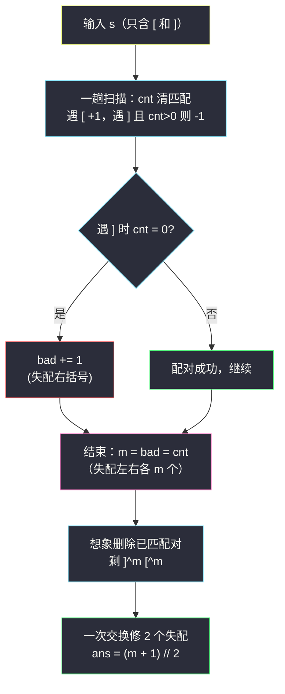

# 使字符串平衡的最小交换次数（合法括号串 RBS · 消除已匹配 + 贪心）

## 一、问题描述

给你一个字符串 `s`，下标从 0 开始、长度为 `n`，其中 `s[i]` 要么是 `'['`，要么是 `']'`，且 `s` 中左括号和右括号的**数量相等**。

一次**交换**定义为：任选两个下标 `i != j`，交换 `s[i]` 和 `s[j]`。

「平衡」的定义：任意前缀中 `'['` 的数量都不少于 `']'` 的数量（即 `s` 是一个合法括号串 RBS）。

返回使 `s` 变平衡的**最少**交换次数。

> 🔗 LeetCode 1963：https://leetcode.cn/problems/minimum-number-of-swaps-to-make-the-string-balanced/
>
> 数据范围：`n == s.length`，`2 <= n <= 10^6`，`n` 为偶数；`s[i]` 为 `'['` 或 `']'`；`s` 中 `'['` 和 `']'` 的个数相同。
>
> 📚 本题出自灵茶题单 **§3.4 合法括号字符串（RBS）**。（原题用方括号 `[` `]`，与圆括号 `( )` 完全同构。）

**示例 1**

```
输入：s = "][]["
输出：1
解释：交换下标 0 和 3，s 变成 "[[]]"，也可以交换下标 0 和 2 得 "[][]"。
```

**示例 2**

```
输入：s = "]]][[["
输出：2
```

**直观理解**

先做一个「**消除已匹配对**」的思想实验：从左到右扫描，能用栈配上的 `[]` 对全部划掉，剩下的部分必然长成 `]]]…[[[`——一截连续的右括号接一截连续的左括号（若不是这个形状，就还有可匹配的对）。设左半截有 `m` 个 `]`（右半截必然是 `m` 个 `[`，因为左右括号总数相等）。接下来只需对这个极简形状数交换次数：**一次交换可以修复 2 个失配**（把最前面的 `]` 与最后面的 `[` 换位，两端各生出一个 `[]`），于是答案就是 ⌈m/2⌉。

---

## 二、暴力解法

最直接的暴力：把「最少交换次数」当成最短路——从 `s` 出发做 BFS，每一层枚举所有 `C(n, 2)` 个交换，第一次遇到平衡串时的层数即答案。

```python
from itertools import combinations
from collections import deque

class Solution:
    def minSwaps(self, s: str) -> int:
        def balanced(t):                     # 计数法判定 RBS
            cnt = 0
            for c in t:
                cnt += 1 if c == "[" else -1
                if cnt < 0:
                    return False
            return cnt == 0

        if balanced(s):
            return 0
        q, step = deque([s]), 0
        seen = {s}
        while q:
            step += 1
            for _ in range(len(q)):
                t = q.popleft()
                lst = list(t)
                for i, j in combinations(range(len(lst)), 2):
                    if lst[i] == lst[j]:                     # 同字符交换无意义
                        continue
                    lst[i], lst[j] = lst[j], lst[i]
                    u = "".join(lst)
                    if u not in seen:
                        if balanced(u):
                            return step
                        seen.add(u)
                        q.append(u)
                    lst[i], lst[j] = lst[j], lst[i]          # 回溯
        return -1
```

### 复杂度

- **时间**：状态数最坏 `C(n, n/2)` 量级、每个状态 `O(n²)` 种转移，`n = 10^6` 下是天文数字。
- **空间**：同样是指数级。

### 🔴 瓶颈在哪里

BFS 把「平衡」当黑盒目标搜索，完全没利用括号的结构。实际上不需要真的换——只要**数出失配个数**，答案就是一个初等公式。

---

## 三、优化探索（核心章节）

> 📚 灵茶题单 **§3.4 合法括号字符串（RBS）** 模板：**先消除所有已匹配的括号对，剩下 `))…((` 形的失配段；一次交换可修复 2 个失配，答案 = ⌈失配对数⌉ 类推导**。本题是这板斧最干净的展示。

### 3.1 第一步：消除已匹配对，剩 `]]]…[[[`

维护计数器 `cnt`（当前待配对的 `[` 数）从左到右扫：

- 遇 `[`：`cnt += 1`；
- 遇 `]`：`cnt > 0` 则 `cnt -= 1`（与前面某个 `[` 配对成功，把这对一起消除）；否则 `bad += 1`（这个 `]` 失配）。

扫描结束后，`cnt` 就是失配的 `[` 个数，`bad` 是失配的 `]` 个数。由「左右括号总数相等」：**失配 `]` 数 = 失配 `[` 数 = m**（设为 `m`，总数守恒 `matched + m = matched + m`）。

把所有配对成功的字符从串里划掉，剩下的串**必然**形如：

```
] ] ] … ] [ [ [ … [
└── m 个 ──┘└── m 个 ──┘
```

为什么一定是这个形状？若剩余串中某个 `[` 出现在某个 `]` 之前，那么这个 `[` 本可配掉后面的 `]`，与「已消除所有可配对」矛盾。

### 3.2 第二步：一次交换修 2 个失配

对 `]^m [^m` 做如下交换——**最前面的 `]` ↔ 最后面的 `[`**：

```
] ] ] … ] [ [ [ … [          （m 个 ] + m 个 [）
└┘ 换 └┘
[ ] ] … [ [ [ … ]      →    [ ] + (剩余 ^m-1 [^m-1) + [ ]
```

交换后，两端各生出一对 `[]`，中间剩 `]^(m-1) [^(m-1)`——**问题规模 m 直接减 2**。

- 若 `m` 为偶数：如此换 `m/2` 次归零；
- 若 `m` 为奇数：换 `(m-1)/2` 次后剩 `][`，再交换一次变 `[]`。

统一写成：

```
答案 = ⌈m / 2⌉ = (m + 1) // 2
```

### 3.3 为什么不能更少（下界）

用前缀和视角给出干净的下界。把 `[` 看作 `+1`、`]` 看作 `-1`，记前缀和 `P[k]`（串平衡 ⟺ 所有 `P[k] >= 0` 且 `P[n-1] = 0`）。

**第一步：原串的最低前缀恰为 `-m`。** 消除匹配后的形状 `]^m [^m` 中最低前缀是 `-m`；而原串每个位置的前缀和，等于消除形状在对应位置的前缀和——因为每对被消除的 `[]` 净贡献为 `0`，删掉它们不改变任何前缀和。所以 `min P = -m`。

**第二步：一次交换对一个位置的抬升至多 `+2`。** 把位置 `i` 的 `]` 与位置 `j` 的 `[` 互换（`i < j`），等价于把区间 `[i, j)` 内的**所有前缀和整体 +2**，区间外不变；反方向的交换是整体 -2；同字符交换无影响。

**结论**：最低点 `-m` 必须被抬到 `0`，而每次交换对该点至多 +2，故至少需要 ⌈m/2⌉ 次交换。与 3.2 的构造次数相同，最优性得证。

### 3.4 推导链全景



### 3.5 一句话核心

> **消除已匹配对，剩 `]^(m) [^(m)`；一次交换修 2 个失配，答案 `(m + 1) // 2`。** 全程不需要真的修改字符串，一趟计数即可。

---

## 四、代码实现

### Python 主解（一趟计数）

```python
class Solution:
    def minSwaps(self, s: str) -> int:
        m = 0                          # 失配 ']' 的个数
        cnt = 0                        # 当前待配对的 '[' 数
        for c in s:
            if c == "[":
                cnt += 1
            elif cnt > 0:
                cnt -= 1               # 配对成功，消除一对
            else:
                m += 1                 # 栈空遇 ']'：失配
        # 循环结束时 cnt（失配 '[' 数）必然等于 m（左右总数相等）
        return (m + 1) // 2            # ⌈m / 2⌉
```

**变量含义**

| 变量 | 含义 |
|------|------|
| `cnt` | 扫描到当前位置时，尚未配对的 `[` 个数（就是栈的大小，用计数器替代栈） |
| `m` | 半路「栈空遇 `]`」的累计次数，即失配 `]` 的个数；最终也等于失配 `[` 的个数 |

**不变式**：任意时刻 `cnt ≥ 0`；扫描结束后 `m` 恰为「消除全部可匹配对后剩下的 `]`（或 `[`）的个数」。

**说明**：此题不需要栈存内容——我们只关心失配**个数**而不关心位置（交换次数只由 `m` 决定，与失配的具体分布无关，因为消除匹配后形状固定为 `]^m [^m`）。

### Java（最优解同款）

```java
class Solution {
    public int minSwaps(String s) {
        int m = 0, cnt = 0;
        for (char c : s.toCharArray()) {
            if (c == '[') {
                cnt++;
            } else if (cnt > 0) {
                cnt--;
            } else {
                m++;
            }
        }
        return (m + 1) / 2;
    }
}
```

---

## 五、具体例子演示

### 例 1：s = "]]][[["（示例 2）

一趟扫描，跟踪 `cnt` 与 `m` 的每步变化：

| i | s[i] | 规则 | cnt（待配对 `[`） | m（失配 `]`） | 说明 |
|---|------|------|------------------|----------------|------|
| 0 | `]` | cnt=0 → 失配 | 0 | 1 | 无 `[` 可配 |
| 1 | `]` | cnt=0 → 失配 | 0 | 2 | 仍无 `[` 可配 |
| 2 | `]` | cnt=0 → 失配 | 0 | 3 | 仍无 `[` 可配 |
| 3 | `[` | cnt+1 | 1 | 3 | 入栈等待 |
| 4 | `[` | cnt+1 | 2 | 3 | 入栈等待 |
| 5 | `[` | cnt+1 | 3 | 3 | 入栈等待 |

结束：`cnt = 3`（失配 `[`）、`m = 3`（失配 `]`），相等 ✓。`m = 3`，答案 = `(3 + 1) // 2 = 2` ✓。

**交换过程还原**（消除已匹配对后剩 `]]][[[`）：

| 步骤 | 串 | 操作 | 效果 |
|------|-----|------|------|
| 0 | `]]][[[` | — | m = 3 |
| 1 | `[]][[]` | 交换下标 0 与 5（最前 `]` ↔ 最后 `[`） | 两端生出 `[]`，剩 `][`，m = 1 |
| 2 | `[][][]` | 交换下标 2 与 4（剩下那对 `]` `[`） | 全部平衡 ✓ |

### 例 2：s = "][]["（示例 1）

| i | s[i] | 规则 | cnt | m |
|---|------|------|-----|---|
| 0 | `]` | cnt=0 → 失配 | 0 | 1 |
| 1 | `[` | cnt+1 | 1 | 1 |
| 2 | `]` | cnt>0 → 配对 | 0 | 1 |
| 3 | `[` | cnt+1 | 1 | 1 |

`m = 1`，答案 = `(1 + 1) // 2 = 1` ✓。消除匹配对后剩 `][`，一次交换 → `[]`。


### 边界自检

- `s = "[]"`：cnt 1→0，m = 0，答案 0（本来就平衡）；
- `s = "]["`（n=2）：i0 `]` 失配 m=1，i1 `[` cnt=1 → 答案 1 = `(1+1)//2` ✓；
- 已平衡串如 `"[[][]]"`：全程无失配，m = 0，答案 0 ✓。

---

## 六、复杂度分析

| 方法 | 时间 | 空间 | 说明 |
|------|------|------|------|
| BFS 暴力 | 指数级 | 指数级 | 状态空间 `C(n, n/2)`，不可行 |
| 一趟计数 + 公式 | `O(n)` | `O(1)` | 只需 `cnt`、`m` 两个整型变量 |

`n = 10^6` 时一趟线性扫描轻松通过；`O(1)` 额外空间是因为**答案只依赖失配个数，不依赖位置**——这正是「消除已匹配」洞察带来的红利。

---

## 七、对比总结

灵茶题单 §3.4 的 RBS 家族里，本题的特色是「**贪心推导出封闭公式**」：

| 题 | 失配的处置 | 答案 |
|----|------------|------|
| **#1963 本篇** | 交换（最前 `]` ↔ 最后 `[`） | `(m + 1) // 2`，m 为失配一半数量 |
| #1249 移除无效括号（同批 `minimum-remove-to-make-valid-parentheses.md`） | 删除 | `2m`（左右失配全删） |
| #921 最少添加 | 插入 | `2m`（左右失配全补） |
| #678 有效括号串（同批 `valid-parenthesis-string.md`） | `*` 通配后判定可行性 | 布尔值 |

对比可见规律：**删除/添加按「字符」计**（每个失配字符各值 1 次），**交换按「对」计**（一次交换同时改变两个位置的字符，能修 2 个失配），所以交换的答案带个除以 2 和向上取整。

**易错点**

1. 公式写成 `m // 2`：`m` 为奇数时错（`][` 需要 1 次而非 0 次）。
2. 试图真的去模拟交换过程或建栈存下标——本题只数个数，计数器足够，`n = 10^6` 时省常数也省内存。
3. 误以为失配的**分布**影响答案：`[[]]][` 与 `]][[` 消除匹配后都是 `][`，交换次数同为 1，与原分布无关。
4. 扫描结束忘记核对 `cnt == m`：这由「左右括号数量相等」保证，是很好的自检点（不放心可 `assert cnt == m`）。

---

## 八、举一反三

| 题目 | 关系 |
|------|------|
| [1249. 移除无效的括号](https://leetcode.cn/problems/minimum-remove-to-make-valid-parentheses/) | 同小节姊妹题：同样「清匹配剩失配」，但用删除，见同批 `minimum-remove-to-make-valid-parentheses.md` |
| [921. 使括号有效的最少添加](https://leetcode.cn/problems/minimum-add-to-make-parentheses-valid/) | 失配总数 `2m` 直接是答案（添加版） |
| [678. 有效的括号字符串](https://leetcode.cn/problems/valid-parenthesis-string/) | 同小节：`*` 通配下判定 RBS 可行性，见同批 `valid-parenthesis-string.md` |
| [1541. 平衡括号字符串的最少插入次数](https://leetcode.cn/problems/minimum-insertions-to-balance-a-parentheses-string/) | 每个左括号配两个右括号的变形，计数法继续用 |
| [2116. 判断一个括号字符串是否有效](https://leetcode.cn/problems/check-if-a-parentheses-string-can-be-valid/) | 锁定部分字符 + 通配 `*`，可行区间法的进阶版 |
| [3412. 计算字符串的镜像分数](https://leetcode.cn/problems/find-mirror-score-of-a-string/) | 同批 `find-mirror-score-of-a-string.md`：LIFO 配对思想迁移到镜像字符 |
| 同目录 `parsing-a-boolean-expression.md` | 栈处理嵌套结构的综合练习 |

**思想迁移**

- 「消除已匹配，剩下极简形状再推公式」是括号题的通用起手式：删除题（#1249）、交换题（本篇）、插入题（#921）共享这一步。
- 交换类题目先问：**一次操作最多修复几个失配？** 修复 2 个 → 答案是失配对数除以 2 向上取整；修复 1 个 → 答案就是失配数。
- 口诀：**「能配全配剩失配，失配左右必成对；一换修二取上整，公式 `(m+1)//2`。」**
