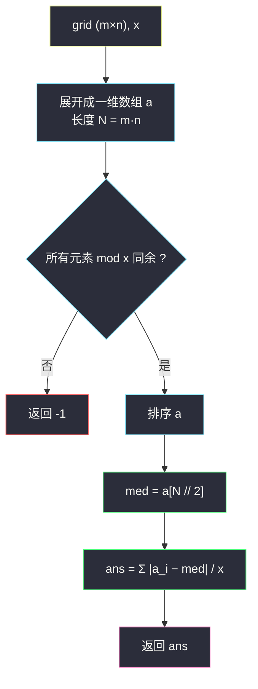

# 获取单值网格的最小操作数（同余判定 + 中位数贪心）

## 一、问题描述

给你一个大小为 `m x n` 的二维整数网格 `grid` 和一个整数 `x`。每一次操作，你可以对 `grid` 中的任一元素**加 `x`** 或**减 `x`**。

**单值网格**是全部元素都相等的网格。

返回使网格化为单值网格所需的**最小**操作数。如果不能，返回 `-1`。

> 🔗 LeetCode 2033：https://leetcode.cn/problems/minimum-operations-to-make-a-uni-value-grid/
>
> 数据范围：`m == grid.length`，`n == grid[i].length`，`1 <= m, n <= 10^5`，`1 <= m * n <= 10^5`，`1 <= x, grid[i][j] <= 10^4`。

**示例 1**

```
输入：grid = [[2,4],[6,8]], x = 2
输出：4
解释：全部变成 4：2 加一次、6 减一次、8 减两次，共 4 次。
```

**示例 2**

```
输入：grid = [[1,5],[2,3]], x = 1
输出：5
解释：全部变成 3：|1-3| + |5-3| + |2-3| + |3-3| = 5。
```

**示例 3**

```
输入：grid = [[1,2],[3,4]], x = 2
输出：-1
解释：1 和 2 对 2 的余数不同，加减 x 永远抹不平差距。
```

**直观理解**

每次操作只能挪动 `x`，所以**任意两个元素的差值永远保持是 `x` 的倍数**——这是先天的「基因」约束：余数不同的元素注定无法汇合。通过这一关后，问题就化成了经典的「把大家挪到同一个值，最少挪多少步」：每个元素的代价是 `|a_i - v| / x`，而让绝对差和最小的那个 `v`，就是**中位数**。两步走完，正是灵茶题单 §4.5「中位数贪心」的标准开场。

---

## 二、暴力解法

先解决可解性（§3.1 会证明同余判定），再枚举**候选终值**：最优终值必然取在某个元素值上（绝对差和关于 `v` 是分段线性的凸函数，极小点可取数据点），于是把每个元素的值轮流当目标，逐个算总代价：

```python
def min_operations_brute(grid, x):
    a = [v for row in grid for v in row]
    r = a[0] % x
    if any(v % x != r for v in a):        # 可解性：所有元素模 x 同余
        return -1
    best = float('inf')
    for c in a:                            # 枚举候选终值
        total = sum(abs(v - c) for v in a)
        best = min(best, total // x)       # 同余保证整除
    return best
```

### 复杂度

- **时间**：`O(n²)`（`n = m * n` 个候选 × 每个扫描全数组），`10^5` 时 `10^10` 超时。
- **空间**：`O(n)`（展开数组）。

### 🔴 瓶颈在哪里

枚举候选值的内层循环在做重复劳动：从候选 `c` 换到下一个候选时，绝大多数元素的距离只变了 1 格。绝对差和这种「V 形」结构的最小值有个著名结论——**中位数**。抓住它，候选枚举整个消失。

---

## 三、优化探索（核心章节）

> 📚 本题在灵茶题单中属于 **§4.5 中位数贪心**。模板要点：**最小化绝对差和 `Σ|a_i − v|` 的最优 `v` 是中位数**——把 `v` 往元素多的一侧移动，代价按「两侧个数之差」线性变化，平衡点恰在中位。本题前面再加一道同余闸门。

### 3.1 第一道闸门：模 x 同余，否则 -1

加减 `x` 不改变 `a_i mod x`，所以每个元素的余数是**不变量**：终值 `v` 与 `a_i` 之差必须是 `x` 的倍数。于是：

- 所有元素模 `x` 的余数**互不相同余** → 无解，返回 `-1`；
- 全部同余（余数 `r`）→ 合法终值 = 与所有元素同余的任意值，问题降为纯「绝对差和」。

（顺手一个推论：同余时每个 `|a_i - v|` 都能被 `x` 整除，总代价 = `Σ|a_i - v| / x`，可以先把差和加完再统一除。）

### 3.2 第二道闸门：中位数最小化绝对差和

展开成一维数组 `a`（长度 `N = m·n`），排序后取 `med = a[N // 2]`（`N` 为偶数时任取中间两个之一，代价相同）。为什么是它？两个视角：

**移动视角**：想象 `v` 从左往右扫过数轴。跨过一个元素 `a_i` 前，它每远离 1 步贡献 `-1`；跨过后，每走 1 步贡献 `+1`。`v` 处的「边际代价」 = `(右边元素个数) − (左边元素个数)`：左边的元素多时往左移更划算，右边的多时往右移更划算，**边际代价由负转正的平衡点恰是中位数**。

**交换论证视角**：若 `v` 左侧元素个数多于右侧，把 `v` 左移 1 格，代价变化 `左 − 右 < 0`，更优；反之间理。最优的 `v` 必须左右两侧元素个数各半——正是中位数。



### 3.3 平凡但值得说的化简：对「商」做中位数等价于对「值」做中位数

同余时写 `a_i = r + x·b_i`，`|a_i − v| / x = |b_i − t|`（`v = r + x·t`），所以也可以全部除以 `x`（减去 `r` 再除）后对**商数组**取中位数——数值变小、防溢出：

```python
# 商数组写法（与主解等价，先验同余是前提）
b = [(v - r) // x for v in a]
b.sort()
t = b[len(b) // 2]
return sum(abs(v - t) for v in b)      # 每项已除过 x，无需再除
```

但注意必须**先判同余**：不同余时商数组的「余数信息」被抹掉，`-1` 的判定会失效。直接对原值排序取中位数同样正确（同余保证整除），两种写法都对，本题数据范围（差和上限 `10^4 × 10^5 × 2 = 2 * 10^9`，64 位安全）下不必特意转商。

### 3.4 一句话核心

> **先验同余（模 x 余数一致，否则 -1），再对一维化的数组取中位数，答案 = 绝对差和 ÷ x。**

---

## 四、代码实现

### Python（主解：同余判定 + 排序 + 中位数）

```python
class Solution:
    def minOperations(self, grid: List[List[int]], x: int) -> int:
        a = [v for row in grid for v in row]      # ① 展开成一维
        r = a[0] % x
        if any(v % x != r for v in a):            # ② 同余闸门
            return -1
        a.sort()                                  # ③ 取中位数
        med = a[len(a) // 2]
        return sum(abs(v - med) for v in a) // x  # ④ 差和统一除以 x
```

**变量含义**

| 变量 | 含义 |
|------|------|
| `r` | 基准余数（任取一个元素的 `mod x`） |
| `med` | 排序后下标 `N // 2` 的中位数（偶数个时任取中间之一） |
| `sum(...) // x` | 所有元素到 `med` 的总步数（同余保证整除） |

### Java（最优解同款写法）

```java
class Solution {
    public int minOperations(int[][] grid, int x) {
        int n = grid.length * grid[0].length;
        int[] a = new int[n];
        int i = 0;
        for (int[] row : grid)
            for (int v : row) a[i++] = v;
        int r = a[0] % x;
        for (int v : a)
            if (v % x != r) return -1;
        Arrays.sort(a);
        int med = a[n / 2];
        long ans = 0;                          // 2e9 量级，用 long 累加
        for (int v : a) ans += Math.abs(v - med) / x;
        return (int) ans;
    }
}
```

---

## 五、具体例子演示

**示例 1**：`grid = [[2,4],[6,8]]`, `x = 2` 端到端走一遍。

**第①步 展开排序**：`a = [2,4,6,8]`。

**第②步 同余检查**：`2 % 2 = 4 % 2 = 6 % 2 = 8 % 2 = 0` ✓ 全部同余，可解。

**第③步 取中位数**：`N = 4`，`med = a[2] = 6`（取 `a[1] = 4` 也行，见下表）。

**第④步 逐元素记账（决策依据 = 每个元素与目标值的距离除以步长 x）**：

| 元素 | 目标 med=6 | 距离 | 操作 | 步数 = 距离 / 2 |
|------|-----------|------|------|-----------------|
| 2 | 6 | 4 | +2, +2 | 2 |
| 4 | 6 | 2 | +2 | 1 |
| 6 | 6 | 0 | 不动 | 0 |
| 8 | 6 | 2 | −2 | 1 |

合计 `2 + 1 + 0 + 1 = 4` ✓。

**候选值对照表（暴力视角，验证中位数确实最优）**：

| 候选 v | Σ\|a_i − v\| | ÷ x 后代价 |
|--------|--------------|------------|
| 2 | 0+2+4+6 = 12 | 6 |
| 4 | 2+0+2+4 = 8 | **4** ⭐ |
| 6 | 4+2+0+2 = 8 | **4** ⭐ |
| 8 | 6+4+2+0 = 12 | 6 |

**决策依据**：`N = 4` 为偶数，中间两个候选（4 与 6）代价并列最小——中位数平台上的任何点都最优，这与「边际代价在跨过第 `N/2` 个元素前保持非正、之后保持非负」的凸性描述一致。官方解释选择「全变 4」，我们取 6，答案同为 4。

**示例 2**：`grid = [[1,5],[2,3]]`, `x = 1`，展开 `a = [1,2,3,5]`，逐步走：

**第①步 同余**：余数全为 0 ✓。**第②步 排序取中位**：`med = a[2] = 3`。

**第③步 逐元素记账**：

| 元素 | 与 med=3 的距离 | 操作序列 | 步数 = 距离 / 1 |
|------|-----------------|----------|-----------------|
| 1 | 2 | +1, +1 | 2 |
| 2 | 1 | +1 | 1 |
| 3 | 0 | 不动 | 0 |
| 5 | 2 | −1, −1 | 2 |

合计 **5** ✓（官方「全变 3」一致；候选值 2 与 3 的代价同为 5，中位平台再次出现）。

**示例 3**：`a = [1,2,3,4]`, `x = 2`。`1 % 2 = 1` 而 `2 % 2 = 0`，同余闸门直接拦下 → **-1** ✓（若不先判同余，取中位数 2 会算出 `1 + 0 + 0 + 1 = 2` 的假答案——这正是暴力代码里先验余数的原因）。

---

## 六、复杂度分析

| 方法 | 时间 | 空间 |
|------|------|------|
| 枚举候选终值 | `O(n²)`（n = m·n） | `O(n)` |
| 排序 + 中位数（主解） | `O(n log n)` | `O(n)` |
| 快速选择取中位 | 平均 `O(n)` | `O(n)` |

`n = m * n <= 10^5`，主解约 `10^5 × 17` 次比较。**时间 `O(n log n)`、空间 `O(n)`**（展开数组；快速选择可把时间做到平均 `O(n)`，竞赛中口头一提即可）。

---

## 七、对比总结

**中位数贪心家族**（本批 §4.5 与 §4.7 联动）：

| 题 | 预处理 | 中位数作用 | 计费 |
|----|--------|------------|------|
| #2033 本篇 | 模 x 同余判定 | 最小化 `Σ|a_i − v| / x` | 差和整除 x |
| #3107 中位数等于 K | 排序定 `m = n//2` | 左右分侧只修一半 | 偏差直接累加（见 `minimum-operations-to-make-median-of-array-equal-to-k.md`） |
| #462 最少移动 II | 无 | 最小化 `Σ|a_i − v|` | x = 1 的特例 |
| #2448 最小开销 | 无 | **带权**中位数 | `Σ cost_i·|a_i − v|` |

**易错点**

1. **先判同余再谈中位数**：余数不一致时中位数公式会给出「假解」（示例 3 的 2），顺序不能颠倒。
2. **偶数个元素中位数任取**：`a[N//2]` 与 `a[N//2 - 1]`（及其间任意同余值）代价相同，不必纠结；但取区间外的值一定更差。
3. **除法放最后**：每个 `|a_i − med|` 都能整除 `x`，先加总再 `// x` 与逐项 `// x` 结果一致；但取 `med` 后**不判同余就除**会掩盖错误。
4. 溢出：Java 中差和上限约 `2 * 10^9`，超出 `int`，累加器用 `long`。
5. 二维只是外壳：展开成一维后与「一维数组全体变相等」完全同构，别被 `m x n` 迷惑。

---

## 八、举一反三

| 题目 | 关系 |
|------|------|
| [3107. 使数组中位数等于 K 的最少操作数](https://leetcode.cn/problems/minimum-operations-to-make-median-of-array-equal-to-k/) | 同批姊妹篇（§4.7）：只把中位修到 k，左压右抬，见 `minimum-operations-to-make-median-of-array-equal-to-k.md` |
| [462. 最少移动次数使数组元素相等 II](https://leetcode.cn/problems/minimum-moves-to-equal-array-elements-ii/) | 本题 x = 1 的母题，纯中位数绝对差和 |
| [2448. 使数组相等的最小开销](https://leetcode.cn/problems/minimum-cost-to-make-array-equal/) | 加权版：中位数推广为带权中位数，排序 + 前缀和求解 |
| [2602. 使数组元素全部相等的最少操作数](https://leetcode.cn/problems/minimum-operations-to-make-all-array-elements-equal/) | #462 的多查询版：预处理 + 二分每个查询 |
| [1685. 有序数组中差绝对值之和](https://leetcode.cn/problems/sum-of-absolute-differences-in-a-sorted-array/) | 绝对差和的前缀和速算，本题暴力枚举候选值时的优化工具 |
| [1478. 安排邮筒](https://leetcode.cn/problems/allocate-mailboxes/) | 中位数思想的区间 DP 版：每条街的邮筒放在该街居民的中位数 |

**思想迁移**

- 「每次 ±x」类操作先问**不变量**：模 x 的余数守恒给出可解性判定，这是比算法更先行的「物理直觉」。
- 绝对差和的最优点 = 中位数、平方和的最优点 = 均值——两个经典结论值得并列记牢，很多「最小化总调整量」的题就是它们换皮。
- 网格题先降维：`m x n` 展平成一维后排序取中位，二维只是叙事外壳（与 [2602] 的查询版一脉相承）。
- 口诀：**「先验同余再看齐，中位收拢差和除。」**
