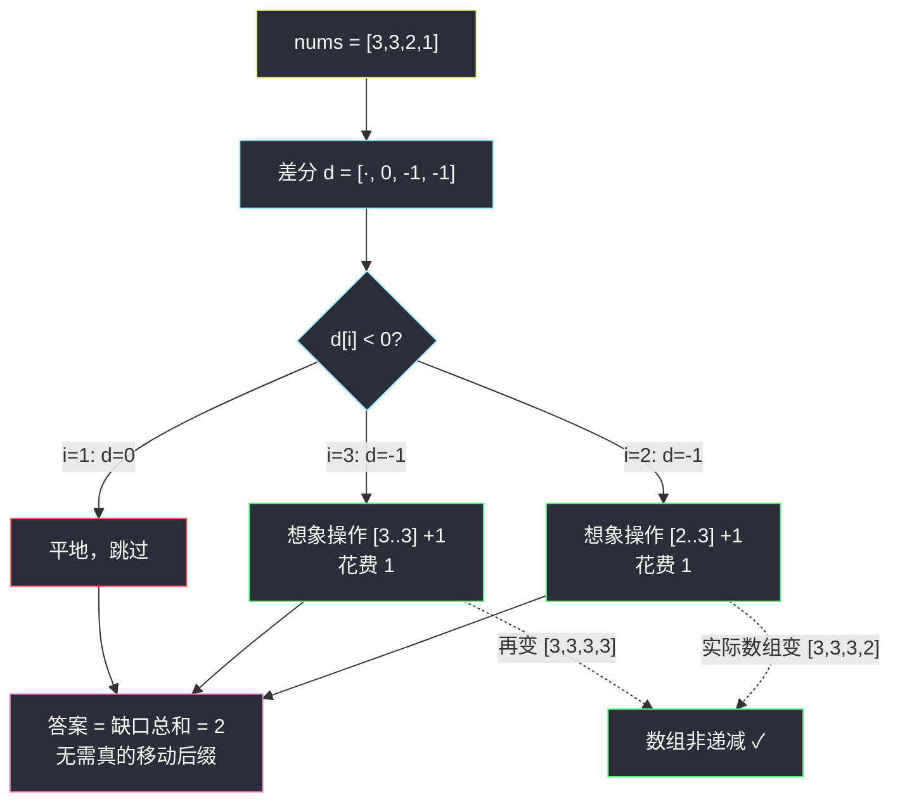

# 使数组非递减需要的最小累计值（一维差分 · 下坡求和）

## 一、问题描述

给你一个长度为 `n` 的整数数组 `nums`。

一次操作中，你可以选择任意子数组 `nums[l..r]`（`0 <= l <= r < n`），并把其中**每个元素**都加上一个**正整数** `x`（`x >= 1`）。

返回使数组变为**非递减**（即对所有 `0 <= i < n-1` 满足 `nums[i] <= nums[i+1]`）所需全部操作的 `x` 之和的**最小值**。由于答案可能很大，返回对 `10^9 + 7` 取余的结果。

> 🔗 LeetCode 3914：https://leetcode.cn/problems/minimum-operations-to-make-array-non-decreasing/
>
> 数据范围：`1 <= n <= 10^5`，`1 <= nums[i] <= 10^9`。
>
> 📚 灵茶题单 **§2.1 一维差分**。本题是「差分数组 + 相邻差求和」家族的新成员，与同小节的 [#1526 形成目标数组的子数组最少增加次数](minimum-number-of-increments-on-subarrays-to-form-a-target-array.md) 互为对偶（一个填上坡、一个削下坡），两篇建议对照着看。

**示例 1**

```
输入：nums = [3,3,2,1]
输出：2
解释：
先选 [2..3] 加 1，得 [3,3,3,2]；
再选 [3..3] 加 1，得 [3,3,3,3]，非递减。
两次操作的 x 之和 = 1 + 1 = 2，没有更小的方案。
```

**直观理解**

「把某段子数组整体抬高」这个操作，在**差分数组**眼里只动两个位置：`d[l] += x`、`d[r+1] -= x`。而「非递减」翻译成差分语言就是「所有 `d[i] >= 0`」。于是问题变成：**至少要花多少总增量，才能把差分数组里的负数全部填平**——答案是每个「下坡」缺口的总和。

---

## 二、暴力解法

最朴素的思路是模拟题面贪心：从左到右扫描，一旦发现 `nums[i] < nums[i-1]`，就把后缀 `nums[i..n-1]` 整体抬高 `nums[i-1] - nums[i]`，同时累计花费：

```python
class Solution:
    def minimumOperations(self, nums: List[int]) -> int:
        nums = nums[:]                      # 不破坏原数组
        cost = 0
        for i in range(1, len(nums)):
            if nums[i] < nums[i - 1]:       # 出现下坡
                x = nums[i - 1] - nums[i]
                cost += x
                for j in range(i, len(nums)):   # 后缀整体抬高
                    nums[j] += x
        return cost
```

这个做法**结果是正确的**（后面会证明它恰好达到最优），但每次下坡都扫一遍后缀：

### 复杂度

- **时间**：最坏 `O(n²)`——严格递减数组如 `[5,4,3,2,1]` 会在每个位置触发后缀抬升，`n = 10^5` 时约 `10^10` 次操作，超时。
- **空间**：`O(n)`（数组副本）。

### 🔴 瓶颈在哪里

后缀 `nums[i..n-1]` 被整体抬高后，**它们之间的相对关系不变**，唯一改变的是 `nums[i-1]` 与 `nums[i]` 这一个相邻差。也就是说，操作的「有效作用点」只有一个差分位置——逐格改数组浪费了 `O(n)` 的动作去维持那些根本没变的关系。

---

## 三、优化探索（核心章节）

> 📚 本题在灵茶题单中属于 **§2.1 一维差分**。灵神模板：`d[i] = nums[i] - nums[i-1]`，子数组 `[l, r]` 整体加 `x` 等价于 `d[l] += x、d[r+1] -= x`，还原时做一遍前缀和。本题不还原，而是把「非递减」这个目标翻译到差分域，直接在差分域里数缺口。

### 3.1 把操作和目标都翻译到差分域

定义差分数组 `d[i] = nums[i] - nums[i-1]`（`i >= 1`）：

**操作**：对子数组 `nums[l..r]` 加正整数 `x`，等价于

```
d[l]   += x
d[r+1] -= x      （若 r = n-1 则无处可减，跳过）
```

其余所有 `d[i]` 原封不动。**一次操作的全部效果，落在至多两个差分位置上。**

**目标**：`nums` 非递减 ⇔ 所有 `d[i] >= 0`。

于是问题重述为：每次操作选一个位置 `l` 加 `x`（可能附带把某个更靠右的位置 `r+1` 减 `x`），问把所有 `d[i]` 抬到非负所需的最小总花费 `Σx`。

### 3.2 下界：每个下坡的缺口都必须真金白银地填

考虑某个下坡位置 `i`（`d[i] < 0`，即 `nums[i-1] > nums[i]`）。要让 `d[i]` 从负数抬到 `0`，只能靠**以 `l = i` 开头的操作**：

- `l = i` 的操作贡献 `+x`，是唯一能**提升** `d[i]`` 的来源；
- `r + 1 = i` 的操作反而贡献 `-x`，只帮倒忙；
- `l ≠ i` 且 `r+1 ≠ i` 的操作对 `d[i]` 零影响。

而 `l = i` 的操作的每一个 `x` 都全额计入总花费。所以：

```
总花费 = Σ(所有操作的 x) ≥ Σ(以 i 为开头的操作的 x) ≥ 需要提升的量 = -d[i]
```

对**每个**下坡位置各得到一条这样的不等式。关键一步：把所有下坡的不等式**相加**依然成立——因为不同下坡位置对应不同的 `l`，同一个操作的 `x` 至多出现在其中一条里（一次操作只有一个 `l`），不会重复计数。于是：

```
总花费 ≥ Σ max(0, -d[i]) = Σ max(0, nums[i-1] - nums[i])
```

### 3.3 上界：逐缺口修复恰好取等

构造：从左到右扫描，遇到 `d[i] < 0` 就执行一次操作 `nums[i..n-1]` 整体加 `-d[i]`（花费 `-d[i]`）。

正确性：这次操作把 `nums[i]` 抬到与 `nums[i-1]` 齐平，同时后缀整体平移——`i` 之后所有相邻差不变，**不会制造新的下坡**，也不会破坏 `i` 之前已修好的前缀。扫描结束时数组非递减，总花费恰为 `Σ max(0, -d[i])`，达到下界。

> 注意这个构造其实就是第二章那个 `O(n²)` 暴力——它最优但写得笨。差分视角告诉我们：**它唯一改动的有效信息只有差分数组里的负数**，把这些负数直接加起来就够了，不必真的移动后缀。



### 3.4 与 #1526 的对偶关系

| | 本题 #3914 | [#1526 形成目标数组](minimum-number-of-increments-on-subarrays-to-form-a-target-array.md) |
|---|---|---|
| 起点 | 给定 `nums` | 全 0 数组 |
| 操作 | 子数组 `+x`（`x` 任意正整数） | 子数组 `+1`（只能加 1） |
| 目标 | 变非递减 | 变成 `target` |
| 优化方向 | **削下坡**：`Σ max(0, nums[i-1] - nums[i])` | **填上坡**：`target[0] + Σ max(0, target[i] - target[i-1])` |
| 计最小值的东西 | 操作的 `x` 之和 | 操作次数 |

两题的证明骨架完全相同：「一次操作对每个差分位置至多提升 `x`（或 `1`）→ 下界；对每个缺口独立操作可取等 → 上界」。差别只在操作粒度（`x` 可大 vs 恒为 1）与方向（往下托 vs 往上垫）。

### 3.5 一句话核心

> **子数组整体加 `x` 在差分域只动两端；非递减 ⇔ 差分非负；答案 = 相邻下坡量之和 `Σ max(0, nums[i-1] - nums[i])`。**

---

## 四、代码实现

### Python（主解：一遍扫描数下坡）

```python
class Solution:
    def minimumOperations(self, nums: List[int]) -> int:
        MOD = 10 ** 9 + 7
        ans = 0
        for i in range(1, len(nums)):
            if nums[i] < nums[i - 1]:          # 下坡
                ans += nums[i - 1] - nums[i]   # 缺口入账
        return ans % MOD
```

**变量含义**

| 变量 | 含义 |
|------|------|
| `nums[i-1] - nums[i]` | 位置 `i` 的下坡量，即差分 `d[i]` 的负部 `-d[i]` |
| `ans` | 全部下坡缺口之和，等于最小总花费 |

**循环不变式**：扫描完位置 `i` 时，`ans` = 「把前缀 `nums[0..i]` 变非递减」所需的最小花费（后续位置的抬高不影响 `i` 及之前的相邻差）。

### 显式差分版（展示推导路径，结果相同）

```python
class Solution:
    def minimumOperations(self, nums: List[int]) -> int:
        MOD = 10 ** 9 + 7
        ans = 0
        prev = nums[0]
        for v in nums[1:]:
            d = v - prev            # 差分 d[i]
            if d < 0:
                ans += -d           # 缺口 = max(0, -d[i])
            prev = v
        return ans % MOD
```

### 验证最优性的对拍脚本（可选练习）

小规模下用 Dijkstra 精确搜索「任意子数组 +1」的最小总花费，与公式对拍：

```python
import heapq, random

def min_cost_exact(nums):
    n = len(nums)
    if all(nums[i] <= nums[i+1] for i in range(n-1)):
        return 0
    start = tuple(nums)
    dist = {start: 0}
    pq = [(0, start)]
    while pq:
        c, st = heapq.heappop(pq)
        if c > dist.get(st, float('inf')):
            continue
        if all(st[i] <= st[i+1] for i in range(n-1)):
            return c
        for l in range(n):
            for r in range(l, n):
                ns = list(st)
                for j in range(l, r + 1):
                    ns[j] += 1
                ns = tuple(ns)
                if c + 1 < dist.get(ns, float('inf')):
                    dist[ns] = c + 1
                    heapq.heappush(pq, (c + 1, ns))
    return -1

def formula(nums):
    return sum(max(0, nums[i-1] - nums[i]) for i in range(1, len(nums)))

# for _ in range(400): 对拍 assert 相等 —— 实测一致
```

---

## 五、具体例子演示

### 例 1：nums = [3,3,2,1]

**第一步：计算差分数组**

| i | nums[i-1] | nums[i] | d[i] = 差 | 下坡缺口 max(0, 前项-后项) |
|---|-----------|---------|-----------|---------------------------|
| 1 | 3 | 3 | 0 | 0 |
| 2 | 3 | 2 | -1 | **1** |
| 3 | 2 | 1 | -1 | **1** |

缺口总和 = `0 + 1 + 1 = 2`，即答案。

**第二步：还原出等价的贪心修复过程（验证公式不是空头支票）**

| 轮次 | 触发位置 | 操作 | 操作后数组 | 当前差分 d[1..3] | 累计花费 |
|------|----------|------|------------|------------------|----------|
| 初始 | — | — | `[3,3,2,1]` | `[0,-1,-1]` | 0 |
| 1 | i=2（d=-1） | `[2..3]` 加 1 | `[3,3,3,2]` | `[0, 0,-1]` | 1 |
| 2 | i=3（d=-1） | `[3..3]` 加 1 | `[3,3,3,3]` | `[0, 0, 0]` | 2 |

两轮后差分全非负，数组非递减，花费 `2` 与公式一致——正是示例 1 给出的官方操作序列。

**第三步：体会「后缀平移不产生新缺口」**

轮 1 把 `nums[2..3]` 同时 `+1`：`2→3`、`1→2`，后缀内部的差 `1-2 = -1` 保持不变（`2-3 = -1`）；被修复的只有 `nums[1]` 与 `nums[2]` 之间的差（`0` → `0`？注意 `nums[1]=3` 未动、`nums[2]` 升到 3，差从 `-1` 变 `0`）。这正是「一次操作只改一个差分位置」的现场演示。

### 例 2：严格递减的极端情况 nums = [5,4,3,2,1]

| i | 1 | 2 | 3 | 4 |
|---|---|---|---|---|
| d[i] | -1 | -1 | -1 | -1 |

答案 = 4。每个位置都要垫一次，且这些操作的 `l` 互不相同、无法合并——差分视角下「一次操作只有一个 `l`」说得一清二楚。

### 例 3：已经非递减 nums = [1,2,2,5]

所有 `d[i] >= 0`，缺口和为 0，答案 0，一次操作都不用。

---

## 六、复杂度分析

| 方法 | 时间 | 空间 | 说明 |
|------|------|------|------|
| 朴素贪心（真移后缀） | `O(n²)` | `O(n)` | 正确但慢 |
| 差分下坡求和 | `O(n)` | `O(1)` | 一遍扫描，常数级额外空间 |

- **时间**：单次线性扫描，每个相邻对看一次。
- **空间**：连差分数组都不必显式建，滚动变量即可（显式差分版也只 `O(n)`）。

---

## 七、对比总结

**「差分数组 + 相邻差求和」三兄弟**

| 题 | 方向 | 公式 | 备注 |
|----|------|------|------|
| 本题 #3914 | 削下坡 | `Σ max(0, nums[i-1] - nums[i])` | 求 `x` 之和 |
| #1526 形成目标数组 | 填上坡 | `target[0] + Σ max(0, target[i] - target[i-1])` | 求操作次数，Hard |
| #995 K 连续位翻转 | 维护奇偶 | 差分数组记录翻转次数 | 同在 §2.1，见 `minimum-number-of-k-consecutive-bit-flips.md` |

**易错点**

1. **方向别反**：下坡是「前项减后项」`nums[i-1] - nums[i]`，写成 `nums[i] - nums[i-1]` 后对非递增数组会得出 0。
2. **别漏取模**：`n = 10^5`、每个缺口最大约 `10^9`，总和可达 `10^14`，Python 无所谓，其他语言要用 64 位整数并按题意取模。
3. **别把「操作次数」和「x 之和」混淆**：本题最小化的是 `Σx`，不是操作数。若最小化操作次数，答案应是「下坡段数」而非缺口和。
4. **证明里的坑**：下界不能只对单个最大缺口成立（那是 `max`），必须对所有下坡求和——依据是「一次操作的 `x` 至多计入一个 `l`」，不同下坡对应不同 `l`。

**模板（下坡缺口求和，Python 版）**

```python
def min_total_x(nums):
    return sum(max(0, nums[i-1] - nums[i]) for i in range(1, len(nums)))
```

---

## 八、举一反三

| 题目 | 关系 |
|------|------|
| [1526. 形成目标数组的子数组最少增加次数](https://leetcode.cn/problems/minimum-number-of-increments-on-subarrays-to-form-a-target-array/) | 对偶姊妹篇：从 0 垫出 `target`，填上坡；同目录 `minimum-number-of-increments-on-subarrays-to-form-a-target-array.md` |
| [1827. 最少操作使数组递增](https://leetcode.cn/problems/minimum-operations-to-make-the-array-increasing/) | 只能单点 `+1` 的简化版：贪心逐位抬到 `max(nums[i-1]+1, nums[i])` |
| [665. 非递减数列](https://leetcode.cn/problems/non-decreasing-array/) | 判定「改至多一个元素能否非递减」，同样是盯着相邻差分析 |
| [1109. 航班预订统计](https://leetcode.cn/problems/corporate-flight-bookings/) | §2.1 一维差分的入门款：区间加后做前缀和还原 |
| [2536. 子矩阵元素加 1 的整数矩阵](https://leetcode.cn/problems/increment-submatrices-by-one/) | 差分升二维：四角标记 + 二维前缀和还原，见同目录 `increment-submatrices-by-one.md` |

**思想迁移**

- 遇到「子数组整体 ±值」类操作，第一反应写差分：操作只动两端，目标（有序、相等、全零）翻译到差分域常常一目了然。
- 「**下界 + 构造取等**」是这类最优化题的标准两步：先用「每次操作的能力上限」卡出下界，再给一个刚好达界的贪心。
- 记忆口诀：**「子数组加值动两端，非降全靠差分正；每个下坡都得填，缺口求和便是答。」**
