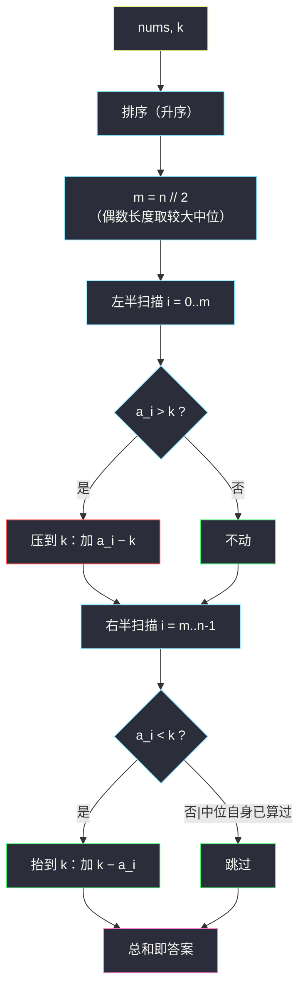

# 使数组中位数等于 K 的最少操作数（排序分侧修正 · 一次性累偏差）

## 一、问题描述

给你一个整数数组 `nums` 和一个**非负**整数 `k`。一次操作中，你可以选择任一元素**加 1** 或者**减 1**。

请你返回将 `nums` 的**中位数**变为 `k` 所需要的**最少**操作次数。

一个数组的中位数指的是数组按**非递减顺序排序后最中间的元素**。如果数组长度为偶数，我们选择中间两个数的**较大值**为中位数。

> 🔗 LeetCode 3107：https://leetcode.cn/problems/minimum-operations-to-make-median-of-array-equal-to-k/
>
> 数据范围：`1 <= nums.length <= 2 * 10^5`，`1 <= nums[i] <= 10^9`，`1 <= k <= 10^9`。

**示例 1**

```
输入：nums = [2,5,6,8,5], k = 4
输出：2
解释：将 nums[1] 和 nums[4] 各减 1 得到 [2,4,6,8,4]，
排序后为 [2,4,4,6,8]，中位数（第 3 个）= 4 = k。
```

**示例 2**

```
输入：nums = [2,5,6,8,5], k = 7
输出：3
解释：将 nums[1] 增加 1 两次、nums[2] 增加 1 一次，得到 [2,7,7,8,5]，
排序后为 [2,5,7,7,8]，中位数 = 7 = k。
```

**示例 3**

```
输入：nums = [1,2,3,4,5,6], k = 4
输出：0      // 偶数长度取中间两个（3,4）的较大者 4，已经等于 k
```

**直观理解**

中位数是「一半人压在下面、一半人顶在上面」的支点。要让支点挪到 `k`，两侧的元素必须**让路**：左半边谁冒出了 `k` 就得按下去，右半边谁矮过 `k` 就得抬起来。而每个元素让路的代价就是它与 `k` 的距离——排序之后，谁该让、让多少，一目了然。这是灵茶题单 §4.7「其他数学贪心」对**排序结构性质**的直接利用：不排序时元素身份混乱，排完序后「下标与 `k` 的大小关系」把每个元素的角色一锤定音。

---

## 二、暴力解法

先做一个关键化简（暴力也需要它才写得出来）：**存在最优解，使每个元素的终值 ∈ {原值, k}**。若某元素终值 `v > k` 且 `v` 不是原值，把它改停在 `k` 代价更小，且它仍满足「≥ k」的排序义务；`v < k` 同理。于是枚举每个元素「不动」或「移到 k」，检查终数组的中位数是否等于 `k`：

```python
def brute(nums, k):
    n = len(nums)
    m = n // 2                      # 中位数下标（奇偶统一，见 §3.1）
    best = float('inf')

    def dfs(i, cost, arr):
        nonlocal best
        if cost >= best:            # 剪枝
            return
        if i == n:
            if sorted(arr)[m] == k:
                best = cost
            return
        dfs(i + 1, cost, arr + [nums[i]])             # 选择 1：不动
        dfs(i + 1, cost + abs(nums[i] - k), arr + [k])  # 选择 2：移到 k

    dfs(0, 0, [])
    return best
```

### 复杂度

- **时间**：`O(2^n · n log n)`（叶子处排序检查），`n = 2 * 10^5` 完全不可行，仅小数组可跑（对拍用）。
- **空间**：递归深度 `O(n)`。

### 🔴 瓶颈在哪里

「每个元素二选一」看似自由度爆炸，但最优解里谁动谁不动**根本不用猜**：排完序后，左半边高于 `k` 的必须降、右半边低于 `k` 的必须升——角色由位置唯一决定。搜索是浪费，排序后线性累加即可。

---

## 三、优化探索（核心章节）

> 📚 本题在灵茶题单中属于 **§4.7 其他数学贪心（利用排序后的结构性质）**。模板要点：**与中位数有关的最优调整，先排序、再围绕中位下标分左右两半统计偏差**；本题结论是「左半压到 k、右半抬到 k、中位本身对齐 k」三笔账一次算清。

### 3.1 中位下标：奇偶统一为 m = n//2

- `n` 为奇数（如 `n = 5`）：中位数是排序后**正中**的元素，下标 `2 = 5 // 2`；
- `n` 为偶数（如 `n = 6`）：题目规定取中间两个的**较大者**，即排序后下标 `3 = 6 // 2` 的元素。

两种情况统一为 `m = n // 2`。这也决定了两半的**不对称**：左半（含中位）共 `m + 1` 个元素，右半（不含中位）共 `n - m - 1` 个。

### 3.2 必要性：中位 = k 逼出两半的修正义务

设最终数组（升序）第 `m` 位恰为 `k`，则：

- **左半（含第 m 位）**：`m + 1` 个值全部 `<= k`。排序后原来在下标 `i <= m` 的元素 `a_i`，若 `a_i > k`，它的终值 `<= k < a_i`，至少花费 `a_i - k` 步（每次 ±1 只挪 1）；
- **右半（含第 m 位）**：`n - m` 个值全部 `>= k`。原下标 `i >= m` 的元素若 `a_i < k`，至少花费 `k - a_i` 步。

把这两侧的「最低让路费」全部加起来，就是答案的下界：

```
ans ≥ Σ max(0, a_i − k)  (i ≤ m)   +   Σ max(0, k − a_i)  (i ≥ m)
```

注意第 `m` 位被两个求和各覆盖一次，但 `max(0, a_m − k)` 与 `max(0, k − a_m)` **至多一个非零**，不会重复计费。

### 3.3 充分性：照着修，中位数恰好落在 k

按上述下界执行：左半高于 `k` 的全部压到 `k`，右半低于 `k` 的全部抬到 `k`，第 `m` 位本身移到 `k`。修完的数组满足：左半（含 `m`）全 `<= k`、右半（含 `m`）全 `>= k`、且第 `m` 位恰为 `k`——排序后前 `m + 1` 个的最大值就是 `k`，即**中位数恰为 k**。下界可以达到，它就是答案。

（若不放心「中位位置的元素该压还是该抬」：`a_m > k` 时它计入左半的压账、右半账为零；`a_m < k` 时相反——公式的两笔求和天然处理了这两种朝向。）



### 3.4 两个常见疑问

**Q1：能不能不动中位元素，靠别的元素顶上去？** 不能更省。若想让某个左半元素越过 `k` 去充当新中位，它得先付「走到 k 之上」的路费，而原本压冒头者的路费一分不少（排序义务只是换人背）；§3.2 的下界证明把这类方案统一封死——两侧的最低让路费是任何方案的硬成本。

**Q2：为什么不枚举其他目标值？** 中位数唯一锁定目标（题目给定 `k`），没有选择余地；真正可选的只有「谁去承担修正」，而排序后位置即角色。这与 [2033 单值网格](minimum-operations-to-make-a-uni-value-grid.md)（目标自选、中位数胜出）恰成对照：那题枚举目标、这题枚举不了目标但角色唯一。

### 3.5 一句话核心

> **排序后左半（含中位）高出 k 的压下来、右半（含中位）低于 k 的抬上去，偏差绝对值直接累加就是答案。**

---

## 四、代码实现

### Python（主解：排序 + 分侧累加）

```python
class Solution:
    def minOperationsToMakeMedianK(self, nums: List[int], k: int) -> int:
        nums.sort()
        m = len(nums) // 2
        ans = 0
        for i in range(m + 1):              # 左半（含中位）：冒头的压下去
            if nums[i] > k:
                ans += nums[i] - k
        for i in range(m, len(nums)):       # 右半（含中位）：矮下去的抬上来
            if nums[i] < k:
                ans += k - nums[i]
        return ans
```

**变量含义**

| 变量 | 含义 |
|------|------|
| `m = len(nums) // 2` | 中位数下标（奇数正中 / 偶数取较大者，统一） |
| 左半循环 `i ∈ [0, m]` | 这些位置的终值必须 `<= k` |
| 右半循环 `i ∈ [m, n-1]` | 这些位置的终值必须 `>= k` |
| `ans` | 两半「让路费」之和（第 `m` 位至多被一侧计费） |

排序的 `O(n log n)` 还可以省：本题其实只需要「第 `m` 小的元素落位 + 左右分侧」，用**快速选择**（`nth_element` 思想）先划出分界，再两侧累加，平均 `O(n)`。`n = 2 * 10^5` 时排序版已绰绰有余，快速选择作为口头加分项即可。

### 错解对照（两段典型 bug）

**错解 1：中位元素重复计费**

```python
# ✗ 两半都写成了不含中位的开区间，又额外加了 |a_m − k|，
#   实际上 i=m 被左右各计一次，遇到 a_m ≠ k 时答案翻倍
ans = sum(max(0, a[i] - k) for i in range(m)) \
    + abs(a[m] - k) \
    + sum(max(0, k - a[i]) for i in range(m + 1, n))
```

表面看是「左开右开 + 中位单算」，但左半若写成 `range(m)`（不含 `m`），那么左侧元素的义务其实没数齐（下标 `i < m` 且 `a_i > k` 时计了，但真正需要「压」的还包括 `a_m` 自己）。正确写法要么两段都含 `m` 靠 `max(0,·)` 去重，要么严格按「左闭右开 + 中位 + 左开右闭」三段互斥地写。

**错解 2：偶数长度取了较小中位**

```python
# ✗ 偶数长度取中间两个的较小者（下标 n//2 − 1）
m = (n - 1) // 2
```

反例：`nums = [1,2,3,4,5,6], k = 3`。正确答案应按较大中位（4）分侧；取小中位 2 会把右半的 3、4 误判为「需抬到 k」的多余修正，直接算错方向。偶中位取大取小是题目定义，逐字读题，别凭旧题惯性。

---

## 五、具体例子演示

**示例 1**：`nums = [2,5,6,8,5]`, `k = 4`。

**第①步：排序** → `[2, 5, 5, 6, 8]`；**第②步：定位中位** `n = 5`，`m = 2`，`a[2] = 5`。

**第③步：分侧逐元素记账（每行给出决策依据）**：

| i | a_i | 所属半区 | 与 k=4 比较 | 决策 | 计费 |
|---|-----|----------|-------------|------|------|
| 0 | 2 | 左半 | 2 ≤ 4 | 已 ≤ k，不动 | 0 |
| 1 | 5 | 左半 | 5 > 4 | 压到 4 | 1 |
| 2 | 5 | 左半 + 右半（中位） | 5 > 4 | 压到 4（左半计费）；右半循环中 5 ≥ 4 不再计 | 1 |
| 3 | 6 | 右半 | 6 ≥ 4 | 已 ≥ k，不动 | 0 |
| 4 | 8 | 右半 | 8 ≥ 4 | 不动 | 0 |

合计 **2** ✓。终数组 `[2,4,4,6,8]`，中位（第 3 个）= 4 = k，与官方解释一致（它动了原数组的 `nums[1]`、`nums[4]`，恰好是两个 5）。

**示例 2**：同一数组 `k = 7`。左半 `i ≤ 2` 全部 `≤ 7` → 计 0；右半 `i = 2,3,4`：`max(0, 7-5) = 2`，`max(0, 7-6) = 1`，`max(0, 7-8) = 0`：

| i | a_i | 决策依据 | 计费 |
|---|-----|----------|------|
| 0 | 2 | 左半，2 ≤ 7 不动 | 0 |
| 1 | 5 | 左半，≤ 7 不动 | 0 |
| 2 | 5 | 中位，5 < 7 → 抬到 7（右半计费） | 2 |
| 3 | 6 | 右半，6 < 7 → 抬到 7 | 1 |
| 4 | 8 | 右半，8 ≥ 7 不动 | 0 |

合计 **3** ✓（官方方案 `[2,7,7,8,5]`，本方案 `[2,5,7,7,8]` 等价）。

**示例 3（偶数长度）**：`nums = [1,2,3,4,5,6]`, `k = 4`。`m = 6 // 2 = 3`，`a[3] = 4` 恰为「中间两个（3, 4）的较大者」且已等于 `k`；左半全 `≤ 4`、右半全 `≥ 4` → 合计 **0** ✓。

**方向对撞的极端例子**：`nums = [2,5,5,6,8]`, `k = 5`：左半 `max(0, a_i - 5)` 全 0，右半 `max(0, 5 - a_i)` 全 0 → 答案 0（中位已是 5）。若 `k = 6`：左半 `i ≤ 2` 计 0；右半 `i = 2,3,4` 计 `(6-5) + 0 + 0 = 1`——只需把一个 5 抬到 6，`[2,5,6,6,8]` 中位变 6，一步到位。

---

## 六、复杂度分析

| 方法 | 时间 | 空间 |
|------|------|------|
| 2^n 枚举终值 | `O(2^n · n log n)` | `O(n)` |
| 排序 + 分侧累加（主解） | `O(n log n)` | `O(1)`（原地排序，不计递归栈） |
| 快速选择 + 分侧累加 | 平均 `O(n)` | `O(1)` |

`n = 2 * 10^5` 时排序约 `2 * 10^5 × 18 ≈ 3.6 * 10^6` 次比较，轻松通过。**主解时间 `O(n log n)`、额外空间 `O(1)`**（Python `sort` 原地；若语言排序需拷贝则为 `O(n)`）。

---

## 七、对比总结

**「中位数 + 偏差累加」家族**（本批 §4.5 / §4.7 联动）：

| 题 | 目标 | 关键结构 | 答案形态 |
|----|------|----------|----------|
| #3107 本篇 | 中位数 = k | 排序后以 `m = n//2` 分侧 | 左压右抬的偏差和 |
| #2033 单值网格 | 所有元素相等 | 同余判定 + 中位数 | 绝对差和 ÷ x（见 `minimum-operations-to-make-a-uni-value-grid.md`） |
| #462 最少移动次数 II | 所有元素相等 | 纯中位数 | 绝对差和（无 ÷ x） |
| #2448 使数组相等的最小开销 | 带权重的相等 | **带权中位数** | `Σ cost_i × |a_i − v|` 最小 |

**易错点**

1. **偶数长度取「较大」中位**：题目明确规定取中间两个的较大者（`m = n // 2`）。若错用较小者（`m = n//2 - 1`），偶数样例（如示例 3 的 `[1,2,3,4,5,6], k = 3`）会算错方向。
2. **第 m 位不要重复计费**：两个循环都覆盖 `i = m`，靠 `max(0, ·)` 的「至多一侧非零」兜底；若写成 `abs(a_m - k)` 再两侧各加一次就会翻倍。
3. **不要试图「移动其他元素顶替中位」**：把某个左半元素抬过 `k` 来顶中位，代价远高于直接压冒头者——§3.2 的下界论证已封死这条路。
4. 数据范围 `10^9`：偏差和最大约 `2 * 10^5 × 10^9 = 2 * 10^14`，32 位会溢出，注意用长整型（Java `long`）。
5. 想省掉排序用快速选择时，务必保证「第 m 位落位」后左右两侧的划分正确，否则分侧记账会串档。

---

## 八、举一反三

| 题目 | 关系 |
|------|------|
| [2033. 获取单值网格的最小操作数](https://leetcode.cn/problems/minimum-operations-to-make-a-uni-value-grid/) | 同批姊妹篇（§4.5 中位数贪心）：先同余判定再取中位数，见 `minimum-operations-to-make-a-uni-value-grid.md` |
| [462. 最少移动次数使数组元素相等 II](https://leetcode.cn/problems/minimum-moves-to-equal-array-elements-ii/) | 中位数最小化绝对差和的母题，本题是它的「只动半边」变体 |
| [2448. 使数组相等的最小开销](https://leetcode.cn/problems/minimum-cost-to-make-array-equal/) | 加权版中位数：绝对差和带权后，最优 v 变成带权中位数 |
| [2602. 使数组元素全部相等的最少操作数](https://leetcode.cn/problems/minimum-operations-to-make-all-array-elements-equal/) | 把 #462 批量化：排序 + 前缀和回答每个查询 |
| [1509. 三次操作后最大值与最小值的最小差](https://leetcode.cn/problems/minimum-difference-between-largest-and-smallest-value-in-three-moves/) | 同目录 `minimum-difference-between-largest-and-smallest-value-in-three-moves.md`：排序后围绕端点做结构性修正的另一例 |

**思想迁移**

- 中位数类问题的通用两步：**先排序定分界，再分侧统计与目标的偏差**——本题把「目标」从全体相等弱化为「第 m 位等于 k」，骨架不变。
- 「下界 + 构造」是数学贪心的标准证明姿势：两侧让路费给出下界，照着修一遍即达成，比绞尽脑汁设计算法更让人踏实。
- 偶数长度中位数的定义要逐字读题：LC 上偶中位有取大（本题）、取小（部分旧题）两种口径，`m = n // 2` 与 `m = n//2 - 1` 一字之差答案全变。
- 口诀：**「排序定中位，左压右抬齐；偏差一次加，中位恰等 k。」**
