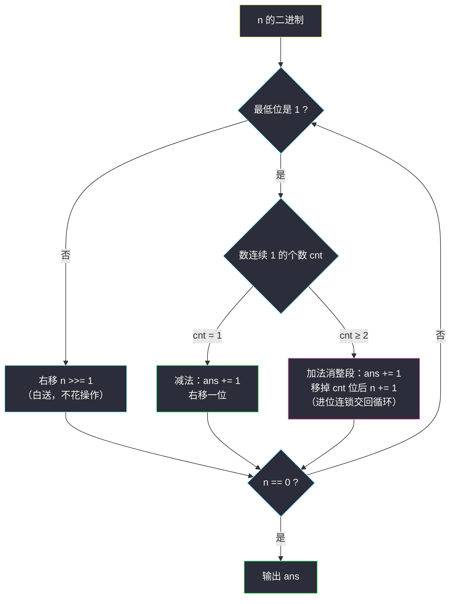

# 将整数减少到零需要的最少操作数（二进制低位贪心 · 连续 1 段进位）

## 一、问题描述

给你一个正整数 `n`。一次操作中，你可以给 `n` **加上**或**减去**一个 2 的幂（`1, 2, 4, 8, ...`，即 `2^0, 2^1, 2^2, ...`）。

返回将 `n` **减少到 0** 的最少操作次数。

> 🔗 LeetCode 2571：https://leetcode.cn/problems/minimum-operations-to-reduce-an-integer-to-0/
>
> 数据范围：`1 <= n <= 10^5`（二进制至多 17 位）。

**示例 1**

```
输入：n = 39
输出：3
解释：39 + 1 = 40 → 40 - 8 = 32 → 32 - 32 = 0，共 3 次操作。
```

**示例 2**

```
输入：n = 54
输出：3
解释：54 + 2 = 56 → 56 + 8 = 64 → 64 - 64 = 0，共 3 次操作。
```

**直观理解**

加减的都是 2 的幂 ⇒ 这是**二进制表示**上的游戏。把 `n` 写成二进制：减 `2^k` 就是消掉第 `k` 位的 1，加 `2^k` 就是把一段尾部的 1 进位清空。「最省操作的删法」取决于 1 的**分布形态**：孤立的 1 直接减，成串的 1 借一次加法整段报销——从最低位（最右）开始逐位决策即可。

---

## 二、暴力解法

**朴素法一：逐个减掉 1。**
每次减 `n` 的最低位 1（lowbit），把二进制里的 1 一个个消掉，操作数恰为 `popcount(n)`。正确但**不最优**：`n = 7`（`111`）要 3 次，而 `7 + 1 = 8`、`8 - 8 = 0` 只要 2 次。

**朴素法二：BFS 最短路。**
把每个整数看作图上的点，`x` 与 `x ± 2^k` 连边，从 `n` 做 BFS 找到 0 的最短层数：

```python
class Solution:
    def minOperations(self, n: int) -> int:
        q, vis = deque([n]), {n}
        step = 0
        while q:
            for _ in range(len(q)):
                x = q.popleft()
                if x == 0:
                    return step
                p = 1
                while p <= x + 1:            # 合理的 2 的幂上界
                    for y in (x - p, x + p):
                        if y >= 0 and y not in vis:
                            vis.add(y)
                            q.append(y)
                    p <<= 1
            step += 1
        return -1
```

### 复杂度

- **时间**：状态数无先验上界（加法会短暂增大 `n`），实测可控但最坏是指数级冗余；`n = 10^5` 时同一层状态爆炸。
- **空间**：同访问集合大小 `O(状态数)`。

### 🔴 瓶颈在哪里

BFS 把「加」和「减」当成平等的分枝搜索，没有利用结构：**2 的幂只作用于二进制的某一位**。低位没清零之前，高位怎么动都白搭——决策天然有从低到高的顺序，直接按位贪心即可。

---

## 三、优化探索（核心章节）

> 📚 本题在灵茶题单中属于 **§1.4 从最左/最右开始贪心**（贪心① A 路）：逐位决策，等价想成位运算——从**最右（最低位）**开始扫二进制，孤立的 1 用减法，连续的 1 段用一次加法整段清空。

### 3.1 为什么必须先处理最低位

任何一次操作 `±2^k`：

- `k = 0`（±1）：直接改变第 0 位；
- `k ≥ 1`：完全不触碰第 0 位。

所以**第 0 位是 1 时，必须发生一次 `±1` 才能清掉它**——这就是「从最右开始」的依据：最低位的去留只由针对它的操作决定，先把它处理干净，再右移（除以 2），问题规模缩小一半。

### 3.2 最低位是 1：看它是「孤 1」还是「串 1」

设最低位开始有一段连续 `cnt` 个 1（其上是 0 或到头）。

**情形 A：`cnt = 1`（孤立的 1，形如 `...01`）**

- 减法 `−1`：一次清掉，高位不动。✅ 总代价 1。
- 加法 `+1`：变成 `...10`——低位清了，但前一位凭空多出一个 1，还得再花 ≥ 1 次。总代价 ≥ 2。

→ **减**。

**情形 B：`cnt ≥ 2`（成串的 1，形如 `...0111...1`）**

- 逐个减：需要 `cnt` 次；
- 加法 `+1`：`0111...1 + 1 = 1000...0`——整段清零，只在前方多出一个 1，总代价 `1 + 后续处理那一个 1 的代价`。`cnt = 2` 时打平（2 对 1+1），`cnt ≥ 3` 时严格更省；若进位恰好接上前面的 1 段，还可能连锁再赚。

→ **加**（`cnt ≥ 2` 一律加，实现统一且不劣）。

### 3.3 进位传播：交给循环

加法消段后，段前那位 `0` 变 `1`；若它前面恰好又贴着 1 段（如 `101111`），新 1 会并入后续扫描继续套同一规则。实现上不用特判——移掉整段后执行 `n += 1`，让 `while` 循环统一消化（这正是「等价想成位运算」的便利：进位的连锁天然由算术加法完成）。



### 3.4 一句话核心

> **从最低位往左扫：孤 1 就减，串 1 就加；加法进位的连锁交给循环，`n` 归零时数一数用了几次。**

---

## 四、代码实现

### Python（主解）

```python
class Solution:
    def minOperations(self, n: int) -> int:
        ans = 0
        while n:
            if n & 1:                     # 低位是 1：处理一段连续 1
                cnt = 0
                while n & 1:
                    n >>= 1
                    cnt += 1
                ans += 1                  # cnt=1 → 减一次；cnt≥2 → 加一次
                if cnt >= 2:
                    n += 1                # 进位（可能连锁），交回循环
            else:                         # 低位是 0：白送
                n >>= 1
        return ans
```

**变量含义**

| 变量 | 含义 |
|------|------|
| `n` | 尚未处理的（已右移的）剩余数 |
| `cnt` | 当前连续 1 段的长度 |
| `ans` | 已用操作数（每个 1 段恰花一次：孤段减、长段加） |

**循环不变式**：每轮开始时，`n` 的最低位尚未决策；`ans` 是「把已扫过的低位全部清零、且不动剩余高位」所需的最少操作数。右移与 `+1` 的组合精确模拟了原数上的加减（移位后的一次操作对应原数上 ±2^(已移位数)）。

### Java（可选对照）

```java
class Solution {
    public int minOperations(int n) {
        int ans = 0;
        while (n > 0) {
            if ((n & 1) == 1) {
                int cnt = 0;
                while ((n & 1) == 1) {
                    n >>= 1;
                    cnt++;
                }
                ans++;
                if (cnt >= 2) n++;         // 进位连锁
            } else {
                n >>= 1;
            }
        }
        return ans;
    }
}
```

`n ≤ 10^5 < 2^17`，进位链最多到 `2^17`，`int` 毫无压力。

### 对照：按位分治的记忆化 DP

同一问题的另一种优雅解法（奇偶分治），与贪心殊途同归，适合当验算器：

```python
@lru_cache(None)
def f(x: int) -> int:
    if x == 0:
        return 0
    if x == 1:
        return 1
    if x % 2 == 0:
        return f(x // 2)                  # 2 的幂带因子 2，整体折半
    return 1 + min(f(x - 1), f(x + 1))    # 奇数：低位 -1 或 +1 进位
```

---

## 五、具体例子演示

### 示例 1 端到端：`n = 39 = 100111₂`

**从最右开始的逐位决策表**（「实际操作」指在**原数**上对应的 ±2 的幂）：

| 轮 | 当前 n（二进制） | 低位形态 | 决策 | 实际操作 | 操作后 | ans |
|----|-----------------|---------|------|---------|--------|-----|
| 1 | `100111` | 连续 2 个 1（`11`） | **加法消段** | +1 | `101000`（40） | 1 |
| 2 | `101000` | 三个 0 | 右移 ×3 | — | `101` | 1 |
| 3 | `101` | 孤立 1 | **减法** | −8 | `100` | 2 |
| 4 | `100` | 两个 0 | 右移 ×2 | — | `1` | 2 |
| 5 | `1` | 孤立 1 | **减法** | −32 | `0` | 3 |

操作序列：`39 + 1 = 40 → 40 − 8 = 32 → 32 − 32 = 0`，共 **3** 次 ✓。
（轮 3 在右移 3 位后的数上「减 1」，对应原数减 `2^3 = 8`；轮 5 对应减 `2^5 = 32`。）

### 示例 2 端到端：`n = 54 = 110110₂`

| 轮 | 当前 n | 低位形态 | 决策 | 实际操作 | 操作后 | ans |
|----|--------|---------|------|---------|--------|-----|
| 1 | `110110` | 末位 0 | 右移 | — | `11011` | 0 |
| 2 | `11011` | 连续 2 个 1 | **加法消段** | +2 | 56 = `111000` → 扫描态 `111` | 1 |
| 3 | `111` | 连续 3 个 1 | **加法消段** | +8 | 64 = `1000000` → 扫描态 `1` | 2 |
| 4 | `1` | 孤立 1 | **减法** | −64 | `0` | 3 |

操作序列：`54 + 2 = 56 → 56 + 8 = 64 → 64 − 64 = 0`，共 **3** 次 ✓。

### 进位连锁的边界例子：`n = 47 = 101111₂`

| 轮 | 当前 n | 低位形态 | 决策 | 实际操作 | 之后 |
|----|--------|---------|------|---------|------|
| 1 | `101111` | 连续 4 个 1 | 加法消段 | +1 | 48 = `110000`，扫描态 `11` |
| 2 | `11` | 连续 2 个 1 | 加法消段 | +16 | 64，扫描态 `1` |
| 3 | `1` | 孤立 1 | 减法 | −64 | 0 |

消掉低 4 个 1 后进位出的新 1 恰好接上前面的 `10`，凑成新的 `11` 段继续用加法——`47 + 1 + 16 − 64 = 0`，共 **3** 次。若在轮 1 后忘了 `n += 1`，就会把进位产生的 1 直接丢掉，得到错误的 2。


---

## 六、复杂度分析

| 方法 | 时间 | 空间 | 说明 |
|------|------|------|------|
| BFS 最短路（暴力） | 状态级（最坏爆炸） | `O(状态数)` | 无先验上界 |
| 逐位贪心（主解） | `O(log n)` | `O(1)` | 每轮至少右移 1 位；进位次数同样被位数限制 |
| 记忆化 DP（对照） | `O(log n)` | `O(log n)` | 奇偶分治，状态数为位数级别 |

`n ≤ 10^5` 至多 17 位，主解常数次循环即结束。

---

## 七、对比总结

**「从最左/最右开始贪心」在二进制题上的化身**：从**最右（最低位）**开始逐位决策，等价想成位运算模拟。与 #1509 的「从两端删」、#3074 的「从最大拿」同属一个方法论：先锁定一个**顺序上不可回避**的位置（本题是最低位——它只受 ±1 影响），逐步把问题规模砍半。

**方法谱系**

| 视角 | 做法 |
|------|------|
| 操作即位操作 | 减 `2^k` = 消第 k 位的 1；加 `2^k` = 进位 |
| 顺序依据 | 低位未清零前高位操作无效 → 先右后左 |
| 形态分类 | 孤 1 减（1 次）；串 1 加（1 次整段报销 + 进位连锁） |

**易错点**

1. 连续段消掉后**忘记 `n += 1`**：进位产生的新 1 被无声丢弃（`101111` 这类连锁场景直接算错）；
2. 孤立的 1 用加法：`01 → 10` 看似「也没多花这一步」，但平白多出一个高位 1，总代价多 1；
3. 忘写低位为 0 时的右移分支，死循环；
4. 以为「能减就减」的 `popcount` 就是最优——`7 = 111` 反例摆在眼前。

**模板（低位扫描贪心，Python）**

```python
ans = 0
while n:
    if n & 1:
        cnt = 0
        while n & 1:
            n >>= 1; cnt += 1
        ans += 1                 # 每段 1 恰好一次操作
        if cnt >= 2:
            n += 1               # 加法进位，连锁交回循环
    else:
        n >>= 1
# ans 即答案
```

---

## 八、举一反三

| 题目 | 关系 |
|------|------|
| [1404. 将二进制表示减到 1 的步骤数](https://leetcode.cn/problems/number-of-steps-to-reduce-a-number-in-binary-representation-to-one/) | 同款低位进位模拟：奇数 +1、偶数除 2 |
| [693. 交替位二进制数](https://leetcode.cn/problems/binary-number-with-alternating-bits/) | 位运算热身，感受「连续 1 / 连续 0」的形态判断 |
| [231. 2 的幂](https://leetcode.cn/problems/power-of-two/) | lowbit 判定基础：`n & (n - 1) == 0` |
| [1780. 判断一个数字是否可以表示成三的幂的和](https://leetcode.cn/problems/check-if-number-is-a-sum-of-powers-of-three/) | 换成三进制的逐位贪心：每位只能是 0/1，出现 2 即无解 |
| [1558. 得到目标数组的最少函数调用次数](https://leetcode.cn/problems/minimum-numbers-of-function-calls-to-make-target-array/) | 「全体 +1」与「全体除 2」的位视角贪心，同为从低位累积代价 |

**思想迁移**

- 操作是 2 的幂 ⇔ **位运算视角**：把「加减什么」翻译成「清哪一位、进不进位」；
- 决策顺序找「不可回避端」：最低位只受 `±1` 影响，必须最先处理——这就是「从最右开始」；
- 形态决定策略：**孤则减、串则加**，进位连锁交给循环统一消化。
- 口诀：**「从右往左扫二进制，孤 1 就减，串 1 进一；进位连锁循环解，位数级别见分晓。」**
