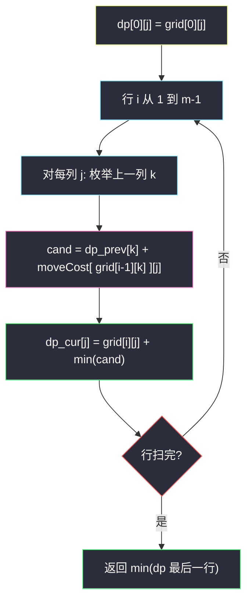

# 2304. 网格中的最小路径代价（Minimum Path Cost in a Grid）

> 题目来源：[https://leetcode.cn/problems/minimum-path-cost-in-a-grid/](https://leetcode.cn/problems/minimum-path-cost-in-a-grid/)
>
> 灵茶题单小节定位：§A 线性 DP（网格 DP · 逐行多列转移）

## 一、问题描述

给你一个下标从 0 开始的整数矩阵 `grid`，矩阵大小为 `m x n`，由从 `0` 到 `m * n - 1` 的**不同**整数组成。你可以在此矩阵中，从一个单元格移动到**下一行**的任何其他单元格。如果你位于单元格 `(x, y)`，且满足 `x < m - 1`，你可以移动到 `(x+1, 0), (x+1, 1), ..., (x+1, n-1)` 中的任何一个单元格。注意：在最后一行中的单元格不能触发移动。

每次可能的移动都需要付出对应的代价，代价用一个下标从 0 开始的二维数组 `moveCost` 表示，该数组大小为 `(m * n) x n`，其中 `moveCost[i][j]` 是从值为 `i` 的单元格移动到下一行第 `j` 列单元格的代价。从 `grid` 最后一行的单元格移动的代价可以忽略。

`grid` 一条路径的代价是：所有路径经过的单元格的**值之和**加上**所有移动的代价之和**。从第一行任意单元格出发，返回到达最后一行任意单元格的**最小路径代价**。

**数据范围**：

- `m == grid.length`
- `n == grid[i].length`
- `2 <= m, n <= 50`
- `grid` 由从 `0` 到 `m * n - 1` 的不同整数组成
- `moveCost.length == m * n`
- `moveCost[i].length == n`
- `1 <= moveCost[i][j] <= 100`

**示例 1**：

```text
输入：grid = [[5,3],[4,0],[2,1]], moveCost = [[9,8],[1,5],[10,12],[18,6],[2,4],[14,3]]
输出：17
解释：最小代价路径是 5 → 0 → 1。
路径单元格值之和 5 + 0 + 1 = 6；5→0 代价 3（moveCost[5][0]）；0→1 代价 8（moveCost[0][1]）。
总代价 6 + 3 + 8 = 17。
```

**示例 2**：

```text
输入：grid = [[5,1,2],[4,0,3]], moveCost = [[12,10,15],[20,23,8],[21,7,1],[8,1,13],[9,10,25],[5,3,2]]
输出：6
解释：最小代价路径是 2 → 3：值和 5，移动代价 moveCost[2][2] = 1，总 6。
```

**核心思考点**：路径逐行下降、每步可跳到下一行任意列——天然的**阶段化**结构（阶段 = 行）。`dp[i][j]` = 到达 `(i,j)` 的最小总代价，转移需枚举上一行所有列 `k`，代价由**源格的值**查 `moveCost`：`dp[i][j] = grid[i][j] + min_k(dp[i-1][k] + moveCost[grid[i-1][k]][j])`。`O(m n²)` 在 `m,n ≤ 50` 下仅 12.5 万次，直接过；还能用「上一行最小、次小」把它压到 `O(mn)`。

## 二、暴力解法

### 思路

递归枚举：从第一行每个起点出发，每步选下一行任意列，累计值和与移动代价，到最后一行结算取最小。不加记忆化，路径数 `n · n^(m-1) = n^m` 指数级。

### 代码

```python
def minPathCostBrute(grid: list[list[int]], moveCost: list[list[int]]) -> int:
    m, n = len(grid), len(grid[0])
    best = float("inf")
    def dfs(i, j, acc):
        nonlocal best
        acc += grid[i][j]
        if i == m - 1:
            best = min(best, acc)
            return
        v = grid[i][j]
        for k in range(n):
            dfs(i + 1, k, acc + moveCost[v][k])
    for j in range(n):
        dfs(0, j, 0)
    return best
```

### 复杂度

- 时间：`O(n^m)`——`n = 50, m = 50` 时彻底不可行；小矩阵对拍可用。
- 空间：`O(m)` 递归栈。

## 三、优化探索

### 3.1 阶段化 + 无后效性：逐行 DP ⭐⭐

「只能向下一行移动」保证路径按行推进，到达 `(i,j)` 后的未来只依赖 `(i,j)` 本身（与怎么来的无关）——无后效性成立。设 `dp[i][j]` 为到达并**计入** `grid[i][j]` 的最小总代价：

```text
dp[0][j] = grid[0][j]
dp[i][j] = grid[i][j] + min over k of ( dp[i-1][k] + moveCost[ grid[i-1][k] ][j] )
```

注意移动代价由**源格值** `grid[i-1][k]` 索引（不是源列号 `k`），且目标列 `j` 是 `moveCost` 的第二维。答案 = `min(dp[m-1])`。

### 3.2 空间滚动：一行足矣 ⭐

转移只看上一行——`dp` 压成 `n` 维数组，每行就地滚动。由于代价表 `moveCost[源值][目标列]` 随目标列变化，**不能**像普通网格那样只比较两个邻居；必须真枚举 `k`。

### 3.3 进阶：最小 + 次小压到 O(mn) ⭐⭐

把内层拆开：

```text
dp[i][j] = grid[i][j] + min_k ( dp[i-1][k] + moveCost[v_k][j] )
```

对固定的 `j`，`min_k` 里 `moveCost[v_k][j]` 随 `k` 任意变化，无法整体取一次 min——**但是**，若「最优 `k*` 在上一行的贡献恰为全局最小 `dp` 值」，除 `j = moveCost[v_{k*}]` 所在……更干净的刻画：设上一行的 `dp` 最小值 `t1`（列 `k1`）与次小 `t2`。对目标列 `j`，候选 `k = k1` 的项是 `t1 + moveCost[v_{k1}][j]`；其余列 `k ≠ k1` 的项 `dp[i-1][k] + moveCost[v_k][j] ≥ t2 + 1`……严格地：`min_k` ≤ `min( t1 + moveCost[v_{k1}][j], t2 + min_j' moveCost[..][j] )` 并不精确。**精确结论**：对每个 `j` 取 `k* = argmin_k (dp[i-1][k] + moveCost[v_k][j])`；若固定 `k1 = argmin dp`，则除「`j` 恰好使 `moveCost[v_{k1}][j]` 很大」的情形外都取 `k1`……这在一般代价下无简明刻画，**标准的 O(mn) 做法换个方向**：不是对每个 `j` 枚举 `k`，而是对每个 `k` 把它的贡献一次性推给所有 `j`：

```text
for k in range(n):
    v = grid[i-1][k]; base = dp_prev[k]
    for j in range(n):
        dp_cur[j] = min(dp_cur[j], base + moveCost[v][j])
cur 加上 grid[i][行] 值
```

这仍是 `O(n²)` 每行。真正 `O(n)` 的技巧需要代价结构特殊（如 `moveCost[v][j] = |v − j|` 型可拆分），本题任意代价下 `O(mn²)` 已是最优通用解（`mn ≤ 2500` 规模无压力）。这一段探索的价值在于认清「**转移代价与目标列相关 ⇒ 双重枚举不可避免**」。



## 四、代码实现

### 主解：逐行 DP + 滚动数组

```python
class Solution:
    def minPathCost(self, grid: List[List[int]], moveCost: List[List[int]]) -> int:
        m, n = len(grid), len(grid[0])
        dp = grid[0][:]                       # 第一行：起点代价即格值
        for i in range(1, m):
            prev_row, prev_dp = grid[i - 1], dp
            dp = [0] * n
            for j in range(n):
                best = min(prev_dp[k] + moveCost[prev_row[k]][j]
                           for k in range(n))
                dp[j] = grid[i][j] + best
        return min(dp)
```

### 进阶：生成器表达式 + 行内 min 的紧凑写法

```python
class Solution:
    def minPathCost(self, grid: List[List[int]], moveCost: List[List[int]]) -> int:
        dp = grid[0][:]
        for prev_row, row in zip(grid, grid[1:]):
            dp = [v + min(p + moveCost[prev_row[k]][j] for k, p in enumerate(dp))
                  for j, v in enumerate(row)]
        return min(dp)
```

（`zip(grid, grid[1:])` 配对相邻两行，省掉下标算术；两层推导式与主解完全等价。）

### 细节说明

- **`moveCost` 用源格值索引**：`moveCost[grid[i-1][k]][j]`——第一维是**值**（0..m·n−1 全局唯一），第二维是**目标列**。写成 `moveCost[k][j]`（用列号）是最常见笔误，示例 1 立刻穿帮。
- **`dp` 初始化为 `grid[0]` 的拷贝**：`grid[0][:]` 防止就地修改输入（主解每轮新建数组，拷贝是保险习惯）。
- **最后一行不再计移动代价**：转移只在 `i ≤ m−1` 循环内发生，最后一行天然无出边——无需特判。
- **答案取 `min(dp)`**：终点任意列；起点的自由度由 `dp[0][j] = grid[0][j]` 全列初始化覆盖。
- **值域与代价上界**：路径总代价 ≤ `m·n·100 + m·n ≤ 2.5×10⁵ + 2500`，`int` 富余。

## 五、例子演示

**示例 1 端到端：grid = [[5,3],[4,0],[2,1]]，moveCost 见题面**

| 阶段 | 计算 | dp |
|---|---|---|
| 第 0 行 | 初始化 | `[5, 3]` |
| 第 1 行 (4,0) | `j=0`：`min(5+mC[5][0], 3+mC[3][0]) = min(5+14, 3+18) = 17`；+4 → 21<br>`j=1`：`min(5+mC[5][1], 3+mC[3][1]) = min(5+3, 3+6) = 8`；+0 → 8 | `[21, 8]` |
| 第 2 行 (2,1) | `j=0`：`min(21+mC[4][0], 8+mC[0][0]) = min(21+2, 8+9) = 17`；+2 → 19<br>`j=1`：`min(21+mC[4][1], 8+mC[0][1]) = min(21+4, 8+8) = 16`；+1 → 17 | `[19, 17]` |

`min(dp) = 17` ✅。回溯最优路径：终点 `(2,1)`（值 1）来自 `k=1`（上格值 0，`8 + moveCost[0][1]=8` → 16，加 1 得 17）；`(1,1)` 的 dp=8 来自 `k=0` 行…等等——`j=1` 列的最优 `k` 是 0（`5+3=8`，源格值 5 即 `(0,0)`）。完整路径 `5 → 0 → 1` ✅ 与官方一致：值和 6 + 代价 `moveCost[5][0]=3` + `moveCost[0][1]=8` = 17。

**示例 2：grid = [[5,1,2],[4,0,3]]**：`dp0 = [5,1,2]`；第 1 行：
- `j=0`（值 4）：`min(5+mC[5][0], 1+mC[1][0], 2+mC[2][0]) = min(10, 21, 23) = 10`；+4 → 14
- `j=1`（值 0）：`min(5+3, 1+23, 2+7) = 9`；+0 → 9
- `j=2`（值 3）：`min(5+2, 1+8, 2+1) = 3`；+3 → 6

`min = 6` ✅——路径 `2 → 3`：值和 5、`moveCost[2][2] = 1`，总 6。

**「卡列号笔误」的小实验**：示例 1 第 1 行 `j=1` 若误用 `moveCost[k][j]`（列号当值）：`min(5+mC[0][1], 3+mC[1][1]) = min(5+8, 3+5) = 8`——碰巧同值（小矩阵陷阱）；但第 2 行 `j=0`：`min(21+mC[0][0], 8+mC[1][0]) = min(30, 9) = 9`，+2 → 11 ≠ 19，答案错成 12。对拍几组随机数据即可抓出此类笔误。

## 六、复杂度分析

设 `m, n` 为行列数：

- **时间复杂度：`O(m·n²)`**——每行 `n` 个目标列 × `n` 个源列。`m,n ≤ 50` 时 ≤ 1.25×10⁵ 次。
- **空间复杂度：`O(n)`**——滚动数组（另有输入的 `moveCost`，不计）。

## 七、对比总结

| 维度 | 暴力枚举路径 | 逐行 DP（主解） |
|---|---|---|
| 时间 | `O(n^m)` | `O(mn²)` |
| 空间 | `O(m)` | `O(n)` |
| 关键洞察 | — | 阶段化（按行）+ 无后效性 |
| 转移形态 | — | 枚举上一行全部列（代价查表） |

**套路归纳**：**「逐行下降的网格 = 阶段化 DP」**，转移自由度由移动规则决定：本题可跳任意列 ⇒ 内层枚举 `n` 个源列，且代价表按**源格值**索引——「读清代价索引的语义」（值 vs 列 vs 坐标）是本题唯一的新知识点。滚动数组一维即够。与 #1594（双状态）、#3148（望远镜 + 前缀 min）对照：网格 DP 的变体全在「转移集 + 状态附加维」两处做文章。

## 八、举一反三

1. **[1289. 下降路径最小和 II](https://leetcode.cn/problems/minimum-falling-path-sum-ii/)**：同款逐行多列转移，但代价不依赖源值（可用最小/次小 O(n) 优化）——批 24 收录的 Hard 版。
2. **[931. 下降路径最小和](https://leetcode.cn/problems/minimum-falling-path-sum/)**：转移集缩成三列的入门版。
3. **[120. 三角形最小路径和](https://leetcode.cn/problems/triangle/)**：变宽度逐行 DP，滚动时需倒序防覆盖。
4. **[1594. 矩阵的最大非负积](https://leetcode.cn/problems/maximum-non-negative-product-in-a-matrix/)** / **[3148. 矩阵中的最大得分](https://leetcode.cn/problems/maximum-difference-score-in-a-grid/)**：本批姊妹篇，网格三部曲另两员。
5. **[2435. 矩形中可达路径的数目](https://leetcode.cn/problems/paths-in-matrix-whose-sum-is-divisible-by-k/)**：逐行 DP + mod 计数（取模维度），转移骨架与本题同、答案形态不同。

**同族互引**：网格三部曲之三；`minimum-falling-path-sum-ii.md`（批 24 #1289）是本题「代价恒为 1、可 O(n) 优化」的 Hard 亲戚，届时对照「何时能省掉内层枚举」。
