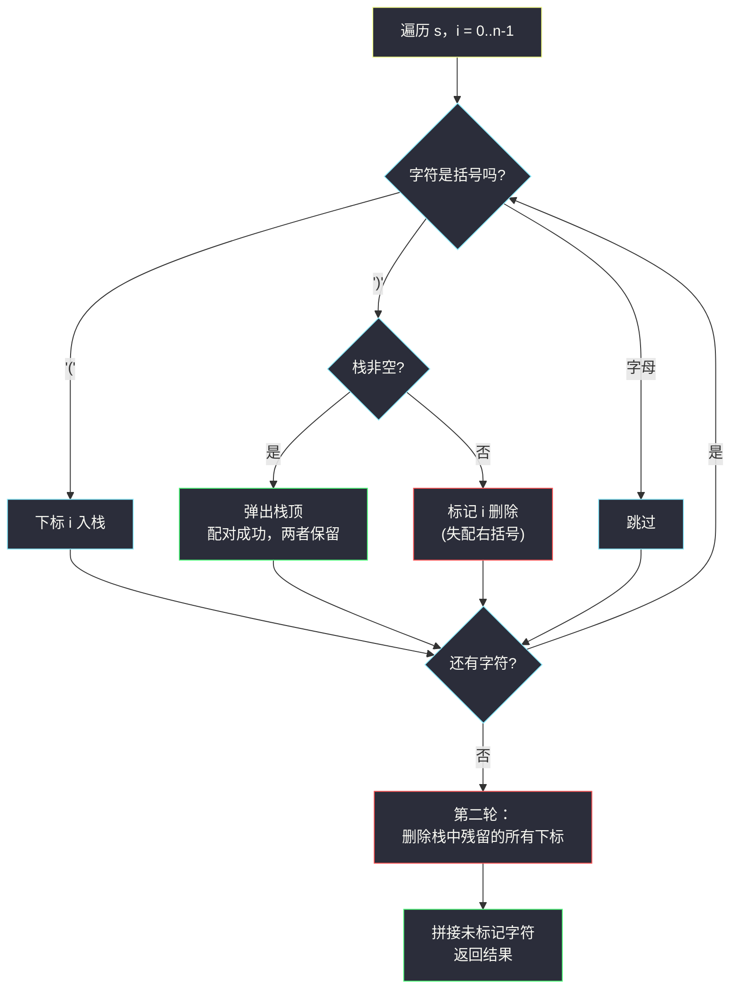
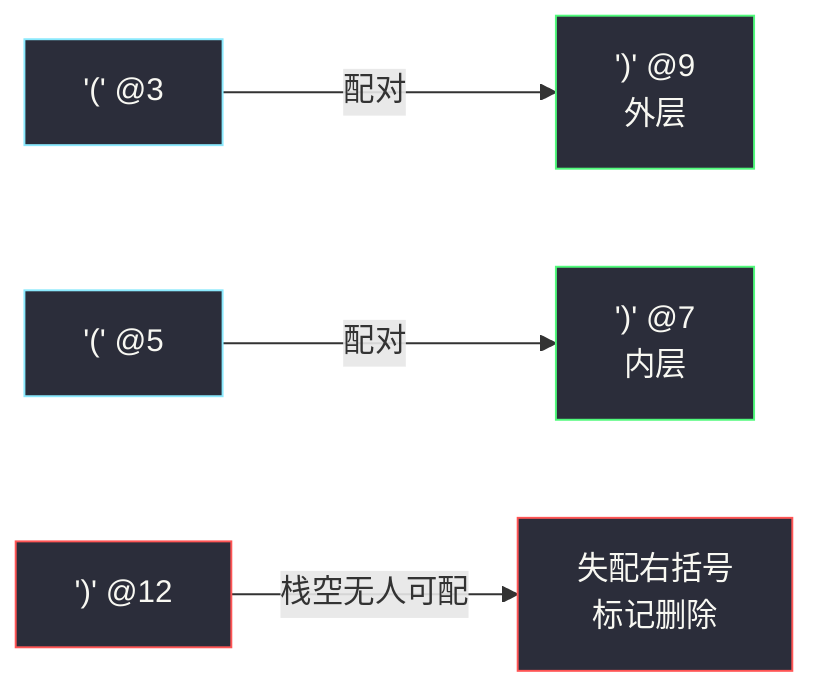

# 移除无效的括号（合法括号串 RBS · 栈存下标定位删除）

## 一、问题描述

给你一个由 `(`、`)` 和小写英文字母组成的字符串 `s`。

你需要从字符串中删除**最少**数量的括号（可以删除字符串中任意位置的括号，字母不能删），使得剩下的「括号有效性」成立——即每个 `(` 都能找到与之配对的 `)`，且配对不存在交叉。请你返回一个剩下的合法字符串。

题目保证答案唯一性不要求：**任意一个**删除最少括号后的合法结果都会被判定正确。

> 🔗 LeetCode 1249：https://leetcode.cn/problems/minimum-remove-to-make-valid-parentheses/
>
> 数据范围：`1 <= s.length <= 10^5`，`s[i]` 可能是 `'('`、`')'`、或小写英文字母。
>
> 📚 本题出自灵茶题单 **§3.4 合法括号字符串（RBS）**。

**示例 1**

```
输入：s = "lee(t(c)o)de)"
输出："lee(t(c)o)de)"
解释：也可以删掉下标 4 的 '(' 得 "le(t(c)o)de"，任意合法答案均可。
```

**示例 2**

```
输入：s = "a)b(c)d"
输出："ab(c)d"
```

**示例 3**

```
输入：s = "))(("
输出：""
解释：所有括号都无法配对，全部删除，返回空串。
```

**直观理解**

「合法括号串」（Regular Bracket Sequence，RBS）的核心判据是**计数法**：从左到右维护计数器 `cnt`，遇 `(` 加一、遇 `)` 减一，过程中 `cnt` 永远不为负、最终恰好为 0。本题问的是**最少删几个字符能变成 RBS**——直觉告诉我们：能配对的括号一个都不用删，只有那些「注定配不上对」的括号才必须删。怎么把它们精确找出来？**栈存下标**。

---

## 二、暴力解法

最朴素的想法：枚举每个括号字符「删或不删」的所有组合，对每个结果检查合法性，保留删除次数最少的。

```python
class Solution:
    def minRemoveToMakeValid(self, s: str) -> str:
        idx = [i for i, c in enumerate(s) if c in "()"]   # 所有括号下标
        best = None
        for mask in range(1 << len(idx)):                 # 枚举删除子集
            remove = {idx[k] for k in range(len(idx)) if mask >> k & 1}
            t = "".join(c for i, c in enumerate(s) if i not in remove)
            cnt = 0
            ok = True
            for c in t:                                   # 计数法检查
                if c == "(":
                    cnt += 1
                elif c == ")":
                    cnt -= 1
                    if cnt < 0:
                        ok = False
                        break
            if ok and cnt == 0 and (best is None or len(t) > len(best[1])):
                best = (len(remove), t)
        return best[1]
```

### 复杂度

- **时间**：`O(2^k · n)`，其中 `k` 是括号个数，最坏 `k = 10^5`，完全不可行。
- **空间**：`O(n)`。

### 🔴 瓶颈在哪里

暴力把「删谁」当成组合搜索问题，但本题的答案结构其实**高度确定**：**最少删除数**是一个定值（见下文推导），且「删掉全部失配括号」就是一个达到该下界的现成方案——搜索空间根本不必展开。

---

## 三、优化探索（核心章节）

> 📚 灵茶题单 **§3.4 合法括号字符串（RBS）** 的三板斧：**计数法**（`cnt` 遇左加一遇右减一，`cnt < 0` 即失配）、**栈法**（存下标便于定位删除）、**贪心**（直接推出最少操作数）。本题是「栈法」的代表：**栈存下标，第二轮删除栈中残留**。

### 3.1 谁是「失配」的括号

用计数器扫一遍 `s`（忽略字母）：

- 遇到 `(`：`cnt += 1`；
- 遇到 `)`：`cnt -= 1`，若 `cnt < 0`，说明这个 `)` **前面已经没有多余的 `(` 可配**——它注定失配；
- 扫完后若 `cnt > 0`，说明有 `cnt` 个 `(` **后面没有 `)` 可配**——同样注定失配。

**关键论断**：任何删除方案都救不了这些括号。

- 半路 `cnt < 0` 的 `)`：它前面的 `(` 全被更早的 `)` 占用了，除非删掉某个更早的 `)`……但那样只是换一个字符失配，**失配右括号的个数不减**；
- 结尾多出的 `cnt` 个 `(`：整个串的 `(` 数比 `)` 数多 `cnt`，每删一个 `(` 补一个缺口。

反过来，把所有失配括号删掉后，剩下的串**恰好合法**（每个保留下来的 `)` 都有专属的 `(`，每个保留的 `(` 都有专属的 `)`）。所以：

> **最少删除数 = 失配括号总数；删掉全部失配括号即可达标。**（最优方案不一定唯一——如例 1 中删下标 7 的 `)` 同样最优，判定器接受任意最优方案；栈法自然给出的是「删失配」这一份。）

### 3.2 栈存下标：一趟定位所有失配

上一节的计数法能数出失配**个数**，但定位**是哪几个**需要栈——栈里存的是**下标**而不是字符：

- 遇 `(`：把下标 `i` 入栈（这是「等待配对的左括号候选」）；
- 遇 `)`：栈非空 → 弹出栈顶（配对成功，两者都保留）；栈空 → 这个 `)` 失配，标记删除；
- 扫描结束后，**栈中残留的下标**就是失配的 `(`，第二轮统一标记删除。



### 3.3 为什么「删失配括号」就是合法串

把保留下来的括号子序列单独抽出来看：每个保留的 `)` 在弹出瞬间都找到了一个比它早入栈、尚未配对的 `(`，且栈的 LIFO 性质保证**配对不交叉**（最近未匹配的 `(` 优先配对，正是合法嵌套的定义）。所以保留子序列是 RBS，删除数又达到了下界（失配总数），最优性得证。

### 3.4 空间优化：两遍计数，免栈标记

如果不想开标记数组/栈，可以用灵神的**两遍计数**写法：

- **第一遍从左到右**：维护 `cnt`，遇 `(` 加一；遇 `)` 时若 `cnt > 0` 则减一（这个 `)` 保留），否则跳过它不写入结果（删失配 `)`）；
- **第二遍从右到左**：对第一遍的结果同理，遇 `)` 加一；遇 `(` 时若计数大于 0 则减一，否则跳过（删失配 `(`）。

两遍后剩下的串就是答案。原理与栈法完全一致，只是用计数器代替了「栈里还剩几个没配对的左括号」这一信息。

### 3.5 一句话核心

> 栈存**下标**：右括号弹栈配对、弹不出就删；扫描完**栈中残留**的左括号也删——删除集恰好是全部失配括号，且这是最少删除。

---

## 四、代码实现

### Python 主解（栈存下标 + 标记数组）

```python
class Solution:
    def minRemoveToMakeValid(self, s: str) -> str:
        n = len(s)
        remove = [False] * n              # 标记删除
        stack = []                        # 栈存未配对 '(' 的下标
        for i, c in enumerate(s):
            if c == "(":
                stack.append(i)           # 等待配对
            elif c == ")":
                if stack:
                    stack.pop()           # 配对成功，两者都保留
                else:
                    remove[i] = True      # 失配右括号
        for i in stack:                   # 第二轮：栈中残留的左括号
            remove[i] = True
        return "".join(c for i, c in enumerate(s) if not remove[i])
```

**变量含义**

| 变量 | 含义 |
|------|------|
| `stack` | 尚未配对的 `(` 的下标，LIFO，栈顶是最近的未配对左括号 |
| `remove` | 待删除标记；最终为 `True` 的位置即全部失配括号 |

**循环不变式**：处理完下标 `i` 后，`stack` 中恰好保存 `s[0..i]` 中所有「尚未找到右括号配对」的 `(` 下标（按出现顺序递增）。

### Python 变体（两遍计数，免栈免标记）

```python
class Solution:
    def minRemoveToMakeValid(self, s: str) -> str:
        # 第一遍：从左到右删失配 ')'
        cnt, t = 0, []
        for c in s:
            if c == "(":
                cnt += 1
                t.append(c)
            elif c == ")":
                if cnt > 0:
                    cnt -= 1
                    t.append(c)           # 配上了，保留
                # else：失配 ')' 直接丢弃
            else:
                t.append(c)               # 字母永远保留
        # 第二遍：从右到左删失配 '('
        ans, cnt = [], 0
        for c in reversed(t):
            if c == ")":
                cnt += 1
                ans.append(c)
            elif c == "(":
                if cnt > 0:
                    cnt -= 1
                    ans.append(c)         # 配上了，保留
                # else：失配 '(' 丢弃
            else:
                ans.append(c)
        return "".join(reversed(ans))
```

### Java（最优解同款）

```java
class Solution {
    public String minRemoveToMakeValid(String s) {
        int n = s.length();
        boolean[] remove = new boolean[n];
        Deque<Integer> stack = new ArrayDeque<>();
        for (int i = 0; i < n; i++) {
            char c = s.charAt(i);
            if (c == '(') {
                stack.push(i);
            } else if (c == ')') {
                if (!stack.isEmpty()) stack.pop();
                else remove[i] = true;
            }
        }
        for (int i : stack) remove[i] = true;
        StringBuilder sb = new StringBuilder();
        for (int i = 0; i < n; i++) {
            if (!remove[i]) sb.append(s.charAt(i));
        }
        return sb.toString();
    }
}
```

---

## 五、具体例子演示

### 例 1：s = "lee(t(c)o)de)"（示例 1）

下标对照：`0:l 1:e 2:e 3:( 4:t 5:( 6:c 7:) 8:o 9:) 10:d 11:e 12:)`

一趟扫描，栈中只装 `(` 的下标：

| i | s[i] | 动作 | 栈（`(` 的下标） | 失配右括号 |
|---|------|------|------------------|------------|
| 0 | l | 字母跳过 | `[]` | — |
| 1 | e | 字母跳过 | `[]` | — |
| 2 | e | 字母跳过 | `[]` | — |
| 3 | `(` | 下标 3 入栈 | `[3]` | — |
| 4 | t | 字母跳过 | `[3]` | — |
| 5 | `(` | 下标 5 入栈 | `[3, 5]` | — |
| 6 | c | 字母跳过 | `[3, 5]` | — |
| 7 | `)` | 弹出 5，配对成功 | `[3]` | — |
| 8 | o | 字母跳过 | `[3]` | — |
| 9 | `)` | 弹出 3，配对成功 | `[]` | — |
| 10 | d | 字母跳过 | `[]` | — |
| 11 | e | 字母跳过 | `[]` | — |
| 12 | `)` | **栈空 → 失配，标记删除** | `[]` | `{12}` |

第二轮：栈为空，无残留左括号。删除集 = `{12}`，结果 = `"lee(t(c)o)de"` ✓，与官方示例输出一致。（此例也存在别的最优方案：删下标 7 的 `)` 得 `"lee(t(co)de)"` 同样合法且同样只删 1 个——本题判定器对任意最优方案都判对，我们输出栈法算出的这份即可。）

**配对关系可视化**：



### 例 2：s = "))(("（示例 3，双失配）

| i | s[i] | 动作 | 栈 | 失配右括号 |
|---|------|------|-----|------------|
| 0 | `)` | 栈空 → 删 | `[]` | `{0}` |
| 1 | `)` | 栈空 → 删 | `[]` | `{0, 1}` |
| 2 | `(` | 入栈 | `[2]` | `{0, 1}` |
| 3 | `(` | 入栈 | `[2, 3]` | `{0, 1}` |

第二轮：栈残留 `{2, 3}` 也删。删除集 = `{0, 1, 2, 3}`，返回空串 `""` ✓。**注意左失配必须靠第二轮删栈才发现**——只扫一遍计数的人容易漏掉这一步。

---

## 六、复杂度分析

| 方法 | 时间 | 空间 | 说明 |
|------|------|------|------|
| 暴力枚举子集 | `O(2^k · n)` | `O(n)` | `k` 为括号个数，完全不可行 |
| 栈存下标 + 标记 | `O(n)` | `O(n)` | 一趟扫描 + 一轮删残留，栈和标记数组各 `O(n)` |
| 两遍计数 | `O(n)` | `O(n)` | 免栈，但中间串仍占 `O(n)`（输出本身 `O(n)`） |

---

## 七、对比总结

本题在灵茶题单 §3.4 的 RBS 家族里，定位是「**栈配对 + 定位删除**」：

| 题 | 已知 | 目标 | RBS 工具 |
|----|------|------|----------|
| **#1249 本篇** | 带字母的括号串 | 最少**删除**使其合法 | 栈存下标，删失配 |
| #1963 最小交换（同批 `minimum-number-of-swaps-to-make-the-string-balanced.md`） | 纯括号串 | 最少**交换**使其平衡 | 计数清匹配，剩 `))..((` 段做贪心推导 |
| #678 有效括号串（同批 `valid-parenthesis-string.md`） | 含 `*` 通配 | 判断能否合法 | 可行区间 `[lo, hi]` |

三题共享同一个第一步：**找出失配括号**。差别只在「怎么处置」：删除（本题，失配数即答案）、交换（#1963，失配配对后 ⌈m/2⌉ 次）、还是引入不确定性后判断可行性（#678）。

**易错点**

1. **栈里必须存下标**，存字符就无法回头定位删除残留的 `(`——「第二轮删除栈中残留」是灵神模板的原文，存字符直接做不了。
2. **只删括号不删字母**：字母无条件保留。
3. 忘了第二轮：只处理失配 `)`、漏掉栈中残留 `(`，`"))((" `这类用例必挂。
4. `)` 遇栈空要「标记但不入栈」——它没有资格等配对（左括号才能等）。
5. 输出任意合法方案即可，不必纠结删哪一份等价的 `(`；本题删除集其实唯一，但即使你的写法产生另一种同样合法的串也能通过。

---

## 八、举一反三

| 题目 | 关系 |
|------|------|
| [1963. 使字符串平衡的最小交换次数](https://leetcode.cn/problems/minimum-number-of-swaps-to-make-the-string-balanced/) | 同小节姊妹题：同样先清匹配剩失配，操作从「删」换成「换」，见同批 `minimum-number-of-swaps-to-make-the-string-balanced.md` |
| [678. 有效的括号字符串](https://leetcode.cn/problems/valid-parenthesis-string/) | RBS 判定 + `*` 通配，可行区间法，见同批 `valid-parenthesis-string.md` |
| [921. 使括号有效的最少添加](https://leetcode.cn/problems/minimum-add-to-make-parentheses-valid/) | 对偶操作：本题删失配，#921 补失配，答案同为失配总数 |
| [1111. 有效括号的嵌套深度](https://leetcode.cn/problems/maximum-nesting-depth-of-two-valid-parentheses-strings/) | 同样一趟栈扫描，输出的是分组方案而非删除方案 |
| [32. 最长有效括号](https://leetcode.cn/problems/longest-valid-parentheses/) | 栈存下标的进阶应用：以下标差求最长合法段 |
| [3412. 计算字符串的镜像分数](https://leetcode.cn/problems/find-mirror-score-of-a-string/) | 同批 `find-mirror-score-of-a-string.md`：栈配对思想从「括号匹配」迁移到「镜像字符匹配」 |
| 同目录 `remove-all-adjacent-duplicates-in-string-ii.md` | 栈消除字符的另一形态（相邻重复消除） |

**思想迁移**

- 看到「最少改动使括号合法」→ 先问**失配是谁**：计数法数个数、栈法定位位置，两者都 `O(n)`。
- 栈存**内容**只能回答「匹不匹配」，栈存**下标**才能回答「在哪里」——需要回溯位置的题目（删除、求长度、分组）一律存下标。
- 口诀：**「左括号入栈等右来，右来弹栈配成对；栈空右括必失配，扫完残留也要删。」**
