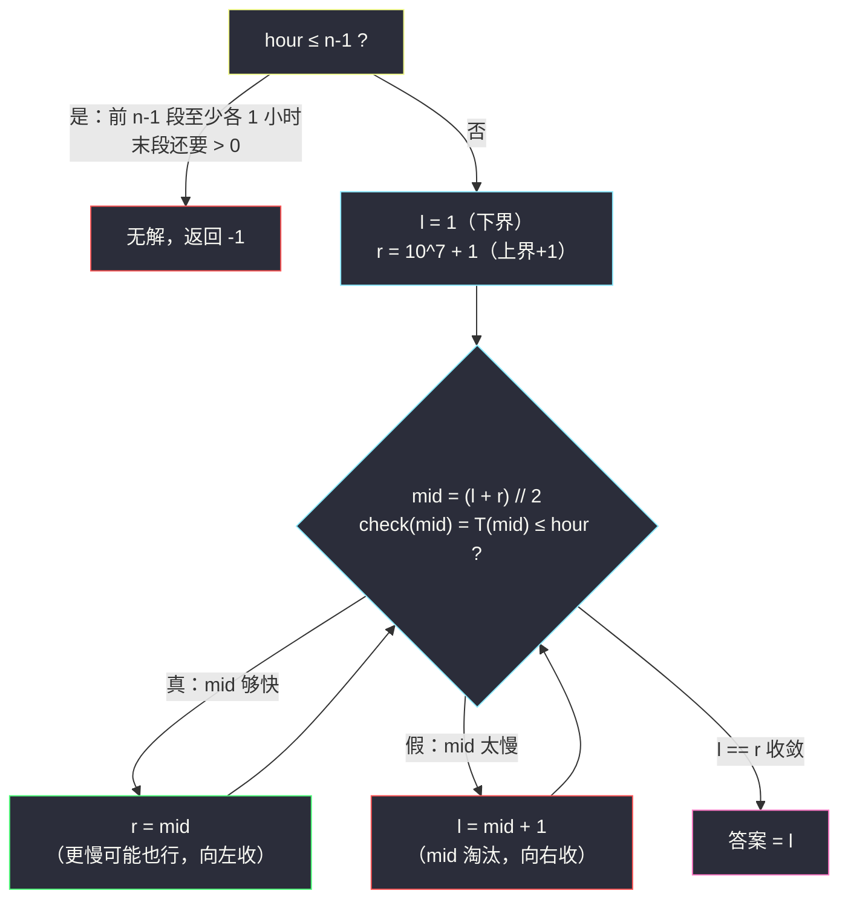
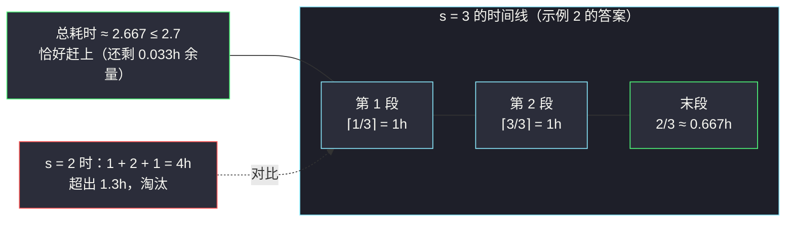

# 准时到达的列车最小时速（二分答案 · 求最小）

## 一、问题描述

给你一个浮点数 `hour`，表示你可以用于旅行的小时数。地上有 `n` 列列车按顺序开出，第 `i` 列（下标从 0 开始）在第 `hour` 小时整点行驶，且只能按顺序乘坐。

准确规则是：你从第 0 列列车出发，依次乘坐全部 `n` 列；第 `i` 列列车行驶 `dist[i]` 公里，时速为 `speed`（对所有列车**相同**）。除**最后**一列外，每列列车到站后你必须等到下一个整点才能换乘下一列；最后一列不等待，到站即结束旅行。

返回能满足准时到达（总耗时 **小于等于** `hour`）的**最小正整数**时速；不存在这样的时速，返回 `-1`。

> 🔗 LeetCode 1870：https://leetcode.cn/problems/minimum-speed-to-arrive-on-time/
>
> 数据范围：`n == dist.length`，`1 <= n <= 10^5`，`1 <= dist[i] <= 10^5`，`1 <= hour <= 10^9`，`hour` 精确到小数点后两位（最多两位小数）。测试保证答案不超过 `10^7`。

**示例 1**

```
输入：dist = [1,3,2], hour = 6
输出：1
解释：时速 1：⌈1/1⌉ + ⌈3/1⌉ = 4 小时（整点换乘等待已含在向上取整里），
再走完最后一段 2/1 = 2 小时，总计 6 ≤ 6，准时到达。
```

**示例 2**

```
输入：dist = [1,3,2], hour = 2.7
输出：3
解释：时速 3：⌈1/3⌉ + ⌈3/3⌉ = 2 小时，最后一段 2/3 ≈ 0.667 小时，总计 ≈ 2.667 ≤ 2.7 ✓；
时速 2：⌈1/2⌉ + ⌈3/2⌉ = 3 小时，加最后一段 2/2 = 1，总计 4 > 2.7 ✗。
```

**示例 3**

```
输入：dist = [1,3,2], hour = 1.9
输出：-1
解释：无论多快，前两段的整点换乘至少各花 1 小时，2 小时就已超过 1.9，无解。
```

**直观理解**

时速越大总耗时越短——「耗时 ≤ hour」这个判定随时速**单调翻转**（小速度全是假、大速度全是真），求「最小的为真时速」是标准的**二分答案求最小**。唯一的坑全在细节里：哪些段要向上取整、`hour` 带小数怎么比较、以及「无解」的精确边界。

---

## 二、暴力解法

时速 `s` 从 1 开始逐个试，第一个满足总耗时 ≤ hour 的就是答案；若试到很大（如 `10^7`）仍不行，返回 `-1`。

```python
class Solution:
    def minSpeedOnTime(self, dist: List[int], hour: float) -> int:
        n = len(dist)
        for s in range(1, 10 ** 7 + 1):
            t = 0.0
            for d in dist[:-1]:              # 前 n-1 段：整点换乘
                t += (d + s - 1) // s        # ⌈d/s⌉ 向上取整
            if t + dist[-1] / s <= hour:     # 最后一段不取整
                return s
        return -1
```

### 复杂度

- **时间**：`O(maxS * n)`，最坏 `10^7 * 10^5 = 10^12`，必然超时。
- **空间**：`O(1)`。

### 🔴 瓶颈在哪里

答案空间 `1..10^7` 是线性试探的；但 `check(s)` 的结果单调（越大越容易满足），分界点用二分只要约 `log(10^7) ≈ 24` 次探测——「逐个试」在单调判定面前就是浪费。

---

## 三、优化探索（核心章节）

> 📚 本题在灵茶题单中属于 **§2.1 二分答案 · 求最小**。灵神模板：**求满足 `check(x)` 的最小 `x`**——红蓝染色，`l = 下界`，`r = 上界 + 1`，循环内 `if (check(mid)) r = mid else l = mid + 1`，答案 `l`。（求最大则整体反过来，见同批 [#2226](https://leetcode.cn/problems/maximum-candies-allocated-to-k-children/)，`minimum-...` 的姊妹篇 `maximum-candies-allocated-to-k-children.md`。）

### 3.1 耗时函数：只有最后一段不取整

设时速为 `s`，总耗时：

```
T(s) = Σ (i = 0..n-2) ⌈dist[i] / s⌉  +  dist[n-1] / s
       └── 前 n-1 段：到站等整点，向上取整 ──┘    └ 最后一段：到站即结束 ┘
```

- **非最后段**：即使 1.1 小时到站，也要坐满/等到第 2 个整点才发下一列——按整小时计，即向上取整。整数实现 `(d + s - 1) // s`；
- **最后一段**：到达即结束，允许小数耗时 `d / s`。

`T(s)` 关于 `s` **单调不增**（每项都随 s 增大而减小），所以「`T(s) <= hour`」在数轴上是一段后缀：全假 → 全真，分界点即答案。**二分求最小的真值。**



### 3.2 无解的精确边界：hour ≤ n − 1

时速趋于无穷时，前 `n-1` 段每段仍**至少 1 小时**（`⌈d/s⌉ >= 1`，因为 `d >= 1`），末段趋于 0——所以 `T(s) > n - 1` 对一切有限 `s` 成立。于是：

- `hour <= n - 1`：**必无解**，直接返回 `-1`（示例 3：`1.9 <= 2`）；
- `hour > n - 1`：**必有解**（见 3.3 上界论证）。

注意 `n = 1` 时 `n - 1 = 0`，而 `hour >= 1 > 0`，永远不会误杀。

### 3.3 上界为什么取 10^7

题目保证 `hour` 最多两位小数。取 `s = 10^7`：

- 前段每项 `⌈d/10^7⌉ = 1`（`d ≤ 10^5 < 10^7`），共 `n - 1`；
- 末段 `d/10^7 ≤ 10^5 / 10^7 = 0.01`；
- 总计 `T(10^7) ≤ n - 1 + 0.01`。

而无解已被 3.2 排除，即 `hour > n - 1` 且是两位小数 → `hour ≥ n - 1 + 0.01 ≥ T(10^7)`，`check(10^7)` 必真。**「有解则 10^7 必在解集中」**，上界安全；题目也直接给出了这个保证。

### 3.4 浮点比较：能用整数就别用小数

主解的 `check` 里，整数部分精确、只有末段一项 `d / s` 与 `hour` 的小数部分相遇。更稳的做法是**把 hour 放大 100 倍变整数**，全式整数比较：

```
T(s) ≤ hour  ⟺  100 * dist[-1] ≤ (h - 100 * S) * s     其中 h = round(hour * 100)，S = Σ⌈d/s⌉
```

（两边同乘 `100 * s` 即得；`h - 100*S` 为负时右边为负、左边为正，自然判假。）本文主解用浮点版（简洁、本题数据下安全），整数版放在第七章易错点处，供「被浮点咬过」的同学切换。

### 3.5 一句话核心

> **「除最后一段全部 ⌈d/s⌉」写对、无解判 `hour ≤ n-1`、上界 `10^7`——三处细节守住，剩下的就是灵神求最小模板原样照抄。**

---

## 四、代码实现

### Python（主解：二分答案求最小）

```python
class Solution:
    def minSpeedOnTime(self, dist: List[int], hour: float) -> int:
        n = len(dist)
        if hour <= n - 1:                     # 前段至少各 1 小时，必然迟到
            return -1

        def check(s: int) -> bool:
            """时速 s 是否准时：前 n-1 段 ⌈d/s⌉ + 末段 d/s ≤ hour"""
            t = 0                             # 整数部分精确累加
            for i in range(n - 1):
                t += (dist[i] + s - 1) // s   # ⌈d/s⌉ 向上取整
            return t + dist[-1] / s <= hour   # 只在最后引入一次除法

        l, r = 1, 10 ** 7 + 1                 # l = 下界，r = 上界 + 1
        while l < r:
            mid = (l + r) // 2
            if check(mid):
                r = mid                       # mid 可行：更慢的可能也行
            else:
                l = mid + 1                   # mid 太慢：直接淘汰
        return l
```

**变量含义**

| 变量 | 含义 |
|------|------|
| `check(s)` | 时速 `s` 下总耗时 ≤ hour（判定函数） |
| `l` / `r` | 搜索闭区间左端 / 哨兵右端（上界 + 1） |
| `t` | 前 `n-1` 段的整数小时数（精确） |
| `dist[-1] / s` | 末段小数耗时，唯一的非整数项 |

**循环不变式**：`[0, l)` 内的时速全部「太慢」，`[r, 10^7+1)` 内全部「够快」；`l == r` 时 `l` 是最小可行时速（3.2/3.3 已保证它落在 `[1, 10^7]` 内）。

### Java（最优解同款写法）

```java
// 准时到达的列车最小时速
// 测试链接 : https://leetcode.cn/problems/minimum-speed-to-arrive-on-time/
class Solution {
    public int minSpeedOnTime(int[] dist, double hour) {
        int n = dist.length;
        if (hour <= n - 1) {
            return -1;
        }
        int l = 1, r = 10_000_001;            // r = 上界 + 1
        while (l < r) {
            int mid = l + (r - l) / 2;
            if (check(dist, hour, mid)) {
                r = mid;
            } else {
                l = mid + 1;
            }
        }
        return l;
    }

    private boolean check(int[] dist, double hour, int s) {
        double t = 0;
        for (int i = 0; i < dist.length - 1; i++) {
            t += (dist[i] + s - 1) / s;       // ⌈d/s⌉，整数除法天然向上取整前的加法
        }
        return t + (double) dist[dist.length - 1] / s <= hour;
    }
}
```

（Java 的 `(d + s - 1) / s` 是整数除法，结果为 `double` 累加也精确——整数转 double 在 `10^9` 内无误差。）

---

## 五、具体例子演示

以 `dist = [1,3,2]`、`hour = 2.7` 端到端走一遍。先判无解：`2.7 > n-1 = 2` ✓ 有解。真实上界 `10^7`；**为便于列表，下文把上界压缩到 16**（`r = 17`），二分轮次更少，逻辑与原代码完全一致——该例答案 3 不受影响。

**第 1 轮：`l = 1, r = 17, mid = 9`**

| 段 | 计算 | 耗时 |
|----|------|------|
| dist[0]=1（取整） | ⌈1/9⌉ | 1 |
| dist[1]=3（取整） | ⌈3/9⌉ | 1 |
| dist[2]=2（末段） | 2/9 | ≈ 0.222 |

总 `≈ 2.222 ≤ 2.7` ✓ → `r = 9`。

**第 2 轮：`l = 1, r = 9, mid = 5`**：`⌈1/5⌉ + ⌈3/5⌉ = 2`，`+ 2/5 = 2.4 ≤ 2.7` ✓ → `r = 5`。

**第 3 轮：`l = 1, r = 5, mid = 3`**：`⌈1/3⌉ + ⌈3/3⌉ = 2`，`+ 2/3 ≈ 2.667 ≤ 2.7` ✓ → `r = 3`。

**第 4 轮：`l = 1, r = 3, mid = 2`**：`⌈1/2⌉ + ⌈3/2⌉ = 1 + 2 = 3`，`+ 2/2 = 1`，总 `4 > 2.7` ✗ → `l = 3`。

**结束：`l == r == 3`，答案 3** ✓。

汇总轨迹表：

| 轮次 | l | mid | r | 前 n-1 段（⌈d/mid⌉） | 末段 | 总耗时 | check（≤ 2.7） | 动作 |
|------|---|-----|---|------------------------|------|--------|-----------------|------|
| 1 | 1 | 9 | 17 | 1 + 1 = 2 | 2/9 ≈ 0.222 | ≈ 2.222 | ✓ | r = 9 |
| 2 | 1 | 5 | 9 | 1 + 1 = 2 | 0.4 | 2.4 | ✓ | r = 5 |
| 3 | 1 | 3 | 5 | 1 + 1 = 2 | ≈ 0.667 | ≈ 2.667 | ✓ | r = 3 |
| 4 | 1 | 2 | 3 | 1 + 2 = 3 | 1.0 | 4.0 | ✗ | l = 3 |
| 结束 | 3 | — | 3 | — | — | — | — | 答案 = 3 |

**示例 1 的快速核对**（`hour = 6`）：`check(1)`：`⌈1/1⌉ + ⌈3/1⌉ = 4`，`+ 2/1 = 6 ≤ 6` ✓。`l` 从 1 出发且任何 `check` 都真，一路 `r = mid` 收敛回 1，答案 1 ✓——等号 `6 ≤ 6` 被正确接纳。

**示例 3 的无解路径**（`hour = 1.9`）：入口处 `1.9 <= n - 1 = 2` 直接返回 `-1` ✓，连二分都不用进。



（上图：末段是唯一「不取整」的绿色段；红色对比展示 `s = 2` 在第 2 段就被 `⌈3/2⌉ = 2` 顶爆。）

---

## 六、复杂度分析

| 方法 | 时间 | 空间 | 说明 |
|------|------|------|------|
| 暴力枚举时速 | `O(maxS * n)` | `O(1)` | `10^12` 级，超时 |
| 二分答案（主解） | `O(n log maxS)` | `O(1)` | 约 24 轮 × `O(n)` 判定 ≈ `2.4 * 10^6` 次运算 |

（`maxS = 10^7`，`log maxS ≈ 24`；`check` 内常数时间的加法与除法。）

---

## 七、对比总结

**与「求最大」的镜像对照**（同批姊妹篇 #2226）：

| | 本篇 #1870（求最小） | #2226 每个小孩最多能分到多少糖果（求最大） |
|---|------------------------|---------------------------------------------|
| 二分的量 | 时速 `s` | 每份糖果数 `c` |
| check | `T(s) ≤ hour`（s 越大越易满足） | `Σ⌊p/c⌋ ≥ k`（c 越大越难满足） |
| 初始化 | `l = 下界`，`r = 上界 + 1` | `l = 下界 − 1`，`r = 上界` |
| mid 取整 | `(l + r) // 2` 下取整 | `(l + r + 1) // 2` 上取整 |
| check 真 | `r = mid` | `l = mid` |
| 无解输出 | `hour ≤ n-1` → `-1` | 总糖 < k → `0`（藏在初始 `l` 里） |

**易错点**

1. **取整范围写错是头号错误**：是「**除最后一段外**全部 ⌈d/s⌉」。全取整会把末段多算，`hour` 恰好卡在整点边界时（如示例 1 的 `6 ≤ 6`）判成超时；全不取整则完全丢掉「整点换乘」的题意。
2. **无解条件**写成 `hour < n` 或 `hour < n - 1` 都不对：精确边界是 `hour <= n - 1`（`hour = n - 1` 时末段耗时 `> 0` 必超）。不预判也行，但要先论证好上界再兜底 `-1`。
3. **浮点比较**：`t + d / s <= hour` 在等号临界处理论上可能差 1 个 ulp。稳妥版全整数化——`h = round(hour * 100)`，`check` 改为 `100 * dist[-1] <= (h - 100 * t) * s`（`t` 为前段整数和），一劳永逸：

```python
def check(s: int) -> bool:                    # 整数版判定，杜绝浮点边界
    t = 0
    for i in range(n - 1):
        t += (dist[i] + s - 1) // s
    return 100 * dist[-1] <= (h - 100 * t) * s
```

4. 上界 `r` 别随手写 `10^9`（来自 `hour` 上限）：答案上界由「末段 ≤ 0.01」论证出 `10^7`，多写只会多二分十几轮；但也别小于 `10^7`，会漏解。
5. Python 的 `//` 对正数就是下取整，`(d + s - 1) // s` 是标准上取整写法；Java 里 `(d + s - 1) / s` 同理。

---

## 八、举一反三

| 题目 | 关系 |
|------|------|
| [875. 爱吃香蕉的珂珂](https://leetcode.cn/problems/koko-eating-bananas/) | 同构母题：`Σ⌈p/v⌉ ≤ h` 求最小速度，无小数烦恼，先做它再回看本篇 |
| [1283. 使结果不超过阈值的最小除数](https://leetcode.cn/problems/find-the-smallest-divisor-given-a-threshold/) | 同款 `Σ⌈x/d⌉ ≤ threshold` 判定，求最小除数 |
| [1011. 在 D 天内送达包裹的能力](https://leetcode.cn/problems/capacity-to-ship-packages-within-d-days/) | 求最小运载能力的经典变体（`⌈w/c⌉` 型天数划分） |
| [2226. 每个小孩最多能分到多少糖果](https://leetcode.cn/problems/maximum-candies-allocated-to-k-children/) | 同批姊妹篇（§2.2 求最大），见 `maximum-candies-allocated-to-k-children.md`，与本篇互为模板镜像 |
| [1648. 销售价值减少的彩色气球](https://leetcode.cn/problems/sell-diminishing-valued-colored-balls/) | 单调判定 + 边界细节的进一步练习 |

**思想迁移**

- 「**速度/容量/份数 → 单调影响某个总量**」的题，先写 `check` 再套二分模板：求最小 `l=下界, r=上界+1, 真收右`；求最大 `l=下界-1, r=上界, mid 上取整, 真收左`。
- 「**整点换乘/按整箱装**」类语义 = 向上取整 `(d + s - 1) // s`；「**除最后一步**」的例外要单独摘出来——这类「差一个元素」的边界是 Medium 高频失分点。
- 能用整数就别用小数：把带两位小数的阈值 `× 100` 整数化，是浮点二分题的通用保险丝。
- 口诀：**「末段除外全上取，无解先看 n 减一；上界千万凭两点，整数比较最安心。」**
