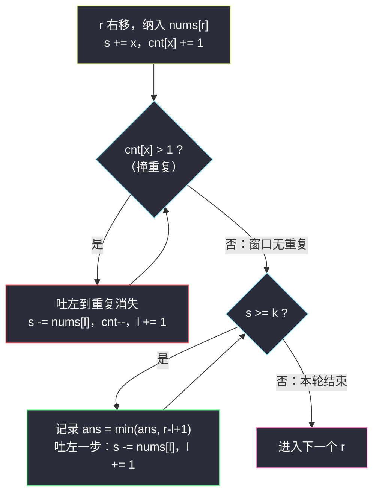

# 不同元素和至少为 K 的最短子数组长度（不定长滑窗 · 越长越合法 / 求最短）

## 一、问题描述

给你一个**正整数**数组 `nums` 和一个整数 `k`。请找出 `nums` 的一个子数组，满足：

1. 子数组中**所有元素互不相同**；
2. 子数组的元素之和 **≥ k**。

返回满足条件子数组的**最短长度**；不存在这样的子数组则返回 `-1`。

> 🔗 LeetCode 3795：https://leetcode.cn/problems/minimum-subarray-length-with-distinct-sum-at-least-k/
>
> 数据规模要点：`n` 在 `10^5` 量级，`nums[i]` 在 `10^5` 量级，`k` 可达 `10^9`（窗口和最大可到 `10^10`，**Java 需用 long**）。

**示例 1（演示数据）**

```
输入：nums = [2,1,2,3], k = 5
输出：2
解释：子数组 [2,3]（下标 2..3）元素互不相同且和为 5 ≥ 5，长度为 2；
不存在长度为 1 的合法子数组（最大单元素只有 3 < 5）。
```

**示例 2（演示数据）**

```
输入：nums = [5,5,5], k = 6
输出：-1
解释：受「互不相同」限制，子数组长度最多为 1，和最大为 5 < 6。
```

**直观理解**

合法性由两个条件叠加：**「无重复」**是窗口越长越容易**违反**的（加元素才可能撞重复）；**「和 ≥ k」**是窗口越长越容易**满足**的（正数累加）。这题是灵神框架「**越长越合法 / 求最短**」的经典组合：把无重复作为窗口必须守住的前提（一撞重复就收缩左端），然后在和达标的时刻尽量收缩左端，把窗口压到最短。

---

## 二、暴力解法

枚举每个左端点 `i`，向右扩展右端点 `j`：用集合记录出现过的元素、变量累加和。一旦 `s ≥ k` 就更新最短长度；**一旦撞上重复元素立刻 break**——从 `i` 出发的更长子数组都包含这对重复，必然非法。

```python
class Solution:
    def minimumSubarrayLength(self, nums: List[int], k: int) -> int:
        n, ans = len(nums), float('inf')
        for i in range(n):
            seen, s = set(), 0
            for j in range(i, n):
                if nums[j] in seen:       # 撞重复：i 开头的更长子数组全非法
                    break
                seen.add(nums[j])
                s += nums[j]
                if s >= k:                # 记录后继续右扩（和只会更大）
                    ans = min(ans, j - i + 1)
        return -1 if ans == float('inf') else ans
```

### 复杂度

- **时间**：`O(n²)`。
- **空间**：`O(min(n, U))`（集合大小，`U` 为值域）。

### 🔴 瓶颈在哪里

`n = 10^5` 时 `n² = 10^10`，必超时。左端点从 `i` 挪到 `i+1`，窗口里的「哪些元素在场 + 当前和」本可增量调整，暴力却全部重建。

---

## 三、优化探索（核心章节）

> 📚 本题在灵茶题单中属于 **§2.2 越长越合法 / 求最短 / 最小**（不定长滑动窗口 · 第二类）。该小节的通用框架：**右端点进窗，窗口满足条件时不断收缩左端并更新最短答案**。本题在此基础上多了一层「无重复」的前提维护，是两类收缩的叠加练习。

### 3.1 观察特征

| 特征 | 说明 |
|------|------|
| 连续子数组 | 滑动窗口 `[l..r]` |
| 元素全为正数 | 窗口和 `s` 随 `r` 增大而增、随 `l` 增大而减 → 单调性完备 |
| 「和 ≥ k」：越长越合法 | 达标后收缩左端求最短 |
| 「无重复」：越长越容易违反 | 纳入元素撞重复时必须吐左去重 |

### 3.2 推导：两层收缩的分工

对固定的右端点 `r`，合法窗口 `[l..r]` 要求「无重复 **且** `s ≥ k`」。受无重复限制，以 `r` 结尾的窗口左边界不能越过某个下界；在此之内，`l` 越大窗口越短、和越小。所以策略是：

1. **第一层（守前提）**：纳入 `nums[r]` 后若其计数 `> 1`（窗口内重复），吐左直到该元素计数恢复为 `1`。这一步保证 `[l..r]` 始终无重复——注意吐元素**会**让 `s` 变小；
2. **第二层（求最短）**：若 `s ≥ k`，**先记录** `ans = min(ans, r - l + 1)`，再吐左一步；重复「达标→记录→再吐」，直到 `s < k` 停。退出时吐掉最后一步之前的那个窗口就是以 `r` 结尾的最短合法窗口。

`l` 在两层收缩中都只增不减，整体 `O(n)`。



### 3.3 为什么「先记录再吐」不会漏解（不变式）

设最优解为 `[l*, r*]`。归纳跟踪算法左端 `l`：

- **去重层**永远不会把 `l` 推过 `l*`：`[l*..r']`（`r' ≤ r*`）是 `[l*..r*]` 的一段，无重复，去重不需要吐它；
- **收缩层**若某轮把 `l` 推到了 `l* + 1`，说明吐前一步 `l = l*` 时窗口 `[l*..r']` 无重复**且** `s ≥ k`（否则不会继续吐）——而那一步我们已经把长度 `r' - l* + 1 ≤ r* - l* + 1` 记进了 `ans`。

因此就算算法「错过」了以 `r*` 结尾的那个最优窗口，也一定记录过一个**不劣于它**的窗口。答案正确。

### 3.4 一句话核心

> **无重复守底线（撞重必吐），和达标就「先记再吐」压最短；`l` 只进不退，一趟 O(n)。**

---

## 四、代码实现

### Python（主解：两层收缩的求最短模板）

```python
from collections import defaultdict

class Solution:
    def minimumSubarrayLength(self, nums: List[int], k: int) -> int:
        ans = float('inf')
        cnt = defaultdict(int)             # 窗口内每个值的出现次数
        s = 0                              # 窗口内元素和
        l = 0
        for r, x in enumerate(nums):
            s += x                         # 纳入 nums[r]
            cnt[x] += 1
            while cnt[x] > 1:              # 第一层：去重，守住前提
                cnt[nums[l]] -= 1
                s -= nums[l]
                l += 1
            while s >= k:                  # 第二层：达标 → 先记录再收缩
                ans = min(ans, r - l + 1)
                s -= nums[l]
                cnt[nums[l]] -= 1
                l += 1
        return -1 if ans == float('inf') else ans
```

**变量含义**

| 变量 | 含义 |
|------|------|
| `cnt` | 窗口 `[l..r]` 内每个值的出现次数（只有 `cnt[x] > 1` 才代表重复） |
| `s` | 窗口内元素和 |
| `l` / `r` | 窗口左右端，均只前进 |
| `ans` | 目前最短合法长度，`inf` 表示从未达标 |

**循环不变式**：每轮两层 while 结束后，`[l..r]` 无重复，且要么 `s < k`（窗口尽力缩短后仍不达标），要么 `l > r`（窗口已空，和为 0）。

### Java（最优解同款，注意 long）

```java
// 不同元素和至少为 K 的最短子数组长度
// 测试链接 : https://leetcode.cn/problems/minimum-subarray-length-with-distinct-sum-at-least-k/
class Solution {
    public int minimumSubarrayLength(int[] nums, int k) {
        int n = nums.length;
        int ans = Integer.MAX_VALUE;
        HashMap<Integer, Integer> cnt = new HashMap<>();
        long s = 0;                            // 和最大可达 1e10，必须 long
        int l = 0;
        for (int r = 0; r < n; r++) {
            int x = nums[r];
            s += x;
            cnt.merge(x, 1, Integer::sum);
            while (cnt.get(x) > 1) {           // 去重
                int y = nums[l++];
                cnt.merge(y, -1, Integer::sum);
                s -= y;
            }
            while (s >= k) {                   // 达标 → 先记录再收缩
                ans = Math.min(ans, r - l + 1);
                int y = nums[l++];
                cnt.merge(y, -1, Integer::sum);
                s -= y;
            }
        }
        return ans == Integer.MAX_VALUE ? -1 : ans;
    }
}
```

---

## 五、具体例子演示

### 例一：`nums = [2,1,2,3]`、`k = 5`，端到端逐步跟踪

| r | nums[r] | 进窗后窗口 | s | 第一层去重 | 第二层收缩（达标先记再吐） | ans |
|---|---------|-----------|----|-----------|---------------------------|-----|
| 0 | 2 | [0,0] = {2} | 2 | cnt[2]=1，无重复 | s=2 < 5，不动 | ∞ |
| 1 | 1 | [0,1] = {2,1} | 3 | 无重复 | s=3 < 5，不动 | ∞ |
| 2 | 2 | [0,2] = {2,1,2} | 5 | cnt[2]=2 → 吐 nums[0]=2，窗口 [1,2]，s=3 | s=3 < 5，不动 | ∞ |
| 3 | 3 | [1,3] = {1,2,3} | 6 | 无重复 | s=6 ≥ 5：记 ans=3，吐 nums[1]=1 → s=5, l=2；s=5 ≥ 5：记 ans=**2**，吐 nums[2]=2 → s=3, l=3；s=3 < 5 停 | **2** |

返回 `2` ✓（对应子数组 `[2,3]`）。


### 例二：`nums = [5,5,5]`、`k = 6`，验证 -1 分支

| r | nums[r] | 进窗后窗口 | s | 动作 |
|---|---------|-----------|----|------|
| 0 | 5 | [0,0] = {5} | 5 | 无重复，s=5 < 6，不动 |
| 1 | 5 | [0,1] = {5,5} | 10 | cnt[5]=2 → 吐 nums[0]=5，窗口 [1,1]，s=5 < 6 |
| 2 | 5 | [1,2] = {5,5} | 10 | cnt[5]=2 → 吐 nums[1]=5，窗口 [2,2]，s=5 < 6 |

三轮下来 `ans` 始终为 `∞`，返回 `-1` ✓。注意每次撞重复都会把和「吐回去」——去重收缩会**减小** `s`，这是与普通「求最短」题（只有一层收缩）最大的不同。

---

## 六、复杂度分析

| 方法 | 时间 | 空间 | 说明 |
|------|------|------|------|
| 暴力枚举 | `O(n²)` | `O(min(n, U))` | 每个起点重建集合与和 |
| 滑窗两层收缩 | `O(n)` | `O(min(n, U))` | `l`、`r` 各至多前进 n 次；`U` 为值域，哈希表至多存不同值个数 |

---

## 七、对比总结

**灵神不定长滑窗三大框架对照**

| 框架 | 窗口方向 | 收缩时机 | 更新答案 | 本批代表 |
|------|---------|----------|----------|----------|
| 越短越合法 / 求最长 | 加长易违反 | **不合法才收缩** | `ans = max(ans, r-l+1)` | LC 3 无重复最长子串 |
| **越长越合法 / 求最短（本篇）** | 加长易满足 | **合法时先记录再收缩** | `ans = min(ans, r-l+1)` | LC 209、本篇 |
| 求子数组个数 | 视条件形态 | 恰好→至多做差；至少→收缩到恰好不合法 | `ans += l` 或 `r-l+1` | #1248 / #930 / #1358 / #2962 |

**易错点**

1. **两层 while 顺序**：必须先去重、后判 `s >= k`——去重吐元素会让 `s` 变小，顺序颠倒会用「含重复的脏和」去更新答案。
2. 第二层是「**先记录、再吐**」：如果先吐再记，最短窗口会被吐破，答案偏大。
3. `cnt[x] > 1` 判重只看**刚进窗的元素 x**：其他元素不可能因这次进窗而变重复（它们上一轮就是 1）。
4. Java 求和用 `long`：`10^5 * 10^5 = 10^10` 超 int。
5. 永不达标时返回 `-1`（Python 用 `inf` 哨兵，Java 用 `Integer.MAX_VALUE` 哨兵）。

**模板（越长越合法 / 求最短，对齐灵神 §2.2）**

```python
ans, l = inf, 0
for r, x in enumerate(nums):
    纳入(x)                    # 更新窗口信息
    while 前提被破坏():         # 本篇：cnt[x] > 1，吐左修复
        吐出(nums[l]); l += 1
    while 窗口满足条件():       # 本篇：s >= k
        ans = min(ans, r - l + 1)   # 先记录
        吐出(nums[l]); l += 1       # 再收缩
```

---

## 八、举一反三

| 题目 | 关系 |
|------|------|
| [209. 长度最小的子数组](https://leetcode.cn/problems/minimum-size-subarray-sum/) | 灵神 §2.2 入门题：同样「和 ≥ target 求最短」，但**没有**无重复约束，只有一层收缩 |
| [3. 无重复字符的最长子串](https://leetcode.cn/problems/longest-substring-without-repeating-characters/) | 「无重复」单独出现时是**求最长**（越短越合法），与本篇方向相反，对照着刷收获最大 |
| [904. 水果成篮](https://leetcode.cn/problems/fruit-into-baskets/) | 「至多 2 种」前提下的求最长，窗口前提维护方式同源 |
| [2461. 长度为 K 子数组中的最大和](https://leetcode.cn/problems/maximum-sum-of-distinct-subarrays-with-length-k/) | 「定长 + 无重复」的组合，定长窗口版练习 |
| [76. 最小覆盖子串](https://leetcode.cn/problems/minimum-window-substring/) | 「覆盖型条件 + 求最短」，同样是合法才收缩 |
| [1248. 统计「优美子数组」](https://leetcode.cn/problems/count-number-of-nice-subarrays/) / [2962. 统计最大元素出现至少 K 次的子数组](https://leetcode.cn/problems/count-subarrays-where-max-element-appears-at-least-k-times/) | 同批「求子数组个数」家族题解：`count-number-of-nice-subarrays.md`、`count-subarrays-where-max-element-appears-at-least-k-times.md`，与本篇合起来覆盖不定长滑窗三大框架 |

**思想迁移**

- 「求最短」滑窗的信号：条件**越长越容易满足**（和 ≥ k、覆盖某字符集）——达标瞬间是收缩的号角，**先记再吐**。
- 合法性由多个条件叠加时，把「易违反的前提」（无重复）交给内层先修复，再用「易满足的目标」（和达标）驱动求最短——**修复在前、优化在后**。
- 若元素可能为负数，和失去单调性，滑窗失效，需转向前缀和 + 单调队列（如 #862）。
- 口诀：**「求短等达标，达标先记账；去重守底线，吐完自然短。」**
