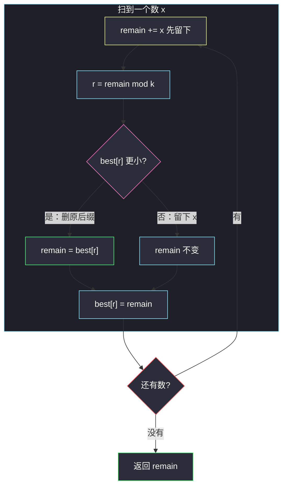

# 3654. 删除可整除和后的最小数组和（Minimum Sum After Divisible Sum Deletions）

> 题目来源：[https://leetcode.cn/problems/minimum-sum-after-divisible-sum-deletions/](https://leetcode.cn/problems/minimum-sum-after-divisible-sum-deletions/)
>
> 灵茶题单小节定位：§11.9 其他优化 DP

## 一、问题描述

给你一个整数数组 `nums` 和一个整数 `k`。

你可以**多次**选择一段**连续**子数组，只要它的元素和能被 `k` 整除，就把它删掉；每次删除后，左右两侧会拼在一起，形成新的数组。

返回任意次删除之后，数组元素和的**最小值**。

**数据范围**：

- `1 <= nums.length <= 10^5`
- `1 <= nums[i] <= 10^6`
- `1 <= k <= 10^5`

**示例 1**：

```text
输入：nums = [1,1,1], k = 2
输出：1
解释：删除 nums[0..1] = [1, 1]（和为 2，可被 2 整除），剩余 [1]，和为 1。
```

**示例 2**：

```text
输入：nums = [3,1,4,1,5], k = 3
输出：5
解释：
- 先删 nums[1..3] = [1, 4, 1]（和 6，可被 3 整除），剩余 [3, 5]；
- 再删 nums[0..0] = [3]（和 3），剩余 [5]；
剩余和为 5。
```

**核心思考点**：每次删掉的都是 `k` 的倍数，所以**剩余和 ≡ 总和 (mod k)**。`n = 10^5` 禁止枚举子数组。用前缀和模 `k` 做一维 DP：对每个余数记下「该余数下的最小剩余和」，扫到相同余数就可以把中间整段（和为 `k` 的倍数）一次性删掉。整段过程 `O(n + k)`。

## 二、暴力解法

### 思路

删完两端会拼接，新的连续段可能又变得可删——必须模拟「任意次删除」。对当前数组枚举每一段和能被 `k` 整除的子数组，删掉后递归，取剩余和的最小值。用元组做记忆化，避免同一局面重复搜索。

只适合短数组对拍；`n = 10^5` 完全不可用。

### 代码

```python
from functools import cache

def minArraySumBrute(nums: list[int], k: int) -> int:
    @cache
    def dfs(arr: tuple[int, ...]) -> int:
        n = len(arr)
        ans = sum(arr)                       # 本局面不再删
        for i in range(n):
            s = 0
            for j in range(i, n):
                s += arr[j]
                if s % k == 0:               # [i..j] 可删
                    nxt = arr[:i] + arr[j + 1:]
                    ans = min(ans, dfs(nxt))
        return ans
    return dfs(tuple(nums))
```

### 复杂度

- 时间：局面数随拼接指数膨胀，仅 `n ≤ 7` 可当基准。
- 空间：记忆化 + 递归栈，随局面数增长。

## 三、优化探索

### 3.1 剩余和的模不变式 ⭐

每一次删除的子数组和 ≡ 0 (mod k)，所以无论删几次：

```text
剩余和 ≡ 原数组总和  (mod k)
剩余和 ≥ 0，且由若干被留下的元素相加得到
```

元素全是正数，删得越多剩余越小。目标就是在「模 `k` 合法」的前提下把能删的都删掉。注意：**不是**简单地把总和模 `k` 当答案——`[5, 5], k = 3` 总和 10 ≡ 1，但两段都删不掉，剩余只能是 10，而不是 1。

### 3.2 为什么「只删原数组的后缀」就够了 ⭐⭐

把 `dp[i]` 定义为前缀 `nums[0..i-1]` 的最小剩余和。处理到 `i` 时，最后一个元素只有两种命运：

1. **留下** `nums[i-1]`：剩余 = `dp[i-1] + nums[i-1]`。
2. **作为某段被删后缀的一部分被删掉**：若存在 `j < i` 使 `sum(nums[j..i-1])` 能被 `k` 整除，则整段原数组后缀可一次删光，剩余 = `dp[j]`。

拼接会不会产生「不是原数组后缀、却能删」的新段？会，但可以还原：拼接后再删的那段，对应原数组里某段后缀，中间已被删的部分本身和也是 `k` 的倍数，整段原后缀和仍是 `k` 的倍数——**直接删原后缀，效果相同**。所以转移不必真去模拟拼接。

前缀和 `P[i] = nums[0] + ... + nums[i-1]`。`sum(nums[j..i-1]) ≡ 0 (mod k)` 当且仅当 `P[i] ≡ P[j] (mod k)`。于是：

```text
dp[i] = min(
    dp[i-1] + nums[i-1],                          # 留下
    min{ dp[j] | P[j] ≡ P[i] (mod k) }            # 删原后缀
)
```

这已经是 `O(n²)` 枚举 `j`。`n = 10^5` 必须再压。

### 3.3 余数上记最小剩余，一次扫过 ⭐⭐⭐

关键观察：被删掉的和都 ≡ 0 (mod k)，所以**当前剩余和 ≡ 当前前缀和 (mod k)**。不必同时记 `P[i]` 和 `dp[i]`，用一个变量 `remain` 跟踪「当前前缀的最小剩余」即可，它的模就是当前前缀和的模。

对每个余数 `r` 维护：

```text
best[r] = 所有已处理前缀里、剩余和 ≡ r (mod k) 的最小剩余
```

扫到新元素 `x`：

1. 先留下：`remain += x`（余数跟着变）；
2. 若以前出现过相同余数 `r = remain % k`，可以把「那次到现在」整段删掉，`remain = min(remain, best[r])`；
3. 用新的 `remain` 刷新 `best[r]`。

`best[0] = 0` 对应空前缀：当前缀和本身能被 `k` 整除时，整段前缀可一次删光，剩余变成 0。



**核心一句**：相同余数再次出现 = 中间是可删段；每个余数只保留「最小剩余」，拼接带来的新删除已经被「删原后缀」覆盖。

## 四、代码实现

### 主解：余数最小剩余

```python
class Solution:
    def minArraySum(self, nums: list[int], k: int) -> int:
        INF = 10**18
        best = [INF] * k                     # best[r]: 余数 r 的最小剩余
        best[0] = 0                          # 空前缀，余数 0，剩余 0
        remain = 0
        for x in nums:
            remain += x                      # 留下 x
            r = remain % k
            remain = min(remain, best[r])    # 或删掉上一次余数 r 到现在
            best[r] = remain
        return remain
```

### 对照：Java 默写版

```java
class Solution {
    public long minArraySum(int[] nums, int k) {
        long[] best = new long[k];
        java.util.Arrays.fill(best, Long.MAX_VALUE / 4);
        best[0] = 0;
        long remain = 0;
        for (int x : nums) {
            remain += x;
            int r = (int) (remain % k);
            remain = Math.min(remain, best[r]);
            best[r] = remain;
        }
        return remain;
    }
}
```

总和最大约 `10^5 · 10^6 = 10^11`，Java 必须用 `long`。

### 细节说明

- **`best[0] = 0` 不能省**：它承担「整段前缀和能被 `k` 整除 → 剩余 0」。漏了的话，`[2,2,2], k = 3` 会得到 6 而不是 0。
- **先 `min` 再写回 `best[r]`**：`remain` 与 `best[r]` 同余，写回后 `best[r]` 单调不增。
- **`k = 1`**：任何子数组和都能被 1 整除，答案恒为 0。循环里 `r` 永远是 0，每次都会被 `best[0] = 0` 清零。
- **不要开 `n × k` 的表**：真正活着的状态是「每个余数一个最小值」，`O(k)` 空间。
- **不要 `O(n²)` 枚举左右端点**：这题评分在 2000 分上下，卡的就是 `n = 10^5`。

## 五、例子演示

**示例 1：nums = [1, 1, 1], k = 2**

`best` 初值：`best[0] = 0`，`best[1] = INF`。

| 扫到 x | remain += x | r | best[r] 旧值 | 新 remain | 写回 best |
|---|---|---|---|---|---|
| 1 | 0+1=1 | 1 | INF | **1** | best[1]=1 |
| 1 | 1+1=2 | 0 | 0 | **0**（删 [1,1]） | best[0]=0 |
| 1 | 0+1=1 | 1 | 1 | **1** | best[1]=1 |

返回 **1** ✅。第二次把前两个 1 当成「余数 0 的后缀」删掉，最后一个 1 留下。

**示例 2：nums = [3, 1, 4, 1, 5], k = 3**

| 扫到 x | remain += x | r | best[r] 旧值 | 新 remain | 含义 |
|---|---|---|---|---|---|
| 3 | 3 | 0 | 0 | **0** | 删掉 [3] |
| 1 | 0+1=1 | 1 | INF | **1** | 留下 1 |
| 4 | 1+4=5 | 2 | INF | **5** | 留下 1+4 |
| 1 | 5+1=6 | 0 | 0 | **0** | 前缀 [3,1,4,1] 和 9 ≡ 0，整段可删 |
| 5 | 0+5=5 | 2 | 5 | **5** | 留下最后的 5 |

返回 **5** ✅。表上「第 4 步 remain 被置 0」已经把官方的两步删除（先中间 [1,4,1]、再左边的 3）压缩成「整段前缀一次删光」——前面证过，效果相同。

逐步对应官方操作也可以：先不删 3，`remain` 会短暂变成 3、4、8、9；第 4 步余数回到 0，`best[0] = 0` 仍然把剩余打成 0，再留下 5。殊途同归。

**补例：nums = [5, 5], k = 3**（总和 10 ≡ 1，但删不掉）

| 扫到 x | remain | r | 新 remain |
|---|---|---|---|
| 5 | 5 | 2 | 5 |
| 5 | 10 | 1 | 10（best[1] 仍是 INF） |

返回 **10** ✅。模不变式只给出「剩余 ≡ 1」，并不保证能剩到 1——没有长度为 1 的可删段，DP 老老实实留下两个 5。

## 六、复杂度分析

设 `n = len(nums)`：

- **时间复杂度：`O(n + k)`**——初始化 `best` 为 `O(k)`，随后每个元素 `O(1)`。
- **空间复杂度：`O(k)`**——余数最小值数组。

## 七、对比总结

| 维度 | 递归模拟删除 | `O(n²)` 后缀 DP | 主解（余数最小剩余） |
|---|---|---|---|
| 时间 | 指数 | `O(n²)` | `O(n + k)` |
| 拼接 | 真去拼 | 用「原后缀」等价 | 同左 |
| `n = 10^5` | 不可用 | TLE | 可通过 |
| 对拍角色 | 短数组基准 | 中等 n 校验 | 提交 |

**套路归纳**：**「可整除删除 / 可整除子数组」→ 前缀和模 k 分组**。能被 `k` 整除的子数组 = 两端前缀同余；要最值而不是计数时，每个余数只留一个最优值（本题是最小剩余，有的题是最早下标、最大前缀和）。拼接看似把数组改形，模意义下仍是同一条前缀和链。

## 八、举一反三

1. **[974. 和可被 K 整除的子数组](https://leetcode.cn/problems/subarray-sums-divisible-by-k/)**：同余计数，每个余数记出现次数而不是最小剩余。
2. **[523. 连续的子数组和](https://leetcode.cn/problems/continuous-subarray-sum/)**：同余 + 最早下标，判定是否存在长度 ≥ 2 的段。
3. **[1590. 使数组和能被 P 整除](https://leetcode.cn/problems/make-sum-divisible-by-p/)**：删一段使总和 ≡ 0，每个余数记最右下标，最短可删段。
4. **[930. 和相同的二元子数组](https://leetcode.cn/problems/binary-subarrays-with-sum/)**：前缀和差值计数，k 换成目标和。
5. **[325. 和等于 k 的最长子数组长度](https://leetcode.cn/problems/maximum-size-subarray-sum-equals-k/)**：前缀和哈希，记最早出现。

**同族互引**：§11.9 其他优化 DP；前缀模优化把「枚举右端再扫左端」压成 `O(1)` 查表。同批 Kadane 题 `maximum-score-of-spliced-array.md` 也是「差分数组上做一次线性扫描」，可以对照着看「扫描时每个桶只留一个最优值」这一习惯。
