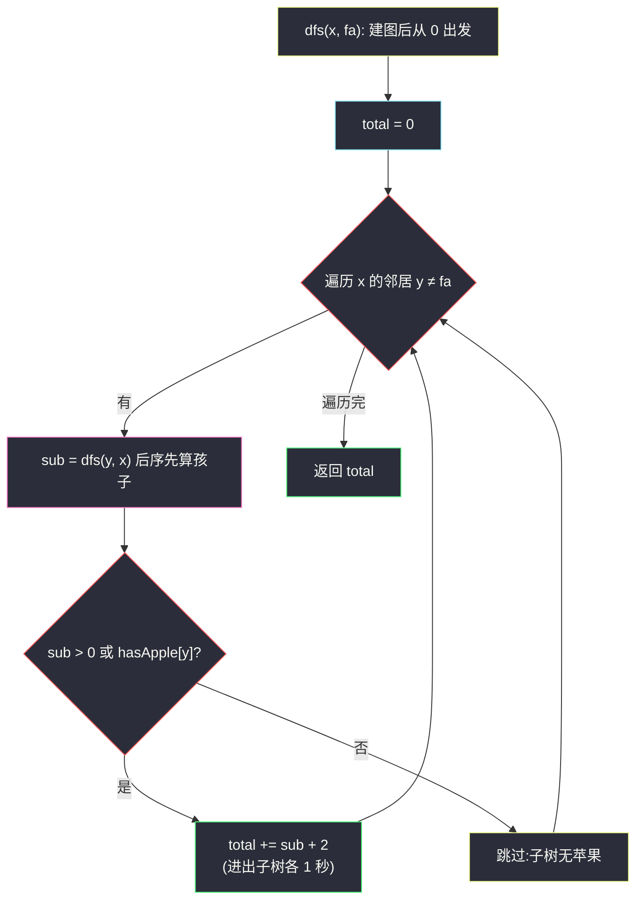
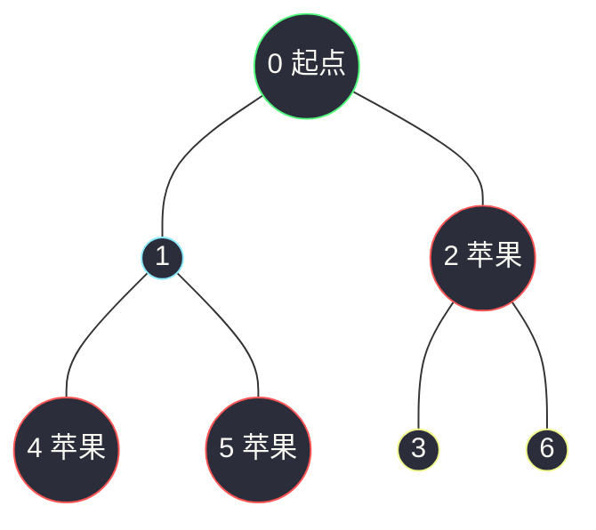

# 1443. 收集树中苹果的最少时间(Minimum Time to Collect All Apples in a Tree)

> 🔗 LeetCode 1443:https://leetcode.cn/problems/minimum-time-to-collect-all-apples-in-a-tree/
>
> 📚 灵茶题单小节:§「无根树 DFS:建图 + 后序统计」练习

## 一、问题描述

给你一棵有 `n` 个节点的无向树,节点编号为 `0` 到 `n - 1`,它们中有一些节点有苹果。通过树上的一条边,需要花费 **1 秒钟**。你从**节点 0** 出发,请你返回最少需要多少秒,可以**收集到所有苹果,并回到节点 0**。

无向树的边由 `edges` 给出,其中 `edges[i] = [from_i, to_i]` 表示有一条边连接 `from_i` 和 `to_i`。除此以外,还有一个布尔数组 `hasApple`,其中 `hasApple[i] = true` 代表节点 `i` 有一个苹果,否则节点 `i` 没有苹果。

**示例 1**

```text
输入:n = 7, edges = [[0,1],[0,2],[1,4],[1,5],[2,3],[2,6]], hasApple = [false,false,true,false,true,true,false]
输出:8
解释:苹果在节点 2、4、5。最优路线 0→1→4→1→5→1→0→2→0,经过 8 条边,耗时 8 秒。
```

**示例 2**

```text
输入:n = 7, edges = [[0,1],[0,2],[1,4],[1,5],[2,3],[2,6]], hasApple = [false,false,true,false,false,true,false]
输出:6
解释:苹果在节点 2、5。最优路线 0→1→5→1→0→2→0,经过 6 条边。
```

**示例 3**

```text
输入:n = 7, edges = [[0,1],[0,2],[1,4],[1,5],[2,3],[2,6]], hasApple = [false,false,false,false,false,false,false]
输出:0
解释:没有苹果,一步都不用走。
```

> 数据范围:`1 <= n <= 10^5`;`edges.length == n - 1`;`0 <= a_i < b_i <= n - 1`;`hasApple.length == n`。

**直观理解**

树没有环,任何一条边走过了想回来就必须原路再走一遍。于是"去某条边的深处摘苹果"的成本天然是**一来一回两次过边**。整趟行程其实就是:反复走进"含有苹果的子树",摘完就退回来。问题从"规划路线"坍缩成一个判断题:**哪些边值得走?**——只走"子树里有苹果"的边,每条恰好两次。

## 二、暴力解法

把苹果的**访问顺序**枚举穷尽:BFS 预处理任意两点距离,对苹果节点做全排列,取 `0 → p1 → p2 → ... → pk → 0` 的最短总路程。

```python
class Solution:
    def minTime(self, n: int, edges: List[List[int]], hasApple: List[bool]) -> int:
        g = [[] for _ in range(n)]
        for a, b in edges:
            g[a].append(b)
            g[b].append(a)

        def bfs(src: int) -> List[int]:            # src 到各点距离
            dist = [-1] * n
            dist[src] = 0
            q = deque([src])
            while q:
                x = q.popleft()
                for y in g[x]:
                    if dist[y] < 0:
                        dist[y] = dist[x] + 1
                        q.append(y)
            return dist

        apples = [i for i in range(n) if hasApple[i]]
        dist_from = {i: bfs(i) for i in apples}    # 每个苹果出发的距离表
        dist_from[0] = bfs(0)

        best = 0
        for perm in permutations(apples):          # 枚举访问顺序
            route = [0, *perm, 0]
            cost = sum(dist_from[route[i]][route[i + 1]]
                       for i in range(len(route) - 1))
            best = min(best, cost) if best else cost
        return best
```

### 复杂度

- 时间:`O(k! * k^2)`——`k` 是苹果数,`k` 到 10 时排列已超千万;同时预处理 `k` 张距离表也是 `O(k * n)`。仅当苹果极少时可用。
- 空间:`O(k * n)` 存距离表。

它的价值是提供了**语义基准**:任何更聪明的解法,输出必须与它一致(本文对拍正是用它,把苹果数压在 6 以内随机验证)。

## 三、优化探索

### 观察 1:一条边要么不经过,要么恰好经过两次

从 0 出发最终回到 0,树上每条被使用的边,进入深处一次必然退出一次——没有第二条路可退。所以总时间 = `2 × (使用的边数)`,答案一定是偶数(示例 1 的 8、示例 2 的 6 都是偶数,可作快速自检)。

### 观察 2:该不该走某条边,只看子树里有没有苹果

把边 `(x, y)`(x 更靠近 0)看成通往"以 y 为根的子树"的大门:门后有苹果,这趟门必须进(两次计费);门后没有苹果,走进去纯属浪费。于是问题变成标记"含苹果的边"——**这正是后序 DFS 的本职**:孩子先汇报"我子树里有没有苹果",父亲据此决定这条边收不收费。

### 观察 3:后序合并——子树耗时向上累计

定义 `dfs(x)` 返回"以 x 为根的子树内,收集完所有苹果并回到 x 的耗时":

- 对每个孩子 `y`:先算 `sub = dfs(y)`;
- 若 `sub > 0`(**y 的后代里有苹果**)或 `hasApple[y]`(**y 自己有苹果**),则这条边值得走:`total += sub + 2`(进 y 的子树摘完全部再退回 x);
- 否则整支跳过,一分不花。

`hasApple[x]` 自身(根 0 除外)由**父层**在判断 `hasApple[y]` 时消费——这样叶子不需要特判。根节点 0 出发即在场,它自己有没有苹果不影响耗时。



### 为什么"同一子树内的苹果顺序"无关紧要

树中通往子树的边是**必经关卡**:无论按什么顺序摘里面的苹果,进出子树的次数可以压到一次(进去后沿树路径逐一摘完再出来)。全排列暴力枚举的 `k!` 种顺序里,大量方案只是同一棵子树内部的顺序差异——后序合并把这些重复压缩成了"一次进入、一次退出"。

### 迭代版:显式栈防深栈

`n` 可达 `10^5`,链形树递归深度同样量级,Python 默认递归上限(1000)会溢出。主解用 `sys.setrecursionlimit` 抬高上限;若追求无递归,可显式栈模拟后序——先序序入栈,逆序出栈时合并孩子:

```python
def minTime_iter(n: int, edges: List[List[int]], hasApple: List[bool]) -> int:
    g = [[] for _ in range(n)]
    for a, b in edges:
        g[a].append(b)
        g[b].append(a)
    order, fa = [0], [-1] * n            # 先序序 + 父记录
    for x in order:                       # 利用列表边遍历边追加
        for y in g[x]:
            if y != fa[x]:
                fa[y] = x
                order.append(y)
    cost = [0] * n                        # 以各点为根的子树耗时
    for x in reversed(order):             # 逆序 = 后序(孩子先于父亲)
        p = fa[x]
        if p >= 0 and (cost[x] > 0 or hasApple[x]):
            cost[p] += cost[x] + 2        # 父层汇总,与递归版同构
    return cost[0]
```

逆序遍历先序序得到严格的后序序——每个节点出栈合并时,它的所有孩子都已算完。两版逐行同构,只是把"递归返回值"换成了"cost 数组下标回写"。

## 四、代码实现

```python
class Solution:
    def minTime(self, n: int, edges: List[List[int]], hasApple: List[bool]) -> int:
        sys.setrecursionlimit(2 * 10 ** 5 + 10)     # 链形树深度可达 n
        g = [[] for _ in range(n)]
        for a, b in edges:                          # 无向树建图
            g[a].append(b)
            g[b].append(a)

        def dfs(x: int, fa: int) -> int:
            total = 0
            for y in g[x]:
                if y != fa:                         # 不走回头路
                    sub = dfs(y, x)                 # 后序:孩子先汇报
                    if sub > 0 or hasApple[y]:      # 子树或孩子自身有苹果
                        total += sub + 2            # 进出这条边各 1 秒
            return total

        return dfs(0, -1)
```

**细节说明**

- **`sub > 0 or hasApple[y]` 两个条件缺一不可**:`sub > 0` 说明 `y` 的**后代**有苹果(深处要收费);`hasApple[y]` 说明 `y` 本人挂果,哪怕 `y` 是叶子(`sub = 0`)也要进门摘——漏掉第二个条件,示例 1 的 4、5 号叶子苹果就会被漏计。
- **`hasApple[x]` 由父层消费**:判断写在父亲侧,叶子天然覆盖;根 0 的苹果字段从不被读(出发即在场),语义自洽。
- **`y != fa` 代替 visited 数组**:树无环,只防"回到父亲"即可;省一个 `O(n)` 的标记数组。
- **返回值不必乘 2**:`+2` 在累计时逐边发生,`dfs(0)` 返回的已是总秒数。
- **答案是偶数**:每条使用边贡献 2;对拍或手算时,奇数结果必错。

## 五、例子演示

用**示例 1** 端到端走一遍:`n = 7`,`hasApple = [F,F,T,F,T,T,F]`,苹果在 2、4、5。



后序到达顺序与汇报(孩子先于父亲返回):

| 步骤 | 到达节点 | 后序位置 | 各孩子汇报 | 判定与累计 | 返回值 |
|---|---|---|---|---|---|
| 1 | 4(叶) | 最先 | 无孩子 | — | 0 |
| 2 | 5(叶) | | 无孩子 | — | 0 |
| 3 | 1 | 4、5 之后 | dfs(4)=0 且 hasApple[4]=T → +2;dfs(5)=0 且 hasApple[5]=T → +2 | 两条边各收费一次 | 4 |
| 4 | 3(叶) | | 无孩子 | — | 0 |
| 5 | 6(叶) | | 无孩子 | — | 0 |
| 6 | 2 | 3、6 之后 | dfs(3)=0 且 hasApple[3]=F → 跳过;dfs(6)=0 且 hasApple[6]=F → 跳过 | 子树无苹果,分文不花 | 0 |
| 7 | 0 | 最后 | dfs(1)=4 > 0 → +4+2=6;dfs(2)=0 但 hasApple[2]=T → +0+2=2 | 汇总 | 8 |

`dfs(0) = 8`,与官方输出一致。注意第 7 步对节点 2 的处理:`dfs(2)` 返回 0(它的两个孩子都没苹果),但 2 自己挂果,父亲照样为边 `0-2` 付费 2 秒——这正是 `or hasApple[y]` 条件的用武之地。路线还原:0→1→4→1→5→1→0→2→0,恰好 8 条边。

对照**示例 2**(`hasApple = [F,F,T,F,F,T,F]`,苹果在 2、5):dfs(5)=0、dfs(4)=0;dfs(1):5 挂果 +2、4 跳过 → 2;dfs(2):无 → 0;dfs(0):dfs(1)=2>0 → +2+2=4;hasApple[2]=T → +0+2=2;合计 **6** ✅。

对照**示例 3**(全 false):所有 `sub = 0` 且 `hasApple[y]` 全假,`dfs(0) = 0`,一步不走 ✅。

### 边界用例速查

| 用例 | 输入要点 | 期望 | 考点 |
|---|---|---|---|
| 单节点无苹果 | `n=1, edges=[], hasApple=[F]` | 0 | 空图不崩 |
| 单节点有苹果 | `n=1, edges=[], hasApple=[T]` | 0 | 根的苹果免费 |
| 全部苹果 | 每个节点都挂果 | `2(n-1)` | 整树遍历 |
| 只有叶子有果 | 苹果全在最深处 | `2×深度` | `or hasApple[y]` 条件 |
| 链形树 | 0-1-2-...-n-1 | 苹果在尾则 2(n-1) | 递归深度 |

### 常见错误清单

- **漏 `or hasApple[y]`**:只看 `sub > 0`,叶子苹果全丢——示例 1 会错报 2(只走到 2 号)。
- **把 `+2` 写成 `+1`**:忘了"回到 0"的返程;所有含苹果用例结果减半。
- **把 `hasApple[x]` 的判断写在 `dfs(x)` 内部对自身累加**:根 0 有苹果时多计 2;且叶子逻辑重复(父层已消费)。
- **用 visited 数组但初始化在 dfs 外共享**:多组用例(判题机批量调用)时残留状态污染;`fa` 参数天然无状态,最稳。
- **忽略递归深度**:`n = 10^5` 链形树直接 `RecursionError`;必须抬上限或改显式栈。

## 六、复杂度分析

- 时间:`O(n)`。每个节点入递归一次,每条无向边在其两端各被扫描一次,总代价与点数边数同阶。
- 空间:`O(n)`。邻接表 `2(n-1)` 条记录,递归栈最坏树高(链形 `10^5`,已抬高上限)。

### 正确性问答

**问:为什么不用考虑"先去哪个子树"的策略问题?** 各子树的进入成本互相独立——进 A 子树的花费不因之前是否去过 B 而变化。独立成本的总和没有顺序依赖,贪心(该进则进)即最优。

**问:如果题目改为"不必回到 0"呢?** 那就变成"总边数 × 2 − 最远苹果距离":省掉最后一程不回来的路,终点选最深的苹果。两问对照,更能体会"回到起点"如何把问题对称化。

**问:苹果在根节点 0 上,耗时是多少?** 0 秒——出发即摘到,`hasApple[0]` 从未被读取,答案自动正确。

**问:若苹果只挂在一条链的末端,答案和链长什么关系?** 链长 `d`(边数),答案 `2d`:进去 d 步、回来 d 步,没有任何分支可省——这同时也是"该题答案上限"的形状:总耗时永远不超过 `2(n-1)`。

## 七、对比总结

| 解法 | 时间 | 空间 | 思路 | 备注 |
|---|---|---|---|---|
| 全排列 + 距离表(暴力) | `O(k! * k^2)` | `O(kn)` | 枚举访问顺序 | 语义基准,对拍专用 |
| 后序 DFS 边计数(本文) | `O(n)` | `O(n)` | 子树含苹果则边计 2 | 主解;一次遍历 |
| 显式栈迭代版 | `O(n)` | `O(n)` | 先序入栈、逆序出栈合并 | 防深栈,逻辑同后序 |
| BFS 按层标记含果子树 | `O(n)` | `O(n)` | 自底向上一层层收缩 | 与剥叶法同构,绕一点 |

四者的共同骨架都是"把无向树定根(以 0 为根)后自底向上汇信息",差别只在汇什么(布尔/计数/耗时)与载体(递归/栈/队列)。

一句话:**"回到起点"让每条使用的边恰好计两次,后序 DFS 把"该不该用这条边"变成孩子向父亲的一次布尔汇报**。

## 八、举一反三

- [1519. 子树中标签相同的节点数](https://leetcode.cn/problems/number-of-nodes-in-the-sub-tree-with-the-same-label/):后序合并子树计数的标准练习——从"汇报有没有"升级成"汇报数量表"。
- [1376. 通知所有员工所需的时间](https://leetcode.cn/problems/time-needed-to-inform-all-employees/):同样的无根树自底向上合并,但合并函数从"求和"换成"取最大"。
- [834. 树中距离之和](https://leetcode.cn/problems/sum-of-distances-in-tree/):换根 DP 的代表作,"子树汇报 + 父侧补充"的完整形态。
- [2385. 感染二叉树需要的总时间](https://leetcode.cn/problems/amount-of-time-for-binary-tree-to-be-infected/):同族"树上最远距离"问题(本站后续篇目),与本文共享"建图 + 从特定点出发"的骨架,一个求总耗时、一个求扩散深度。
- 本站延伸阅读:[最小高度树](./minimum-height-trees.md)——同样是"无向树 + 从全局视角选关键节点",剥叶向内收缩与本文后序向外汇报是树形 DP 的两个对称方向;[删点成林](./delete-nodes-and-return-forest.md)的后序断链手法亦与本文的"后序累计"互为参照。
