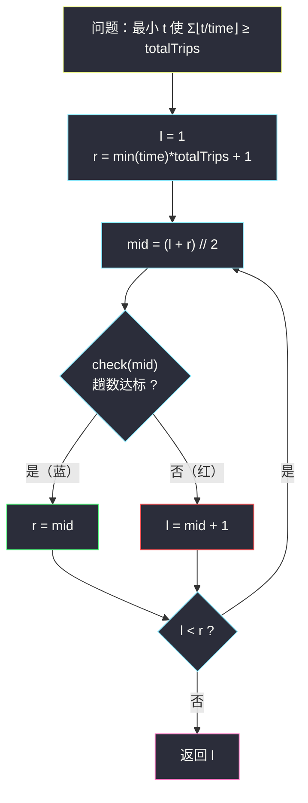

# 完成旅途的最少时间（二分答案 · 求最小）

## 一、问题描述

给你一个数组 `time`，其中 `time[i]` 表示第 `i` 辆公交车完成**一趟旅途**所需要花费的时间。每辆车可以**连续不断**地按周期往返：跑完一趟立刻开始下一趟。

同时给你一个整数 `totalTrips`，表示所有公交车**总共**需要完成的旅途数目。求**最少**需要多少时间才能完成**至少** `totalTrips` 趟旅途。

> 🔗 LeetCode 2187：https://leetcode.cn/problems/minimum-time-to-complete-trips/
>
> 数据范围：`1 <= time.length <= 10^5`，`1 <= time[i], totalTrips <= 10^7`。
>
> 返回值用 64 位整数（Java 的 `long`）。

**示例**

```
输入：time = [1,2,3], totalTrips = 5
输出：3
解释：t = 3 时：车 0 完成 3 趟，车 1 完成 1 趟，车 2 完成 1 趟，共 5 趟。

输入：time = [2], totalTrips = 1
输出：2
```

**直观理解**

与前两篇（#875、#1283）不同，这里**二分对象不是「能力」而是时间本身**：给定时刻 `t`，第 `i` 辆车恰好完成了 `⌊t / time[i]⌋` 趟；总趟数随 `t` 增长而增长。问「最早何时达到 `totalTrips`」——又一个左假右真的分界，答案是最小的蓝色 `t`。

---

## 二、暴力解法

时刻 `t` 从 1 开始每分钟检查一次总趟数是否达标。

```python
class Solution:
    def minimumTime(self, time: List[int], totalTrips: int) -> int:
        t = 1
        while True:
            if sum(t // x for x in time) >= totalTrips:
                return t
            t += 1
```

### 复杂度

- **时间**：最坏要走到 `min(time) * totalTrips ≈ 10^14`，每步 `O(n)`，完全不可行。
- **空间**：`O(1)`。

### 🔴 瓶颈在哪里

答案是 `10^14` 量级，逐分钟模拟等于沙里淘金。但「总趟数关于 t 单调不减」的结构白送——直接在时刻轴上二分。

---

## 三、优化探索（核心章节）

> 📚 本题在灵茶题单中属于 **§2.1 求最小**（二分答案）。与 #875/#1283 唯一的不同是 **check 的不等号方向反了**，但「求最小」模板原封不动。

### 3.1 单调性：趟数随时间只增不减

定义 `trips(t) = Σ ⌊t / time[i]⌋`：

- 对每辆车，`⌊t / time[i]⌋` 随 `t` 增大**单调不减**；
- 所以 `trips(t)` 单调不减，「`trips(t) >= totalTrips`」在时间轴上**左假右真**：时间太短（红）趟数不够，时间够长（蓝）趟数达标。

答案 = 最小的蓝色 `t`。注意与 #875 对照：那里是「能力越大越易达标」，这里是「时间越长越易达标」——**单调的东西是谁不重要，重要的是单调**。


### 3.2 取整方向变了：⌊⌋ 而不是 ⌈⌉

- #875 吃香蕉：一小时**开始**了就算数，就算吃不满也算一整小时 → 每堆耗时 **⌈p/k⌉**（向上取整）；
- 本题跑趟：一趟**完成**才算一趟，跑到一半不算 → 每辆车完成趟数 **⌊t/x⌋**（向下取整）。

向上还是向下，取决于「半截算不算数」。这半行想反了，check 就全错，是本家族最典型的失分点。

### 3.3 上界怎么定：让最快的车单干

哪怕其他车全部罢工，最快的那辆（周期 `mn = min(time)`）独自跑 `totalTrips` 趟需要 `mn * totalTrips` 时间，此时总趟数恰好达标：

```
trips(mn * totalTrips) >= totalTrips        # 一定成立
```

所以上界取 `mn * totalTrips` 即可，比无脑用 `10^14` 更紧。于是 `l = 1`，`r = mn * totalTrips + 1`（左闭右开）。

**量级提醒**：`mn * totalTrips` 最大 `10^7 * 10^7 = 10^14`。Python 天然大整数无感；Java 里 `l`、`r`、`mid`、`t / x` 的结果全部要用 `long`，函数签名也是 `long`。

### 3.4 模板（求最小，红蓝染色）



循环不变量：`l` 左边全红（趟数不够），`r` 右边（含 `r`）全蓝（达标），未染色区间每轮至少减半，`log2(10^14) ≈ 47` 轮内收敛。

### 3.5 一句话核心

> **总趟数 Σ⌊t/x⌋ 随 t 单调不减 → 在 `[1, min(time) * totalTrips]` 上跑「求最小」模板，check = 趟数 ≥ totalTrips。**

---

## 四、代码实现

### Python（主解）

```python
class Solution:
    def minimumTime(self, time: List[int], totalTrips: int) -> int:
        def check(t: int) -> bool:
            # t 时刻所有车完成的总趟数是否 >= totalTrips
            return sum(t // x for x in time) >= totalTrips

        # 上界：最快的车独自跑完全部趟数，必然可行
        l, r = 1, min(time) * totalTrips + 1
        while l < r:
            mid = (l + r) // 2
            if check(mid):
                r = mid                  # mid 及更晚都达标
            else:
                l = mid + 1              # mid 不够，更早更不够
        return l
```

**变量含义**

| 变量 | 含义 |
|------|------|
| `t` / `mid` | 猜测的时刻 |
| `t // x` | 周期为 `x` 的车在 `t` 时刻完成的趟数 `⌊t/x⌋` |
| `l` | 红区右边界：更早的时长都凑不够趟数 |
| `r` | 蓝区左边界：它及更晚都达标 |
| 返回值 `l` | 完成至少 totalTrips 趟的最少时间 |

### Java（最优解同款写法）

```java
class Solution {
    public long minimumTime(int[] time, int totalTrips) {
        long mn = time[0];
        for (int x : time) {
            mn = Math.min(mn, x);
        }
        long l = 1, r = mn * totalTrips + 1;      // 上界 ~1e14，全程 long
        while (l < r) {
            long mid = l + (r - l) / 2;
            if (check(time, mid, totalTrips)) {
                r = mid;
            } else {
                l = mid + 1;
            }
        }
        return l;
    }

    // t 时刻总趟数是否 >= totalTrips
    private boolean check(int[] time, long t, int totalTrips) {
        long trips = 0;
        for (int x : time) {
            trips += t / x;                       // ⌊t/x⌋ 完成一趟才算一趟
            if (trips >= totalTrips) {            // 提前退出，既省时又防溢出
                return true;
            }
        }
        return false;
    }
}
```

**Java 易错**：`l`、`r`、`mid`、`trips` 全部 `long`；`mn * totalTrips` 在 int 下乘法溢出，必须先把 `mn` 声明成 `long`。

---

## 五、具体例子演示

以 `time = [1,2,3]`、`totalTrips = 5` 端到端走一遍。`min(time) = 1`，上界 `1 * 5 = 5`，初始 `l = 1`、`r = 6`。

每轮 check 明细：`⌊m/1⌋ + ⌊m/2⌋ + ⌊m/3⌋`。

| 轮次 | l | r | mid | 三辆车趟数 | 总和 | ≥ 5 ? | 染色 | 动作 |
|------|---|---|-----|------------|------|-------|------|------|
| 1 | 1 | 6 | 3 | 3 + 1 + 1 | 5 | ✓ | 蓝 | `r = 3` |
| 2 | 1 | 3 | 2 | 2 + 1 + 0 | 3 | ✗ | 红 | `l = 3` |

`l == r == 3`，循环结束，返回 **3** ✓。

**验证「最小」**：`t = 3` 时趟数 3+1+1 = 5 ≥ 5 ✓；`t = 2` 时 2+1+0 = 3 < 5 ✗。分界恰在 3。

**再看示例 2**：`time = [2]`、`totalTrips = 1`。`l = 1`，`r = 2 * 1 + 1 = 3`。

| 轮次 | l | r | mid | ⌊m/2⌋ | ≥ 1 ? | 动作 |
|------|---|---|-----|--------|-------|------|
| 1 | 1 | 3 | 2 | 1 | ✓ | `r = 2` |
| 2 | 1 | 2 | 1 | 0 | ✗ | `l = 2` |

`l == r == 2`，返回 **2** ✓——第 1 分钟末一趟还没跑完（半截不算，⌊1/2⌋ = 0），第 2 分钟末恰好完成 1 趟。这一步正是「向下取整」的直观体现。

---

## 六、复杂度分析

| 方法 | 时间 | 空间 | 说明 |
|------|------|------|------|
| 暴力逐分 | `O(n * minT * totalTrips)` | `O(1)` | `10^19` 量级，不可行 |
| 二分答案 | `O(n log (mn * totalTrips))` | `O(1)` | `n = 10^5` × 约 47 轮 ≈ `5 * 10^6` |

---

## 七、对比总结

**§2.1 四题终版对照表**（建议背下这张表的形状）：

| 题 | 二分对象 | check | 取整 | 达标方向 |
|----|----------|-------|------|----------|
| #875 珂珂 | 速度 k | Σ⌈p/k⌉ ≤ h | ⌈⌉ 半截算一整小时 | 越快越好 |
| #1283 除数 | 除数 d | Σ⌈x/d⌉ ≤ threshold | ⌈⌉ | 越大越好 |
| #2187 本题 | 时间 t | Σ⌊t/x⌋ ≥ totalTrips | ⌊⌋ 半截不算一趟 | 越久越好 |
| #1011 包裹 | 载重 cap | 贪心天数 ≤ days | — | 越大越好 |

**易错点**

1. **取整方向**：完成制用 ⌊⌋（跑一半不算），占用制用 ⌈⌉（占一分钟算一分钟）。审题先分清「按完成计数」还是「按占用计数」。
2. **上界要留足**：`r = mn * totalTrips + 1`。如果错用 `max(time)` 或 `totalTrips` 当上界，会漏掉真实答案，二分返回错误值。
3. **全程 long（Java）**：上界 `10^14`，任何一步 int 乘法/累加都可能溢出。
4. check 提前 `return true` 既剪枝又防 `trips` 溢出（Python 可不管，但习惯通用）。

**模板回顾（求最小，方向无关）**

```python
def minimum_time(time: List[int], totalTrips: int) -> int:
    l, r = 1, min(time) * totalTrips + 1   # check(上界) 必真
    while l < r:
        mid = (l + r) // 2
        if check(mid): r = mid    # 不等号方向藏进 check 里，模板不变
        else:          l = mid + 1
    return l
```

---

## 八、举一反三

| 题目 | 关系 |
|------|------|
| [875. 爱吃香蕉的珂珂](https://leetcode.cn/problems/koko-eating-bananas/) | 同家族，取整方向相反（⌈⌉ vs ⌊⌋），见 `koko-eating-bananas.md` |
| [1283. 使结果不超过阈值的最小除数](https://leetcode.cn/problems/find-the-smallest-divisor-given-a-threshold/) | 同家族，达标方向相反（≤ vs ≥），见 `find-the-smallest-divisor-given-a-threshold.md` |
| [1011. 在 D 天内送达包裹的能力](https://leetcode.cn/problems/capacity-to-ship-packages-within-d-days/) | 二分「资源量」+ 贪心 check，见 `capacity-to-ship-packages-within-d-days.md` |
| [2594. 修车的最少时间](https://leetcode.cn/problems/minimum-time-to-repair-cars/) | 本题加强版： mechanic 越熟练耗时按 `rank * n^2` 增长，check 里对 `t / rank` 开平方 |
| [2064. 分配给商店的最多商品的最小值](https://leetcode.cn/problems/minimized-maximum-of-products-distributed-to-any-store/) | 「最小化最大值」，check 里又是 ⌊⌋ 分配 |
| [1802. 有界数组中指定下标处的最大值](https://leetcode.cn/problems/maximum-value-at-a-given-index-in-a-bounded-array/) | 反方向：在答案上界内求最大，配合等差求和的 check |

**思想迁移**

- 「**最早何时达标**」型问题：先证目标量随时间单调，再二分时间。
- check 里出现除法时，先问自己「半截算不算」——⌊⌋ 还是 ⌈⌉，一念之差。
- 口诀：**「趟数随时长，先证单调涨；⌊t 除周期⌋，达线即收网。」**
