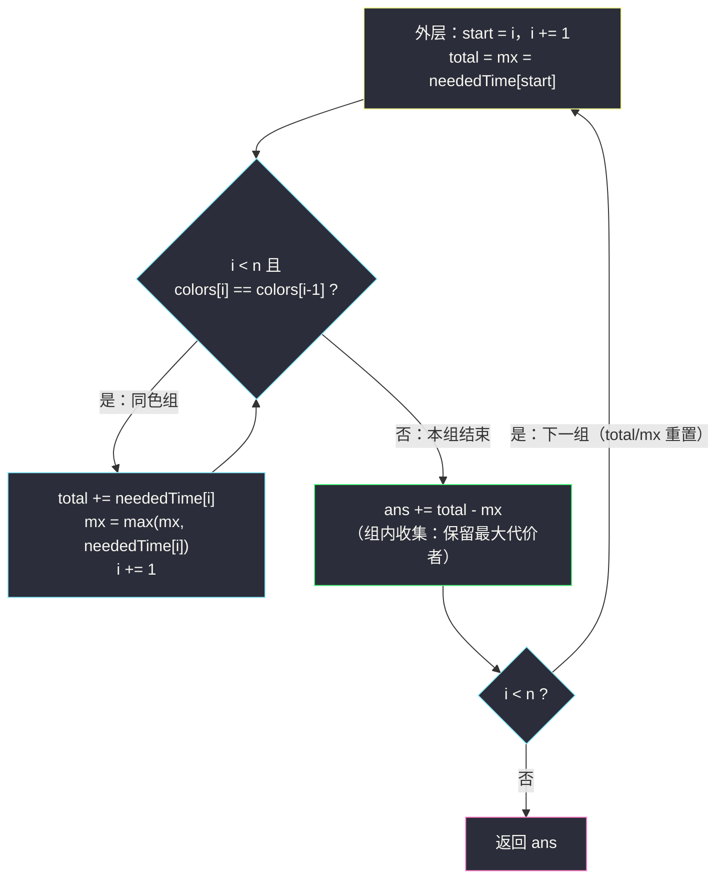
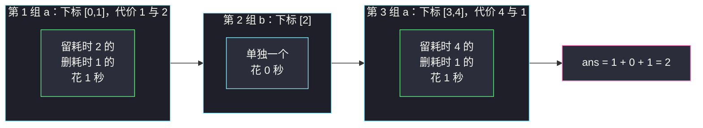

# 使绳子变成彩色的最短时间（分组循环：每组保留最大代价）

## 一、问题描述

Alice 把 `n` 个气球排成一根绳子，第 `i` 个气球的颜色是 `colors[i]`，移除它的耗时是 `neededTime[i]`（单位：秒）。

Bob 想把绳子变得「彩色」：**任意两个相邻的气球颜色不同**。他可以移除若干气球，求让绳子变成彩色的**最小总耗时**。

> 🔗 LeetCode 1578 使绳子变成彩色的最短时间：https://leetcode.cn/problems/minimum-time-to-make-rope-colorful/
> 难度：Medium · 出自灵神题单「**六、分组循环**」小节 · 关键词：每组保留最大代价

**示例 1**

```
输入：colors = "abaac", neededTime = [1,2,3,4,5]
输出：3
解释：下标 2、3 的气球都是 'a'，移除其中耗时较小的 colors[2]（3 秒）即可。
```

**示例 2**

```
输入：colors = "abc", neededTime = [1,2,3]
输出：0
解释：绳子已经彩色，无需移除。
```

**示例 3**

```
输入：colors = "aabaa", neededTime = [1,2,3,4,1]
输出：2
解释：移除下标 0（'a'，1 秒）和下标 4（'a'，1 秒）。
```

**直观理解**

「相邻颜色不同」的限制只发生在**连续同色段内部**。把 `colors` 按「连续相同颜色」分组后，每个组最多只能留下 1 个气球；组与组的交界处颜色天然不同，互不干扰。于是问题变成：每个组删谁、留谁，使总代价最小。

---

## 二、暴力解法

### 思路

先把字符串按连续同色分组（这一步 `O(n)`）。合法方案等价于「每组恰好保留 1 个」（后面第三节会证明）。于是对每组枚举「保留哪一个」，现场求出该组的删除代价，取最小：

```python
class Solution:
    def minCost(self, colors: str, neededTime: List[int]) -> int:
        n = len(colors)
        ans = 0
        i = 0
        while i < n:
            start = i
            i += 1
            while i < n and colors[i] == colors[i - 1]:
                i += 1                       # 吃掉同色组 [start, i-1]
            best = float('inf')
            for keep in range(start, i):     # 枚举保留谁
                cost = 0
                for j in range(start, i):    # 现场求组内删除代价
                    if j != keep:
                        cost += neededTime[j]
                best = min(best, cost)
            ans += best
        return ans
```

### 复杂度

- **时间**：`O(Σ len²)`，最坏全同色时 `O(n²)`。`n` 可达 `10^5`，必超时。
- **空间**：`O(1)`。

### 🔴 瓶颈在哪里

组内求和被反复计算：换一个「保留者」，组内总和其实**一个字都没变**。组代价 = 组内总和 - 保留者的代价，先求出总和与最大值，枚举本身就可以整个删掉。

---

## 三、优化探索（核心章节）

### 3.1 两个关键结论

**结论 1：合法方案 ⇔ 每个连续同色组内至多留 1 个气球。**

- 组内留 ≥ 2 个 → 这两个同色气球中间没有异色气球（组内颜色全同），最终必然相邻 → 不合法；
- 每组至多留 1 个 → 组交界处两侧颜色不同 → 全绳相邻异色 → 合法。

进一步，「整组删光」虽然合法，但代价是 `total`，而「留 1 个」最少代价是 `total - max`。由于 `neededTime[i] ≥ 0`，恒有 `total - max ≤ total`，所以**最优方案一定是每组恰好留 1 个**。

**结论 2：组与组独立 → 总代价 = 各组代价之和。**

每组怎么做与其他组无关，可以逐组取最优。

### 3.2 推导：每组保留代价最大的那一个

> **题单出处**：本题出自灵神题单「**六、分组循环**」小节，对齐 lyl 分组循环模板：
> **外层循环确定每组起点，内层 `while` 消费同组连续段；组内收集答案，组间重置。**

由结论 1、2，每组（设组内代价为 `t1, t2, ..., tm`）的最小删除代价为：

`min over 保留者 tk of (t1 + ... + tm - tk) = 组内总和 total - 组内最大值 mx`

于是分组循环时在**组内**顺手维护两个量：`total`（代价总和）与 `mx`（最大代价），组结束时就地累加 `total - mx`，然后**组间重置**这两个量（下一轮外层重新初始化）。



### 3.3 进阶：一遍扫描的流式贪心（不显式分组）

把「组内保留最大」改写成流式版本：每当新气球与前一气球同色，说明二者必删其一——删掉**当前组内已保留者与新来者中代价较小**的那个。归纳可得组内总删除代价恰好等于 `total - mx`：

```python
ans += min(mx, neededTime[i])
mx = max(mx, neededTime[i])
```

颜色一换（`colors[i] != colors[i-1]`）就把 `mx` 归零——这就是「组间重置」的流式形态。

### 3.4 一句话核心

> **连续同色组恰好保留一个气球，保留组内 `neededTime` 最大者；组代价 = 组内总和 - 组内最大值，组间重置。**

---

## 四、代码实现

### Python（主解：分组循环）

```python
from typing import List

class Solution:
    def minCost(self, colors: str, neededTime: List[int]) -> int:
        n = len(colors)
        ans = 0
        i = 0
        while i < n:
            start = i
            i += 1
            total = neededTime[start]      # 组内代价总和
            mx = neededTime[start]         # 组内最大代价
            while i < n and colors[i] == colors[i - 1]:
                total += neededTime[i]
                mx = max(mx, neededTime[i])
                i += 1                     # 消费同色组
            ans += total - mx              # 组内收集：删掉除最大者外的全部
        return ans
```

**变量含义**

| 变量 | 含义 | 作用域 |
|------|------|--------|
| `i` | 全局扫描指针（只增不减） | 全局 |
| `start` | 当前组起点 | 组内 |
| `total` | 当前组代价总和 | 组内（每轮外层重置） |
| `mx` | 当前组最大代价 | 组内（每轮外层重置） |
| `ans` | 累计删除代价 | 全局 |

### Python（进阶：一遍扫描流式贪心）

```python
class Solution:
    def minCost(self, colors: str, neededTime: List[int]) -> int:
        ans = mx = 0
        for i, c in enumerate(colors):
            if i > 0 and c != colors[i - 1]:
                mx = 0                     # 组间重置：换色即换组
            ans += min(mx, neededTime[i])  # 同色二选一，删小的
            mx = max(mx, neededTime[i])    # 组内流式保留最大
        return ans
```

### Java（最优解补充：分组循环版）

```java
class Solution {
    public int minCost(String colors, int[] neededTime) {
        char[] cs = colors.toCharArray();
        int n = cs.length, ans = 0;
        int i = 0;
        while (i < n) {
            int start = i;
            i++;
            int total = neededTime[start], mx = neededTime[start];
            while (i < n && cs[i] == cs[i - 1]) {
                total += neededTime[i];
                mx = Math.max(mx, neededTime[i]);
                i++;
            }
            ans += total - mx;             // 每组保留最大代价者
        }
        return ans;
    }
}
```

---

## 五、具体例子演示

### 端到端跟踪：colors = "aabaa", neededTime = [1,2,3,4,1]

下标对照：`0:a(1) 1:a(2) 2:b(3) 3:a(4) 4:a(1)`（括号内为移除耗时）

| 组号 | 组字符 | start | 组尾下标（i-1） | 组内代价 | total | mx | 本组删除代价 total-mx | ans 累计 |
|------|--------|-------|-----------------|----------|-------|-----|----------------------|----------|
| 1 | `aa` | 0 | 1 | 1, 2 | 3 | 2 | 1（留下标 1 的耗时 2） | 1 |
| 2 | `b` | 2 | 2 | 3 | 3 | 3 | 0（单独一组，不用删） | 1 |
| 3 | `aa` | 3 | 4 | 4, 1 | 5 | 4 | 1（留下标 3 的耗时 4） | **2** |

最终返回 **2** ✓（对应官方示例 3：删下标 0 和下标 4，各 1 秒）



### 再快速过一遍 colors = "abaac", neededTime = [1,2,3,4,5]

| 组号 | 组字符 | 范围 | 组内代价 | total | mx | 本组代价 | ans |
|------|--------|------|----------|-------|-----|----------|-----|
| 1 | `a` | [0,0] | 1 | 1 | 1 | 0 | 0 |
| 2 | `b` | [1,1] | 2 | 2 | 2 | 0 | 0 |
| 3 | `aa` | [2,3] | 3, 4 | 7 | 4 | 3 | **3** |
| 4 | `c` | [4,4] | 5 | 5 | 5 | 0 | 3 |

返回 **3** ✓（官方示例 1）

---

## 六、复杂度分析

| 方法 | 时间 | 空间 | 说明 |
|------|------|------|------|
| 暴力：组内枚举保留者 | `O(n²)` 最坏 | `O(1)` | 组内求和重复计算 |
| 分组循环 | `O(n)` | `O(1)` | `total`/`mx` 组内一遍维护 |
| 流式贪心 | `O(n)` | `O(1)` | 不显式分组，一遍 for |

三种方法空间都只用了常数个变量。

---

## 七、对比总结与易错点

**易错点**

1. **别忘证「每组恰好留 1 个」**：直观容易只想到「组内不能留 ≥2」，而漏掉「整组删光不划算」这一步——后者说明最优解形态固定，才能推出 `total - mx`。
2. `total` 与 `mx` 是**组内变量**，必须每轮外层用 `neededTime[start]` 重新初始化——这正是模板中「组间重置」的落点；漏了重置会把不同颜色组的代价混在一起。
3. 组的定义是**相邻同色**（`colors[i] == colors[i-1]`），不是「颜色出现过」；`abaac` 中两个 `a` 属于不同组。
4. 流式贪心版中 `mx` 的重置时机是「颜色变化」，`min` 在 `max` 之前累加，先后顺序不能颠倒（否则新来者自己会被和自己比较）。

**模板（分组循环 · 组内聚合量）**

```python
i = 0
while i < n:
    start = i
    i += 1
    total = mx = w[start]               # 组内聚合量在此重置
    while i < n and 同组条件:            # colors[i] == colors[i-1]
        total += w[i]
        mx = max(mx, w[i])
        i += 1
    ans += total - mx                   # 组内收集答案
```

---

## 八、举一反三

| 题目 | 关系 |
|------|------|
| [#1446 连续字符](https://leetcode.cn/problems/consecutive-characters/) | 分组循环入门：组内只收集长度（本批题解：`consecutive-characters.md`） |
| [#1869 哪种连续子字符串更长](https://leetcode.cn/problems/longer-contiguous-segments-of-ones-than-zeros/) | 分类别分桶收集（本批题解：`longer-contiguous-segments-of-ones-than-zeros.md`） |
| [#1839 所有元音按顺序排布的最长子字符串](https://leetcode.cn/problems/longest-substring-of-all-vowels-in-order/) | 把「若干相邻组」串成一条合法链（本批题解：`longest-substring-of-all-vowels-in-order.md`） |
| [#830 较大分组的位置](https://leetcode.cn/problems/positions-of-large-groups/) | 同为「连续同字符分组」，组内收集区间 |
| [#413 等差数列划分](https://leetcode.cn/problems/arithmetic-slices/) | 邻题：连续段上收集计数的另一种练习 |

**思想迁移**：分组循环里「组内收集什么」是自由的——长度、区间、总和、最大值都行。看到「相邻不能同 X」的限制，第一反应就应当是**按连续相同 X 分组，每组只留一个/只算一次**。
