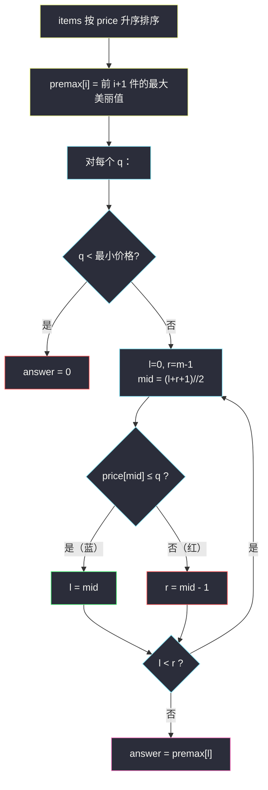

# 每一个查询的最大美丽值（排序 + 前缀最大值 + 二分）

## 一、问题描述

给你一个二维数组 `items`，其中 `items[i] = [price_i, beauty_i]`，表示第 `i` 件物品的**价格**和**美丽值**；再给你一个下标从 0 开始的整数数组 `queries`。

对于每个 `queries[j]`，求满足 `price_i <= queries[j]`（买得起）的物品中，**美丽值最大**的那个；若没有任何物品满足条件，答案为 `0`。

返回长度与 `queries` 相同的答案数组 `answer`。

> 🔗 LeetCode 2070：https://leetcode.cn/problems/most-beautiful-item-for-each-query/
>
> 数据范围：`1 <= items.length, queries.length <= 10^5`，`items[i].length == 2`，
> `1 <= price_i, beauty_i, queries[j] <= 10^9`。

**示例 1**

```
输入：items = [[1,2],[3,2],[2,4],[5,6],[3,5]], queries = [1,2,3,4,5,6]
输出：[2,4,5,5,6,6]
解释：
- q = 1：买得起的只有 [1,2]，最大美丽值 2
- q = 2：买得起 [1,2],[2,4]，最大美丽值 4
- q = 3：买得起前四件，最大美丽值 5
- q = 4：同上，仍是 5（第五件价格 5 买不起）
- q = 5 / 6：全部买得起，最大美丽值 6
```

**示例 2 / 3**

```
输入：items = [[1,2],[1,2],[1,3]], queries = [1]  → [3]   // 同价取更美
输入：items = [[10,1000]],         queries = [5]  → [0]   // 一件都买不起
```

**直观理解**

把 `queries[j]` 看成**预算**：预算内挑最漂亮的。物品表**静态不变**、预算询问海量——又是「预处理 + 二分查询」的标准形态（灵茶题单 §1.2）。预算越大买得起的越多，这个**单调性**就是二分的入场券。

---

## 二、暴力解法

对每个预算，把所有物品扫一遍，维护「买得起的物品里最大的美丽值」：

```python
class Solution:
    def maximumBeauty(self, items: List[List[int]], queries: List[int]) -> List[int]:
        ans = []
        for q in queries:
            best = 0
            for price, beauty in items:      # 无序，只能全扫
                if price <= q:
                    best = max(best, beauty)
            ans.append(best)
        return ans
```

### 复杂度

- **时间**：`O(n * m)`，`10^5 * 10^5 = 10^10`，必然超时。
- **空间**：`O(1)`（不计输出）。

### 🔴 瓶颈在哪里

`items` 无序，任何「剪枝」都无从谈起；而它明明是**静态的**——每个查询都在重复回答同一个问题的不同预算版本。破局点：把「预算 → 可选集合」变成一眼可查的结构。

---

## 三、优化探索（核心章节）

> 📚 本题在灵茶题单中属于 **§1.2 二分进阶（排序 / 预处理 + 二分）**。两步预处理（排序 + 前缀最大值）把「区间取 max」降成「查表」，查询时的二分用灵神**求最大**模板：`check(mid)` 满足则 `l = mid`。

### 3.1 关键观察：按价格排序后，买得起的物品是一个前缀

把 `items` 按 `price` 升序排序。价格 ≤ q 的物品在下标上**左连续**：


于是「预算 q 的答案」= 「最长的蓝色前缀」中美丽值的最大值。前缀右端点随 q 增大而右移——`check(x) = price[x] <= q` 关于 x **左真右假**，答案 = **最右蓝**。这正是灵神模板里的「求满足 check 的**最大**值」。

### 3.2 前缀最大值：把「前缀取 max」压成 O(1) 查表

排序后顺手再做一层预处理：

```
premax[i] = max(premax[i-1], beauty[i])
```

`premax[i]` 的含义：**只看下标 `0..i` 的物品，能拿到的最大美丽值**。这样「预算 q」的答案只需两步：

1. 二分找最后一个 `price <= q` 的下标 `idx`（求最大模板）；
2. 返回 `premax[idx]`。

**为什么不用线段树 / ST 表**：那些结构解决的是「任意区间取 max」；这里查询的永远是**前缀**，形状退化到一维，一个前缀 max 数组就够——预处理的复杂度要贴着查询的形状走，别高射炮打蚊子。

### 3.3 统一模板（求最大）

```
求满足 check(x) 的最大下标 x（红蓝染色，右假左真）：
    前提：check(l) 为真（本题已特判 q < prices[0] 的情形）
    l, r = 0, m - 1                # 闭区间 [0, m-1]
    while l < r:
        mid = (l + r + 1) // 2     # ★ 求最大必须上取整，防死循环
        if check(mid): l = mid     # mid 蓝：可行，尝试更大的下标
        else:          r = mid - 1 # mid 红：太贵，收缩右界
    # 循环结束 l == r = 最右蓝下标
```

和 §2.1 二分答案（同批 `koko-eating-bananas.md`）的「求最小」模板对照：**箭头方向反了**——满足往左收变满足往右走；相应地 `mid` 必须 `(l + r + 1) // 2`，否则当 `r = l + 1` 时 `mid = l`，`l = mid` 原地踏步死循环。



### 3.4 一句话核心

> **按价格排序 + 前缀最大值预表；每个预算二分找「最后一个买得起」的下标，答案就是那张表上的一格。**

---

## 四、代码实现

### Python（主解：排序 + premax + 手写求最大二分）

```python
class Solution:
    def maximumBeauty(self, items: List[List[int]], queries: List[int]) -> List[int]:
        items.sort(key=lambda it: it[0])            # ① 按 price 升序
        m = len(items)
        premax = [0] * m
        premax[0] = items[0][1]                     # ② 前缀最大美丽值
        for i in range(1, m):
            premax[i] = max(premax[i - 1], items[i][1])

        ans = []
        for q in queries:
            if q < items[0][0]:                     # 一件都买不起
                ans.append(0)
                continue
            l, r = 0, m - 1                          # ③ 求「最后一个 price <= q」
            while l < r:
                mid = (l + r + 1) // 2               # 求最大：上取整防死循环
                if items[mid][0] <= q:
                    l = mid                          # 买得起，试更贵的
                else:
                    r = mid - 1                      # 太贵，收缩
            ans.append(premax[l])
        return ans
```

**变量含义**

| 变量 | 含义 |
|------|------|
| `items[mid][0]` | 中点物品的价格 |
| `premax[i]` | 下标 `0..i` 物品中的最大美丽值（非降数组） |
| `l == r` | 最后一个 `price <= q` 的下标（最右蓝） |
| 返回值 `premax[l]` | 预算 q 能买到的最大美丽值 |

等价的 `bisect` 版本（`bisect_right` = 最后一个 `<= q` 的下一个）：

```python
from bisect import bisect_right

    prices = [p for p, _ in items]
    for q in queries:
        j = bisect_right(prices, q) - 1             # 最后一个 <= q 的下标
        ans.append(premax[j] if j >= 0 else 0)
```

### Java（最优解同款写法）

```java
class Solution {
    public int[] maximumBeauty(int[][] items, int[] queries) {
        Arrays.sort(items, Comparator.comparingInt(a -> a[0]));
        int n = items.length;
        int[] premax = new int[n];
        premax[0] = items[0][1];
        for (int i = 1; i < n; i++) {
            premax[i] = Math.max(premax[i - 1], items[i][1]);
        }
        int[] ans = new int[queries.length];
        for (int k = 0; k < queries.length; k++) {
            int q = queries[k];
            if (q < items[0][0]) continue;          // ans[k] 默认 0
            int l = 0, r = n - 1;
            while (l < r) {
                int mid = l + (r - l + 1) / 2;      // 上取整
                if (items[mid][0] <= q) l = mid;
                else r = mid - 1;
            }
            ans[k] = premax[l];
        }
        return ans;
    }
}
```

---

## 五、具体例子演示

以示例 1 端到端走一遍：`items = [[1,2],[3,2],[2,4],[5,6],[3,5]]`，`queries = [1,2,3,4,5,6]`。

**预处理①**：按价格排序 → `[(1,2), (2,4), (3,2), (3,5), (5,6)]`。
**预处理②**：滚动求前缀最大美丽值：

| 下标 i | 0 | 1 | 2 | 3 | 4 |
|--------|---|---|---|---|---|
| price  | 1 | 2 | 3 | 3 | 5 |
| beauty | 2 | 4 | 2 | 5 | 6 |
| premax | 2 | 4 | 4 | 5 | 6 |

（注意下标 2：`(3,2)` 自己比 premax[1]=4 丑，被前缀 max 吸收掉。）

**查询 q = 4：求最后一个 `price <= 4` 的下标**，`l = 0, r = 4`：

| 轮次 | l | mid | r | price[mid] | check：`<= 4` ? | 染色 | 动作 |
|------|---|-----|---|------------|------------------|------|------|
| 1 | 0 | 2 | 4 | 3 | ✓ | 蓝 | `l = 2` |
| 2 | 2 | 3 | 4 | 3 | ✓ | 蓝 | `l = 3` |
| 3 | 3 | 4 | 4 | 5 | ✗ | 红 | `r = 3` |
| 结束 | 3 | — | 3 | — | — | — | `premax[3] = 5` ✓ |

验证：预算 4 买不起 `(5,6)`，前四件里最美的是 `(3,5)` → **5** ✓。

**其余查询一表速览**：

| q | 最后可行下标 | premax | 解释 |
|---|--------------|--------|------|
| 1 | 0 | 2 | 只买得起 `(1,2)` |
| 2 | 1 | 4 | 买得起 `(1,2),(2,4)` |
| 3 | 3 | 5 | 同价 3 两件，取更美的 5 |
| 4 | 3 | 5 | `(5,6)` 超预算 |
| 5 | 4 | 6 | 全部买得起 |
| 6 | 4 | 6 | 同上 |

输出 `[2,4,5,5,6,6]` ✓。

**特判演示（示例 3）**：`items = [[10,1000]]`、`q = 5`：`q < prices[0] = 10`，不进二分直接返回 **0** ✓。这也说明「求最大」模板需要**至少一个可行解**作前提——先把「无解」用 `O(1)` 判掉。

---

## 六、复杂度分析

| 方法 | 预处理 | 单次查询 | 总时间 | 空间 |
|------|--------|----------|--------|------|
| 暴力扫描 | `O(1)` | `O(n)` | `O(nm) = 10^10`，超时 | `O(1)` |
| 排序 + premax + 二分 | `O(n log n)` | `O(log n)` | `O(n log n + m log n) ≈ 3.5 * 10^6` | `O(n)` |

预处理的大头是一次排序 `O(n log n)`；`m` 次查询每次只有 `log2(10^5) ≈ 17` 次比较。

---

## 七、对比总结

**§1.2 家族对照**（同小节其余题解见同目录）：

| 题 | 预处理成什么 | 查询二分什么 | 模板方向 |
|----|--------------|--------------|----------|
| #2070 本篇 | 排序 + 前缀最大值 | 最后一个 `price <= q` 的下标 | 求最大 |
| #2476 BST 最近节点查询 | 中序展开成有序数组 | `<= q` 的最大值 / `>= q` 的最小值 | 求最大 / 求最小 |
| #2080 区间频率 | 值 → 有序下标表 | 两次求最小，数段长 | 求最小 ×2 |
| #1146 快照数组 | 下标 → (snap_id, value) 版本链 | 最后一个 `snap_id <= s` 的版本 | 求最大 |
| #1385 距离值 | 排序 `arr2` | 判 `[x-d, x+d]` 非空 | 求最小 ×2 |

**易错点**

1. **求最大必须 `mid = (l + r + 1) // 2`**：`l = mid` 配下取整，`r = l + 1` 时会死循环。这是「求最大」模板最经典的坑（灵神模板里两条分支的方向与取整方式是绑定的）。
2. **排序对象只能是 price**：beauty 毫无单调性，对它二分毫无意义；排序后 beauty 的乱序正是靠 premax 抹平的。
3. 重复价格不用去重：前缀 max 天然吸收「同价但更丑」的物品。
4. 「一件都买不起」返回 0（题目规定，不是 -1）；用 `q < items[0][0]` 提前判掉，别让无解情形进二分。
5. 查询数组 `queries` 的顺序不能动（答案按原顺序输出），离线做法才允许排序它（见下）。

**延伸：离线双指针**。若把 `queries` 排序后与排序后的 items 双指针推进，可做到 `O(n log n + m log m)` 且免掉每次二分——本题两种做法复杂度同阶，在线（边问边答）的写法更通用，面试口头提一句即可。

---

## 八、举一反三

| 题目 | 关系 |
|------|------|
| [2476. 二叉搜索树最近节点查询](https://leetcode.cn/problems/closest-nodes-queries-in-a-binary-search-tree/) | 同小节亲缘题：同样是「`<= q` 的最大值」查询，见 `closest-nodes-queries-in-a-binary-search-tree.md` |
| [2080. 区间内查询数字的频率](https://leetcode.cn/problems/range-frequency-queries/) | 同批姊妹篇（同 §1.2）：有序下标表 + 两刀计数，见 `range-frequency-queries.md` |
| [1146. 快照数组](https://leetcode.cn/problems/snapshot-array/) | 同批姊妹篇（同 §1.2）：同为「求最大」二分，见 `snapshot-array.md` |
| [2389. 和有限的最长子序列](https://leetcode.cn/problems/longest-subsequence-with-limited-sum/) | 结构一模一样的 Easy 亲缘题：排序 + 前缀和 + `bisect_right` |
| [1847. 最近的房间](https://leetcode.cn/problems/closest-room/) | 进阶 Hard：离线排序 + 有序集合二分，本题思路的加强版 |
| [1182. 与目标颜色间的最短距离](https://leetcode.cn/problems/shortest-distance-to-target-color/) | 思想迁移：预处理「颜色 → 有序下标表」，查询时二分找最近 |

**思想迁移**

- 预处理要**贴着查询的形状**走：查询是前缀 → 前缀和/前缀 max；查询是任意区间 → 才考虑 ST 表、线段树。
- 「预算变大，可选集只增不减」是本题二分合法性的来源——先找单调性，再上二分。
- 一步排序换来每次查询 `O(log n)`，是性价比最高的预处理；配合一个前缀统计（和/max/计数）能覆盖一大类「排序 + 二分边界」题。
- 口诀：**「排序定前缀，前缀备最大；预算问一格，右蓝即是答。」**
