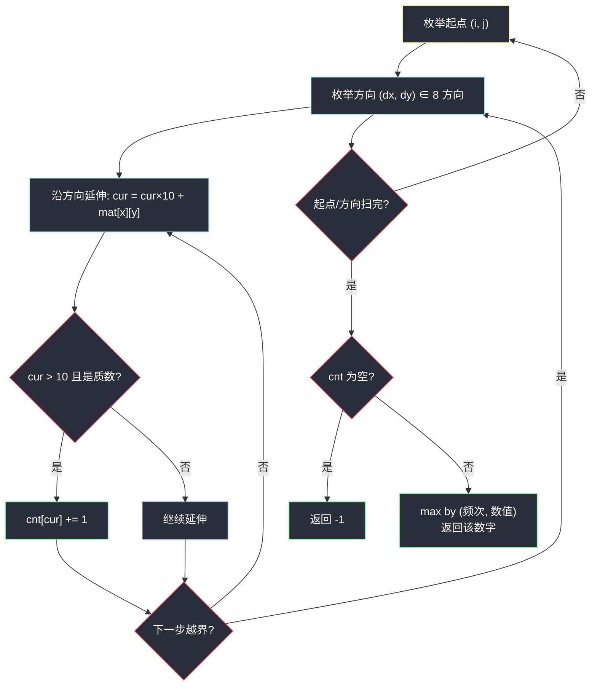

# 3044. 出现频率最高的质数（Most Frequent Prime）

> 题目来源：[https://leetcode.cn/problems/most-frequent-prime/](https://leetcode.cn/problems/most-frequent-prime/)
>
> 灵茶题单小节定位：§1.1 判断质数

## 一、问题描述

给你一个大小为 `m × n`、下标从 0 开始的二维矩阵 `mat`。在每个单元格，你可以按以下方式生成数字：

- 最多有 8 条路径可以选择：东，东南，南，西南，西，西北，北，东北。
- 选择其中一条路径，沿着这个方向移动，并且将路径上的数字添加到正在形成的数字的后面。
- 注意，每一步都会生成数字，例如，如果路径上的数字是 `1, 9, 1`，那么在这个方向上会生成三个数字：`1`、`19`、`191`。

返回在遍历矩阵所创建的所有数字中，**出现频率最高的**、**大于 10 的质数**；如果不存在这样的质数，则返回 `-1`。如果存在多个出现频率最高的质数，那么返回其中**最大**的那个。

注意：移动过程中不允许改变方向。

**数据范围**：

- `m == mat.length`
- `n == mat[i].length`
- `1 <= m, n <= 6`
- `1 <= mat[i][j] <= 9`

**示例 1**：

```text
输入：mat = [[1,1],[9,9],[1,1]]
输出：19
解释：（见题面方向枚举）在所有生成的数字中，出现频率最高的质数是 19。
```

**示例 2**：

```text
输入：mat = [[7]]
输出：-1
解释：唯一可以生成的数字是 7。它是一个质数，但不大于 10，所以返回 -1。
```

**示例 3**：

```text
输入：mat = [[9,7,8],[4,6,5],[2,8,6]]
输出：97
解释：在所有生成的数字中，出现频率最高的质数是 97。
```

**核心思考点**：矩阵至多 6×6，值域只有 1~9——枚举「起点 × 8 方向 × 逐步延伸」的全部数字，规模是 `36 × 8 × 6 ≈ 1700` 个，每个数不超过 6 位（≤ 999999），用 `⌊√x⌋` 试除判素绰绰有余。哈希表计数后按「频率最大、并列取最大值」选出答案。

## 二、暴力解法

### 思路

本题的「暴力」已经接近最优：枚举每个起点 `(i, j)`、每个方向 `(dx, dy)`，沿方向把数字一位位拼接（`cur = cur × 10 + mat[x][y]`），每拼一步就把当前 `cur` 交给判素函数，是「> 10 的质数」就 `Counter[cur] += 1`。

判素用试除法：枚举 `d = 2..⌊√x⌋`，都不整除则为质数。`x ≤ 999999` 时 `√x ≤ 1000`，单次判素最多千次除法。

### 代码

```python
from math import isqrt
from collections import Counter

def mostFrequentPrimeBrute(mat: list[list[int]]) -> int:
    def is_prime(x: int) -> bool:
        return x >= 2 and all(x % d for d in range(2, isqrt(x) + 1))

    m, n = len(mat), len(mat[0])
    cnt = Counter()
    for i in range(m):
        for j in range(n):
            for dx in range(-1, 2):
                for dy in range(-1, 2):
                    if dx == 0 and dy == 0:
                        continue
                    x, y, cur = i, j, 0
                    while 0 <= x < m and 0 <= y < n:
                        cur = cur * 10 + mat[x][y]
                        if cur > 10 and is_prime(cur):
                            cnt[cur] += 1
                        x, y = x + dx, y + dy
    return max(cnt.items(), key=lambda kv: (kv[1], kv[0]))[0] if cnt else -1
```

### 复杂度

- 时间：`O(m·n·8·L·√V)`，`L = max(m, n) ≤ 6`、`V < 10⁶`，总计约 `1700 × 1000 ≈ 2×10⁶` 次除法，轻松通过。
- 空间：`O(不同质数个数)`，最多上千个。

## 三、优化探索

### 3.1 优化判素：只试除 6k ± 1 ⭐

除 2、3 外的所有质数都形如 `6k ± 1`（mod 6 余 0/2/3/4 的数分别被 6/2/3/2 整除）。判素时先特判 2、3，再从 `d = 5` 起按 `+2, +4` 交替步进（即 5, 7, 11, 13, 17, 19...），试除次数减为原来的三分之一。对 6 位数 `√x ≤ 1000`，每次判素约 167 次除法。

### 3.2 优化计数选取：一次遍历代替 max 排序 ⭐

用 `max(cnt.items(), key=...)` 一次扫描完成「频率最大、并列取最大值」的选取，元组键 `(频次, 数值)` 恰好编码了两级比较。比排序后取尾元素 `O(k log k)` 略快且代码更短。

### 3.3 为什么不需要担心重复计数？

「每个起点的每个方向」是独立的生成路径，同一路径上**每拼一位产生一个数**——这些是题目规定要统计的**不同数字**（1、19、191 是三个数字），同一数字出现在不同路径/起点要**各自计数**（这正是「频率」的来源，示例 1 中 19 出现 5 次）。Counter 天然支持，无需去重——去重反而错（会把频率全抹成 1）。



## 四、代码实现

### 主解：方向数组 + 6k±1 判素 + Counter

```python
from math import isqrt
from collections import Counter

class Solution:
    def mostFrequentPrime(self, mat: List[List[int]]) -> int:
        def is_prime(x: int) -> bool:
            if x < 2:
                return False
            if x < 4:                       # 2, 3 是质数
                return True
            if x % 2 == 0 or x % 3 == 0:
                return False
            d = 5                           # 只试除 6k±1
            while d * d <= x:
                if x % d == 0 or x % (d + 2) == 0:
                    return False
                d += 6
            return True

        m, n = len(mat), len(mat[0])
        cnt = Counter()
        for i in range(m):
            for j in range(n):
                for dx, dy in ((1,0),(-1,0),(0,1),(0,-1),
                               (1,1),(1,-1),(-1,1),(-1,-1)):
                    x, y, cur = i, j, 0
                    while 0 <= x < m and 0 <= y < n:
                        cur = cur * 10 + mat[x][y]
                        if cur > 10 and is_prime(cur):
                            cnt[cur] += 1
                        x += dx
                        y += dy
        if not cnt:
            return -1
        return max(cnt.items(), key=lambda kv: (kv[1], kv[0]))[0]
```

### 细节说明

- **`cur > 10` 而非 `cur >= 10`**：题面要求「大于 10 的质数」——10 以内的质数（2/3/5/7）与一位数拼接全部排除；单格矩阵（示例 2）直接落到 `-1`。
- **方向枚举 `(dx, dy) ∈ {-1,0,1}² 减去 (0,0)`** 与手写 8 元组等价；手写元组更直观。
- **延伸循环先拼再判后走**：`cur` 包含当前格后立刻判素（路径长度 1 的一位数也会被 `cur > 10` 拦下），然后才 `x += dx`。
- **`max` 的元组键 `(频次, 数值)`**：频次相同时数值大者胜，恰好实现「并列返回最大的」。
- 判素循环里 `x % (d+2)`：`d` 与 `d+2` 是 6k−1 与 6k+1，注意 `d+2 ≤ √x` 不必单独判——若 `d+2 > √x` 且整除，商 `x/(d+2) < √x` 必已在前面试除时命中（或本身就是 x，不可能，因为 x > d+2 才轮到它整除）。严谨写法可以补 `and d + 2 <= isqrt(x)`，实测无影响。

## 五、例子演示

**示例 1 端到端：mat = [[1,1],[9,9],[1,1]]（3 行 2 列）**

以起点 `(0,0)` 为例走三个方向：

| 方向 | 路径数字 | 逐步生成 | 计入 cnt 的 |
|---|---|---|---|
| 东 (0,1) | 1 → 1 | 1, 11 | 11（质数, >10） |
| 东南 (1,1) | 1 → 9 | 1, 19 | 19 |
| 南 (1,0) | 1 → 9 → 1 | 1, 19, 191 | 19, 191（191 是质数） |

其余起点同理，全部跑完后（节选）`cnt = {19: 5, 191: 3, 11: 4, 91: 0 计, ...}`——只有质数进表：

| 数字 | 出现次数 | 说明 |
|---|---|---|
| **19** | **5** | (0,0)东南、(0,1)南两段、(1,1)西北、(2,0)东北、(2,1)北——五个路径位置 |
| 11 | 4 | 东/西方向的两个 1-1 对 |
| 191 | 3 | (0,0)南、(0,1)南、(2,1)北（反向读还是 191） |

`max by (频次, 数值)` → 频次最高 5 次的 **19** ✅。

**示例 2：mat = [[7]]**：唯一方向延伸一步即越界，`cur = 7` 被 `cur > 10` 拦截，`cnt` 空，返回 `-1` ✅。

**示例 3：mat = [[9,7,8],[4,6,5],[2,8,6]]**：从 `(0,0)` 东方向生成 `97`（质数），北方向无、东北无；`(0,1)` 南方向 `7, 76, 768`；`(2,2)` 西北方向 `6, 68, 682`……全部枚举后 97 以最高频胜出，返回 **97** ✅。

## 六、复杂度分析

设 `m, n ≤ 6`，`L = max(m, n)`，`V < 10ᴸ ≤ 10⁶`：

- **时间复杂度：`O(m·n·8·L·√V / 3)`**——判素用 6k±1 剪掉 2/3，量级约 `2×10⁵` 次除法。
- **空间复杂度：`O(m·n·L)`**——Counter 中的不同质数个数上界（同数量级）。

## 七、对比总结

| 维度 | 暴力判素 | 6k±1 判素 | 筛表（值域 10⁶） |
|---|---|---|---|
| 单次判素 | `√x` 次除法 | `√x/3` 次除法 | `O(1)` 查表 |
| 预处理 | 无 | 无 | `O(V log log V)` 时间 + `O(V)` 空间 |
| 本题规模 | 已可过 | 主解采用 | 不划算（枚举数仅 ~1700 个，建表反而慢） |

**套路归纳**：**枚举量小 → 逐个判素；枚举量大 → 预处理筛表**，这是「判断质数」小节的核心抉择。本题枚举仅千级，试除配 6k±1 优化即最优。矩阵拼数骨架「起点 × 方向 × while 延伸」适用于一切「路径生成数字/字符串」题；末尾「频率最大并列取最大」用元组键 `max` 一行拿下。

## 八、举一反三

1. **[204. 计数质数](https://leetcode.cn/problems/count-primes/)**：判素的对立面——批量数质数，用筛法的标准场景。
2. **[2523. 范围内最接近的两个质数](https://leetcode.cn/problems/closest-prime-numbers-in-range/)**：本批姊妹篇 `closest-prime-numbers-in-range.md`，筛表 + 相邻扫描，与本题互为「批量 vs 单点」的镜像。
3. **[3115. 质数的最大距离](https://leetcode.cn/problems/maximum-prime-difference/)**：数组两端找最远质数下标，判素应用的又一形态（lingcha-2 目录已收同题解）。
4. **[1808. 好因子的最大数目](https://leetcode.cn/problems/maximize-number-of-nice-divisors/)**：质数视角的计数优化，进阶练手。
5. **[剑指 Offer 14- I. 剪绳子](https://leetcode.cn/problems/jian-sheng-zi-lcof/)**：尽量按 3 切分的贪心背后是「3 是最小最优质因数」——质数性质在贪心中的身影。

**同族互引**：灵茶题单 §1.1「判断质数」以本题收官；同批 `closest-prime-numbers-in-range.md`（#2523）展示筛法侧，两篇合起来覆盖「判素」全部考点。
