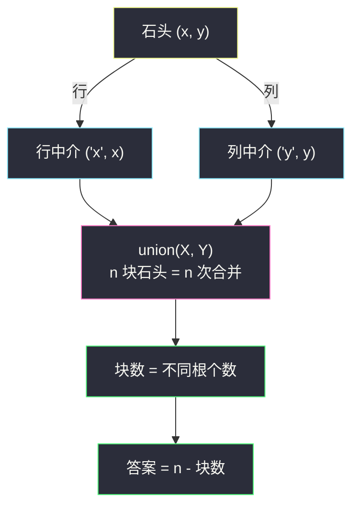
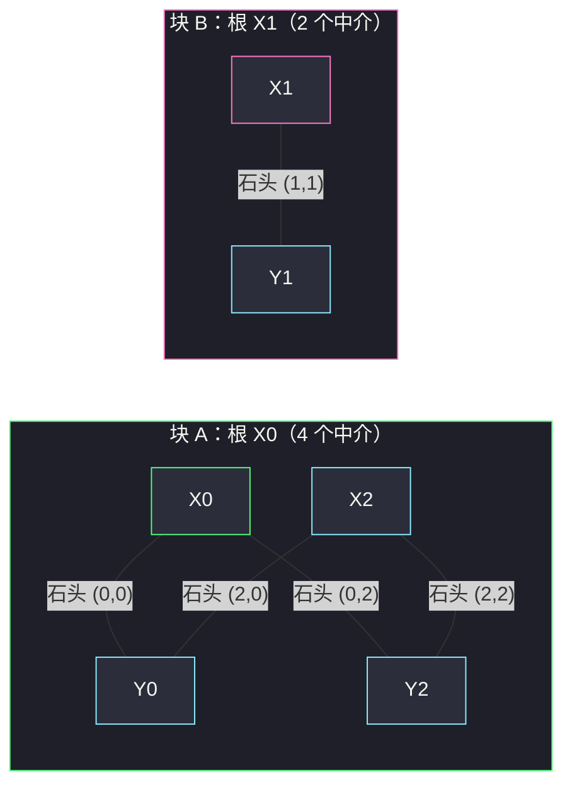

# 移除最多的同行或同列石头（中介并查集 · 答案 = n - 连通块数）

## 一、问题描述

二维平面上放着 `n` 块石头，`stones[i] = [xi, yi]` 表示第 `i` 块石头的坐标，任意两块石头坐标不同。

一块石头**可以**被移除，当且仅当存在**另一块尚未移除的石头**与它**同行**（x 坐标相同）或**同列**（y 坐标相同）。每次移除一块石头，直到无法再移除。返回**最多**能移除多少块石头。

> 🔗 LeetCode 947：https://leetcode.cn/problems/most-stones-removed-with-same-row-or-column/
>
> 数据范围：`1 <= n <= 1000`，`-10^9 <= xi, yi <= 10^9`。

**示例 1**

```
输入：stones = [[0,0],[0,1],[1,0],[1,2],[2,1],[2,2]]
输出：5
解释：一种移除方案是依次移除 (1,2)、(2,2)、(2,0)、(0,1)、(1,0)，
     最后只剩 (0,0)。
```

**示例 2**

```
输入：stones = [[0,0],[0,2],[1,1],[2,0],[2,2]]
输出：3
解释：移除 (2,2)、(2,0)、(0,2)，剩 (0,0) 与 (1,1)。
```

**示例 3**

```
输入：stones = [[0,0]]
输出：0
解释：没有别的石头与它同行或同列。
```

**直观理解**

「同行」「同列」都能作为移除的依据，而且这两个关系会**传递**：(0,0) 与 (0,2) 同行，(0,2) 与 (2,2) 同列——三块石头连成一伙，一伙里可以删到只剩一块。于是石头按「行或列相连」划分成**连通块**，直觉上每块留一个。答案就是：

> **可移除数 = n - 连通块数**

问题只剩「怎么高效求连通块」：两两判断是 `O(n²)`；把**行号、列号本身当作节点**（中介），每块石头只连一次边，就是本篇主角——**中介并查集**。

---

## 二、暴力解法

石头两两判断：同行或同列就用并查集合并。`n <= 1000`，`O(n²) = 10^6` 对判断，本题能过：

```python
class Solution:
    def removeStones(self, stones: List[List[int]]) -> int:
        n = len(stones)
        fa = list(range(n))                # 直接对石头编号建并查集

        def find(x: int) -> int:
            while fa[x] != x:
                fa[x] = fa[fa[x]]          # 路径减半
                x = fa[x]
            return x

        for i in range(n):
            for j in range(i + 1, n):      # 两两判断
                if stones[i][0] == stones[j][0] or stones[i][1] == stones[j][1]:
                    fa[find(i)] = find(j)

        return n - len({find(i) for i in range(n)})
```

### 复杂度

- **时间**：`O(n² α(n))`，`n = 1000` 约 `5 * 10^5` 对判断，可过。
- **空间**：`O(n)`。

### 🔴 瓶颈在哪里

两两比较把力气花在了**重复传递**上：同一行的 `k` 块石头要比较 `k²` 次，但「同一行」这个事实只需要说一遍。坐标域达 `±10^9` 也开不了桶。同小节的 Hard 姊妹题 #3873（`n <= 10^5`）里 `O(n²)` 直接超时——需要把「比较」改成「共享」。

---

## 三、优化探索（核心章节）

> 📚 本题在灵茶题单中属于 **§7.3 中介并查集**（常用数据结构 B · 并查集），与 #3873（`maximum-points-activated-with-one-addition.md`）同小节互为姊妹。模板要点：**把「属性值」当节点，点连接它的两个中介**。

### 3.1 观察特征

| 特征 | 说明 |
|------|------|
| 连接规则是「同 x 或同 y」 | 传递闭包决定分组，天然的连通块结构 |
| 坐标域 `±10^9` | 开不了数组，必须哈希离散化 |
| 同一行 k 块石头 | 两两比较 `k²` 次 vs 共享一个「行节点」`k` 次 |

### 3.2 答案 = n - 连通块数

设某连通块含 `L` 块石头：

- **至多删 `L - 1` 块**：删到只剩最后一块后，最后一块再也找不到「另一块未移除的同行/同列石头」，删不动；
- **能删 `L - 1` 块**：在块内任选一块作根做 BFS 得到生成树，**按深度从大到小（叶子先删）**——每次删除时，它在生成树上的父节点仍在场作为「伴随石头」，合法。

全图求和：`Σ (L_k - 1) = n - 连通块数`。

### 3.3 核心构造：中介并查集

石头自己**不做**并查集节点，而是把「**行号**」「**列号**」哈希成节点：

```python
for x, y in stones:
    union(('x', x), ('y', y))     # 石头 (x, y) = 一条连接行中介与列中介的边
```

为什么等价？「两块石头同行」⟺ 它们共享同一个行中介；「同行连成链、再经同列转行」的传递闭包，在中介图上恰好一一对应。`n` 块石头只需 `n` 次 `union`，复杂度从 `O(n²)` 掉到 `O(n α(n))`。

注意 `('x', 1)` 与 `('y', 1)` 是**两个不同节点**：行 1 和列 1 毫无关系（见第七章易错点的反例）。

### 3.4 正确性小结与计数

块数 = 中介图里不同根的个数（对每个中介节点 `find` 一次去重）。由于每块石头都同时贡献一个行中介和一个列中介，**每个真实点都被它的行中介所在的块「代表」**，不会漏块也不会多块。



### 3.5 一句话核心

> **石头是边不是点：行号、列号做节点，每块石头连一次「行中介—列中介」；答案 = n - 连通块数，每块留一。**

---

## 四、代码实现

### Python（主解：中介并查集）

```python
class Solution:
    def removeStones(self, stones: List[List[int]]) -> int:
        fa, sz = {}, {}                     # 父指针 / 集合大小（根处有效）

        def find(x: tuple) -> tuple:
            if x not in fa:                 # 中介节点首次出现：自立门户
                fa[x] = x
                sz[x] = 1
                return x
            root = x
            while fa[root] != root:         # 先找根
                root = fa[root]
            while fa[x] != root:            # 再路径压缩
                fa[x], x = root, fa[x]
            return root

        def union(x: tuple, y: tuple) -> None:
            rx, ry = find(x), find(y)
            if rx == ry:
                return
            if sz[rx] < sz[ry]:             # 小树挂大树
                rx, ry = ry, rx
            fa[ry] = rx
            sz[rx] += sz[ry]

        for x, y in stones:
            union(('x', x), ('y', y))       # 石头 = 连接行、列中介的边

        blocks = len({find(k) for k in fa}) # 中介图的连通块数
        return len(stones) - blocks
```

**极简变体（递归 find，竞赛手速版）**

```python
class Solution:
    def removeStones(self, stones: List[List[int]]) -> int:
        fa = {}
        def find(x):
            if fa.setdefault(x, x) != x:
                fa[x] = find(fa[x])         # 递归路径压缩
            return fa[x]
        for x, y in stones:
            fa[find(('x', x))] = find(('y', y))
        return len(stones) - len({find(k) for k in fa})
```

不带按大小合并时最坏退化成链，`n = 1000` 时递归深度可能超过 Python 默认限制（1000 层），需要 `sys.setrecursionlimit(10**4)` 兜底；主解的迭代版 + 按大小合并无此隐患。

**变量含义**

| 变量 | 含义 |
|------|------|
| `('x', v)` / `('y', v)` | 值 v 的**行中介** / **列中介**，两个不同节点 |
| `fa` | 中介节点 -> 父节点（哈希表做离散化） |
| `sz[r]` | 以 r 为根的集合大小 |
| `blocks` | 中介图连通块数 = 石头连通块数 |

**循环不变式**：处理完前 `k` 块石头后，`fa` 森林恰好是前 `k` 块石头「同行/同列」关系的传递闭包。

### Java（可选）

```java
// 移除最多的同行或同列石头
// 测试链接 : https://leetcode.cn/problems/most-stones-removed-with-same-row-or-column/
class Solution {
    public int removeStones(int[][] stones) {
        int n = stones.length;
        Map<Long, Integer> id = new HashMap<>();      // 中介 -> 编号
        int[] fa = new int[2 * n];
        int[] sz = new int[2 * n];
        for (int i = 0; i < 2 * n; i++) { fa[i] = i; sz[i] = 1; }
        int[] cnt = {0};
        for (int[] s : stones) {
            int a = id.computeIfAbsent(key(s[0], true),  k -> cnt[0]++);
            int b = id.computeIfAbsent(key(s[1], false), k -> cnt[0]++);
            union(fa, sz, a, b);
        }
        Set<Integer> roots = new HashSet<>();
        for (int i = 0; i < cnt[0]; i++) roots.add(find(fa, i));
        return n - roots.size();
    }

    private long key(int v, boolean isRow) {
        return ((long) v << 1) | (isRow ? 0L : 1L);   // 行列分奇偶编码
    }

    private int find(int[] fa, int x) {
        while (fa[x] != x) { fa[x] = fa[fa[x]]; x = fa[x]; }
        return x;
    }

    private void union(int[] fa, int[] sz, int x, int y) {
        int rx = find(fa, x), ry = find(fa, y);
        if (rx == ry) return;
        if (sz[rx] < sz[ry]) { int t = rx; rx = ry; ry = t; }
        fa[ry] = rx; sz[rx] += sz[ry];
    }
}
```

---

## 五、具体例子演示

以示例 2 `stones = [[0,0],[0,2],[1,1],[2,0],[2,2]]` 端到端走主解。中介记号：`Xv` 表示行中介 `('x', v)`，`Yv` 表示列中介 `('y', v)`；编号 `X0=0, Y0=1, X1=2, Y1=3, X2=4, Y2=5`。

**合并过程（merge/find 每步父数组快照）**

| 步骤 | 石头 | union 操作 | 找根过程 | fa 快照 (X0 Y0 X1 Y1 X2 Y2) | 说明 |
|------|------|-----------|----------|------------------------------|------|
| 初始 | — | — | — | `[0,1,2,3,4,5]` | 每个中介自成一块 |
| 1 | (0,0) | union(X0, Y0) = (0,1) | 根 0 vs 根 1，大小 1 vs 1 | `[0,0,2,3,4,5]` | Y0 挂到 X0，块 {X0,Y0} |
| 2 | (0,2) | union(X0, Y2) = (0,5) | 根 0（大小 2）vs 根 5（大小 1） | `[0,0,2,3,4,0]` | 小树 Y2 挂到根 0 |
| 3 | (1,1) | union(X1, Y1) = (2,3) | 根 2 vs 根 3，大小 1 vs 1 | `[0,0,2,2,4,0]` | Y1 挂到 X1，独立一块 |
| 4 | (2,0) | union(X2, Y0) = (4,1) | 根 4（大小 1）vs 根 0（大小 3） | `[0,0,2,2,0,0]` | 小树 X2 挂到根 0 |
| 5 | (2,2) | union(X2, Y2) = (4,5) | find(4)=0、find(5)=0，**同根** | `[0,0,2,2,0,0]` | 跳过，无变化 |

**连通块统计**：对 6 个中介逐个 `find` → 根集合 = `{0, 2}`，共 **2 块**。



石头是边：块 A 的 4 条边对应石头 (0,0)、(0,2)、(2,0)、(2,2)；块 B 的 1 条边对应 (1,1)。

**答案**：`n - 块数 = 5 - 2 = 3` ✓。

**删除方案的构造（验证 3.2 的可达性）**：块 A 中 4 块石头，按「叶子先删」——

| 次序 | 移除 | 合法依据（伴随石头尚未移除） |
|------|------|------------------------------|
| 1 | (2,2) | 与 (2,0) 同行 x=2 |
| 2 | (2,0) | 与 (0,0) 同列 y=0 |
| 3 | (0,2) | 与 (0,0) 同行 x=0 |
| 留 | (0,0) | 块 A 的「根」 |

共删 3 块；块 B 只有 (1,1) 一块，删不动——与公式一致。示例 1 同理：6 块石头全连通（1 块），答案 `6 - 1 = 5` ✓。

---

## 六、复杂度分析

| 方法 | 时间 | 空间 | 说明 |
|------|------|------|------|
| 两两判断合并 | `O(n² α(n))` | `O(n)` | `n = 1000` 可过；`n = 10^5` 超时 |
| 中介并查集（主解） | `O(n α(n))` | `O(n)` | n 次 union，哈希离散化坐标 |

---

## 七、对比总结

**中介并查集三步曲**——本篇是范本：

1. 识别「点与点通过**共享属性**相连」（同行/同列、同邮箱、同字符串……）；
2. 把**属性值**哈希成节点，每个点转成「连接它各属性中介的**边**」；
3. 合并后按题意取「块数 / 块内点数 / 最大块」等统计量。

| 题 | 中介是什么 | 点连接哪些中介 |
|----|------------|----------------|
| #947 本篇 | 行号、列号 | 每块石头连 1 个行 + 1 个列 |
| #3873 添加一个点后可激活的最大点数 | x 值、y 值 | 同上，但统计块内**真实点数**取最大两块 |
| #721 账户合并 | 邮箱字符串 | 每个账户连它所有邮箱 |

**易错点**

1. **行中介与列中介混淆**：`('x', 1)` 和 `('y', 1)` 必须是两个节点。反例 `stones = [[0,1],[1,0]]`：正确划分是 `{X0,Y1}`、`{X1,Y0}` 两块（两块石头不同行不同列，谁也删不了，答案 0）；若把 x=0 和 y=0 当同一个节点，会错并成一块，误答 1。
2. **块数数的是中介图的根**，不是石头编号的根——用了中介就不要再回头数石头。
3. **递归 find 的深度**：无按大小合并时链可长达 `2n`，Python 默认递归深度 1000 可能爆栈，大规模用迭代版。
4. 删除合法性要求「另一块**尚未移除**的石头」——构造删除顺序时叶子先删、根最后留。

**模板（中介并查集，Python）**

```python
fa, sz = {}, {}

def find(x):
    if x not in fa:
        fa[x] = x; sz[x] = 1
        return x
    root = x
    while fa[root] != root:
        root = fa[root]
    while fa[x] != root:
        fa[x], x = root, fa[x]
    return root

def union(x, y):
    rx, ry = find(x), find(y)
    if rx == ry:
        return
    if sz[rx] < sz[ry]:
        rx, ry = ry, rx
    fa[ry] = rx
    sz[rx] += sz[ry]

for x, y in points:
    union(('x', x), ('y', y))     # 点 = 行、列中介之间的边
```

---

## 八、举一反三

| 题目 | 关系 |
|------|------|
| [3873. 添加一个点后可激活的最大点数](https://leetcode.cn/problems/maximum-points-activated-with-one-addition/) | 同小节 Hard 姊妹题 `maximum-points-activated-with-one-addition.md`：同款中介图，升级为取最大两块 |
| [990. 等式方程的可满足性](https://leetcode.cn/problems/satisfiability-of-equality-equations/) | 同批地基篇 `satisfiability-of-equality-equations.md`（§7.1），并查集模板来源 |
| [721. 账户合并](https://leetcode.cn/problems/accounts-merge/) | 邮箱字符串当中介，块内收集账户 |
| [547. 省份数量](https://leetcode.cn/problems/number-of-provinces/) | 「n - 连通块数」的裸图版本 |
| [1202. 交换字符串中的元素](https://leetcode.cn/problems/smallest-string-with-swaps/) | 下标当节点连边，块内排序重组 |
| [695. 岛屿的最大面积](https://leetcode.cn/problems/max-area-of-island/) | DFS/BFS 求连通块的替代写法，对照理解 |

**思想迁移**

- 值域大、比较关系是「**相等**」型（同行、同列、同邮箱），别两两比较——**让相等的值共享一个节点**，比较变连接，`O(n²)` 变 `O(n)`。
- 「最多删几个 / 最少留几个」型的连通块问题，先猜「每块留一」再证上下界（生成树叶子先删）。
- 口诀：**「点是边，值是点；行连列，块中选。删到每块剩一个，n 减块数答案现。」**
