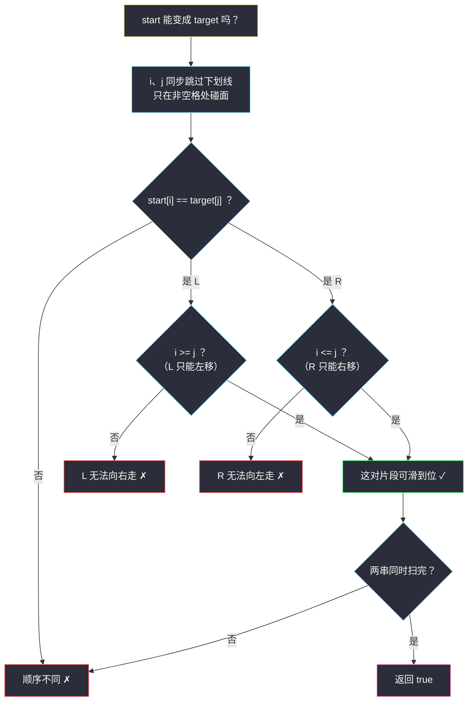

# 移动片段得到字符串（双指针 · 忽略空格同步走）

## 一、问题描述

给你两个字符串 `start` 和 `target`，长度相等，只包含字符 `'L'`、`'R'` 和 `'_'`。这里：

- `'L'` 表示一段向左移动的片段，只能**向左**移动到与它相邻的空位 `'_'`；
- `'R'` 表示一段向右移动的片段，只能**向右**移动到与它相邻的空位 `'_'`。

移动规则：片段每一步可以移到相邻的空格上（与空格交换位置），片段不能越过其他片段。判断 `start` 能否经过若干次移动变成 `target`。

> 🔗 LeetCode 2337：https://leetcode.cn/problems/move-pieces-to-obtain-a-string/
>
> 数据范围：`n == start.length == target.length`，`2 <= n <= 10^5`，只含 `'L'`、`'R'`、`'_'`。

**示例 1**

```
输入：start = "_L__R__R_", target = "L______RR"
输出：true
解释：一种移动序列（完整逐步表见「五、具体例子演示」）：
  "_L__R__R_" → "L___R__R_"（下标 1 的 L 左移）
              → "L___R___R"（下标 7 的 R 右移腾位）
              → "L______RR"（下标 4 的 R 依次右移到 7）
```

**示例 2**

```
输入：start = "R_L_", target = "__LR"
输出：false
解释：去掉空格后 start 是 "RL"、target 是 "LR"，L 与 R 的相对顺序已经不同，
      片段互相不能穿过对方，怎么移都回不去。
```

**示例 3**

```
输入：start = "_R", target = "R_"
输出：false
解释：R 只能右移，而它需要出现在更左边的位置。
```

**直观理解**

`'_'` 只是「空位」，片段在空位间滑行。由于片段不能互相穿过，**L 和 R 的先后顺序永远不变**；每个片段唯一能做的是在自己这条「单向车道」上滑动：L 向左、R 向右。于是问题变成两道独立的「位置检查」。

## 二、暴力解法（BFS 模拟所有移动）

### 直观思路

把 `start` 的每个可达状态当作图上的节点：每个状态枚举所有「片段 + 空格相邻」的移动得到邻居，BFS 判重后搜索，看能否到达 `target`。

```python
from collections import deque

class Solution:
    def canChange(self, start: str, target: str) -> bool:
        if start == target:
            return True
        q = deque([start])
        seen = {start}
        while q:
            cur = q.popleft()
            lst = list(cur)
            n = len(lst)
            for k in range(n):
                if lst[k] == 'L' and k > 0 and lst[k - 1] == '_':
                    lst[k - 1], lst[k] = 'L', '_'          # L 左移一步
                    nxt = ''.join(lst)
                    if nxt == target:
                        return True
                    if nxt not in seen:
                        seen.add(nxt)
                        q.append(nxt)
                    lst[k - 1], lst[k] = '_', 'L'          # 回溯
                elif lst[k] == 'R' and k + 1 < n and lst[k + 1] == '_':
                    lst[k + 1], lst[k] = 'R', '_'          # R 右移一步
                    nxt = ''.join(lst)
                    if nxt == target:
                        return True
                    if nxt not in seen:
                        seen.add(nxt)
                        q.append(nxt)
                    lst[k + 1], lst[k] = '_', 'R'          # 回溯
        return False
```

### 复杂度

- **时间**：状态数最坏是 `'L'/'R'/'_'` 排列级别的组合数（`n` 个位置放 `k` 个片段约 `C(n, k)` 个可达状态），`n = 10^5` 时天文数字。
- **空间**：`O(状态数 × n)`。

### 🔴 瓶颈在哪里

BFS 把「片段一格一格滑」的过程当成计算单位，但每个片段的**起点与终点一旦配对，能否滑到其实一眼可判**：路上不能有别的东西挡着、方向要对。我们其实在用指数级的搜索验证一个线性可查的条件。

## 三、优化探索（核心章节）

> 📚 本题在灵茶题单中属于 **§4.1 双指针**（双指针匹配：`i` 指向 start、`j` 指向 target，忽略空格同步走）。灵神的标准写法：两根指针各自跳过 `'_'`，只在「非空格」处碰面对比，一个循环同时完成「顺序检查」和「方向检查」。

### 3.1 关键观察一：空格不重要，顺序不能变

片段只能滑进空格，**不能交换、不能穿过彼此**。因此把两条串的 `'_'` 全部删掉后，剩下的 L/R 序列必须**完全相同**——否则第一个不同的位置就宣告无解。

### 3.2 关键观察二：位置约束只有两条

删掉空格后第 `k` 个非空格字符是同一对片段。设它在 `start` 中下标为 `i`、在 `target` 中下标为 `j`：

| 字符 | 移动方向 | 下标变化 | 必要条件 |
|------|----------|----------|----------|
| `L` | 只能左移 | 只减不增 | `i >= j`（start 的 L 不许跑到 target 位置左边） |
| `R` | 只能右移 | 只增不减 | `i <= j` |

### 3.3 条件也是充分的（构造证明）

必要性上面已经说完。充分性给一个简洁构造：**按 target 中非空格字符从左到右的顺序逐个片段归位**。

归纳假设：处理第 `k` 个片段（target 位置 `p`，start 位置 `q`）之前，前 `k-1` 个片段都已归位且都停在 `p` 左边。由「顺序相同」，start 中位于 `q` 左边的片段恰好是前 `k-1` 个，它们已经离开；位于 `q` 右边的片段是第 `k+1` 个之后，它们初始都在 `q` 右边、也不会挡路。于是：

- 若片段是 `L`（`q >= p`）：区间 `[p, q)` 内此刻全是 `'_'`，让它一格一格左滑到 `p`；
- 若片段是 `R`（`q <= p`）：区间 `(q, p]` 内此刻全是 `'_'`，让它一格一格右滑到 `p`。

每个片段至多滑 `O(n)` 步且互不干扰，构造完成。**顺序相同 + 每对满足方向条件 ⟺ 可达**。



### 3.4 一句话核心

> **忽略空格双指针同步走：字符必须一一配对，L 满足 `i >= j`、R 满足 `i <= j`，条件齐了就一定能滑到位。**

## 四、代码实现

### Python（主解：忽略空格双指针）

```python
class Solution:
    def canChange(self, start: str, target: str) -> bool:
        n = len(start)
        i = j = 0
        while i < n or j < n:
            while i < n and start[i] == '_':
                i += 1                        # 跳过 start 的空格
            while j < n and target[j] == '_':
                j += 1                        # 跳过 target 的空格
            if i == n or j == n:
                break                         # 只有一边扫完：非空格数不同
            if start[i] != target[j]:
                return False                  # L/R 的相对顺序不同
            if start[i] == 'L' and i < j:
                return False                  # L 不能向右移
            if start[i] == 'R' and i > j:
                return False                  # R 不能向左移
            i += 1                            # 这对片段配对成功
            j += 1
        return i == n and j == n
```

**变量含义**

| 变量 | 含义 |
|------|------|
| `i` / `j` | 分别指向 `start`、`target` 中下一个「非空格」字符 |
| 两个内层 `while` | 各自跳过下划线，把指针顶到片段上 |

**循环不变式**：每轮比较前，`start[0..i-1]` 与 `target[0..j-1]` 删掉空格后的 L/R 序列完全相同，且已配对的每对片段都满足方向条件。

### Java（最优解同款写法）

```java
// 移动片段得到字符串
// 测试链接 : https://leetcode.cn/problems/move-pieces-to-obtain-a-string/
class Solution {
    public boolean canChange(String start, String target) {
        int n = start.length();
        int i = 0, j = 0;
        while (i < n || j < n) {
            while (i < n && start.charAt(i) == '_') i++;
            while (j < n && target.charAt(j) == '_') j++;
            if (i == n || j == n) break;
            if (start.charAt(i) != target.charAt(j)) return false;
            if (start.charAt(i) == 'L' && i < j) return false;
            if (start.charAt(i) == 'R' && i > j) return false;
            i++;
            j++;
        }
        return i == n && j == n;
    }
}
```

## 五、具体例子演示

**示例 1**：`start = "_L__R__R_"`（下标 0~8），`target = "L______RR"`。

先看删掉空格后的序列：start → `"LRR"`，target → `"LRR"`，顺序相同 ✓。再看双指针逐轮推进：

| 轮次 | 跳过空格后 (i, j) | start[i] | target[j] | 方向检查 | 判定 |
|------|--------------------|----------|-----------|----------|------|
| 1 | (1, 0) | L | L | L：i=1 ≥ j=0 ✓ | 配对成功 |
| 2 | (4, 7) | R | R | R：i=4 ≤ j=7 ✓ | 配对成功 |
| 3 | (7, 8) | R | R | R：i=7 ≤ j=8 ✓ | 配对成功 |
| 结束 | (9, 9) | — | — | 两串同时扫完 | **true** |

配对成功的三对片段，对应的真实移动序列（按 target 从左到右归位）：

| 步骤 | 操作 | 当前状态（下标 0~8） |
|------|------|----------------------|
| 初始 | — | `_L__R__R_` |
| 1 | L（下标 1）左移到 0 | `L___R__R_` |
| 2 | R（下标 7）右移到 8 | `L___R___R` |
| 3 | R（下标 4）右移三步到 7 | `L______RR` |

注意步骤 2 必须先移右边的 R 腾位，左边的 R 才能滑到 7——3.3 的构造按「target 顺序」归位时这一步是自动处理好的（第 3 个片段的 target 位置 8 在第 2 个片段的 7 右边，先归位它）。

**示例 2（顺序不同）**：`start = "R_L_"`，`target = "__LR"`。

| 轮次 | 跳过空格后 (i, j) | start[i] | target[j] | 判定 |
|------|--------------------|----------|-----------|------|
| 1 | (0, 2) | R | L | 字符不同 ✗ → **false** |

**示例 3（方向违反）**：`start = "_R"`，`target = "R_"`。

| 轮次 | 跳过空格后 (i, j) | start[i] | target[j] | 方向检查 | 判定 |
|------|--------------------|----------|-----------|----------|------|
| 1 | (1, 0) | R | R | R：i=1 > j=0，R 不能左移 ✗ | **false** |


## 六、复杂度分析

| 方法 | 时间 | 空间 | 说明 |
|------|------|------|------|
| BFS 模拟移动 | 组合级（约 `C(n, k)` 状态） | 同左 | 逐格滑动的过程被逐状态枚举 |
| 双指针同步走（主解） | `O(n)` | `O(1)` | `i`、`j` 各自只前进，每个字符访问一次 |

## 七、对比总结

**易错点**

1. 顺序检查和方向检查**必须都做**：只查顺序会放过示例 3（`"_R"` → `"R_"` 顺序同为 `"R"`），只查方向抓不住示例 2。
2. `L` 与 `R` 的方向条件容易写反：`L` 只能左移 ⟹ start 下标 `i >= j`；`R` 只能右移 ⟹ `i <= j`。
3. 循环出口用 `while i < n or j < n`（注意是 `or`），退出后还要 `i == n and j == n` 兜底「非空格数量不同」的情况。
4. 别去真的模拟移动——两个条件是充要的，一步到位。

**模板（忽略某类字符的双指针匹配，Python 版）**

```python
i = j = 0
while i < n or j < n:
    while i < n and start[i] == '_': i += 1     # 跳过无关字符
    while j < n and target[j] == '_': j += 1
    if i == n or j == n: break
    if start[i] != target[j]: return False      # 顺序约束
    # ... 按题目补充方向/位置约束 ...
    i += 1; j += 1
return i == n and j == n
```

## 八、举一反三

| 题目 | 关系 |
|------|------|
| [844. 比较含退格的字符串](https://leetcode.cn/problems/backspace-string-compare/) | 同款「双指针跳过无效字符后对齐」思想（退格 = 另一种被消掉的字符） |
| [777. 在LR字符串中交换相邻字符](https://leetcode.cn/problems/swap-adjacent-in-lr-string/) | 姊妹题：`L`/`R` 与 `X` 的可达性判定，同样的顺序 + 方向双条件 |
| [986. 区间列表的交集](https://leetcode.cn/problems/interval-list-intersections/) | 两根指针同步前进、各走各的步长，框架感一致 |
| [809. 情感丰富的文字](https://leetcode.cn/problems/expressive-words/) | 同小节 §4.1 姊妹题：双指针逐组对齐，见本批 `expressive-words.md` |
| [2288. 价格减免](https://leetcode.cn/problems/price-discount/) | 另一种「按分隔符扫描推进」的双指针变体 |

**思想迁移**

- 「不可穿越的个体」问题：先删掉无关字符（空格）验证**顺序不变量**，再按种类验证**单调方向约束**，两步合起来就是充要条件。
- 双指针「跳过无关字符同步走」是 §4.1 的通用骨架：把两个序列中真正参与匹配的实体一一配对，O(n) 完成。
- 口诀：**「空格全忽略，顺序不能乱；L 只左 R 只右，下标方向定输赢。」**
