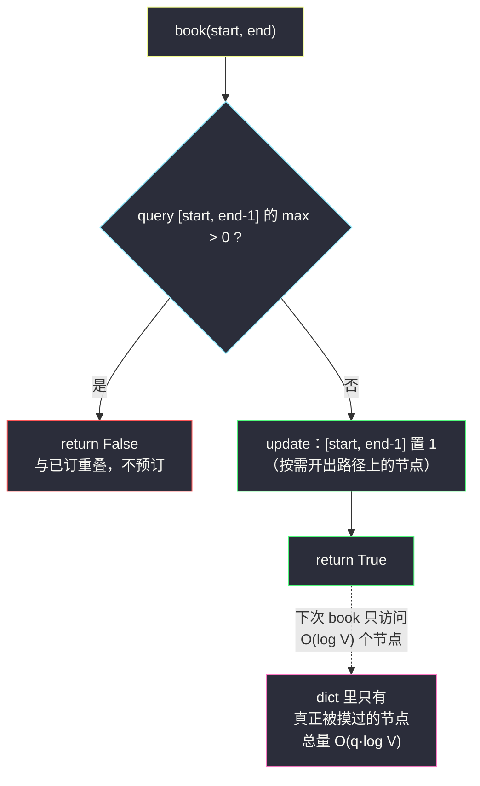
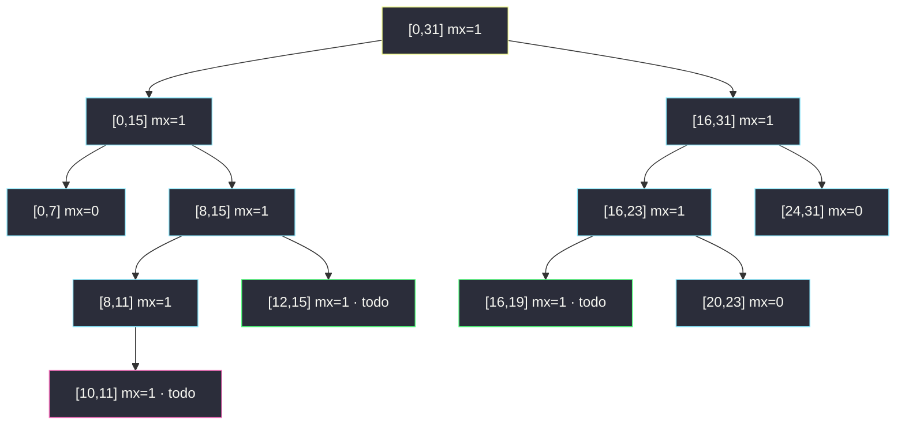

# 我的日程安排表 I（动态开点线段树 · 值域 1e9 区间 max）

## 一、问题描述

请你实现一个 `MyCalendar` 类来**预订日程**，每个日程用半开区间 `[start, end)` 表示：

- `MyCalendar()`：初始化日历，初始无任何预订；
- `boolean book(int start, int end)`：如果日程 `[start, end)` 与**任何已预订日程不重叠**，则将其加入日历并返回 `true`；否则**不预订**并返回 `false`。

区间重叠的定义：两区间 `[s1, e1)` 与 `[s2, e2)` 有公共整数点即重叠——端点相接不算（`e1 == s2` 时恰好错开）。

> 🔗 LeetCode 729：https://leetcode.cn/problems/my-calendar-i/
>
> 数据范围：`0 <= start < end <= 10^9`，每个测试用例最多调用 `book` 1000 次。

**示例**

```
输入：
["MyCalendar", "book", "book", "book"]
[[], [10, 20], [15, 25], [20, 30]]
输出：
[null, true, false, true]

解释：
- book(10, 20)：与空日历不重叠 → 预订成功，true
- book(15, 25)：与 [10, 20) 在 15..19 重叠 → false
- book(20, 30)：[10, 20) 不含 20（半开），恰好不重叠 → true
```

**直观理解**：一根值域 0 到 10^9 的时间轴，每次 `book` 就是问「**这段上有没有一个点已被占用**」——是则拒绝，否则把整段染色。这是一个纯**区间存在性**问题，天然是线段树「区间 max」的形状；而值域大到 10^9，逼出了本篇的主角：**动态开点**。

---

## 二、暴力解法

把所有已预订区间存进列表，每次 `book` 线性比对：

```python
class MyCalendar:
    def __init__(self):
        self.events = []

    def book(self, start: int, end: int) -> bool:
        for s, e in self.events:
            if s < end and start < e:       # 半开区间重叠判定
                return False
        self.events.append((start, end))
        return True
```

- **时间**：第 k 次 `book` 扫 k 个区间，总量 `O(q²)`；`q <= 1000` 时约 `5 * 10^5` 次比较，本题能过；
- **空间** `O(q)`。

判定式 `s < end and start < e` 是半开区间重叠的标准写法（等价于 `max(s, start) < min(e, end)`）。瓶颈在于每次都从零开始翻全部历史——区间**无序**，任何剪枝都无从谈起。

---

## 三、优化探索（核心章节）

> 📚 本题在灵茶题单中属于 **§8.5 动态开点线段树**。前两篇（§8.3 单点改、§8.4 区间赋值 Lazy）的数组线段树都开在**小值域**上；本题值域 `10^9`，数组版要 `4 * 10^9` 个位置根本开不出来——灵神的答案是**按需建点**：节点不再预分配，走到哪建到哪，总节点数只与**操作次数**挂钩。

### 3.1 把重叠翻译成「区间 max」

时间轴看成一个 0/1 数组：预订 `[start, end)` = 把闭区间 `[start, end-1]` 置 1（**半开转闭：右端点减一**，`end` 本身留给下一个区间用）。于是：

```
book(start, end)：
    if query([start, end-1] 的 max) > 0:  return False   # 已有点被占
    update([start, end-1], 置 1)
    return True
```

「是否存在重叠」⇔「区间 max > 0」——查存在性就维护 max，这与同批 [#3479 水果成篮 III](fruits-into-baskets-iii.md) 的区间 max 是同一件武器，只是方向反过来：那边用 max 做**定位**，这边用 max 做**存在性判定**。

### 3.2 对比路线：有序集合按端点排序

把已订区间按 `start` 排序，新来 `[s, e)` 只可能与「**start 小于 e 的最后一个**」重叠：

```python
from sortedcontainers import SortedList

class MyCalendar:
    def __init__(self):
        self.events = SortedList()              # (start, end) 按 start 升序

    def book(self, start: int, end: int) -> bool:
        i = self.events.bisect_left((end,))     # 第一个 start >= end 的位置
        if i > 0 and self.events[i - 1][1] > start:
            return False                        # 前驱区间的 end 伸进了新区间
        self.events.add((start, end))
        return True
```

正确性：`i-1` 位置的区间是所有 `start < end` 中 `start` 最大者，是唯一可能「右端伸进新区间」的候选；`i` 及之后的区间 `start >= end` 必不重叠。判定 `O(log n)`、插入 `O(n)`（搬移），总量 `O(q²)` 的搬移步在 `q = 1000` 下毫无压力。这条路简洁优雅，是很多选手的实战首选。

### 3.3 主角：动态开点线段树

有序集合路线的短板：只能回答「与已存区间**整体**是否重叠」，一旦要问「值域 `[L, R]` 内被占了多少天」（#732 那类统计）、或支持区间**计数**修改，就不够用了。线段树路线通吃，唯一的障碍是值域：

| | 数组版（§8.3/§8.4） | 动态开点版（本篇） |
|---|---|---|
| 值域 | `n <= 10^5` 级 | `10^9` 级 |
| 存储 | 预开 `4n` 数组 | `dict`，走到哪建到哪 |
| 节点数 | `O(n)` | `O(q log V)` |

关键观察：`book` 只有 ≤ 1000 次，每次 `query + update` 只沿**一条根到叶的路径**走 `log2(10^9) ≈ 30` 层、每层至多触碰常数个节点——**没被碰过的节点永远不需要存在**。用 `dict` 存 `mx[o]`（区间 max）与 `todo[o]`（懒标记），未出现在 dict 里的节点 `o` 自动视为「全 0、无标记」，语义完全自洽。



### 3.4 todo 懒标记：「整段已订」与「段内有订」的区别

`update` 把 `[start, end-1]` 染 1 时，若递归到叶子再染，单次就是 `O(区间长)`——在 1e9 值域下等于死。灵神 Lazy 姿势：**完整覆盖住一个节点就停**，`mx[o] = 1` 并记 `todo[o] = True`（含义：**整段** `[l, r]` 都是 1，孩子信息未落实）。之后谁要下钻进这个节点（`update` 分裂 / `query` 深入），先把标记推给孩子。

一个精妙的差别要拎清：

- `mx[o] = 1` 只说「**段内存在** 1」——它不能当查询剪枝，1 可能落在与查询相交的部分之外；
- `todo[o] = True` 说「**整段都是** 1」——只要查询区间与 `[l, r]` 相交，max 必为 1，**立即返回，连孩子都不用看**。

把 `mx` 当 `todo` 用是最常见的隐性 bug：查询会漏判不重叠的区间、误拒合法预订。

### 3.5 一句话核心

> **半开转闭 `[start, end-1]`；先查区间 max，非 0 即拒绝；置 1 靠 todo 懒标记，节点用 dict 按需创建——值域 1e9 也只花 `O(q log V)` 的内存。**

---

## 四、代码实现

### Python（主解：dict 动态开点线段树）

```python
class MyCalendar:
    def __init__(self):
        self.mx = {}           # mx[o]：节点 o 区间内的 max（0/1），未建点视为 0
        self.todo = {}         # todo[o]：节点 o 整段已置 1 的懒标记
        self.N = 10 ** 9 - 1   # 值域 [0, N]

    def query(self, o: int, l: int, r: int, ql: int, qr: int) -> int:
        if qr < l or r < ql:
            return 0                        # 不相交：贡献 0（隐式空节点）
        if self.todo.get(o):
            return 1                        # 整段全 1：相交即命中，免下钻
        if ql <= l and r <= qr:
            return self.mx.get(o, 0)        # 完整覆盖：直接读聚合值
        m = (l + r) // 2
        return max(self.query(o * 2, l, m, ql, qr),
                   self.query(o * 2 + 1, m + 1, r, ql, qr))

    def update(self, o: int, l: int, r: int, ql: int, qr: int) -> None:
        if ql <= l and r <= qr:
            self.mx[o] = 1                  # 覆盖即停：整段染 1
            self.todo[o] = True
            return
        if self.todo.get(o):                # 下钻前先落实懒标记
            for c in (o * 2, o * 2 + 1):
                self.mx[c] = 1
                self.todo[c] = True
            self.todo[o] = False
        m = (l + r) // 2
        if ql <= m:
            self.update(o * 2, l, m, ql, qr)
        if qr > m:
            self.update(o * 2 + 1, m + 1, r, ql, qr)
        self.mx[o] = max(self.mx.get(o * 2, 0), self.mx.get(o * 2 + 1, 0))

    def book(self, start: int, end: int) -> bool:
        if self.query(1, 0, self.N, start, end - 1):   # 半开 [start, end)
            return False
        self.update(1, 0, self.N, start, end - 1)
        return True
```

**变量含义**

| 变量 | 含义 |
|------|------|
| `mx[o]` | 节点 `o`（管 `[l, r]`）区间内是否已有预订；dict 里没有 = 0 |
| `todo[o]` | 「整段 `[l, r]` 已订」的懒标记，孩子信息待落实 |
| `N = 10^9 - 1` | 值域右端（`end <= 10^9`，闭区间右端至多 `10^9 - 1`） |
| `start, end - 1` | 半开 `[start, end)` 的闭区间等价形式 |

若语言没有现成 dict 可用（如 C 风格数组），就把节点开成结构体数组、大小按 `4·q·log V` 预算（1000 × 4 × 30 ≈ 1.2 * 10^5），用一个 `cnt` 指针顺序分配——思想完全相同：**先记账后建点**。

---

## 五、具体例子演示

为让树能画进图里，把值域缩成 `[0, 31]`（5 层满树；真实值域 1e9 只是层数变 30，机制一模一样）。逐次 `book`：

**book(10, 20) → 染 [10,19]**：`update` 沿路径下钻，被完整覆盖而停下的节点（打上 todo）：`[10,11]`、`[12,15]`、`[16,19]`；回传沿途 `[8,11]、[8,15]、[0,15]、[16,23]、[16,31]、[0,31]` 的 mx 全变 1。树状如下：



只有被路径摸过的节点真正存在——`[0,7]`、`[20,23]` 等是因为路径经过才有 mx=0 的记录，其余节点（如 `[28,31]`）**从未被创建**，dict 查不到即视为全 0。返回 `true` ✓。

**book(15, 25) → 查 [15,24]** 的逐步路径：

| 走到的节点 | 与 [15,24] 关系 | 判定 | 动作 |
|-----------|-----------------|------|------|
| `[0,31]` | 相交 | todo 无，未覆盖 | 下钻 |
| `[0,15]` | 相交（含 15） | todo 无，未覆盖 | 下钻 |
| `[0,7]` | `7 < 15` 不相交 | — | 返回 0 |
| `[8,15]` | 相交 | todo 无（mx=1 只是「段内有订」），未覆盖 | 下钻 |
| `[8,11]` | `11 < 15` 不相交 | — | 返回 0 |
| `[12,15]` | 相交 | **todo=True** | **直接返回 1，免下钻** |

max = 1 → 返回 `false`，树**一个字节都没改**。注意 `[8,11]` 明明 mx=1 却返回 0——它的 1 落在 10、11，不在查询范围里，这就是「`mx` 不能当 `todo` 用」的活例子。

**book(20, 30) → 查 [20,29]**：`[0,15]` 整段 `15 < 20` 不相交返回 0；`[16,31]` → `[16,23]` → `[16,19]`（`19 < 20` 不相交，0）；`[20,23]` 被 `[20,29]` **完整覆盖**，读 `mx=0`；`[24,31]` → `[24,27]` 覆盖读 0、`[28,31]` → `[28,29]` 覆盖读 0、`[30,31]` 不相交 0。全程 max = 0——[10,20) 的右端点 20 属于闭区间 `[20,29]` 但**不属于** `[10,19]`，半开语义在线段树上严丝合缝。`update` 把 `[20,29]` 置 1（新打 todo 的节点：`[20,23]`、`[24,27]`、`[28,29]`），返回 `true` ✓。

三次调用与官方输出 `[true, false, true]` 完全一致。

---

## 六、复杂度分析

| 方案 | 单次 book | 总时间 | 空间 |
|------|-----------|--------|------|
| 暴力列表（二章） | `O(k)` | `O(q²)` | `O(q)` |
| 有序集合（3.2） | 判定 `O(log q)` + 插入 `O(q)` | `O(q²)` 搬移 | `O(q)` |
| 动态开点线段树（本篇） | `O(log V)` | `O(q log V)` | `O(q log V)` 个节点 |

`V = 10^9`，`log2 V ≈ 30`：`q = 1000` 次约 `6 * 10^4` 次节点访问、dict 里最多几千个键。**空间与值域彻底解耦**——这才是动态开点的全部意义：数组版的 `O(V)` 内存换成 `O(q log V)`，值域想开多大开多大。

---

## 七、对比总结

| 方案 | 判重叠 | 改查询形态的扩展性 |
|------|--------|---------------------|
| 暴力列表 | 逐条比对 | 无 |
| 有序集合 | 前驱区间一次比较 | 只答「是否重叠」 |
| 动态开点线段树 | 区间 max | 换 max → 计数 / 取 max / min 即成新题 |

**与灵茶题单数据结构⑤线段树三连的对照**：

| 篇 | 小节 | 递进关系 |
|----|------|----------|
| [#3479 水果成篮 III](fruits-into-baskets-iii.md) | §8.3 | 区间 max + 树上二分（数组版、小值域） |
| [#2502 设计内存分配器](design-memory-allocator.md) | §8.4 | 区间赋值 Lazy + 三字段连续段 |
| 本篇 #729 | §8.5 | 值域 1e9 → dict 按需开点 |

**易错点**

1. **半开转闭**：`end` 必须减一，否则 `[10,20)` 与 `[20,30)` 会被误判重叠（示例第三步就靠它返回 true）；
2. **`mx` 与 `todo` 的语义差**：查询剪枝只能用 `todo`（整段语义），用 `mx` 会把「段内有订」误当「整段已订」；
3. `update` 下钻前必须先 pushdown（落实 todo 给两个孩子），否则旧标记丢失；
4. 值域右端是 `10^9 - 1` 不是 `10^9`（闭区间右端最大值）；
5. Python 递归深度：每层一分为二、30 层递归远低于默认上限，无需干预；但要确认 `query/update` 不相交/覆盖分支先返回，避免无谓下钻。

---

## 八、举一反三

| 题目 | 关系 |
|------|------|
| [731. 我的日程安排表 II](https://leetcode.cn/problems/my-calendar-ii/) | 允许两重预订：max 换成「区间 +1 后计数」，同一棵树的直接加强 |
| [732. 我的日程安排表 III](https://leetcode.cn/problems/my-calendar-iii/) | k 重预订统计：区间加 lazy + 区间查 max，动态开点标准进阶 |
| [715. Range 模块](https://leetcode.cn/problems/range-module/) | 区间置 0/1 + 查询整段状态，与 #2502 同款赋值 Lazy + 动态开点 |
| [699. 掉落的方块](https://leetcode.cn/problems/falling-squares/) | 区间「取 max」更新 + 查询，动态开点的又一经典载体 |
| [2031. 1 比 0 多的子数组个数](https://leetcode.cn/problems/count-subarrays-with-more-ones-than-zeros/) | 值域含负数的线段树/树状数组，体会「值域偏移」与「动态开点」两种应对 |
| [#3479 水果成篮 III](fruits-into-baskets-iii.md) | 同批姊妹篇（§8.3）：同是区间 max，那边用于树上定位 |
| [#2502 设计内存分配器](design-memory-allocator.md) | 同批姊妹篇（§8.4）：赋值 Lazy 的数组版，本篇是其动态开点形态 |

**思想迁移**：值域大而**操作少**时，问自己一句「我真的需要那 `4 * 10^9` 个格子吗」——绝大多数格子这辈子不会被任何查询碰到。按需开点把内存从「值域的函数」变成「操作的函数」，与哈希表用「冲突换空间」是同一种哲学：**为可能发生的事付钱，而不是为理论上存在的事付钱**。后续遇到值域 1e18 的线段树（如 #699 变体、一些扫描线题），这套 dict 开点模板原样可用。口诀：**「半开先减一，查零再染一；dict 走到哪，点就建到哪。」**
