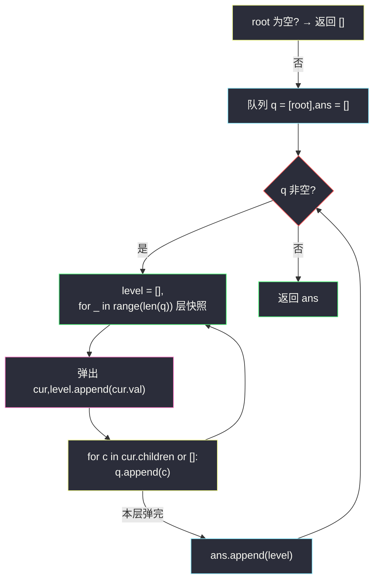
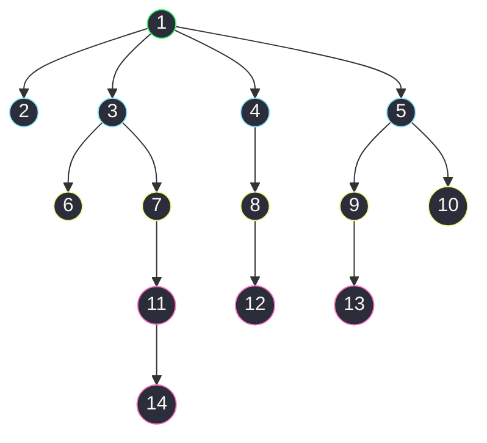

# 429. N 叉树的层序遍历(N-ary Tree Level Order Traversal)

> 🔗 LeetCode 429:https://leetcode.cn/problems/n-ary-tree-level-order-traversal/
>
> 📚 灵茶题单小节:§「BFS 按层遍历:从二叉树到 N 叉树」练习

## 一、问题描述

给定一棵 N 叉树,返回其节点值的**层序遍历**(即从左到右,逐层遍历)。

N 叉树在输入序列化中表示为层序遍历,每组的子节点都由 `null` 值分隔(参见示例)。

**节点定义**

```text
class Node:
    def __init__(self, val=None, children=None):
        self.val = val                 # 节点值
        self.children = children       # 子节点列表(长度可为 0 到 N)
```

**示例 1**

```text
输入:root = [1,null,3,2,4,null,5,6]
输出:[[1],[3,2,4],[5,6]]
解释:根 1 在第 0 层;它的三个孩子 3、2、4 在第 1 层;3 的两个孩子 5、6 在第 2 层。
```

**示例 2**

```text
输入:root = [1,null,2,3,4,5,null,null,6,7,null,8,null,9,10,null,null,11,null,12,null,13,null,null,14]
输出:[[1],[2,3,4,5],[6,7,8,9,10],[11,12,13],[14]]
```

> 数据范围:树的高度不会超过 `1000`;树的节点总数在 `[0, 10^4]` 之间。

**直观理解**

二叉树层序遍历用队列,每轮取空"上一层的快照"——这个套路在 N 叉树上唯一的变化是:**扩展孩子时不再固定左、右两个指针,而是迭代整个 `children` 列表**。序列化格式也跟着变:兄弟之间用 `null` 分隔,解析时"读到 null 才切换到下一个父节点",这也是很多人看不懂示例 2 输入数组的根源——后文例子演示里会逐步拆解。

## 二、暴力解法

不用队列,直接递归 DFS:把**深度 depth** 当作参数一路向下传,每个节点按自己的深度写进对应层的桶里。

```python
class Solution:
    def levelOrder(self, root: 'Node') -> List[List[int]]:
        res = []                               # res[d] 存第 d 层的值

        def dfs(node: 'Node', depth: int) -> None:
            if node is None:
                return
            if depth == len(res):              # 第一次到达这么深:开新桶
                res.append([])
            res[depth].append(node.val)        # 归层
            for child in node.children or []:  # 依次递归每个孩子
                dfs(child, depth + 1)

        dfs(root, 0)
        return res
```

### 复杂度

- 时间:`O(n)`——每个节点访问一次;`depth == len(res)` 的判断让开桶均摊 `O(1)`,无需预处理树高。
- 空间:`O(h)` 递归栈(最坏链形 `h = 1000`),加上输出 `O(n)`。

这个版本能直接通过本题,但它是"按深度归类"的**结果视角**,不是"逐层推进"的**过程视角**:层的先后顺序靠下标隐式表达,理解多源扩散类问题(如感染、腐烂橘子)时,队列 BFS 才是可迁移的模型。

## 三、优化探索

### 观察 1:队列天然维护"层"的边界

把根入队;此后每轮循环处理"当前队列里已有的全部节点"(即一整层),逐个出队、记录值、把孩子入队。关键一句是 `for _ in range(len(q))`——**进入循环前对队列长度拍照**,循环中孩子入队不影响本轮计数,层与层自然切开。

### 观察 2:孩子扩展从"左右两指针"变成"列表迭代"

二叉树写 `q.append(node.left)`、`q.append(node.right)` 两条;N 叉树是 `for c in node.children: q.append(c)` 一条循环。注意到 `children` 可能为 `None`(叶子节点构造时未传参),迭代前要 `or []` 兜底——这是本题最常见的运行时错误。另一个差异在序列化:二叉树的层序数组用 null 占位表达空指针,而 N 叉树的孩子数不定,null 改用作文孩子段的终结符,后文第五章会专门拆解怎么读这种输入。

### 观察 3:为什么逐层快照不能换成"单点弹出"

若去掉 `for _ in range(len(q))`,每轮只弹一个节点,就没有"层"的概念了——那就退化成普通 BFS 的访问序列,需要额外手段才能分层。补救办法有二:一是在队列里存 `(节点, 深度)` 元组,按元组里的深度归层;二是维护 `cur_level`/`next_level` 两个列表,处理完 `cur_level` 后整体交换。快照法把"标记深度"这一步省掉了——它相当于让队列长度自己充当层边界,是三种写法里最省的。

```python
# 双列表变体:与 len 快照等价,换一种"层"的物理载体
cur = [root]
while cur:
    ans.append([node.val for node in cur])
    nxt = []
    for node in cur:
        nxt.extend(node.children or [])
    cur = nxt
```

双列表版每次整体丢弃旧层,语义上"层"是显式对象;快照版层是队列的隐式前缀,边界靠 `len(q)` 切出。两者输出完全一致,选哪个看口味——但面试中能说清"为什么不混层",比背写法更重要。



### 序列化格式是怎么读出来的

N 叉树的官方序列化约定是:**根值后面跟一个 null 作为孩子列表的起始标记,此后每个节点的孩子段(可能为空)都以一个 null 结尾**。解析规则:把根入队,逐个弹出队首节点,从数组当前位置连续读取非 null 值作为它的孩子并入队,读到 null 即结束该节点的孩子段——没有孩子的节点同样消费一个 null 占位。

以示例 1 `[1,null,3,2,4,null,5,6]` 为例:位置 1 的 null 是起始标记;弹 1,读到 3、2、4 入队,遇 null 结束;弹 3,读到 5、6 入队,数组耗尽;弹 2、4,孩子均为空。得到 1 的孩子 [3,2,4]、3 的孩子 [5,6],三层结构 `[[1],[3,2,4],[5,6]]`。

## 四、代码实现

```python
class Solution:
    def levelOrder(self, root: 'Node') -> List[List[int]]:
        if root is None:                       # 空树:题目允许节点总数为 0
            return []
        ans = []
        q = deque([root])                      # 初始队列只放根
        while q:
            level = []                         # 收集当前层的值
            for _ in range(len(q)):            # 关键:对当前队列长度拍照
                cur = q.popleft()              # 弹出本层节点
                level.append(cur.val)
                for c in cur.children or []:   # N 叉:迭代孩子列表
                    q.append(c)                # 孩子属于下一层
            ans.append(level)
        return ans
```

**细节说明**

- **`len(q)` 快照分层**:进入 `for` 时队列里恰好是"当前层的全部节点",循环中入队的孩子只影响 `len(q)` 的后续读取——层边界由此保证。
- **`cur.children or []` 兜底**:叶子节点常以 `Node(val)` 构造,`children` 为 `None`;直接 `for c in cur.children` 会抛 `TypeError`,这是本题提交错误率最高的一处。
- **空树特判**:数据范围写明节点总数可为 `0`,`deque([root])` 若不判空会把 `None` 当节点弹出。
- **层内顺序**:孩子按 `children` 列表顺序入队,出队顺序即"从左到右"。
- **返回类型**:每层是值的列表,不是节点;与序列化输入不同,输出不含 `null` 分隔符。
- **为什么用 `popleft` 而非 `pop`**:`deque` 从右弹出会得到"每层从右往左"的输出,与定义相悶;队列的 FIFO 性质本身就是层序的载体。
- **不用判重**:树无环,孩子只会被自己的父亲入队一次,无需 visited 集合——这点与图 BFS 不同,后文举一反三的感染题要补判重。

## 五、例子演示

用**示例 2** 端到端走一遍。先按第三章的规则还原树结构:根 1 的孩子是 2、3、4、5;2 无孩子(消费一个空段),3 的孩子是 6、7,4 的孩子是 8,5 的孩子是 9、10;6 无孩子,7 的孩子是 11,8 的孩子是 12,9 的孩子是 13,10 无孩子;11 的孩子是 14。



树结构与逐层执行过程(对照官方输出 `[[1],[2,3,4,5],[6,7,8,9,10],[11,12,13],[14]]`):

| 轮次 | 进入时队列(快照长度) | 弹出并记录 | 孩子入队 | ans 追加 |
|---|---|---|---|---|
| 1 | `[1]`(1) | 1 | 1 的 2,3,4,5 | `[1]` |
| 2 | `[2,3,4,5]`(4) | 2,3,4,5 | 3 的 6,7;4 的 8;5 的 9,10 | `[2,3,4,5]` |
| 3 | `[6,7,8,9,10]`(5) | 6,7,8,9,10 | 7 的 11;8 的 12;9 的 13 | `[6,7,8,9,10]` |
| 4 | `[11,12,13]`(3) | 11,12,13 | 11 的 14 | `[11,12,13]` |
| 5 | `[14]`(1) | 14 | 无(叶子) | `[14]` |

最终 `ans = [[1],[2,3,4,5],[6,7,8,9,10],[11,12,13],[14]]`,与官方输出一致。值得琢磨的是最后两层:11、12、13 同为深度 3,却分属 3 的三支(7、8、9 之下);而 14 挂在 11 下面,是 12、13 的"下一辈"。同一棵树里"同层兄弟"与"隔层侄子"并存——层序输出只认深度,不认辈分,这正是层序与先序/后序的本质差异。

对照**示例 1** `root = [1,null,3,2,4,null,5,6]`:第 1 轮弹 1,入 3、2、4;第 2 轮依次弹 3(入 5、6)、2(无孩子)、4(无孩子);第 3 轮弹 5、6。得 `[[1],[3,2,4],[5,6]]`。注意第 2 轮的入队顺序是"3 的孩子先入,再轮到 2、4"——同一层内谁先弹就先扩展谁的孩子,但孩子们都老老实实排在队列尾等待下一轮,这就是"层边界不被孩子入队冲破"的直观体现:队列里永远是"当前层打头、下一层压尾"的两段式结构,`len(q)` 拍照的恰是打头那段。

### 常见错误清单

- **`for c in cur.children` 忘了 `or []`**:`children=None` 的叶子节点直接崩溃,报 `TypeError: 'NoneType' is not iterable`。
- **漏空树特判**:返回 `[[None]]` 之类的脏数据。
- **快照写在循环内**:把 `for _ in range(len(q))` 写成 `while q` 并在内部 `len(q)` 动态判断,层边界消失,输出挤成一团或交错。
- **把 `null` 当节点值处理**:自己解析输入数组时把 `null` 存成 0 或 None 混进结果——`null` 只是孩子段的终结符,无孩子节点也占一个。

序列化自测小表(手工解析一遍,序列化不再神秘):

| 输入 | 树结构 | 层序输出 |
|---|---|---|
| `[1,null,3,null,2,null,4]` | 1→[3],3→[2],2→[4] | `[[1],[3],[2],[4]]` |
| `[1,null,null]` | 仅根(根孩子段为空) | `[[1]]` |
| `[1,null,2,3,null,4,5,null,6,null,null,7]` | 1→[2,3];2→[4,5];3→[6];4→[];5→[7] | `[[1],[2,3],[4,5,6],[7]]` |

第三行值得再走一遍:1 的孩子段 2,3(null 结束);2 的孩子段 4,5(null 结束);3 的孩子段 6(null 结束);4 的孩子段空(吃掉倒数第二个 null);5 的孩子段 7(数组耗尽)。所以 7 挂在 5 下、深度 3——两个连续的 null 意味着"4 的空孩子段也要占位",这是最容易读错的地方。

## 六、复杂度分析

- 时间:`O(n)`。每个节点恰好入队、出队一次;所有 `children` 列表长度之和恰为 `n - 1`(除根外每个节点恰是一个孩子),孩子扩展总代价线性。
- 空间:`O(n)`。队列峰值是最宽一层(`O(w)`),输出 `O(n)`;不计输出时辅助空间为 `O(w)`,最坏星形一层 `n - 1` 个节点。

与二叉树模板的逐行对照(体会"推广"而非"重学"):

```python
# 二叉树层序(左、右固定指针)      # N 叉层序(孩子列表)
q = deque([root])                 q = deque([root])
while q:                          while q:
    level = []                        level = []
    for _ in range(len(q)):           for _ in range(len(q)):
        cur = q.popleft()                 cur = q.popleft()
        level.append(cur.val)             level.append(cur.val)
        q.append(cur.left)                for c in cur.children or []:
        q.append(cur.right)                   q.append(c)
    ans.append(level)                 ans.append(level)
```

只有孩子扩展那几行不同:二叉树固定两行 append,N 叉树一个 for 循环。分层骨架(`len(q)` 快照)一字不改——这就是"模板"的含义:骨架可复用,扩展点局部化。

### 正确性问答

**问:DFS 版与 BFS 版输出为何完全一致?** 层序定义只依赖"深度"这一属性:DFS 按深度归桶,BFS 按层生成,同一深度桶内的顺序都是"孩子列表顺序的先来后到",两版逐层同序。

**问:若要求自底向上输出(如 #107 层序遍历 II)怎么办?** 最后把 `ans` 反转即可,分层逻辑不变——这正说明"怎么分层"才是模板的核心资产。

**问:N 叉树可以有 N 多大?** 本题不设上限,`children` 是变长列表;扩展代码与 N 无关,这是列表结构优于"固定左、右指针"的原因。

**问:递归深度会不会栈溢出?** 树高上限 `1000`,Python 默认递归栈(约 1000 层)刚好卡在临界——DFS 版在极端链形树上可能触发 `RecursionError`,安全起见可 `sys.setrecursionlimit(10**4)` 或改用 BFS;这也是主解选队列版的现实理由之一。

## 七、对比总结

| 解法 | 时间 | 空间 | 思路 | 备注 |
|---|---|---|---|---|
| 递归 DFS 按深度归桶(暴力) | `O(n)` | `O(h)` 栈 | 深度参数向下传,`res[depth]` 收集 | 结果视角;代码短,理解分层 |
| 队列 BFS 层快照(本文) | `O(n)` | `O(w)` 队列 | `len(q)` 拍照切层,孩子列表迭代 | 过程视角;迁移到扩散类问题的通用模板 |
| 双列表法 | `O(n)` | `O(w)` | `cur`/`next` 两列表轮换 | 层为显式对象,无队列依赖 |
| `(节点, 深度)` 元组入队 | `O(n)` | `O(n)` | 深度随元素入队,按键归层 | 冗余但直观,适合面试讲解分层原理 |

### 常见问答

**问:输出为什么不含 null?** 序列化输入里的 null 是"孩子段终结符",属于树结构的存储约定;输出是纯值的二维列表,树的结构信息由"分了几层、每层几个"表达,不再需要终结符。

**问:同一层的节点值可能重复吗?** 题目未限制,可能出现重复值;层序只关心节点位置与深度,对值无任何假设——这点与 BST 系列题(值序敏感)形成对比。

**问:能否把本题改成"自顶向下 N 层就截止"?** 在快照循环外加一个层数计数器、到 N 层提前 break 即可;队列里残留的节点直接丢弃,不影响已收集部分。

**问:若要求每层从右往左输出怎么办?** 把孩子迭代改成 `for c in reversed(cur.children or [])` 即可——层内的左右序完全由入队顺序决定,与分层机制正交,这也再次印证"分层骨架"与"层内顺序"是两个独立决策。

一句话:**要"结果"用 DFS 归桶也行,要"模型"必练 BFS 快照**——感染、腐烂、多源扩散全都长着后者的骨架。

## 八、举一反三

- [559. N 叉树的最大深度](https://leetcode.cn/problems/maximum-depth-of-n-ary-tree/):把"每层的值"换成"层数计数",同一骨架去掉收集数组即可。
- [590. N 叉树的后序遍历](https://leetcode.cn/problems/n-ary-tree-postorder-traversal/):N 叉树的深度优先对照题,体会"孩子列表迭代"在 DFS 中的对应写法。
- [102. 二叉树的层序遍历](https://leetcode.cn/problems/binary-tree-level-order-traversal/):本模板的二叉树原点,两篇对照看"左右指针 → 孩子列表"的推广路径。
- [994. 腐烂的橘子](https://leetcode.cn/problems/rotting-oranges/):多源 BFS 逐层扩散,"层 = 一分钟",快照分层的价值在这类题里兑现。
- [637. 二叉树的层平均值](https://leetcode.cn/problems/average-of-levels-in-binary-tree/):把"收集整层"换成"层求和取均值",考察同模板下的聚合改写,适合作为 429 后的 5 分钟练习。
- 本站延伸阅读:[删点成林](./delete-nodes-and-return-forest.md)——其第五章的 BFS 层序变体(父标记随层传递)与本文同属"队列层快照"家族,可对照体会"快照分层 + 随层携带信息"的组合拳。
