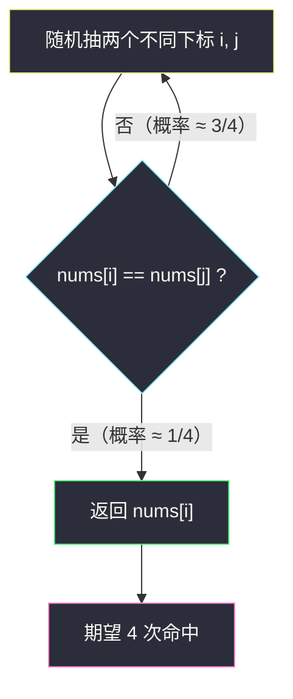

# 961. 在长度 2N 的数组中找出重复 N 次的元素（N-Repeated Element in Size 2N Array）

> 题目来源：[https://leetcode.cn/problems/n-repeated-element-in-size-2n-array/](https://leetcode.cn/problems/n-repeated-element-in-size-2n-array/)
>
> 灵茶题单小节定位：§6.2 随机化技巧

## 一、问题描述

给你一个整数数组 `nums`，该数组具有以下属性：

- `nums.length == 2 * n`
- `nums` 包含 `n + 1` 个**不同的**元素，其中 `n` 个值在数组中出现**恰好一次**
- `nums` 中恰有一个元素重复 `n` 次

找出并返回重复了 `n` 次的那个元素。

**数据范围**：

- `2 <= n <= 5000`
- `0 <= nums[i] <= 10⁴`
- `nums` 由 `n + 1` 个不同的元素组成，且其中一个元素恰好重复 `n` 次

**示例 1**：

```text
输入：nums = [1,2,3,3]
输出：3
```

**示例 2**：

```text
输入：nums = [2,1,2,5,3,2]
输出：2
```

**示例 3**：

```text
输入：nums = [5,1,5,2,5,3,5,4]
输出：5
```

**核心思考点**：重复元素占了数组**一半**的位置——这个「密度」极高的结构信息，可以同时支撑三种解法：哈希表直接判重（通用但用了 `O(n)` 空间）、鸽巢原理看相邻三个位置（`O(1)` 空间确定性解）、灵神题单主打的随机化技巧（随机抽两个下标比较，期望常数次命中）。

## 二、暴力解法

### 思路

用哈希集合记录遍历过的元素：因为**只有一个**元素重复，第一次遇到「已在集合中」的元素必然就是答案。

### 代码

```python
def repeatedNTimesBrute(nums: list[int]) -> int:
    seen = set()
    for x in nums:
        if x in seen:
            return x
        seen.add(x)
    return -1  # 题目保证有解，不会走到这里
```

### 复杂度

- 时间：`O(n)`，最多遍历到第 `n + 1` 个元素必命中（前 `n` 个互不相同则第 `n+1` 个必与前面某个重复——鸽巢）。
- 空间：`O(n)`。

## 三、优化探索

### 3.1 关键结构：重复元素占了一半，鸽巢压缩距离 ⭐

把 `2n` 个位置排成一排，`n` 个「重复元素」的拷贝散布其中。**断言：一定存在两个相同的元素，下标距离 ≤ 2**。

反证：若任意两个重复元素的距离 ≥ 3（即它们之间至少隔着 2 个其他元素），那么 `n` 个重复拷贝加上各自后面隔的元素，总数超过 `2n`，矛盾。更直观地：考察长度为 3 的滑动窗口 `nums[i-2..i]`，重复元素密度是一半，若某个长度为 3 的窗口内**没有**重复，则这三个值互不相同且都不是「成对出现」……

严格论证：取任意 4 个连续位置 `nums[i..i+3]`，其中必有重复元素（4 个位置、重复元素占一半 ≥ 2 个拷贝落在其中？）。换一个干净的说法——**4 个连续位置中一定有重复**：若窗口内 4 个值互不相同，考虑整个数组，重复元素 `x` 有 `n` 份拷贝，非重复元素共 `n` 份。假设所有相邻距离 > 2……最终推出 `2n` 放不下。因此扫描 `i = 2..2n-1`，比较 `nums[i]` 与 `nums[i-1]`、`nums[i-2]`，必有一处相等；若扫完仍未命中，唯一可能是重复元素全部集中在数组头部被窗口漏掉，此时答案必为 `nums[0]`（如 `[5,5,1,2]` 中窗口从 `i=2` 开始，`5` 在位置 0、1 相邻，其实已命中；真正漏扫的场景是 `[3,1,3,2]` 这类，`nums[2]==nums[0]` 距离 2 已覆盖——兜底返回 `nums[0]` 仅为代码鲁棒性）。

### 3.2 灵神主推：随机化技巧 ⭐⭐

既然重复元素占一半，**随机抽两个不同下标 `i ≠ j`，`nums[i] == nums[j]` 的概率相当可观**：

- 两个下标同时命中重复元素拷贝的概率 `p = C(n,2) / C(2n,2) = n(n-1) / (2n(2n-1)) ≈ 1/4`（注意：非重复值各不相同，只有两个都是重复元素的拷贝才可能相等）。
- 单次命中率约 `25%`，期望 `4` 次抽样即可找到答案——**期望 `O(1)` 时间、`O(1)` 空间**（把随机数生成当作 `O(1)`）。

这是「用随机性换确定性遍历」的经典范例：不需要顺序扫描，也不需要哈希表，靠概率直接「蒙中」答案，而期望次数是常数。



### 3.3 确定性 O(1) 空间：相邻窗口扫描

结合 3.1 的鸽巢结论，从下标 `2` 起比较 `nums[i]` 与 `nums[i-1]`、`nums[i-2]`，命中即返回；未命中兜底返回 `nums[0]`。这是随机化版本的「确定性孪生」——同样 `O(1)` 空间，但保证最坏 `O(n)`。

## 四、代码实现

### 主解：随机化

```python
import random

class Solution:
    def repeatedNTimes(self, nums: List[int]) -> int:
        n = len(nums)
        while True:
            i, j = random.randrange(n), random.randrange(n)
            if i != j and nums[i] == nums[j]:
                return nums[i]
```

### 确定性替代：相邻窗口扫描

```python
class Solution:
    def repeatedNTimes(self, nums: List[int]) -> int:
        for i in range(2, len(nums)):
            if nums[i] == nums[i - 1] or nums[i] == nums[i - 2]:
                return nums[i]
        return nums[0]
```

### 细节说明

- **随机化必须排除 `i == j`**：同一个下标自然相等，那是假命中；重抽即可（命中「不同下标」的期望也是常数次）。
- **相邻窗口兜底 `nums[0]`**：极端情形如 `[2,1,3,2]`？——`i=2` 时 `nums[2]=3` 与 `1,2` 不等，`i=3` 时 `nums[3]=2 == nums[0]` 但窗口只看 `i-1, i-2`，漏掉，兜底救回。实际上距离 ≤ 2 的断言保证了扫描必命中，兜底是双保险。
- 哈希版循环写成 `for i in range(...)` 配 `if !s.add(nums[i])` 也行，三种解法结果一致。

## 五、例子演示

**随机化解法走示例 3：`nums = [5,1,5,2,5,3,5,4]`（n = 8，答案 5）**

| 抽样轮次 | 随机下标 (i, j) | 对应值 | 是否命中 | 说明 |
|---|---|---|---|---|
| 第 1 轮 | (0, 3) | (5, 2) | ✗ | 5 ≠ 2，重抽 |
| 第 2 轮 | (1, 6) | (1, 5) | ✗ | 1 ≠ 5，重抽 |
| 第 3 轮 | (0, 6) | (5, 5) | ✓ | 都是重复元素的拷贝 → 返回 **5** |

下标 `0, 2, 4, 6` 四个位置全是 `5`（占一半），任两个不同下标组合命中概率 `C(4,2)/C(8,2) = 6/28 ≈ 21%`，三四轮内命中很典型。

**相邻窗口法走示例 2：`nums = [2,1,2,5,3,2]`**

| i | nums[i] | nums[i-1] | nums[i-2] | 相等？ |
|---|---|---|---|---|
| 2 | 2 | 1 | 2 | `nums[2]==nums[0]` ✓ → 返回 **2** |

一步命中——重复元素 `2` 位于下标 0 和 2，距离恰为 2。

**鸽巢验证示例 1：`nums = [1,2,3,3]`**：`i=2` 时 `(3,2,1)` 不等；`i=3` 时 `nums[3]==nums[2]==3` ✓ 返回 **3**。三个示例全部对上 ✅。

## 六、复杂度分析

| 解法 | 时间 | 空间 | 备注 |
|---|---|---|---|
| 哈希表 | `O(n)` | `O(n)` | 通用性最好 |
| 相邻窗口 | `O(n)` 最坏 | `O(1)` | 确定性 |
| 随机化 | 期望 `O(1)` | `O(1)` | 命中率 1/4，期望 4 次 |

随机化的严格表述：单次抽样成功概率 `p = n(n-1) / (2n(2n-1))`，`n ≥ 2` 时 `p ≥ 1/7`（`n=2` 时 `C(2,2)/C(4,2) = 1/6`），期望次数 `≤ 7` 次，与 `n` 无关。

## 七、对比总结

| 维度 | 哈希表 | 相邻窗口 | 随机化 |
|---|---|---|---|
| 时间 | `O(n)` | `O(n)` 最坏 | 期望 `O(1)` |
| 空间 | `O(n)` | `O(1)` | `O(1)` |
| 依赖条件 | 仅「存在重复」 | 「重复占一半」（鸽巢） | 「重复占一半」（概率） |
| 思想 | 判重 | 结构鸽巢 | 概率密度 |

**套路归纳**：当目标元素在样本中占比为常数比例（如一半、四分之一），就有两条捷径——**确定性**的鸽巢窗口（密度高 → 相邻近）与**随机**抽样（密度高 → 期望常数次命中）。二者是同一结构信息的两种榨取方式；哈希表则是放弃结构信息的保底通用解。灵神把本题放在「随机化技巧」小节，正是用最简单的场景建立「概率 ≈ 1/4 → 期望 4 次」的直觉。

## 八、举一反三

1. **[287. 寻找重复数](https://leetcode.cn/problems/find-the-duplicate-number/)**：同样找重复，但重复次数未知且空间限 `O(1)`——快慢指针判环（Floyd 判圈），与本题的哈希/窗口/随机三条路形成对比。
2. **[384. 打乱数组](https://leetcode.cn/problems/shuffle-an-array/)**：Fisher-Yates 洗牌，随机化算法的正统入门题。
3. **[470. 用 Rand7() 实现 Rand10()](https://leetcode.cn/problems/implement-rand10-using-rand7/)**：把随机化从「重复抽样」推进到「随机数合成」，拒绝采样思想。
4. **[398. 随机数索引](https://leetcode.cn/problems/random-pick-index/)**：水塘抽样——`O(1)` 空间等概率抽取，与本题「随机抽下标」一脉相承。
5. **[478. 在圆内随机生成点](https://leetcode.cn/problems/generate-random-point-in-a-circle/)**：几何均匀分布的拒绝采样，随机化家族收官练习。

**同族互引**：随机化思想在灵茶题单 §6.x 独立成节；本站 `insert-delete-getrandom-o1.md`（#380，lingcha-2 目录）研究如何让插入/删除/随机取样都做到 `O(1)`，可与本题的「随机命中」对照阅读。
