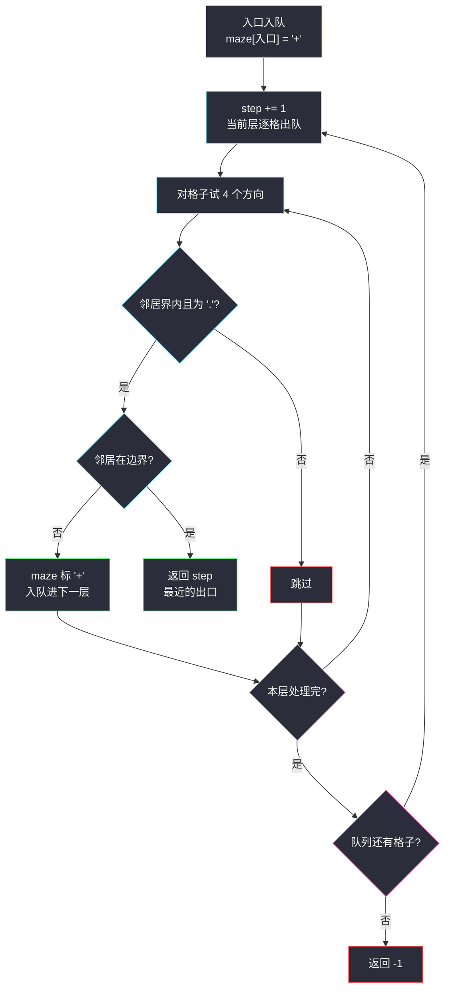
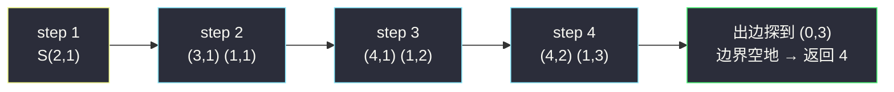

# 迷宫中离入口最近的出口(按层 BFS · 边界出口判定)

## 一、问题描述

给你一个 `m x n` 的迷宫矩阵 `maze`:`'.'` 表示**空地**可以走,`'+'` 表示**墙**不能走。同时给你入口 `entrance = [row, col]`,保证该格是 `'.'`。

一开始你站在入口。每一步可以向上、下、左、右移动一格(不能走墙,不能出界)。**出口**的定义是:**边界**上的空地 `'.'`,且**不是入口本身**。

返回从入口到**最近出口**的最短步数;如果不存在这样的出口,返回 `-1`。

> 🔗 LeetCode 1926:https://leetcode.cn/problems/nearest-exit-from-entrance-in-maze/
>
> 数据范围:`1 <= m, n <= 100`;`maze[i][j]` 是 `'.'` 或 `'+'`;入口总是 `'.'`。

**示例 1**

```text
maze = [["+","+",".","+"],
        [".",".",".","+"],
        ["+","+","+","."]]
entrance = [1,2]
输出:1
解释:入口 (1,2) 上方的 (0,2) 是边界空地,是出口,1 步到达。
```

**示例 2**

```text
maze = [["+","+","+"],
        [".",".","."],
        ["+","+","+"]]
entrance = [1,0]
输出:2
解释:(1,0) 自己在边界但它是入口不算;需走到 (1,2),共 2 步。
```

**示例 3**

```text
maze = [[".","+"]]
entrance = [0,0]
输出:-1
解释:唯一的空地就是入口,没有出口。
```

**直观理解**

边权全为 1、从**单一起点**找最近的「目标集合」(所有边界空地)——BFS 按层扩散,哪一层先碰到边界空地,层号就是答案。与 [#1091](https://leetcode.cn/problems/shortest-path-in-binary-matrix/) 同模板,考的是两个细节:**入口自身不算出口**、**入队即标记**。

---

## 二、暴力解法

DFS 回溯枚举从入口出发的所有简单路径,对每条路径统计第一次踩到出口的步数,取最小:

```python
class Solution:
    def nearestExit(self, maze: List[List[str]], entrance: List[int]) -> int:
        m, n = len(maze), len(maze[0])
        sx, sy = entrance

        def is_exit(x: int, y: int) -> bool:          # 边界空地且非入口
            return (x in (0, m - 1) or y in (0, n - 1)) and maze[x][y] == '.' and (x, y) != (sx, sy)

        best = m * n + 1

        def dfs(x: int, y: int, seen: set, step: int) -> None:
            nonlocal best
            if is_exit(x, y):
                best = min(best, step)
                return                                # 出口后再往里绕只会更长
            for nx, ny in ((x + 1, y), (x - 1, y), (x, y + 1), (x, y - 1)):
                if 0 <= nx < m and 0 <= ny < n and maze[nx][ny] == '.' and (nx, ny) not in seen:
                    seen.add((nx, ny))
                    dfs(nx, ny, seen, step + 1)
                    seen.remove((nx, ny))             # 回溯

        dfs(sx, sy, {(sx, sy)}, 0)
        return best if best <= m * n else -1
```

### 复杂度

- **时间**:`O(4^(mn))` 上界(每格 4 分支的简单路径枚举),指数级,`100 x 100` 直接爆炸。
- **空间**:`O(mn)` 递归栈与 `seen`。

### 🔴 瓶颈在哪里

「最近的出口」只要距离,不需要路径;DFS 却在枚举全部绕行方式。同格被不同路径反复踏入,而 BFS 每格只处理一次,且天然由近到远——**第一次碰到出口的那层就是最近**。

---

## 三、优化探索(核心章节)

> 📚 本题出自灵茶题单一期 **§二、网格图 BFS**(网格图 BFS 篇),与 #1091 同为单源 BFS 最短路模板,按层扩展计步;灵神模板的关键点全部适用:队列、入队判重、dist/层号单调。

### 3.1 观察特征

| 特征 | 说明 |
|------|------|
| 每步代价相同(1 步) | BFS 主场 |
| 目标是**一组格子**(边界空地) | 扩展出边时判断即可,不必枚举所有出口 |
| 入口在边界也不算出口 | 入口入队时立即标记,天然排除 |
| `maze` 是字符矩阵 | 直接复用 `'+'` 做墙+标记,免 visited |

### 3.2 关键一步:按层扩展 + 出边上判出口

维护队列与步数 `step`,**整层出队、整层入队**:

```text
入口入队,同时把 maze[入口] 改成 '+'      # 入队即标记,且杜绝入口被当出口
loop:
    step += 1                             # 新的一层 = 比 entrance 多走 step 步
    把当前层全部出队,对每格试 4 个方向:
        邻居界内且为 '.':
            若邻居在边界 → 它就是出口,返回 step   # 第一次到达 = 最近
            否则改 '+' 并入队                  # 入队即标记
队列空 → 返回 -1
```

两个细节值得咀嚼:

- **出口判在「出边」上**:当前层是距离 `step-1` 的格子,它们的邻居是距离 `step` 的格子;邻居一落边界立即收工,不多走一步。
- **入口提前封口**:入口入队时就标 `'+'`。此后任何 `'.'` 邻居都**不可能是入口**,出口判定无需再比较坐标——一举两得(防绕回 + 防误判)。



### 3.3 为什么第一次到达的出口最近?

队列按层单调:距离 `1` 的格子全部先于距离 `2` 的处理。若出口 `E` 在第 `s` 层被首次碰到,则任何其他出口若更近,会出现在更小的层、更早被碰到——矛盾。所以首个命中的出口必是最近的。

### 3.4 换个视角:反向多源 BFS

「入口到最近出口」也可以反过来:**所有边界空地(出口)同时入队做多源 BFS**,扩散到入口时的层数即答案。这与 [#1162 地图分析](https://leetcode.cn/problems/as-far-from-land-as-possible/)(同批 `as-far-from-land-as-possible.md`)的多源技巧同源。本题正向更直观,反向视角留给举一反三。

### 3.5 一句话核心

> **入口入队先封口,整层出队整层进;邻居落边界就收工,step 即最近步数。**

---

## 四、代码实现

### Python(主解:按层 BFS,复用 maze 做标记)

```python
class Solution:
    def nearestExit(self, maze: List[List[str]], entrance: List[int]) -> int:
        m, n = len(maze), len(maze[0])
        q = deque([(entrance[0], entrance[1])])
        maze[entrance[0]][entrance[1]] = '+'        # 入队即标记:防绕回 + 入口不算出口
        step = 0
        while q:
            step += 1                               # 即将扩展出的一层
            for _ in range(len(q)):                 # 固定本层长度,整层处理
                x, y = q.popleft()
                for nx, ny in ((x + 1, y), (x - 1, y), (x, y + 1), (x, y - 1)):
                    if 0 <= nx < m and 0 <= ny < n and maze[nx][ny] == '.':
                        if nx == 0 or nx == m - 1 or ny == 0 or ny == n - 1:
                            return step             # 出边上判出口:首达即最近
                        maze[nx][ny] = '+'          # 入队即标记
                        q.append((nx, ny))
        return -1
```

**变体(dist 数组版)**:不改迷宫,用 `dist[i][j]` 判重存距,出队时判 `dist` 是否出口。不破坏输入,但多一个数组;`maze` 允许修改时,复用墙字符更省。

**变量含义**

| 变量 | 含义 |
|------|------|
| `step` | 当前扩展层的步数(入口为 0 层) |
| `for _ in range(len(q))` | 把「此刻队列长度」当层大小,整层出队 |
| `maze[nx][ny] = '+'` | 入队即标记,墙与已访问合流 |

**循环不变式**:处理第 `step` 层前,队列里恰好是所有「到入口距离为 `step - 1`」的空地(各恰一次),因此返回的 `step` 是某出口的真实最短步数,且没有更早的层包含出口。

### Java(最优解环节)

```java
class Solution {
    public int nearestExit(char[][] maze, int[] entrance) {
        int m = maze.length, n = maze[0].length;
        Queue<int[]> q = new ArrayDeque<>();
        q.add(entrance);
        maze[entrance[0]][entrance[1]] = '+';
        int[][] dirs = {{1, 0}, {-1, 0}, {0, 1}, {0, -1}};
        int step = 0;
        while (!q.isEmpty()) {
            step++;
            for (int sz = q.size(); sz > 0; sz--) {   // 整层出队
                int[] p = q.poll();
                for (int[] d : dirs) {
                    int nx = p[0] + d[0], ny = p[1] + d[1];
                    if (0 <= nx && nx < m && 0 <= ny && ny < n && maze[nx][ny] == '.') {
                        if (nx == 0 || nx == m - 1 || ny == 0 || ny == n - 1)
                            return step;              // 首达出口
                        maze[nx][ny] = '+';
                        q.add(new int[]{nx, ny});
                    }
                }
            }
        }
        return -1;
    }
}
```

---

## 五、具体例子演示

用一个 6 x 6 的迷宫端到端走主解(`+` 墙,`.` 空地,`S` 表入口):

```text
+ + + . + +
+ . . . + +
+ S + . . +
+ . + + . +
+ . . . . +
+ + + + . +
entrance = [2,1]
```

**按层扩展表**(标记快照中 `O` 表示本层新入队并封口的格子):

| step | 出队的格子 | 本层新入队(标 '+') | 标记快照 |
|------|-----------|----------------------|----------|
| — | —(初始化) | 入口封口 | S 在 (2,1) 已是 '+' |
| 1 | (2,1) | (3,1) (1,1) | 第 1 行、第 3 行的 `.` 处变 `O` |
| 2 | (3,1) (1,1) | (4,1) (1,2) | 加上 (4,1)、(1,2) |
| 3 | (4,1) (1,2) | (4,2) (1,3) | 加上 (4,2)、(1,3) |
| 4 | (4,2) (1,3) | **(0,3) 落边界 → 返回 4** | — |

逐层核对(方向序:下、上、右、左):

- **step 1**:从 S(2,1) 出发,下 (3,1)=`.` ✓ 入队;上 (1,1)=`.` ✓ 入队;右 (2,2)=`+`;左 (2,0)=`+`。
- **step 2**:(3,1) 向下 (4,1)=`.` ✓;(1,1) 向右 (1,2)=`.` ✓;其余是墙/已封。
- **step 3**:(4,1) 向右 (4,2)=`.` ✓;(1,2) 向右 (1,3)=`.` ✓。
- **step 4**:(1,3) 向上 (0,3)=`.` 且 `x == 0` 在边界 → **出口,返回 4**;(4,2) 的扩展不再发生。

**答案 4**。最短路径之一:`(2,1) → (1,1) → (1,2) → (1,3) → (0,3)`,4 步。注意右下的边界空地 `(5,4)` 也在出口集合里,但它距离 5,更晚被碰到——印证「首达即最近」。



---

## 六、复杂度分析

| 方法 | 时间 | 空间 | 说明 |
|------|------|------|------|
| DFS 回溯枚举 | 指数级(约 `4^(mn)` 上界) | `O(mn)` | 同格重复进入,爆炸 |
| 按层 BFS(主解) | `O(mn)` | `O(mn)` | 每格至多入队一次,查 4 邻 |

---

## 七、对比总结

**BFS 家族三连**(本批三道 BFS 题的定位):

| 题 | 源 | 目标 | 方向 | 答案口径 |
|----|----|------|------|----------|
| #1091 二进制矩阵中的最短路径 | 单点 (0,0) | 单点 (n-1,n-1) | 8 | 格子数(起点 1) |
| #1926 本篇 | 单点 entrance | 边界空地集合 | 4 | 步数(起点 0) |
| #1162 地图分析 | **全部陆地(多源)** | 全体水格的最远者 | 4 | 最大距离 |

**易错点**

1. **入口在边界却不算出口**:示例 2 的核心陷阱;入队即封口可一劳永逸。
2. **判重时机**:必须在**入队时**封口;出队时才封会让同格反复入队。
3. **step 的语义**:进入循环先 `+1`,因为新一层的距离恰为旧层 +1;初始化别提前 +1。
4. **整层控制**:`for _ in range(len(q))` 要先取长度再循环,边遍历边入队会破坏层边界。
5. 复用 `maze` 打标记会**破坏输入**;若后续还要用原图,换 `dist` 数组版。

**模板(按层 BFS 计步,Python)**

```python
q = deque([起点])
标记起点
step = 0
while q:
    step += 1
    for _ in range(len(q)):        # 整层出队
        x, y = q.popleft()
        for nx, ny in 四方向:
            if 界内 and 可走 and 未标记:
                if 命中目标(nx, ny):
                    return step    # 首达即最近
                标记; 入队
return -1
```

---

## 八、举一反三

| 题目 | 关系 |
|------|------|
| [1091. 二进制矩阵中的最短路径](https://leetcode.cn/problems/shortest-path-in-binary-matrix/) | 同批姊妹题 `shortest-path-in-binary-matrix.md`:8 方向版模板 |
| [1162. 地图分析](https://leetcode.cn/problems/as-far-from-land-as-possible/) | 同批姊妹题 `as-far-from-land-as-possible.md`:多源 BFS,求最远而非最近 |
| [994. 腐烂的橘子](https://leetcode.cn/problems/rotting-oranges/) | 多源 + 按层计轮数,和本篇的 step 机制一模一样 |
| [542. 01 矩阵](https://leetcode.cn/problems/01-matrix/) | 多源 BFS 求每格到目标集合的距离 |
| [1293. 网格中的最短路径](https://leetcode.cn/problems/shortest-path-in-a-grid-with-obstacles-elimination/) | 本篇 + 「可拆 k 面墙」的状态扩展 |
| [2258. 逃离火灾](https://leetcode.cn/problems/escape-the-spreading-fire/) | 多源 BFS(火)+ 二分/双 BFS 的组合,Hard 进阶 |

**思想迁移**

- 「到**最近**的某类格子」= 单源 BFS 首达;「到最近目标的最**远**者」= 多源 BFS(把目标全当源)。
- 目标是集合时,把判定写进**出边检查**,先到的层先收工,省去枚举目标的预处理。
- 口诀:**「入口先封口,整层往外走;邻居撞边界,step 拿来收。」**
