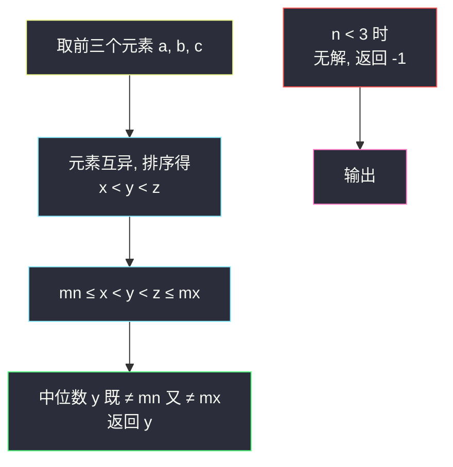

# 既不是最小值也不是最大值（脑筋急转弯 · 三元取中）

## 一、问题描述

给你一个由**互不相同**的正整数组成的数组 `nums`，请你找出其中一个**既不是最小值也不是最大值**的元素并返回它；如果不存在这样的元素，返回 `-1`。

> 🔗 LeetCode 2733：https://leetcode.cn/problems/neither-minimum-nor-maximum/
>
> 数据范围：`1 <= nums.length <= 100`，`1 <= nums[i] <= 100`，且 `nums` 中的整数互不相同。判定为 Special Judge：任意一个合法答案都会被接受。

**示例 1**

```
输入：nums = [3,2,1,4]
输出：3（返回 2 同样正确）
解释：3 既不是最小值（1）也不是最大值（4）。
```

**示例 2**

```
输入：nums = [1,2]
输出：-1
解释：1 是最小值，2 是最大值，没有别的元素可选。
```

**直观理解**

这是一道「脑筋急转弯 + 构造」题（灵茶题单 §5.2）：它不要求你把数组处理得多好，而是考你**能否一眼给出一组合法解并说明它为什么合法**。既然只要「一个」答案，那答案多半藏在某个很小的局部里——三个互异的元素，中间那个必然「夹在中间」。

---

## 二、暴力解法

最直接的做法是按定义搜索：先扫一遍求出全局最小值 `mn` 与最大值 `mx`，再扫一遍返回第一个不等于二者的元素。

```python
class Solution:
    def findNonMinOrMax(self, nums: List[int]) -> int:
        mn = min(nums)
        mx = max(nums)
        for x in nums:
            if x != mn and x != mx:
                return x
        return -1
```

### 复杂度

- **时间**：`O(n)`（两趟扫描）。
- **空间**：`O(1)`。

### 🔴 瓶颈在哪里

复杂度上其实没什么可挑的，但这题的「精髓」在于：**根本不需要看整个数组**。当 `n >= 3` 时，答案在前三个元素里就一定存在——把整个数组扫一遍是做了大量与答案无关的工作。构造题的思维是：直接锁定一小块「必然包含解」的区域，取出来，证明合法，收工。

---

## 三、优化探索（核心章节）

> 📚 本题在灵茶题单中属于 **§5.2 脑筋急转弯**，讲法按「构造题」模板：**直接给出一组合法解，并证明它一定合法**。

### 3.1 先想清楚什么时候无解

- `n = 1`：唯一的元素既是最小值又是最大值，无解，返回 `-1`。
- `n = 2`：两个互异的元素，小的那个是全局最小，大的那个是全局最大，仍然无解，返回 `-1`。
- `n >= 3`：**一定有解**——这正是下面要构造证明的。

### 3.2 构造：任取三个元素，取中位数

取数组任意三个不同下标的元素（不妨就取前三个 `a, b, c`），把它们排序成 `x < y < z`（互异保证没有相等），返回中间的 `y`。

**证明（构造的合法性）**：数组元素互异，所以 `x < y < z` 严格成立。而全局最小值 `mn` 和最大值 `mx` 满足：

```
mn <= x < y < z <= mx
```

于是 `y > mn` 且 `y < z <= mx`，即 `y` 既不等于全局最小值，也不等于全局最大值。证毕。

注意证明只用了「`mn` 不超过任何元素、`mx` 不小于任何元素」这一条性质，所以**任取三个元素都行**，取前三个只是写起来最短。

### 3.3 为什么「互异」这个条件必不可少

如果去掉互异条件，构造会翻车：例如 `nums = [1,1,2]`，取前三个排序得 `x=1, y=1, z=2`，`y` 与 `x` 相等，而全局最小值恰是 `1`，返回 `1` 就是错的（此数组本应返回 `-1`）。严格不等号 `x < y < z` 完全依赖互异性——审题时看到 **distinct** 要立刻意识到它是构造的钥匙。



### 3.4 一句话核心

> `n >= 3` 且元素互异时，**任取三个元素的中位数**就是一组合法解：它被 `mn` 和 `mx` 严格夹在中间。

---

## 四、代码实现

### Python（主解：三元取中）

```python
class Solution:
    def findNonMinOrMax(self, nums: List[int]) -> int:
        if len(nums) < 3:
            return -1
        a, b, c = nums[:3]
        return a + b + c - min(a, b, c) - max(a, b, c)
```

**写法说明**

| 写法 | 含义 |
|------|------|
| `nums[:3]` 解包 | 取前三个元素，下标任意取三个都行 |
| `和 - 最小 - 最大` | 三个数的中位数，一行得到，不用排序 |

也可以写 `sorted(nums[:3])[1]`，可读性更好；`O(1)` 与 `O(3)` 排序在实际意义上没有区别。

### Java（最优解同款）

```java
class Solution {
    public int findNonMinOrMax(int[] nums) {
        if (nums.length < 3) {
            return -1;
        }
        int a = nums[0], b = nums[1], c = nums[2];
        return a + b + c - Math.min(a, Math.min(b, c))
                       - Math.max(a, Math.max(b, c));
    }
}
```

---

## 五、具体例子演示

### 例 1：nums = [3,2,1,4]

构造过程只有一步，把「取材 → 排序 → 定位中位数」拆开看：

| 步骤 | 操作 | 中间状态 |
|------|------|----------|
| 1 | 取前三个元素 | 候选集 `{3, 2, 1}` |
| 2 | 找最小 | `x = 1`，剩余候选 `{3, 2}` |
| 3 | 找最大 | `z = 3`，剩余候选 `{2}` |
| 4 | 剩下的就是中位数 | `y = 2` |

合法性核对：全局 `mn = 1 <= x = 1 < y = 2 < z = 3 <= mx = 4`，故 `2` 既非最小也非最大，返回 `2`（Special Judge 下同样接受示例输出 `3`）。

### 例 2：nums = [1,2]

| 步骤 | 操作 | 结果 |
|------|------|------|
| 1 | `len(nums) = 2 < 3` | 直接短路 |
| 2 | 返回 `-1` | 小的是最小值，大的是最大值，确实无解 |

### 例 3：nums = [5,4,1,2,3]

任取三个仍成立（体现「取材任意」）：

| 取材下标 | 候选集 | 排序后 | 中位数 | 合法? |
|----------|--------|--------|--------|-------|
| 0,1,2 | {5,4,1} | 1 < 4 < 5 | 4 | ✓（`mn=1 < 4 < mx=5`） |
| 1,2,3 | {4,1,2} | 1 < 2 < 4 | 2 | ✓ |
| 0,3,4 | {5,2,3} | 2 < 3 < 5 | 3 | ✓ |

无论怎么取，中位数都被 `mn = 1` 与 `mx = 5` 严格夹住——这正是 3.2 节证明的一般性。

---

## 六、复杂度分析

| 方法 | 时间 | 空间 | 说明 |
|------|------|------|------|
| 按定义两趟扫描 | `O(n)` | `O(1)` | 与答案无关的信息也全看了 |
| **三元取中（本篇）** | `O(1)` | `O(1)` | 只看前三个元素，`n` 再大也常数步 |

---

## 七、对比总结

**构造题通用模板：给出一组解 + 一行证明**

1. 先确定无解的边界（本题 `n < 3`）。
2. 在最小的「必然含解」区域内直接取解（本题前三个元素的中位数）。
3. 用题目的定义性质完成证明（本题 `mn <= x < y < z <= mx`）。

**易错点**

1. 漏判 `n < 3`：长度为 1 或 2 时前三个元素根本取不出来，必须先短路返回 `-1`。
2. 忽略互异条件：它是严格不等号的来源；面试中可以主动指出「若无互异条件，本题需返回 `-1` 的情形会更多，三元取中也不再正确」。
3. 纠结「返回哪一个」：判定是 Special Judge，任何合法元素都行，不必找字典序最小或位置最靠前的。

**与后续题目的关系**：本篇是「构造与字典序贪心」lane 的热身，同样的「给出解并证明」流程会在同批的 `find-n-unique-integers-sum-up-to-zero.md`（和为零的 N 个不同整数）、`construct-smallest-number-from-di-string.md`（根据模式串构造最小数字）中反复出现，只是证明会更长。

---

## 八、举一反三

| 题目 | 关系 |
|------|------|
| [215. 数组中的第 K 个最大元素](https://leetcode.cn/problems/kth-largest-element-in-an-array/) | 「第 2 大」就是 `n = 3` 时既非最小也非最大的那个，本题是它的常数级特例 |
| [4. 寻找两个正序数组的中位数](https://leetcode.cn/problems/median-of-two-sorted-arrays/) | 中位数的一般化：如何在更难的输入结构上「定位中间那个数」 |
| [1304. 和为零的 N 个不同整数](https://leetcode.cn/problems/find-n-unique-integers-sum-up-to-zero/) | 同批构造题：对称构造 `±1..±n/2`，见 `find-n-unique-integers-sum-up-to-zero.md` |
| [1323. 6 和 9 组成的最大数字](https://leetcode.cn/problems/maximum-69-number/) | 同批「字典序贪心」lane：高位优先做决策，见 `maximum-69-number.md` |
| [12. 整数转罗马数字](https://leetcode.cn/problems/integer-to-roman/) | 同目录贪心构造题解 `integer-to-roman.md`：从大到小贪心配构造 |

**思想迁移**

- 看到返回「任意一个」满足条件的解，先问：**最小的必然含解的窗口是多大？** 本题答案是 3。
- Special Judge 题目不要过度设计「最优答案」，把证明写清楚比把代码写复杂更有价值。
- 口诀：**「互异取三元，居中必安全；不足三元时，-1 稳稳还。」**
