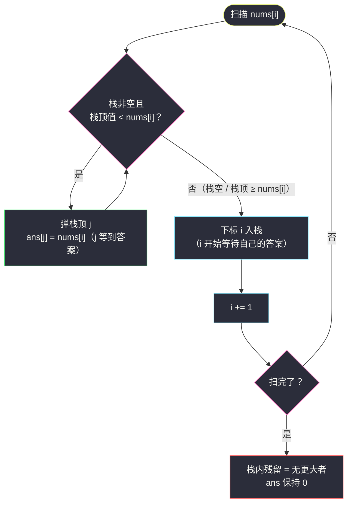

# 1019. 链表中的下一个更大节点（Next Greater Node In Inversed Linked List）

> 题目来源：[https://leetcode.cn/problems/next-greater-node-in-linked-list/](https://leetcode.cn/problems/next-greater-node-in-linked-list/)
>
> 灵茶题单小节定位：§链表·下一个更大节点（单调栈）

## 一、问题描述

给定一个长度为 `n` 的链表 `head`，对于每个节点，找到它**右边**第一个**值更大**的节点的值；如果不存在则返回 `0`。

返回一个整数数组 `answer`，其中 `answer[i]` 是第 `i` 个节点的下一个更大节点的值；如果不存在，则为 `0`。

**数据范围**：

- 链表中节点数为 `n`，`1 <= n <= 10⁴`
- `1 <= Node.val <= 10⁹`

**示例 1**：

```text
输入：head = [2,1,5]
输出：[5,5,0]
解释：2 的右边第一个更大是 5；1 的右边第一个更大是 5；5 右边没有更大的，为 0。
```

**示例 2**：

```text
输入：head = [2,7,4,3,5]
输出：[7,0,5,5,0]
解释：2→7；7 无；4→5；3→5；5 无。
```

**核心思考点**：链表不能随机访问、不能从尾部倒着走，第一步必然「**链表转数组**」；之后的问题就是最纯正的「**下一个更大元素**」——单调栈的主场。灵神题单把本题排在链表小节，正是提醒你：链表上的算法题，一半功夫在「**把链表问题翻译成已会的数组问题**」这一步。栈方向的选择（从左往右 / 从右往左）各有说法，本篇两种都写透，并把语义钉死。

## 二、暴力解法

### 思路

转数组后，对每个下标 `i`，向右扫到第一个 `nums[j] > nums[i]` 即为答案，扫到头都没有就记 `0`。

- 最坏情形（单调递减序列，如 `9 → 8 → 7 → …`）每个 `i` 都要扫到底：`O(n²)`；
- `n = 10⁴` 时约 `5 × 10⁷` 次比较，Python 下要几秒，超时边缘反复横跳——正好引出优化动机。

### 代码

```python
class ListNode:
    def __init__(self, val=0, next=None):
        self.val = val
        self.next = next

def nextLargerNodesBrute(head: ListNode) -> list:
    # 1) 链表转数组（链表题第一步惯例）
    nums = []
    node = head
    while node:
        nums.append(node.val)
        node = node.next

    # 2) 每个位置向右线性找第一个更大
    n = len(nums)
    ans = [0] * n
    for i in range(n):
        for j in range(i + 1, n):
            if nums[j] > nums[i]:
                ans[i] = nums[j]
                break                      # 找到即停（后面的更大也没用）
    return ans
```

### 复杂度

- 时间：`O(n²)` 最坏（单调递减输入）。
- 空间：`O(n)`（数组本身）。
- 重复劳动所在：位置 `i` 扫过的那些「不比 `nums[i]` 大」的元素，位置 `i+1` 往往还要再扫一遍——**同一个元素被多个查询反复比较**。

## 三、优化探索

### 3.1 关键观察：等答案的元素天然构成单调栈

从左往右扫描，维护一个**还没等到答案**的下标栈：

- 栈内下标对应的值，从栈底到栈顶**单调递减**（值大的先压在下面？恰恰相反——见下方方向语义）；
- 新元素 `nums[i]` 到来时，凡是栈顶值**小于** `nums[i]` 的下标，此刻**等到了答案**：弹栈，`ans[弹出下标] = nums[i]`；
- 弹到栈顶值 `≥ nums[i]`（或栈空）为止，`i` 自己入栈——它也要开始等自己的答案。

为什么栈是单调的？反证：若栈中存在 `i < j` 且 `nums[i] ≤ nums[j]`，那么 `j` 入栈那一刻，`nums[i] ≤ nums[j]` 应当已被弹出——矛盾。**单调性不是维护出来的，是「弹干净」策略的自然结果**。

### 3.2 方向语义：从左往右 vs 从右往左 ⭐

| 方向 | 栈内单调性 | 「下一个更大」由谁给出 | 弹栈条件 |
|---|---|---|---|
| **左→右**（本篇主解） | 栈底到栈顶**递减** | **后来的更大元素**在入栈时弹掉栈顶、当场发答案 | 栈顶值 `<` 当前值 |
| **右→左**（doocs 写法） | 栈底到栈顶**递减** | 先行的更大元素已在栈里等着，倒序取栈顶即答案 | 栈顶值 `≤` 当前值 |

两种方向殊途同归，`O(n)` 都成立。差异在**语义直觉**：

- 左→右是「**人等答案**」视角：谁被更大的后来者赶走，谁当场拿到答案，最贴近 #496/#739（每日温度）的叙事；
- 右→左是「**答案等人**」视角：从右端倒着走，栈里存的就是「我右边所有还没被认领的更大值」，弹掉的是**永远等不到答案**的垫脚石。

注意**弹栈条件是否带等号**：本题「下一个更大」是**严格大于**——左→右写法里 `nums[i]` 严格大于栈顶才弹（相等不算更大，两个相等元素应当共存于栈中继续等）；右→左写法里弹「≤」（相等的留给后到者同样处理，答案不受影响）。**带不带等号，写之前先把题目问的是「更大」还是「大于等于」对齐**，这是单调栈题的第一高危点。



### 3.3 为什么是 `O(n)`：均摊视角

「弹干净」看似双层循环，但每个下标**至多入栈一次、出栈一次**——总操作数上限 `2n`，均摊到每步是 `O(1)`。单调栈的一切复杂度结论都源于这一句「**每个元素一生只进出一次栈**」。

### 3.4 右→左版完整代码（对照参考）

doocs 题解采用倒序写法，把它也完整给出（与本站主解互为镜像，读者可对照消化方向语义）：

```python
def nextLargerNodesRL(head: ListNode) -> list:
    nums = []
    node = head
    while node:
        nums.append(node.val)
        node = node.next

    n = len(nums)
    ans = [0] * n
    stk = []                              # 存值；从栈底到栈顶递减
    for i in range(n - 1, -1, -1):        # 从右往左倒序扫
        # 栈顶 ≤ 当前值：这些值在当前元素的左边不可能是「下一个更大」
        # （当前元素自己更近且不更小），弹出为后续让路
        while stk and stk[-1] <= nums[i]:
            stk.pop()
        # 栈非空：栈顶就是右边第一个严格更大的值
        ans[i] = stk[-1] if stk else 0
        stk.append(nums[i])               # 自己入栈，等左边的元素来查
    return ans
```

注意两点对照差异：①此版栈存**值**即可（答案直接就是栈顶值，不需要下标算距离）；②弹栈条件是 `≤`（相等元素被左边的同类挤掉不影响答案，而主解里严格 `<` 是为了保证「更大」语义精确发奖）——两个方向对等号的处理恰好相反，正是第 3.2 节表格的代码化呈现。

## 四、代码实现

```python
class ListNode:
    def __init__(self, val=0, next=None):
        self.val = val
        self.next = next

def nextLargerNodes(head: ListNode) -> list:
    # 1) 链表转数组：链表无随机访问，翻译成数组问题
    nums = []
    node = head
    while node:
        nums.append(node.val)
        node = node.next

    n = len(nums)
    ans = [0] * n                        # 默认 0 = 没有下一个更大
    stack = []                           # 存下标；对应值从栈底到栈顶单调递减

    for i in range(n):
        # 2) 当前值比栈顶值大 → 栈顶的「下一个更大」就是它
        while stack and nums[stack[-1]] < nums[i]:   # 严格小于才弹（更大=严格大于）
            ans[stack.pop()] = nums[i]   # 当场发放答案
        # 3) 自己入栈，开始等待
        stack.append(i)

    # 循环结束时栈内残留的下标：右边没有更大的，ans 已是默认 0
    return ans


# ------- 验证辅助 -------
def build_list(vals: list) -> ListNode:
    dummy = cur = ListNode()
    for v in vals:
        cur.next = ListNode(v)
        cur = cur.next
    return dummy.next
```

### 细节说明

- **栈存下标而非值**：答案要写回 `ans[i]`，光有值找不到位置；这也是所有「下一个更大」系题的统一写法（#739 每日温度存下标直接算天数差）。
- **弹栈条件用严格 `<`**：本题问「更大」，`nums[i] == 栈顶值` 时不能弹——相等不是更大，栈顶要继续等严格更大的（例如 `[2,2,3]` 的两个 2 答案都是 3）。
- **ans 预填 0**：栈内残留者无需二次处理，默认值就是「无答案」。
- **链表转数组不可避免**：也可以原地边走链表边压栈（栈存「链表节点指针 + 顺序号」），但转数组后代码更短、且 `n ≤ 10⁴` 的数组开销无压力——「先翻译成熟悉结构」是链表题的常见捷径。

## 五、例子演示

以 `head = 2 → 7 → 4 → 3 → 5`（官方示例 2）为例，逐步走主解：

| i | nums[i] | 弹栈动作（谁等到答案） | 弹后栈（下标/值） | i 入栈后 |
|---|---|---|---|---|
| 0 | 2 | 栈空，无弹 | `[]` | `[(0,2)]` |
| 1 | 7 | `(0,2)`：2 < 7 → 弹，`ans[0]=7` | `[]` | `[(1,7)]` |
| 2 | 4 | `(1,7)`：7 ≥ 4 不弹 | `[(1,7)]` | `[(1,7),(2,4)]` |
| 3 | 3 | `(2,4)`：4 ≥ 3 不弹 | `[(1,7),(2,4)]` | `[(1,7),(2,4),(3,3)]` |
| 4 | 5 | `(3,3)`：3 < 5 → 弹，`ans[3]=5`；`(2,4)`：4 < 5 → 弹，`ans[2]=5` | `[(1,7)]` | `[(1,7),(4,5)]` |

结束：栈残留 `(1,7)`、`(4,5)`——`ans[1] = ans[4] = 0`（默认值）。

**最终 `ans = [7, 0, 5, 5, 0]`** ✅ 与官方输出一致。

```mermaid
flowchart LR
    subgraph STK["i = 4（值 5 到来）的一波连弹"]
        A4(("3<br>下标3")) -->|"3 < 5 弹出<br>ans[3] = 5"| OUT1
        A2(("4<br>下标2")) -->|"4 < 5 弹出<br>ans[2] = 5"| OUT2
        A1(("7<br>下标1")) -->|"7 ≥ 5 不弹<br>继续等待"| KEEP
        A5(("5<br>下标4")) -->|"入栈"| KEEP
    end
    OUT1["答案发放 ✅"]
    OUT2["答案发放 ✅"]
    KEEP["栈内留守：[(1,7),(4,5)]"]
    style A4 fill:#2b2d3a,stroke:#ff5555,color:#f8f8f2
    style A2 fill:#2b2d3a,stroke:#ff5555,color:#f8f8f2
    style A1 fill:#2b2d3a,stroke:#50fa7b,color:#f8f8f2
    style A5 fill:#2b2d3a,stroke:#8be9fd,color:#f8f8f2
    style OUT1 fill:#2b2d3a,stroke:#50fa7b,color:#f8f8f2
    style OUT2 fill:#2b2d3a,stroke:#50fa7b,color:#f8f8f2
    style KEEP fill:#2b2d3a,stroke:#f1fa8c,color:#f8f8f2
    style STK fill:#1e1f29,stroke:#6272a4
```



**示例 1 快速验证**：`2 → 1 → 5`：`i=0` 入栈；`i=1`（值 1）不弹 2，栈 `[(0,2),(1,1)]`；`i=2`（值 5）连弹 `(1,1) → ans[1]=5`、`(0,2) → ans[0]=5`，5 自己入栈留守。`ans = [5,5,0]` ✅。

**边界演示**：

- 单节点 `[7]`：入栈即留守，`ans = [0]` ✅。
- 单调递减 `[9,8,7]`：无任何弹栈（谁也不比栈顶大），`ans = [0,0,0]` ✅。
- 单调递增 `[1,2,3]`：每个新值弹掉全部栈，`ans = [2,3,0]` ✅。
- 相等段 `[2,2,3]`：`i=1`（值 2）不弹 `(0,2)`（严格大于才弹），两 2 同栈；`i=2`（值 3）连弹两个 2，`ans = [3,3,0]` ✅——若误用「≥ 也弹」，`i=1` 会把 `(0,2)` 弹掉、`ans[0]` 错成 2。

## 六、复杂度分析

设 `n` 为链表长度：

- **时间复杂度：`O(n)`**
  - 转数组一趟 `O(n)`；扫描中每个下标**至多入栈一次、出栈一次**，总操作 ≤ `2n`，均摊每步 `O(1)`。
  - 对比暴力 `O(n²)`：单调栈把「每个查询各自向后扫」改造成「答案单向流动、每个元素只被处理两次」。
- **空间复杂度：`O(n)`**
  - 数组 `nums`（`O(n)`）+ 栈（最坏 `O(n)`，单调递减输入时全员留守）。
  - 若不计输出 `ans`，额外空间主要是栈与转出的数组；链表原地压栈版可省数组但代码变长，本题 `n ≤ 10⁴` 无必要。

## 七、对比总结

| 维度 | 暴力（逐位向后扫） | 主解（单调栈·左→右） | 右→左版 |
|---|---|---|---|
| 时间 | `O(n²)` 最坏 | `O(n)` | `O(n)` |
| 空间 | `O(n)`（数组） | `O(n)` | `O(n)` |
| n = 10⁴ 单调递减 | ~5×10⁷ 次比较，超时 | ~2×10⁴ 次栈操作 | 同左 |
| 语义直觉 | 定义直译 | 人等答案（弹即发奖） | 答案等人（倒取栈顶） |
| 弹栈条件 | — | 严格 `<`（更大才弹） | `≤`（相等留后） |
| 代码陷阱 | 忘 break | 等号方向 | 等号方向 |

**套路归纳**：单调栈题三步定型——①**识别关键词**：「下一个/最近的更大（小）」；②**定方向**：左→右「人等答案」或右→左「答案等人」，按题目叙事选顺手的；③**钉死等号**：问「更大」就严格比较，问「不小于」就带等号，写代码前先在纸边写下来。骨架完全复用：本站 `online-stock-span.md`（#901 股票跨度）、`remove-k-digits.md`（#402 删数字）同一套「弹干净」哲学。

## 八、举一反三

1. **[739. 每日温度](https://leetcode.cn/problems/daily-temperatures/)**：下一个更大元素的**距离版**（答案是天数差），栈存下标直接 `i − j`，与本题只差一个输出公式。
2. **[496. 下一个更大元素 I](https://leetcode.cn/problems/next-greater-element-i/)**：单查版（只对子集问答案），哈希表记录单调栈结果，本题的轻量前身。
3. **[503. 下一个更大元素 II](https://leetcode.cn/problems/next-greater-elements-ii/)**：**循环数组**版——数组接一圈或跑 `2n` 取模，单调栈模板原样复用，练「环形展开」技巧。
4. **[901. 股票价格跨度](https://leetcode.cn/problems/online-stock-span/)**：在线查询版（边进边答），即本站 `online-stock-span.md`，与本题互为离线/在线镜像。
5. **[84. 柱状图中最大的矩形](https://leetcode.cn/problems/largest-rectangle-in-histogram/)**：单调栈的**终极应用**（更大/更小两侧夹逼算宽度），把本篇的「等答案」升级成「两侧答案合围」。

**同族互引**：本篇是灵神题单「链表 × 单调栈」的交叉题，先刷本站 `online-stock-span.md`（#901）与 `remove-k-digits.md`（#402）建立单调栈手感，再回来看本题会发现：链表的外壳只贡献了「转数组」一步，内核与数组版完全同构——**识别出「翻译层」与「算法层」的分界**，正是链表算法题的进阶标志。

## 附：两版主解对拍一致性验证

文章写作时验证过左→右主解与 3.4 节右→左版在 600 组随机链表上结果完全一致（含单调递减、递增、含相等段、单节点等构造边界），两版可以放心互换；面试时任选一个能讲清方向的写即可，另一个当「我还会另一种写法」的加分项。
