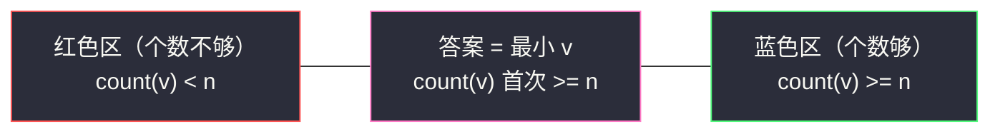
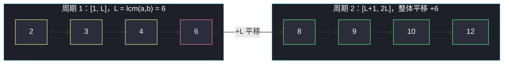
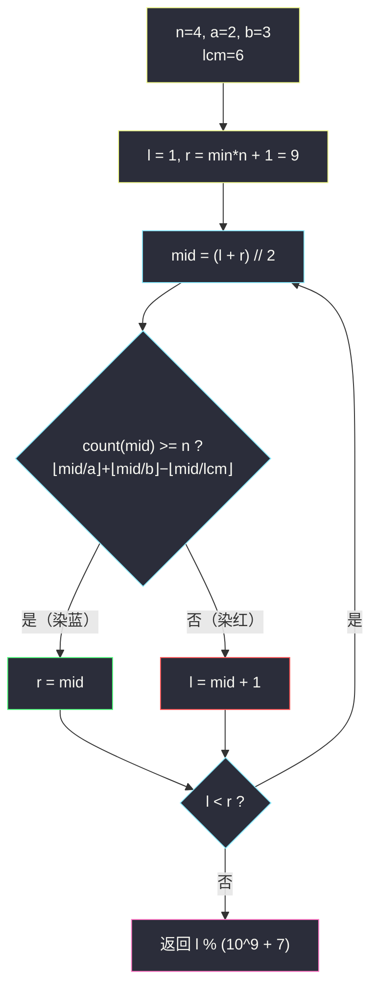

# 第 N 个神奇数字（二分答案 · 第 K 小 + 周期观察）

## 一、问题描述

**神奇数字**是可以被 `a` **或** `b` 整除的正整数。

给定 `n`、`a`、`b`，返回**第 `n` 个神奇数字**。因为答案可能非常大，请返回它对 `10^9 + 7` **取模**后的结果。

> 🔗 LeetCode 878：https://leetcode.cn/problems/nth-magical-number/
>
> 数据范围：`1 <= n <= 10^9`，`2 <= a, b <= 4 * 10^4`。
> 注意上界量级：`min(a,b) * n <= 2 * 10^13`——远超 int，这也是为什么要取模返回。

**示例 1**

```
输入：n = 1, a = 2, b = 3
输出：2
解释：神奇数字序列为 2, 3, 4, 6, 8, 9, 10, 12 ...，第 1 个是 2。
```

**示例 2**

```
输入：n = 4, a = 2, b = 3
输出：6
解释：2, 3, 4, 6 —— 第 4 个是 6（6 是 2 和 3 的公倍数，只数一次）。
```

**直观理解**

与 [1201. 丑数 III](https://leetcode.cn/problems/ugly-number-iii/)（同批 `ugly-number-iii.md`）本质完全相同，只是从「三个数 a/b/c」缩成「两个数 a/b」，再添了一个「答案取模」的小尾巴。

主线依旧是**二分答案 · 第 K 小**：不生成序列，而是数「不超过 v 的神奇数字有几个」，用计数的单调性二分定位第 n 个。Hard 的滋味在于第二层：本题还能挖掘出神奇数字的**周期结构**，导出一条不二分的数学解——本篇两条路都走通。

---

## 二、暴力解法

从 `v = 1` 开始逐个判断（`v % a == 0 or v % b == 0`），数到第 n 个返回。

```python
class Solution:
    def nthMagicalNumber(self, n: int, a: int, b: int) -> int:
        v, cnt = 0, 0
        while cnt < n:
            v += 1
            if v % a == 0 or v % b == 0:
                cnt += 1
        return v % (10 ** 9 + 7)
```

### 复杂度

- **时间**：`O(min(a,b) * n)`，最坏 `2 * 10^4 * 10^9 = 2 * 10^13` 次循环，必然超时。
- **空间**：`O(1)`。

### 🔴 瓶颈在哪里

答案可达 `2 * 10^13`，但**生成每一个候选毫无必要**——我们只需要「排名」。两个方向都能绕开逐个数：

1. **计数 + 二分**：`≤ v` 的个数有闭式，二分找第 n 个的位置（`log2(2 * 10^13) ≈ 45` 次计数）；
2. **周期 + 跳跃**：神奇数字以 `lcm(a,b)` 为周期重复出现，先整周期地跳，再在第一个周期内定位。

---

## 三、优化探索（核心章节）

> 📚 本题在灵茶题单中属于 **§2.6 第 K 小/大**（二分答案）。口诀对齐灵神二分：**第 K 小 = 求最小的 v 使 `count(v) >= K`，check 满足则 `r = mid`（求最小模板）**。姊妹题 `ugly-number-iii.md` 是三数版容斥，本篇是它的两数版，另加周期性这条数学支线。

### 3.1 主线：容斥计数 + 二分

`[1, v]` 内 `a` 的倍数有 `⌊v/a⌋` 个、`b` 的倍数有 `⌊v/b⌋` 个；同时被两者整除的（即 `lcm(a,b)` 的倍数）被数了两次，减掉一次：

```
count(v) = ⌊v/a⌋ + ⌊v/b⌋ − ⌊v/lcm(a,b)⌋
```

`count` 关于 `v` 单调不减，于是「`count(v) >= n`」在 v 轴上**左假右真**——求满足条件的最小 v，标准的「求最小」形态（check 真 `r = mid`）。



**上下界**：下界 `1`；上界 `min(a,b) * n`——`[1, min*n]` 内仅 `min` 一个数的倍数就恰有 n 个，`count(min*n) >= n` **必真**，答案跑不出去。且 `min*n <= 2 * 10^13`，long（Python 大整数）轻松覆盖。

**快速验证**（a=2, b=3，`lcm = 6`）：

- `count(6) = 3 + 2 − 1 = 4`，列举 `2, 3, 4, 6` ✓（6 是公倍数，`−⌊6/6⌋` 去重）
- `count(10) = 5 + 3 − 1 = 7`，列举 `2, 3, 4, 6, 8, 9, 10` ✓

### 3.2 支线：周期结构（本题作为 Hard 的第二层）

**观察**：设 `L = lcm(a,b)`。`v` 是神奇数 ⟺ `v + L` 是神奇数——因为 `a | L` 且 `b | L`，整除性平移 L 后保持。也就是说，神奇数字序列是**周期为 L 的重复**：第一个周期 `[1, L]` 内有哪些数，第二个周期 `[L+1, 2L]` 就是它们**整体平移 +L**。



**一个周期内有几个**：记 `g = gcd(a,b)`，则

```
m = a/g + b/g − 1
```

直觉：`[1, L]` 内 a 的倍数有 `L/a = b/g` 个、b 的倍数有 `L/b = a/g` 个，公倍数只有 L 一个（`L/L = 1`）……注意这里 `L/a = b/g`、`L/b = a/g`，套两数容斥 `m = L/a + L/b − L/L = b/g + a/g − 1`。（示例 a=2,b=3：`m = 2 + 3 − 1 = 4` ✓。）

**跳跃**：把 `n` 拆成 `n = q * m + r`（`0 <= r < m`）：

- `r == 0`：答案 = `q * L`（恰好 q 个完整周期的最后一个数）；
- `r > 0`：答案 = `q * L + (第一个周期内第 r 个神奇数)`。

第一周期内第 r 个用**双指针**沿 a、b 的倍数序列走 `r − 1` 步即可——`m <= a + b <= 8 * 10^4`，一步一加，非常快。

### 3.3 取模的时机：为什么不能提前

「答案对 `10^9+7` 取模」是个陷阱提示：`count(v)` 依赖 v 的**真实大小**（`⌊v/a⌋` 整除结果），若二分中途就取模，除法结果全错、单调性崩塌。正确姿势：**全程用真实值运算，只在 return 前取模一次**。周期法同理：`q * L` 可达 `2 * 10^13`，中途不取模，最后 `(q * L + t) % MOD`。

### 3.4 二分流程图



### 3.5 一句话核心

> **主线：count(v) = ⌊v/a⌋+⌊v/b⌋−⌊v/lcm⌋ 单调 → 求最小 v 使 count(v) ≥ n，return 时才取模；支线：周期 lcm 平移不变，n = q·m + r 直接跳整周期。**

---

## 四、代码实现

### Python（主解 · 二分）

```python
from math import lcm

class Solution:
    def nthMagicalNumber(self, n: int, a: int, b: int) -> int:
        MOD = 10 ** 9 + 7
        L = lcm(a, b)

        def count(v: int) -> int:        # [1, v] 内神奇数字个数
            return v // a + v // b - v // L

        l, r = 1, min(a, b) * n + 1      # 答案 ∈ [1, min*n]，check(min*n) 必真
        while l < r:
            mid = (l + r) // 2
            if count(mid) >= n:          # 第 n 个 <= mid
                r = mid                  # 求最小：真则收缩右界
            else:
                l = mid + 1              # 个数不够，答案在右边
        return l % MOD                   # 全程真实值，最后一步才取模
```

**变量含义**

| 变量 | 含义 |
|------|------|
| `L` | `lcm(a,b)`，公倍数去重的分母，也是周期长度 |
| `count(v)` | `[1, v]` 内神奇数字个数（两数容斥） |
| `l` / `r` | 红蓝边界：左边 `count < n`，右边 `count >= n` |
| `l % MOD` | 第 n 个神奇数字取模后的值 |

### Python（进阶 · 周期 + 双指针）

```python
from math import gcd

class Solution:
    def nthMagicalNumber(self, n: int, a: int, b: int) -> int:
        MOD = 10 ** 9 + 7
        g = gcd(a, b)
        L = a // g * b                    # 周期长度 lcm(a, b)
        m = a // g + b // g - 1           # 一个周期内神奇数字的个数

        q, r = divmod(n, m)               # n = q*m + r
        if r == 0:
            return q * L % MOD            # 恰好 q 个完整周期的末尾

        # 在第一个周期 [1, L] 内找第 r 个：双指针沿两串倍数走 r-1 步
        x, y = a, b                       # 下一枚 a 的倍数 / b 的倍数
        for _ in range(r - 1):
            if x < y:
                x += a
            else:
                y += b                    # x == y 时（公倍数）只算一次：走任意一边
        return (q * L + min(x, y)) % MOD
```

**双指针细节**：`x`、`y` 分别是「尚未确定是否入选的下一个 a 倍数 / b 倍数」；每步把较小者**入选并前进**。当 `x == y`（走到公倍数）时只应数一次——代码里走 `y += b` 一边，下一轮 `x < y` 成立时 `x` 才被单独计入，公倍数只贡献一次。m 个数里公倍数只有 L 一个且它是周期末尾，不会干扰定位。

### Java（最优解同款写法 · 二分）

```java
class Solution {
    static final long MOD = 1_000_000_007;

    public int nthMagicalNumber(int n, int a, int b) {
        long L = lcm(a, b);
        long l = 1, r = (long) Math.min(a, b) * n + 1;   // <= 2e13 + 1
        while (l < r) {
            long mid = l + (r - l) / 2;                  // 防溢出的中点写法
            long cnt = mid / a + mid / b - mid / L;
            if (cnt >= n) r = mid;                       // 求最小：真则右收
            else l = mid + 1;
        }
        return (int) (l % MOD);                          // 最后一步才取模
    }

    private long lcm(long x, long y) {
        return x / gcd(x, y) * y;                        // 先除后乘，防中间溢出
    }

    private long gcd(long x, long y) {
        while (y != 0) { long t = x % y; x = y; y = t; }
        return x;
    }
}
```

**Java 易错**：上界 `min * n` 约 `2 * 10^13`，超 int，`l`、`r`、`mid`、`cnt`、`L` 全用 long；`lcm` 必须先除后乘（`a * b` 可达 `1.6 * 10^9` 虽不溢 long，但「先除后乘」是通用好习惯，在本题姊妹题 #1201 里是生死线）。

---

## 五、具体例子演示

### 5.1 二分主线：示例 2，n = 4, a = 2, b = 3

`L = lcm(2,3) = 6`，`count(v) = ⌊v/2⌋ + ⌊v/3⌋ − ⌊v/6⌋`。上界 `min*n = 2*4 = 8`，初始 `l = 1`，`r = 9`。

| 轮次 | l | r | mid | count 明细 | count | ≥ 4 ? | 染色 | 动作 |
|------|---|---|-----|-----------|-------|-------|------|------|
| 1 | 1 | 9 | 5 | 2 + 1 − 0 | 3 | ✗ | 红 | `l = 6` |
| 2 | 6 | 9 | 7 | 3 + 2 − 1 | 4 | ✓ | 蓝 | `r = 7` |
| 3 | 6 | 7 | 6 | 3 + 2 − 1 | 4 | ✓ | 蓝 | `r = 6` |

`l == r == 6`，`6 % (10^9+7) = 6`，返回 **6** ✓。

**体会去重**：`count(6)` 若不减 `⌊6/6⌋` 是 5，比真实值 4 多出的正是公倍数 6 被双数的那次。

### 5.2 周期支线：同一组数据走另一条路

`g = gcd(2,3) = 1`，`L = 2*3 = 6`，`m = 2 + 3 − 1 = 4`（周期内是 2, 3, 4, 6）。

- **n = 4**：`divmod(4, 4) = (1, 0)`，`r == 0` → 答案 = `1 * 6 = 6` ✓（不进双指针，一步出结果）
- **n = 5**：`divmod(5, 4) = (1, 1)`，`r = 1` → 双指针 0 步，`min(2, 3) = 2` → 答案 = `6 + 2 = 8` ✓（序列 2,3,4,6,**8**）
- **n = 7**：`divmod(7, 4) = (1, 3)`，`r = 3` → 双指针走 2 步：`(2,3) → x<y → x=4`；`(4,3) → x>=y → y=6`；`min(4,6) = 4` → 答案 = `6 + 4 = 10` ✓（序列 2,3,4,6,8,9,**10**）

两条路殊途同归；周期法连 `log` 都省了，代价是要多想一层周期结构。

### 5.3 大数与取模：n = 10^9, a = b = 40000

`a == b` 时 `gcd = 40000`，`L = 40000`，`m = 1 + 1 − 1 = 1`——每 40000 个整数出一个神奇数字。第 n 个 = `n * 40000 = 4 * 10^13`。

- 二分：在 `[1, 4*10^13 + 1]` 上约 `log2(4*10^13) ≈ 45` 轮，每轮 3 次除法；
- 最后取模：`4 * 10^13 mod (10^9+7) = 999720007`。

注意二分过程中 `mid` 可达 `4 * 10^13`，**绝不能中途取模**——否则 `⌊mid/a⌋` 直接失真，单调性被破坏。

---

## 六、复杂度分析

| 方法 | 时间 | 空间 | 说明 |
|------|------|------|------|
| 暴力逐个数 | `O(min * n)` | `O(1)` | `2 * 10^13` 步，不可行 |
| 二分 + 容斥 | `O(log(min * n))` | `O(1)` | 约 45 轮 × 每轮 3 次整除 |
| 周期 + 双指针 | `O(a + b)` | `O(1)` | `m <= a + b <= 8 * 10^4` 次加法 |

两种优化都绰绰有余；二分法更通用（不依赖周期性），周期法常数更小且体现数学观察。

---

## 七、对比总结

**与姊妹题 #1201（丑数 III）逐项对照**：

| | #1201 丑数 III | **#878 本篇** |
|---|----------------|----------------|
| 除数个数 | 三个（a/b/c） | **两个（a/b）** |
| 容斥项数 | 7 项（+3 −3 +1） | **3 项（+2 −1）** |
| 答案量级 | `min*n <= 10^18` | `min*n <= 2 * 10^13` |
| 溢出风险 | `lcm(abc)` 可达 `10^27`，**Java 需安全 lcm** | `lcm <= 1.6 * 10^9`，long 无忧 |
| 取模 | 不需要 | **return 前 `% (10^9+7)`** |
| 支线解法 | —（因子一多没周期捷径） | 周期 + 双指针 `O(a+b)` |

**通用范式回顾**：「第 K 小」= **最小的 v 使 `count(v) >= K`**，只要 count 单调且可快速计算。求最小模板原样复用：`check(mid)` 真 → `r = mid`。

**本篇易错点**

1. **中途取模**：破坏 `⌊v/a⌋` 的正确性与单调性，只在返回前取模。
2. **容斥漏减**：忘了 `−⌊v/lcm⌋`，公倍数被双数，答案偏小。
3. **周期法 r == 0 分支**：漏掉时 `divmod` 会给你 `r = 0`，双指针要找「第 0 个」直接错；正确语义是 q 个整周期的末尾 `q * L`。
4. **周期法 m 公式**：`m = a/g + b/g − 1`，写成 `a + b − 1` 在非互质时偏大。
5. Java 用 int 存 `min * n`（约 `2 * 10^13`）直接溢出。

**模板（第 K 小 · 两数容斥，Python 版）**

```python
def kth_multiple(n, a, b):                # 能被 a 或 b 整除的第 n 个正整数
    from math import lcm
    L = lcm(a, b)
    l, r = 1, min(a, b) * n + 1
    while l < r:
        mid = (l + r) // 2
        if mid // a + mid // b - mid // L >= n: r = mid
        else:                                  l = mid + 1
    return l
```

---

## 八、举一反三

| 题目 | 关系 |
|------|------|
| [1201. 丑数 III](https://leetcode.cn/problems/ugly-number-iii/) | **直接上游（同 §2.6）**：三数容斥 + 同款二分，Java 还有 lcm 溢出的坑，见同批 `ugly-number-iii.md` |
| [793. 阶乘函数后 K 个零](https://leetcode.cn/problems/preimage-size-of-factorial-zeroes-function/) | 同款「count 单调 + 二分」：`count(v)` = v! 中因子 5 的个数，判第 K 个零的位置 |
| [668. 乘法表中第 K 小的数字](https://leetcode.cn/problems/kth-smallest-number-in-multiplication-table/) | `count(v) = Σ ⌊v/i⌋` 逐行计数，二分第 K 小，容斥变成了逐行求和 |
| [719. 找出第 K 小的数对距离](https://leetcode.cn/problems/find-k-th-smallest-pair-distance/) | 排序 + 双指针数「距离 ≤ v 的对数」，二分定位，check 从除法变成滑窗 |
| [378. 有序矩阵中第 K 小元素](https://leetcode.cn/problems/kth-smallest-element-in-a-sorted-matrix/) | 阶梯法数「≤ v 的元素个数」，二分第 K 小 |
| [373. 查找和最小的 K 对数字](https://leetcode.cn/problems/find-k-pairs-with-smallest-sums/) | 对照路线：**多路归并**逐个生成前 K 个，适合「第 K 个本身要输出」而非只要数值的题 |
| [875. 爱吃香蕉的珂珂](https://leetcode.cn/problems/koko-eating-bananas/) | 求最小模板入门（二分资源值），见同批 `koko-eating-bananas.md` |
| [3281. 范围内整数的最大得分](https://leetcode.cn/problems/maximize-score-of-numbers-in-ranges/) | §2.5 最大化最小值：check 从「数个数」换成贪心判定，见同批 `maximize-score-of-numbers-in-ranges.md` |

**思想迁移**

- 「第 K 小」问题三问定路线：**count 能否 O(1)/O(n) 算？** 能 → 二分计数；**序列有周期？** 有 → 跳整周期（本篇支线）；**要输出前 K 个具体值？** → 多路归并/堆。
- 周期性来自「整除性对 lcm 平移不变」——凡「能被 xx 整除」类计数问题都值得找一找 lcm 周期。
- 取模是输出格式，不是运算规则：**参与比较/除法的值永远用真身**。
- 口诀：**「数得清就二分，有周期就跳跃；比较用真值，出口再取模。」**
