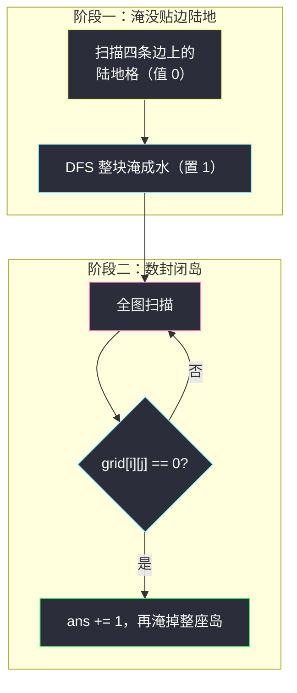

# 统计封闭岛屿的数目（网格图 DFS · 边界淹没法）

## 一、问题描述

给你 `m x n` 的二元网格 `grid`，其中：

- **`0` 表示陆地**；
- **`1` 表示水**。

（注意：这与常见的「1 陆 0 水」设定**正好相反**！）

**岛屿**是被水完全包围的一块四连通陆地（上下左右连接）。**封闭岛屿**（closed island）是**完全不接触网格边界**（即 `0 <= row1, row2 <= m - 1` 范围内的陆地，没有一格在第 0 行、第 `m-1` 行、第 0 列、第 `n-1` 列上）的岛屿。返回封闭岛屿的数目。

> 🔗 LeetCode 1254：https://leetcode.cn/problems/number-of-closed-islands/
>
> 数据范围：`1 <= n, m <= 100`，`grid[i][j]` 为 `0` 或 `1`。

**示例 1**

```
输入：grid = [
  [1,1,1,1,1,1,1,0],
  [1,0,0,0,0,1,1,0],
  [1,0,1,0,1,1,1,0],
  [1,0,0,0,0,1,0,1],
  [1,1,1,1,1,1,1,0]]
输出：2
解释：灰色区域（0）中，中间那座岛和右下 (3,6) 单格岛是封闭的；
     第 7 列上贴边的岛不是封闭岛屿。
```

**示例 2**

```
输入：grid = [[0,0,1,0,0],[0,1,0,1,0],[0,1,1,1,0]]
输出：1
解释：只有中间 (1,2) 这座单格岛四面环水且不贴边。
```

**示例 3**

```
输入：grid = [[1,1,1,1,1,1,1,1]]
输出：0
解释：全是水，没有岛屿。
```

**直观理解**

「封闭 ⟺ 不贴边界 ⟺ 走不到网格边缘」。于是岛屿分成两类：贴边的（不封闭）与被水团团围住的（封闭）。统计后者，最干净的做法是「先淹后数」：从边界上的陆地出发反向 DFS，把所有**能走到边界**的陆地淹成水——剩下的陆地全是封闭岛，再数连通块个数即可。这与 #1020 飞地数量是同一套路、两种问法。

---

## 二、暴力解法

按定义直译的第一版：对每个陆地格独立判断「它所在的连通块是否封闭」——从它出发搜索整块，途中碰到网格边界就说明不封闭。**注意这个直译对 #1020（数飞地格子）是可行的，但对本题（数岛）是错的**：一座 `k` 格的封闭岛会被数成 `k` 座！数岛必须「每块只判一次」，用全局 `seen` 去重、且发现贴边后不能提前退出（要继续标完整块，否则残留格子会被当成新岛）：

```python
class Solution:
    def closedIsland(self, grid: List[List[int]]) -> int:
        m, n = len(grid), len(grid[0])
        DIRS = (1, 0), (-1, 0), (0, 1), (0, -1)
        seen = set()

        def is_closed(si: int, sj: int) -> bool:
            st = [(si, sj)]
            seen.add((si, sj))
            closed = True
            while st:
                x, y = st.pop()
                if x == 0 or x == m - 1 or y == 0 or y == n - 1:
                    closed = False       # 块内贴边：不封闭，但不能提前退出
                for dx, dy in DIRS:
                    nx, ny = x + dx, y + dy
                    if 0 <= nx < m and 0 <= ny < n and grid[nx][ny] == 0 and (nx, ny) not in seen:
                        seen.add((nx, ny))
                        st.append((nx, ny))
            return closed

        ans = 0
        for i in range(m):
            for j in range(n):
                if grid[i][j] == 0 and (i, j) not in seen:
                    ans += is_closed(i, j)   # 每块只判一次
        return ans
```

注意条件全部是**反直觉方向**：陆地是 `== 0`，水是 `== 1`。

### 复杂度

- **时间**：`O(mn)`——每块只搜一遍；但若不慎用成逐格独立判断，则退化到 `O((mn)²)` 且答案直接错。
- **空间**：`O(mn)`——`seen` 集合。

### 🔴 瓶颈在哪里

复杂度已是线性，但写法很重：要维护 `seen` 集合与 `closed` 标志两个状态，「贴边」信号要在搜完整块后才能安全回传，还要记得不能提前 `return`。三个状态缠在一起，极易出 bug。有没有更笨、更稳的办法？

---

## 三、优化探索（核心章节）

> 📚 本题出自灵茶题单 **「网格图 DFS 基础 · 一、网格图 DFS」** 小节，核心套路仍是**从边界反向 DFS 淹没**：先把「贴边的陆地」整体淹掉，剩下的陆地闭着眼睛数岛。与 #1020 一脉相承。

### 3.1 封闭 ⟺ 与边界无连通路径

一座岛不封闭 ⟺ 它至少有一格在边界上 ⟺ 边界上的陆地能（沿陆路）走到这座岛的每一格。所以：

```
非封闭岛 = 与边界陆地连通的陆地块
封闭岛   = 剩下的陆地块
```

### 3.2 阶段一：边界淹没

扫描四条边，遇到陆地（`0`）就 DFS/BFS 把整块淹成水（`1`）。淹没 = 访问标记，不需要 `visited`。这一步消灭所有非封闭岛。

### 3.3 阶段二：数岛

再扫一遍全图：遇到陆地就 `ans += 1`，并把它整块淹掉（防止同一座岛被数多次）。剩下每块陆地恰好启动一次计数。



### 3.4 别把 0 和 1 写反

本题最大的坑不是算法而是**语义**：肌肉记忆总把 `1` 当陆地。所有条件写完自查一遍：

| 语义 | 本题取值 | 扩散条件 | 淹没动作 |
|------|----------|----------|----------|
| 陆地 | `0` | `grid[nx][ny] == 0` | 置 `1` |
| 水 | `1` | — | — |

另外 `m, n ≤ 100` 最坏 `10^4` 格连成一块，递归深度可能超出 Python 默认上限；防爆栈的显式栈写法与 #1020 完全同款（见同批 `number-of-enclaves.md`），或提交前 `sys.setrecursionlimit` 一行保平安。

### 3.5 替代写法：单遍 DFS 返回「是否封闭」

不先淹边界，直接全图扫，每个新块调 `dfs` 返回布尔值「该块是否封闭」：

```python
def dfs(i: int, j: int) -> bool:
    if not (0 <= i < m and 0 <= j < n):
        return False                  # 走出网格：贴边，不封闭
    if grid[i][j] == 1:
        return True                   # 遇水：这一侧安全
    grid[i][j] = 1                    # 淹没
    ok = True
    for dx, dy in DIRS:
        if not dfs(i + dx, j + dy):
            ok = False                # 只记失败，不提前 return！
    return ok
```

关键细节：发现「贴边」后**不能提前 return False**——必须继续把整块淹完，否则块中残存的 `0` 会在后续扫描中被当作新岛屿重复计数。两阶段淹没法则没有这个心智负担，也更直观。

### 3.6 一句话核心

> 四条边上的陆地 DFS 淹成水，非封闭岛全军覆没；剩余陆地扫到一块、淹掉一块、计数一块。两个阶段各 `O(mn)`。

---

## 四、代码实现

### Python（主解：边界淹没 + 计数）

```python
class Solution:
    def closedIsland(self, grid: List[List[int]]) -> int:
        m, n = len(grid), len(grid[0])
        DIRS = (1, 0), (-1, 0), (0, 1), (0, -1)

        def dfs(i: int, j: int) -> None:
            if not (0 <= i < m and 0 <= j < n) or grid[i][j] == 1:
                return                      # 越界或水（含已淹没）
            grid[i][j] = 1                  # 0 是陆地，淹成 1
            for dx, dy in DIRS:
                dfs(i + dx, j + dy)

        for j in range(n):                  # 阶段一：淹没贴边陆地
            dfs(0, j)
            dfs(m - 1, j)
        for i in range(m):
            dfs(i, 0)
            dfs(i, n - 1)

        ans = 0
        for i in range(m):                  # 阶段二：数封闭岛
            for j in range(n):
                if grid[i][j] == 0:
                    ans += 1
                    dfs(i, j)               # 淹掉整座，防止重复计数
        return ans
```

**变量含义**

| 变量 / 函数 | 含义 |
|-------------|------|
| `dfs(i, j)` | 把 `(i, j)` 所在陆地块全部淹成 `1` |
| 阶段一的四趟 `dfs` | 消灭所有「能走到边界」的岛 |
| 阶段二的 `ans += 1` | 每发现一块幸存陆地即一座封闭岛 |

**循环不变式**：阶段二外层循环扫到 `(i, j)` 时，此前所有发现过的封闭岛均已整块置 `1`，`grid[i][j] == 0` 当且仅当 `(i, j)` 是一座尚未计数的新岛的格子。

### Python（替代：单遍 DFS 返回封闭标志）

```python
class Solution:
    def closedIsland(self, grid: List[List[int]]) -> int:
        m, n = len(grid), len(grid[0])
        DIRS = (1, 0), (-1, 0), (0, 1), (0, -1)

        def dfs(i: int, j: int) -> bool:        # 该块是否封闭
            if not (0 <= i < m and 0 <= j < n):
                return False                    # 走出网格：贴边
            if grid[i][j] == 1:
                return True                     # 水：安全
            grid[i][j] = 1
            ok = True
            for dx, dy in DIRS:
                if not dfs(i + dx, j + dy):
                    ok = False                  # 不提前 return，淹完整块
            return ok

        return sum(1 for i in range(m) for j in range(n)
                   if grid[i][j] == 0 and dfs(i, j))
```

---

## 五、具体例子演示

### 例 1：自拟 4 x 6 网格，两阶段端到端跟踪

```
grid（0 陆 1 水）:
0 0 1 1 1 1
1 0 1 0 0 1
1 0 1 0 0 1
1 1 1 1 1 1
```

**阶段一：边界扫描找种子**

| 边 | 格子值 | 种子（陆地 0） |
|----|--------|----------------|
| 第一行 (0, j) | `0 0 1 1 1 1` | **(0,0)、(0,1)** |
| 最后一行 (3, j) | 全 1 | 无 |
| 第一列 (i, 0) | `0 1 1 1` | (0,0) 已处理 |
| 最后一列 (i, 5) | 全 1 | 无 |

**阶段一 DFS 淹没轨迹**（方向：下、上、右、左；淹没 = 置 1）：

| # | 进入 dfs | 淹没动作 | 下 | 上 | 右 | 左 |
|---|----------|----------|----|----|----|----|
| 1 | (0,0) | (0,0)→1 | 递归→#2 `(1,0)=0` | 越界，返回 | 递归→#5 `(0,1)=0` | 越界，返回 |
| 2 | (1,0) | (1,0)→1 | 递归→#3 `(2,0)=0` | 已淹，返回 | (1,1)=1 水，返回 | 越界，返回 |
| 3 | (2,0) | (2,0)→1 | (3,0)=1 水，返回 | 已淹，返回 | (2,1)=1 水，返回 | 越界，返回 |
| 4 | 回溯至 #1 继续 | — | — | — | — | — |
| 5 | (0,1) | (0,1)→1 | (1,1)=1 水，返回 | 越界，返回 | (0,2)=1 水，返回 | 已淹，返回 |

种子 `(0,1)` 的第二次外层调用 `dfs(0,1)` 直接被入口条件挡回（已淹）。淹没后的矩阵快照：

```
1 1 1 1 1 1
1 1 1 0 0 1
1 1 1 0 0 1
1 1 1 1 1 1
```

**阶段一 BFS 扩散层数表**（同一淹没过程的队列视角）：

| 层 | 处理格子 | 新淹没并入队 |
|----|----------|--------------|
| 0 | (0,0)、(0,1) | 边界种子，入队即淹 |
| 1 | (0,0) 扩散 | (1,0) |
| 2 | (0,1) 扩散 | 无（(1,1) 是水） |
| 3 | (1,0) 扩散 | (2,0) |
| 4 | (2,0) 扩散 | 无 |
| — | 队列空 | 淹没结束 |

**阶段二：数封闭岛**

| 扫描到 | 动作 | ans |
|--------|------|-----|
| (1,3)=0 | `ans += 1`，`dfs(1,3)` 淹掉 (1,3)、(2,3)、(1,4)、(2,4) | 1 |
| 其余格子 | 全为 1，跳过 | 1 |

这块 `2 x 2` 的陆地四面全是水、不贴任何边界，是一座封闭岛。答案 **1** ✓

### 例 2：示例 2 验证（3 x 5）

```
0 0 1 0 0
0 1 0 1 0
0 1 1 1 0
```

边界陆地种子：`(0,0),(0,1),(0,3),(0,4),(1,0),(1,4),(2,0),(2,4)`——淹没后这些全变 1，且互相不连通成片之外没有内陆格被牵连。幸存陆地只剩 `(1,2)` 一格（四邻全 1），阶段二计数 **1** ✓

### 例 3：示例 1 验证（5 x 8）

第 7 列 `(0,7)(1,7)(2,7)` 连成的贴边岛与单格 `(4,7)` 都在边界上，阶段一被淹；中央由 `(1,1)..(1,4)、(2,1)、(2,3)、(3,1)..(3,4)` 连成的大岛与 `(3,6)` 单格岛不贴边幸存，答案 **2** ✓

---

## 六、复杂度分析

| 方法 | 时间 | 空间 | 说明 |
|------|------|------|------|
| 正向逐块判定（二章） | `O(mn)` | `O(mn)` | 要 `seen` + `closed` 双状态，易错 |
| 逐格独立判断（错误直译） | `O((mn)²)` | `O(mn)` | 对数岛问法会重复计数，答案错 |
| 边界淹没 + 计数（主解） | `O(mn)` | `O(mn)` 栈 / 递归版同阶 | 每格恰好淹一次，无额外状态 |
| 单遍 DFS 返回标志 | `O(mn)` | `O(mn)` | 少一趟全扫，但不能提前 return |

---

## 七、对比总结

**#1254 与 #1020：同一套路、两种问法**

| | #1020 飞地的数量 | **#1254 本篇** |
|---|------------------|-----------------|
| 陆地 / 水 | 1 / 0 | **0 / 1（反转！）** |
| 淹没谁 | 贴边界的陆地（置 0） | 贴边界的陆地（置 1） |
| 最后统计什么 | 剩余陆地的**格子数**（`sum`） | 剩余陆地的**连通块个数** |
| 关系 | 飞地格数 = Σ 各封闭岛的格子数 | 封闭岛数 = 飞地所在块的个数 |

「从边界反向淹没」全家桶再添两员：

| 题 | 淹掉谁 | 剩下做什么 |
|----|--------|------------|
| #1020 | 边界连通陆地 | 数格子 |
| **#1254** | 边界连通陆地 | **数岛屿** |
| #130 被围绕的区域 | 不淹边界连通 `O` | 把剩余 `O` 翻成 `X` |
| #417 太平洋大西洋 | 只标记不淹 | 两片可达集取交集 |

**易错点**

1. **0 陆 1 水**：所有条件（扩散、判断、淹没值）都与「1 陆」直觉相反，写完逐条自查。
2. **四条边都要扫**，漏边导致贴边岛漏淹、答案偏大。
3. **阶段二数岛要边数边淹**：只数不淹会把一座岛数成多座。
4. 单遍写法中**不能提前 `return False`**：必须淹完整块，否则残留格子被重复计数。
5. 淹没值用 `1`（水）保持语义一致；若想用 `2` 当标记也能过，但入口条件要改成 `grid[i][j] != 0` 一并挡住。

---

## 八、举一反三

| 题目 | 关系 |
|------|------|
| [1020. 飞地的数量](https://leetcode.cn/problems/number-of-enclaves/) | 同一套路的「数格子」版，1 陆 0 水，见同批 `number-of-enclaves.md` |
| [130. 被围绕的区域](https://leetcode.cn/problems/surrounded-regions/) | 淹边界连通 `O`、翻转其余 `O` 为 `X` |
| [417. 太平洋大西洋水流问题](https://leetcode.cn/problems/pacific-atlantic-water-flow/) | 从两片边界反向 DFS 收集可达集再取交集 |
| [463. 岛屿的周长](https://leetcode.cn/problems/island-perimeter/) | 网格 DFS 入门与贡献法，见同批 `island-perimeter.md` |
| [2658. 网格中的最大鱼数](https://leetcode.cn/problems/maximum-number-of-fish-in-a-grid/) | 连通分量求和（正向统计的对照），见同批 `maximum-number-of-fish-in-a-grid.md` |
| [1905. 统计子岛屿](https://leetcode.cn/problems/count-sub-islands/) | 两个网格间连通块的包含关系，分量思想进阶 |
| [200. 岛屿数量](https://leetcode.cn/problems/number-of-islands/) | 「数岛」的裸版（无封闭条件），先练它再回来 |

**思想迁移**

- 「**被包围 / 是否贴边**」类问题统一翻译成「与边界陆地是否连通」，然后从边界反向淹没。
- 语义反转的题（0 陆 1 水）先在纸上写死「陆地值、水值、淹没值」三行备忘，再动笔写代码。
- 口诀：**「零是陆来一是水，边界先淹后数岛；数完一岛淹一岛，四条边上一个都别少。」**
