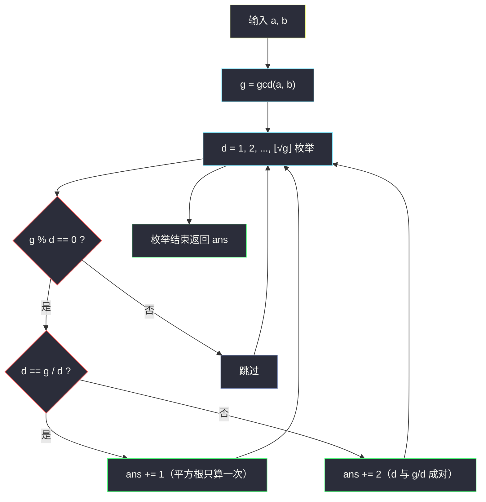

# 2427. 公因子的数目（Number of Common Factors）

> 题目来源：[https://leetcode.cn/problems/number-of-common-factors/](https://leetcode.cn/problems/number-of-common-factors/)
>
> 灵茶题单小节定位：§1.5 因子

## 一、问题描述

给你两个正整数 `a` 和 `b`，返回 `a` 和 `b` 的**公因子**的数目。

如果 `x` 可以同时整除 `a` 和 `b`，则认为 `x` 是 `a` 和 `b` 的一个**公因子**。

**数据范围**：

- `1 <= a, b <= 1000`

**示例 1**：

```text
输入：a = 12, b = 6
输出：4
解释：12 和 6 的公因子是 1、2、3、6。
```

**示例 2**：

```text
输入：a = 25, b = 30
输出：2
解释：25 和 30 的公因子是 1、5。
```

**核心思考点**：「x 同时整除 a 和 b」等价于「x 整除 `gcd(a, b)`」——公因子集合与最大公约数的因子集合**完全相同**。问题从「两数的公因子计数」降维成「一个数（gcd）的因子计数」，再套用「因子成对出现，枚举到平方根」的经典优化。

## 二、暴力解法

### 思路

直接枚举 `x = 1..min(a, b)`，逐一检查 `a % x == 0` 且 `b % x == 0`，计数即可。

### 代码

```python
def commonFactorsBrute(a: int, b: int) -> int:
    return sum(1 for x in range(1, min(a, b) + 1) if a % x == 0 and b % x == 0)
```

### 复杂度

- 时间：`O(min(a, b))`，`a, b ≤ 1000` 时最多 1000 次检查，轻松通过。
- 空间：`O(1)`。

## 三、优化探索

### 3.1 等价转化：公因子 = gcd 的因子 ⭐

设 `g = gcd(a, b)`。证明两个方向的包含关系：

- **公因子都是 g 的因子**：若 `x | a` 且 `x | b`，则 `x` 整除 a 和 b 的任意线性组合，特别地整除最大公约数 `g`（g 可由贝祖系数表出：`g = p·a + q·b`）。
- **g 的因子都是公因子**：若 `x | g`，由 `g | a`、`g | b` 传递性得 `x | a` 且 `x | b`。

所以答案 = `g` 的因子个数。示例 1：`g = gcd(12, 6) = 6`，因子 `{1, 2, 3, 6}` 共 4 个 ✅；示例 2：`g = gcd(25, 30) = 5`，因子 `{1, 5}` 共 2 个 ✅。

这一步把「双变量问题」压成「单变量问题」，枚举上界从 `min(a, b)` 降到 `⌊√g⌋`。

### 3.2 因子成对：枚举到平方根 ⭐

对任意正整数 `n`，因子总是**成对**出现：若 `d | n` 且 `d ≤ √n`，则配对因子 `n/d ≥ √n` 也整除 `n`。因此只需枚举 `d = 1..⌊√n⌋`：

- `n % d == 0` 时计数 `+2`（`d` 和 `n/d` 各一个）；
- 特判 `d == n/d`（完全平方时）只计 `+1`。



## 四、代码实现

### 主解：gcd + 枚举到平方根

```python
from math import gcd, isqrt

class Solution:
    def commonFactors(self, a: int, b: int) -> int:
        g = gcd(a, b)
        ans = 0
        for d in range(1, isqrt(g) + 1):
            if g % d == 0:
                ans += 1 if d == g // d else 2
        return ans
```

### 简化写法（本题值域小，枚举到 g 也可）

```python
from math import gcd

class Solution:
    def commonFactors(self, a: int, b: int) -> int:
        g = gcd(a, b)
        return sum(g % x == 0 for x in range(1, g + 1))
```

### 细节说明

- **`d == g // d` 判断完全平方**：`g = 36` 时 `d = 6` 的配对因子也是 6，只能算一个因子。
- **`gcd(1, x) = 1`**：任何正整数与 1 的公因子只有 1，公式自动覆盖（`g = 1`，因子数 1）。
- 值域放大到 `10⁹` 甚至 `10¹⁸` 时，平方根枚举依然高效（`10⁹` 只需 3 万余次循环）；若需更快可用质因数分解求因子个数积性公式，本题用不上。

## 五、例子演示

**示例 1 端到端：a = 12, b = 6**

| 步骤 | 计算 | 结果 |
|---|---|---|
| 求 gcd | `gcd(12, 6)`：`12 = 1×6 + 0` → 余 0，最大公约数 **6** | `g = 6` |
| 枚举上界 | `⌊√6⌋ = 2` | `d ∈ {1, 2}` |
| d = 1 | `6 % 1 == 0`，`1 ≠ 6/1 = 6` | `+2`（因子 1、6） |
| d = 2 | `6 % 2 == 0`，`2 ≠ 6/2 = 3` | `+2`（因子 2、3） |
| 汇总 | | **4** ✅ |

**示例 2 端到端：a = 25, b = 30**

| 步骤 | 计算 | 结果 |
|---|---|---|
| 求 gcd | `gcd(25, 30)`：`30 = 1×25 + 5`，`25 = 5×5 + 0` | `g = 5` |
| 枚举上界 | `⌊√5⌋ = 2` | `d ∈ {1, 2}` |
| d = 1 | `5 % 1 == 0`，`1 ≠ 5` | `+2`（因子 1、5） |
| d = 2 | `5 % 2 == 1` | 跳过 |
| 汇总 | | **2** ✅ |

**完全平方特判示例（自造）：a = 36, b = 108** → `g = 36`，`⌊√36⌋ = 6`：

| d | 36 % d | 配对 | 计数 |
|---|---|---|---|
| 1 | 0 | 36 | +2 |
| 2 | 0 | 18 | +2 |
| 3 | 0 | 12 | +2 |
| 4 | 0 | 9 | +2 |
| 5 | 1 | — | 跳过 |
| 6 | 0 | 6（相等！） | **+1** |

合计 `9` 个因子（1,2,3,4,6,9,12,18,36），`6` 处只计一次 ✅。

## 六、复杂度分析

- **时间复杂度：`O(log(min(a,b)) + √g)`**
  - 辗转相除求 gcd：`O(log min(a, b))`；
  - 枚举到平方根：`O(√g)`，`g ≤ 1000` 时 ≤ 32 次。
- **空间复杂度：`O(1)`**。

## 七、对比总结

| 维度 | 暴力（枚举到 min） | 主解（gcd + √ 枚举） |
|---|---|---|
| 时间 | `O(min(a, b))` | `O(√gcd(a, b))` |
| 空间 | `O(1)` | `O(1)` |
| 本题 1000 值域 | 可过 | 可过（且 10⁹ 值域也稳） |
| 关键转化 | 无 | 公因子集 = gcd 的因子集 |

**套路归纳**：因子问题的两个固定动作——①「同时整除 a、b」⇔「整除 gcd(a,b)」，双数问题单数化；②因子成对出现，枚举到 `⌊√n⌋` 即可成对计数，注意完全平方的 `+1` 特判。这套组合拳适用于一切「因子计数 / 因子枚举 / 判断某数是否为因子」场景。

## 八、举一反三

1. **[1492. n 的第 k 个因子](https://leetcode.cn/problems/the-kth-factor-of-n/)**：单变量因子枚举第 k 小，直接套「枚举到 √n 成对收集」模板。
2. **[1952. 三除数](https://leetcode.cn/problems/three-divisors/)**：判断因子是否恰好 3 个（完全平方数的质数平方），√n 枚举的迷你应用。
3. **[507. 完美数](https://leetcode.cn/problems/perfect-number/)**：真因子之和等于自身，成对收集时排除自身。
4. **[829. 连续整数求和](https://leetcode.cn/problems/consecutive-numbers-sum/)**：因子视角的另一种变形（连续和 ⇔ 奇因子/2 的幂），Hard 里体会因子转化威力。
5. **[1819. 序列中不同最大公约数的数目](https://leetcode.cn/problems/number-of-different-subsequences-gcds/)**：枚举「gcd 的可能取值」再验证存在性，gcd 与因子视角的进阶联动。

**同族互引**：本批 `smallest-even-multiple.md`（#2413）是 lcm 入门、`assign-elements-to-groups-with-constraints.md`（#3447）是因子分配的调和级数应用，与本篇构成灵神题单数学章「因子三连」；GCD 家族进阶见 `number-of-subarrays-with-gcd-equal-to-k.md`（#2447，GCD LogTrick）。
