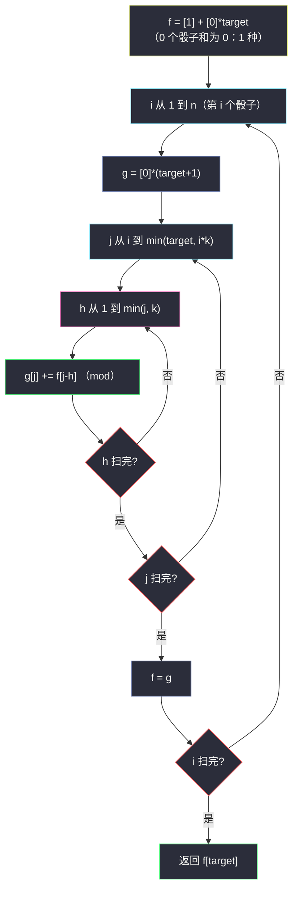

# 1155. 掷骰子等于目标和的方法数（Number of Dice Rolls With Target Sum）

> 题目来源：[https://leetcode.cn/problems/number-of-dice-rolls-with-target-sum/](https://leetcode.cn/problems/number-of-dice-rolls-with-target-sum/)
>
> 灵茶题单小节定位：§B 计数 DP 入门（多重子和）

## 一、问题描述

这里有 `n` 个一样的骰子，每个骰子上都有 `k` 个面，分别标号为 `1` 到 `k`。

给定三个整数 `n`、`k` 和 `target`，请返回投掷骰子的所有可能得到的结果（共有 `kⁿ` 种方式），使得骰子面朝上的数字总和等于 `target`。

由于答案可能很大，你需要对 `10⁹ + 7` 取模。

**数据范围**：

- `1 <= n, k <= 30`
- `1 <= target <= 1000`

**示例 1**：

```text
输入：n = 1, k = 6, target = 3
输出：1
```

**示例 2**：

```text
输入：n = 2, k = 6, target = 7
输出：6
解释：1+6, 2+5, 3+4, 4+3, 5+2, 6+1。
```

**示例 3**：

```text
输入：n = 30, k = 30, target = 500
输出：222616187
```

**核心思考点**：`n` 个骰子是**有序**的（`1+6` 与 `6+1` 不同），本质是「每位取值 1..k、总和为 target 的元组计数」——标准的多重子和计数 DP。按「第几个骰子」划分阶段，`f[i][j]` = 前 `i` 个骰子和为 `j` 的方案数，转移枚举第 `i` 个骰子的点数 `h` 累加上一层。滚动一维 + 取模随时做。

## 二、暴力解法

### 思路

`itertools.product(range(1, k+1), repeat=n)` 枚举全部 `kⁿ` 个组合，数和为 target 的个数。`kⁿ` 最大 `30³⁰`，仅作小样例对拍基准。

### 代码

```python
from itertools import product

def numRollsToTargetBrute(n: int, k: int, target: int) -> int:
    return sum(1 for combo in product(range(1, k + 1), repeat=n)
               if sum(combo) == target)
```

### 复杂度

- 时间：`O(kⁿ · n)`。`n = k = 30` 时天文数字。
- 空间：`O(n)`。

## 三、优化探索

### 3.1 阶段化：一个骰子一层 ⭐⭐

骰子之间独立但**有序**——「第 i 个骰子掷出 h」是互斥可加的事件。定义 `f[i][j]` = 用 `i` 个骰子凑出和 `j` 的方案数：

```text
f[0][0] = 1                        （零骰子凑零和，空方案）
f[i][j] = Σ_{h=1..min(j, k)} f[i-1][j - h]
```

第 `i` 个骰子的点数 `h` 把「和 j」拆回「和 j−h 的前 i−1 个骰子」。答案 `f[n][target]`。

### 3.2 可行值域剪枝 ⭐

`i` 个骰子的和落在 `[i, i·k]` 之外必为 0——循环上界取 `min(target, i*k)`、枚举 `h` 时 `j − h ≥ i−1`（留给前面骰子的最小和）可少扫空格子。数据规模下非必需，但思维上要清楚「为什么越界是 0」。

### 3.3 滚动数组 + 边界哨兵 ⭐

转移只依赖上一层——压成两个一维数组（或一个数组倒着刷，但这里是「上一层多个格子求和」，正序重建新数组更清晰）。取模**每轮都做**，加法链长达 `k·target` 次不取模会溢出（Python 无碍但习惯要养）。



## 四、代码实现

### 主解：滚动一维计数 DP

```python
class Solution:
    def numRollsToTarget(self, n: int, k: int, target: int) -> int:
        MOD = 10 ** 9 + 7
        f = [1] + [0] * target          # f[j]: 当前骰子数下和为 j 的方案数
        for i in range(1, n + 1):       # 第 i 个骰子
            g = [0] * (target + 1)
            for j in range(i, min(target, i * k) + 1):   # 和的可行域 [i, i*k]
                g[j] = sum(f[j - h] for h in range(1, min(j, k) + 1)) % MOD
            f = g
        return f[target]
```

### 进阶：二维完整表（教学对照版）

```python
class Solution:
    def numRollsToTarget(self, n: int, k: int, target: int) -> int:
        MOD = 10 ** 9 + 7
        f = [[0] * (target + 1) for _ in range(n + 1)]
        f[0][0] = 1
        for i in range(1, n + 1):
            for j in range(i, min(target, i * k) + 1):
                for h in range(1, min(j, k) + 1):
                    f[i][j] = (f[i][j] + f[i - 1][j - h]) % MOD
        return f[n][target]
```

### 细节说明

- **`f[0][0] = 1` 的空方案锚点**：所有「恰好用 i 个物品凑 j」类计数的初始化惯例——零物品凑零和恰有一种（什么都不选）；`f[0][j>0] = 0`。
- **内层求和上界 `min(j, k)`**：点数最大 k；`j − h ≥ 0` 由上界保证。
- **`j` 循环起点 `i`、终点 `min(target, i*k)`**：i 个骰子和至少 i、至多 i·k，域外恒 0,跳过。
- **每轮 `% MOD`**：加法计数 DP 的取模节奏——每次累加完就取，别攒到最后。
- **为什么不是 `C(n + target − 1, ...)` 组合数**：骰子点数有上界 k 且有序，普通隔板法不适用；若 k 无限（每位任意正数）才可退化成组合数。

## 五、例子演示

**示例 2 端到端：n = 2, k = 6, target = 7**

| 阶段 | 表（j = 0..7） |
|---|---|
| i=0 | `[1, 0, 0, 0, 0, 0, 0, 0]` |
| i=1 | j=1..6 各 1：`[0, 1, 1, 1, 1, 1, 1, 0]` |
| i=2 | j=2: 1（1+1）；j=3: 2（1+2/2+1）；j=4: 3；j=5: 4；j=6: 5；**j=7: f[1][6]+f[1][5]+...+f[1][1] = 6**；j 超 12 截止于 7 |

`f[7] = 6` → 返回 **6** ✅。核对转移：`g[7] = Σ_{h=1..6} f[7-h] = f[6]+f[5]+f[4]+f[3]+f[2]+f[1] = 1+1+1+1+1+1 = 6`——六个有序对 `1+6, 2+5, 3+4, 4+3, 5+2, 6+1` 各贡献一次。

**示例 1：n = 1, k = 6, target = 3**：i=1 层 `g[3] = f[2] + f[1] + f[0]`——等等，`h ≤ min(3,6)=3`，`g[3] = f[3-1] + f[3-2] + f[3-3] = f[2]+f[1]+f[0] = 0+0+1 = 1`（只有 `f[0]=1` 有效：一个骰子直接掷出 3）→ 返回 **1** ✅。

**可行性反例：n = 2, k = 3, target = 7**：i=2 时 j 上界 `min(7, 6) = 6`，`g[7]` 保持 0 → 返回 **0**（两骰子和至多 6）。

## 六、复杂度分析

设 `n, k, T`（= target）：

- **时间复杂度：`O(n·T·k)`**——三层循环。上限 `30×1000×30 ≈ 9×10⁵`。
- **空间复杂度：`O(T)`**（滚动版）或 `O(n·T)`（二维版）。

## 七、对比总结

| 维度 | 暴力枚举 | 主解（滚动计数 DP） |
|---|---|---|
| 时间 | `O(kⁿ·n)` | `O(n·T·k)` |
| 空间 | `O(n)` | `O(T)` |
| 本质 | 枚举结果 | 按骰子分阶段加法原理 |

**套路归纳**：**「有序多重取和」计数的万能模板**——状态 `(前 i 个, 和 j)`、转移枚举当前位的取值、初始化 `f[0][0]=1`、答案 `f[n][target]`。同款骨架通吃：爬楼梯（每位 1/2）、解码方法、骰子目标、零钱兑换 II 的「有序版」。三个习惯性细节：可行域剪枝（`[i, i·k]`）、每轮取模、`min(j, k)` 双上界。进阶方向是前缀和把内层 `Σ` 压成 `O(1)`（转移区间连续时适用，本题 `h ∈ [1, k]` 连续，可做 `O(n·T)`，留给读者）。

## 八、举一反三

1. **[70. 爬楼梯](https://leetcode.cn/problems/climbing-stairs/)**：每步 1/2 的最小版「骰子」（k=2、和=target 恰是阶数）。
2. **[2466. 统计构造好字符串的方案数](https://leetcode.cn/problems/count-ways-to-build-good-strings/)**：每步加 zero 或 one——「双面骰子」计数，批 21 待写。
3. **[518. 零钱兑换 II](https://leetcode.cn/problems/coin-change-ii/)**：**无序**组合计数——与本题对照「物品顺序敏感与否」决定外层循环是物品还是和。
4. **[2400. 恰好移动 k 步到达某一位置的方法数目](https://leetcode.cn/problems/number-of-ways-to-reach-a-position-after-exactly-k-steps/)**：本批姊妹篇，±1 移动的计数（k=2 的位置版），含组合数学闭式解。
5. **[377. 组合总和 Ⅳ](https://leetcode.cn/problems/combination-sum-iv/)**：与本题完全同构的「有序取和」计数（数值可复用）。

**同族互引**：灵茶题单计数 DP 开篇；`number-of-ways-to-reach-a-position-after-exactly-k-steps.md`（#2400，本批）把「面数」换成「±1 方向」并展示组合数学路线。
