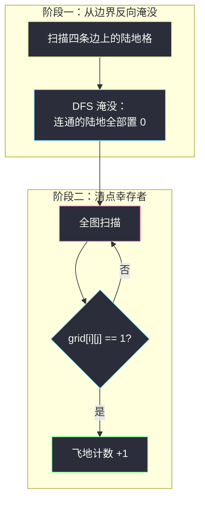

# 飞地的数量（网格图 DFS · 从边界反向淹没）

## 一、问题描述

给你 `m x n` 的二元网格 `grid`，`1` 表示陆地、`0` 表示海水。从某个陆地格出发，每次可以向上、下、左、右移动一格，但只能进入陆地格。

**飞地**（enclave）定义：从该陆地格出发，**无论怎么移动都无法走出网格边界**的陆地格（即移动有限步后必然还留在网格内）。请你返回网格中**飞地的数量**。

> 🔗 LeetCode 1020：https://leetcode.cn/problems/number-of-enclaves/
>
> 数据范围：`1 <= m, n <= 500`，`grid[i][j]` 为 `0` 或 `1`。

**示例 1**

```
输入：grid = [[0,0,0,0],[1,0,1,0],[0,1,1,0],[0,0,0,0]]
输出：3
解释：左下那块 1（(1,2),(2,1),(2,2)）被海水完全包围，是飞地；
     而 (1,0) 与边界相连，能走出去，不算。
```

**示例 2**

```
输入：grid = [[0,1,1,0],[0,0,1,0],[0,1,1,0],[0,0,0,0]]
输出：0
解释：所有陆地都连着边界，没有飞地。
```

**直观理解**

「能不能走出去」是个可达性问题。正向问每个格子太散；反过来想——**能与边界相连的陆地一定能走出去**（沿着连通路径走到边界格子、再迈一步就出去了）。于是陆地被分成两类：与边界连通的（非飞地）、被海完全包围的（飞地）。统计后者，用「从边界出发的反向 DFS 淹没」最顺。

---

## 二、暴力解法

按定义直译：对每个陆地格，从它出发做一次可达性搜索，看能否碰到网格边界。

```python
class Solution:
    def numEnclaves(self, grid: List[List[int]]) -> int:
        m, n = len(grid), len(grid[0])
        DIRS = (1, 0), (-1, 0), (0, 1), (0, -1)

        def can_escape(i: int, j: int) -> bool:
            st = [(i, j)]
            seen = {(i, j)}
            while st:
                x, y = st.pop()
                if x == 0 or x == m - 1 or y == 0 or y == n - 1:
                    return True              # 站上边界格 → 能走出去
                for dx, dy in DIRS:
                    nx, ny = x + dx, y + dy
                    if grid[nx][ny] == 1 and (nx, ny) not in seen:
                        seen.add((nx, ny))
                        st.append((nx, ny))
            return False

        return sum(1 for i in range(m) for j in range(n)
                   if grid[i][j] == 1 and not can_escape(i, j))
```

细节：`can_escape` 里只有「非边界格」才会扩散，所以邻居 `(nx, ny)` 永远不会越界，无需范围检查。

### 复杂度

- **时间**：`O((mn)²)`——同一连通块的每个格子都要把整块重新搜一遍。`m, n = 500` 时最坏约 `6 * 10^10` 次操作，严重超时。
- **空间**：`O(mn)`——每个起点的 `seen` 集合。

### 🔴 瓶颈在哪里

和所有「逐点独立做可达性」的暴力一样，重复劳动爆炸：块内 `k` 个格子，同一块被搜 `k` 遍。而「能不能出去」对所有同块格子答案相同——连通性是**整块的属性**，不是单格的属性。需要一个能按块计算的视角。

---

## 三、优化探索（核心章节）

> 📚 本题出自灵茶题单 **「网格图 DFS 基础 · 一、网格图 DFS」** 小节，核心套路是**从边界反向 DFS 淹没**：不从格子问边界，而从边界扫格子。这一招同时是 #1254 封闭岛屿、#130 被围绕的区域、#417 太平洋大西洋的同源解法。

### 3.1 正难则反：可达性是对称的

「格 A 能走到边界格 B」⟺「从 B 能走到 A」（四连通无向）。所以：

```
非飞地 = 与某个边界陆地格连通的陆地
飞地   = 陆地 − 非飞地
```

与其对每个陆地格正向搜索，不如**只从边界陆地格出发做一次反向搜索**，标记所有可达格子。

### 3.2 淹没法：标记就用「置 0」

把「能走到边界的陆地」全部改成 `0`——想象海水从边界漫上来，把所有与边界相连的陆地淹掉。淹完之后：

- 剩下的 `1` 全是**与任何边界陆地都不连通**的陆地，恰好就是飞地；
- 淹没（置 0）同时充当访问标记，天然防止重复访问，不需要 `visited`。



### 3.3 为什么只扫边界就够了

边界格子只有 `2m + 2n − 4` 个，且任何一个「非飞地」的陆地必然连通到其中某个边界格——反向搜索从这 `2m + 2n` 个种子出发即可全覆盖。每个格子只被访问一次，总代价 `O(mn)`。

### 3.4 递归还是显式栈：本题必须小心深度

`m, n ≤ 500`，全陆极端情况下连通块有 `2.5 * 10^5` 格，Python 递归会**爆栈**（默认上限约 1000）。两个选择：

1. **显式栈 / BFS**（推荐，提交零风险）；
2. 递归 + `sys.setrecursionlimit`（思维更简洁，但要记住调上限）。

递归版淹没函数（模板展示用）：

```python
def dfs(i: int, j: int) -> None:
    if not (0 <= i < m and 0 <= j < n) or grid[i][j] == 0:
        return                      # 越界或水（含已淹没）：不出海
    grid[i][j] = 0                  # 淹没 = 访问标记
    for dx, dy in DIRS:
        dfs(i + dx, j + dy)
```

### 3.5 一句话核心

> 从四条边的陆地格出发 DFS，把连通陆地全部置 0（「淹死」能走出去的）；剩下的 `1` 全是飞地，`sum` 一把即为答案。两趟合计 `O(mn)`。

---

## 四、代码实现

### Python（主解：显式栈淹没，防深递归）

```python
class Solution:
    def numEnclaves(self, grid: List[List[int]]) -> int:
        m, n = len(grid), len(grid[0])
        DIRS = (1, 0), (-1, 0), (0, 1), (0, -1)

        def flood(i: int, j: int) -> None:
            grid[i][j] = 0                      # 种子先淹
            st = [(i, j)]
            while st:
                x, y = st.pop()
                for dx, dy in DIRS:
                    nx, ny = x + dx, y + dy
                    if 0 <= nx < m and 0 <= ny < n and grid[nx][ny] == 1:
                        grid[nx][ny] = 0        # 入栈即淹，防重复入栈
                        st.append((nx, ny))

        for j in range(n):                      # 上、下两条边
            if grid[0][j] == 1:
                flood(0, j)
            if grid[m - 1][j] == 1:
                flood(m - 1, j)
        for i in range(m):                      # 左、右两条边
            if grid[i][0] == 1:
                flood(i, 0)
            if grid[i][n - 1] == 1:
                flood(i, n - 1)

        return sum(map(sum, grid))              # 幸存的 1 全是飞地
```

**变量含义**

| 变量 / 函数 | 含义 |
|-------------|------|
| `flood(i, j)` | 从边界格 `(i, j)` 出发，淹掉整个连通块（含种子本身） |
| `grid[nx][ny] = 0` | 「入栈即淹」：置 0 与入栈同刻完成，杜绝重复入栈 |
| `sum(map(sum, grid))` | 剩余陆地格总数，即飞地数 |

**循环不变式**：边界扫描结束后，「与边界陆地连通」的陆地全部为 0，且每个格子至多入栈一次。

### Python（递归版对照：更接近灵神模板）

```python
class Solution:
    def numEnclaves(self, grid: List[List[int]]) -> int:
        m, n = len(grid), len(grid[0])
        DIRS = (1, 0), (-1, 0), (0, 1), (0, -1)

        def dfs(i: int, j: int) -> None:
            if not (0 <= i < m and 0 <= j < n) or grid[i][j] == 0:
                return
            grid[i][j] = 0                      # 淹没 = 标记
            for dx, dy in DIRS:
                dfs(i + dx, j + dy)

        for j in range(n):
            dfs(0, j)
            dfs(m - 1, j)
        for i in range(m):
            dfs(i, 0)
            dfs(i, n - 1)
        return sum(map(sum, grid))
```

递归版入口不必判 `grid[i][j] == 1`（函数入口条件兜底）；但注意 Python 提交需 `sys.setrecursionlimit(10 ** 6)` 一类保护，否则大规模数据可能 `RecursionError`。

---

## 五、具体例子演示

### 例 1：示例 1 端到端跟踪

```
grid（1 陆 0 海）:
0 0 0 0
1 0 1 0
0 1 1 0
0 0 0 0
```

**阶段一：边界扫描找种子**

| 边 | 边界格子值 | 种子 |
|----|------------|------|
| 第一行 (0, j) | `0 0 0 0` | 无 |
| 最后一行 (3, j) | `0 0 0 0` | 无 |
| 第一列 (i, 0) | `0 1 0 0` | **(1,0)** |
| 最后一列 (i, 3) | `0 0 0 0` | 无 |

只有 `(1,0)` 一个种子。以递归版走轨迹（方向：下、上、右、左；淹没 = 置 0）：

| # | 进入 dfs | 淹没动作 | 下 | 上 | 右 | 左 |
|---|----------|----------|----|----|----|----|
| 1 | (1,0) | (1,0)→0 | (2,0)=0 海，返回 | (0,0)=0 海，返回 | (1,1)=0 海，返回 | (1,-1) 越界，返回 |

种子块的淹没一步结束。淹没后的矩阵快照：

```
0 0 0 0
0 0 1 0     ← (1,0) 被淹
0 1 1 0
0 0 0 0
```

**阶段二：清点幸存者**

剩余的 `1`：`(1,2)`、`(2,1)`、`(2,2)`，共 **3** 个 ✓

验证它们确实是飞地：`(1,2)` 的四邻 `(0,2) (2,2) (1,1) (1,3)` 中唯一陆地 `(2,2)` 也不贴边；整块被海包死，走不出去。

### 例 2：示例 2（无飞地）

```
0 1 1 0
0 0 1 0
0 1 1 0
0 0 0 0
```

边界种子：第一行 `(0,1)`、`(0,2)`。从 `(0,1)` 淹没：右邻 `(0,2)`、`(0,2)` 下邻 `(1,2)`、`(1,2)` 下邻 `(2,2)`、`(2,2)` 左邻 `(2,1)`——一淹到底，全部陆地清零。阶段二扫不到 `1`，输出 **0** ✓

### 例 3：BFS 扩散层数视角（同一淹没过程）

把种子入队看第 0 层，BFS 逐层淹没（以示例 2 为例）：

| 层 | 出队格子 | 新淹没并入队 |
|----|----------|--------------|
| 0 | (0,1)、(0,2) | 边界种子，入队即淹 |
| 1 | (0,1)：下邻 (1,1)=0 无果；(0,2)： | (0,2) 下邻 (1,2)=1 → 淹 |
| 2 | (1,2) | (2,2) → 淹 |
| 3 | (2,2) | (2,1) → 淹 |
| 4 | (2,1) | 无（(3,1)=0、(2,0)=0） |
| — | 队列空 | 淹没结束，剩余 1 计数为 0 |

DFS 与 BFS 只是淹没顺序不同，「每个格子恰好淹一次」的保证是同一个。

---

## 六、复杂度分析

| 方法 | 时间 | 空间 | 说明 |
|------|------|------|------|
| 逐格正向判断（暴力） | `O((mn)²)` | `O(mn)` | 同块重复搜索 |
| 边界反向淹没 | `O(mn)` | `O(mn)` 栈 / `O(1)` 递归版不计栈 | 每格恰好访问一次 |

---

## 七、对比总结

**「从边界反向淹没」家族**：凡是「与边界相连与否」决定去留的问题，都能用这招。

| 题 | 淹掉谁 | 剩下怎么算 |
|----|--------|------------|
| **#1020 本篇** | 与边界连通的陆地 | 数剩余 `1` 的**格子数** |
| #1254 封闭岛屿 | 与边界连通的陆地 | 数剩余陆地的**连通块个数** |
| #130 被围绕的区域 | 不动边界连通的 `O`，翻非连通的 | 把剩余 `O` 翻成 `X` |
| #417 太平洋大西洋 | （标记而非淹没）从两片边界反向可达集 | 取交集 |

#1020 与 #1254 是**同一套路、两种问法**：一问「剩多少格子」，一问「剩多少块岛」——只差最后一步的统计方式。

**易错点**

1. **四条边都要扫**：漏掉任何一条边，那条边上的非飞地就漏淹，答案偏大。
2. **淹没即标记**：别再加 `visited`——置 0 已包含标记语义，双标记徒增 bug 面。
3. **防重复入栈**：栈版必须「入栈即置 0」（或出栈时检查 `grid == 0` 跳过），否则同一格反复入栈，最坏指数膨胀。
4. **递归深度**：`500 x 500` 全陆时递归 25 万层，Python 必须用栈/BFS 或调大递归上限。
5. 别把「能走出去」误读成「与水相邻」——能走出去靠的是**与边界陆地连通**，水路不通。

主解 `flood` 加上阶段一的四趟边界扫描就是本套路的全部：入口条件挡住越界与水、入栈即淹防重复、末尾 `sum` 一把收尾——把末尾换成「扫到一块、淹一块、计数一块」，就得到 #1254。

---

## 八、举一反三

| 题目 | 关系 |
|------|------|
| [1254. 统计封闭岛屿的数目](https://leetcode.cn/problems/number-of-closed-islands/) | 同一套路数**岛屿个数**而非格子数，0 还是陆地，见同批 `number-of-closed-islands.md` |
| [130. 被围绕的区域](https://leetcode.cn/problems/surrounded-regions/) | 淹没边界连通 `O`、翻转剩余 `O`，同一招的「改值」版 |
| [417. 太平洋大西洋水流问题](https://leetcode.cn/problems/pacific-atlantic-water-flow/) | 从两片海边界反向 DFS/BFS 收集可达集再取交集 |
| [463. 岛屿的周长](https://leetcode.cn/problems/island-perimeter/) | 网格 DFS 入门（贡献法可绕开），见同批 `island-perimeter.md` |
| [695. 岛屿的最大面积](https://leetcode.cn/problems/max-area-of-island/) | 分量遍历正向统计的对照练习 |
| [1905. 统计子岛屿](https://leetcode.cn/problems/count-sub-islands/) | 连通分量间的包含关系判定，分量思想的进阶 |

**思想迁移**

- 「**能否离开/是否被包围**」类网格题，先把判断对象从格子提升到**连通块**，再「正难则反」从边界做反向可达。
- 「淹没」（改值当标记）是网格题最常用的标记手法，前提是题目允许破坏原值、或不需要保留原值。
- 口诀：**「想出界，问边界；边界淹没剩飞地；数格数块随便你，四条边上一格不能漏。」**
