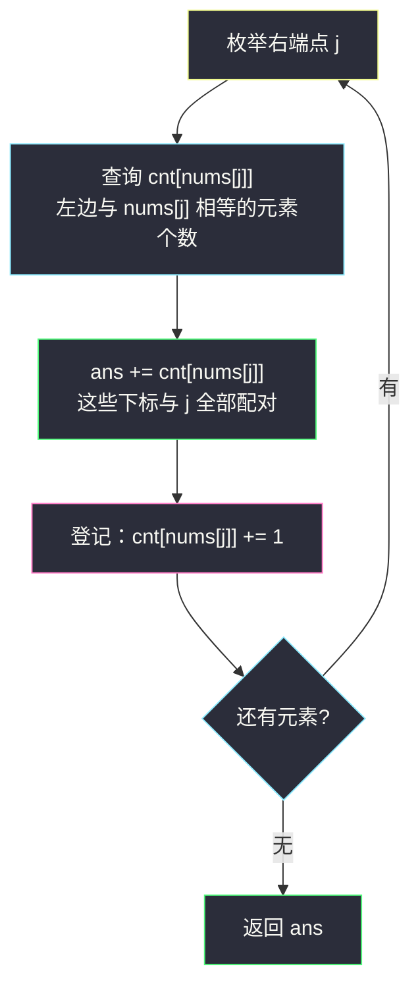
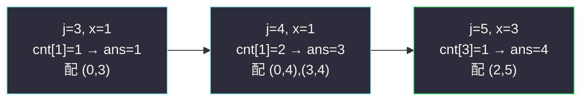

# 好数对的数目（哈希计数 · 枚举右，维护左）

## 一、问题描述

给你一个整数数组 `nums`。如果一对下标 `(i, j)` 满足 `i < j` 且 `nums[i] == nums[j]`，就称 `(i, j)` 是一对**好数对**。返回好数对的数目。

> 🔗 LeetCode 1512：https://leetcode.cn/problems/number-of-good-pairs/
>
> 数据范围：`1 <= nums.length <= 100`，`1 <= nums[i] <= 100`。

**示例 1**

```
输入：nums = [1,2,3,1,1,3]
输出：4
解释：4 组好数对分别是 (0,3)、(0,4)、(3,4)、(2,5)，下标从 0 开始。
```

**示例 2**

```
输入：nums = [1,1,1,1]
输出：6
解释：任意两个下标都构成好数对，共 C(4,2) = 6 组。
```

**示例 3**

```
输入：nums = [1,2,3]
输出：0
解释：没有重复元素，不存在好数对。
```

**直观理解**

这是「统计满足条件的下标对」的最入门形态：条件只有两个——顺序（`i < j`）与相等（`nums[i] == nums[j]`）。它是灵神题单 **§0.1 枚举右，维护左** 的第一课：从左往右枚举右端点，用哈希表维护「左边每个值出现了几次」，当前元素一到场，**先查询、再登记**。后面几道题（#2441、#2364、#3805）都是这个骨架的变体。

---

## 二、暴力解法

双重循环枚举所有下标对，逐对判定：

```python
class Solution:
    def numIdenticalPairs(self, nums: List[int]) -> int:
        ans = 0
        for i in range(len(nums)):
            for j in range(i + 1, len(nums)):
                if nums[i] == nums[j]:
                    ans += 1
        return ans
```

### 复杂度

- **时间**：`O(n²)`。本题 `n ≤ 100`，约 5000 次比较，轻松通过。
- **空间**：`O(1)`。

### 🔴 瓶颈在哪里

对每个 `j` 都要把左边的元素从头再看一遍，**「左边有哪些值、各出现几次」这份信息被反复重新统计**。本题数据小无所谓，但一旦 `n` 上到 `10^5`（比如姊妹题 [#2364 统计坏数对的数目](https://leetcode.cn/problems/count-number-of-bad-pairs/)），`O(n²)` 直接超时。优化方向自然浮现：把左边的信息**一次性存进哈希表**，边扫边查。

---

## 三、优化探索（核心章节）

> 📚 本题在灵茶题单中属于 **§0.1 枚举右，维护左**（常用数据结构 A · 哈希表）。模板三步：**枚举右端点 `j` → 用 `nums[j]` 查询哈希表中「左边」的信息 → 把 `nums[j]` 登记进哈希表**。顺序千万不能反：先查后存，才不会把自己和自己配对。

### 3.1 观察特征

| 特征 | 说明 |
|------|------|
| 统计下标对，且要求 `i < j` | 固定右端点 `j`，只关心左边的元素 |
| 配对条件是 `nums[i] == nums[j]` | 只与「值」有关 → 哈希表按值索引 |
| 每次只需要「值出现了几次」 | `cnt[v]`：左边值为 `v` 的元素个数 |

### 3.2 枚举右端点，哈希表维护左边

固定 `j`：能与 `nums[j]` 配对的 `i`，正是左边值为 `nums[j]` 的那些下标，个数就是 `cnt[nums[j]]`。让 `j` 从左往右移动，每步查询完再把 `nums[j]` 计入 `cnt`，单趟就能数完全部好数对：



**为什么必须先查后存**：查询发生在登记之前，哈希表里只装着下标小于 `j` 的元素，天然满足 `i < j`，绝不会出现 `(j, j)` 自配。这是整个模板正确性的根基。

### 3.3 等价的「分组 + 组合数」视角

扫完一遍后，若值 `v` 总共出现 `c` 次，任取两个都是好数对，共 `c*(c-1)/2` 组。于是也可以：

```python
ans = sum(c * (c - 1) // 2 for c in Counter(nums).values())
```

两个视角完全等价：枚举右端点时累加的 `cnt[key]`，最终恰好把每组内的每一对 `(i, j)` 各算一次，总和就是 `c*(c-1)/2`。选择上有个小经验——**顺序敏感（要求 `i < j`、涉及下标运算）用「先查后存」单趟版**（如 [#2364](https://leetcode.cn/problems/count-number-of-bad-pairs/)）；**顺序无关、只问「同组配对」用「分组组合数」版**（如 [#2001](https://leetcode.cn/problems/number-of-pairs-of-interchangeable-rectangles/)、本批的 [#3805 统计凯撒加密对数目](https://leetcode.cn/problems/count-caesar-cipher-pairs/)）。

### 3.4 一句话核心

> **从左往右枚举右端点，哈希表按值维护左边出现次数；每个 `j` 先累加 `cnt[nums[j]]`，再自增登记——单趟 `O(n)` 数完全部好对。**

---

## 四、代码实现

### Python（主解：枚举右，维护左）

```python
class Solution:
    def numIdenticalPairs(self, nums: List[int]) -> int:
        ans = 0
        cnt = defaultdict(int)          # 值 -> 左边出现次数
        for x in nums:                  # 枚举右端点 j（值为 x）
            ans += cnt[x]               # 先查：左边有多少个与 x 相等
            cnt[x] += 1                 # 后存：x 登记，供后续查询
        return ans
```

**变量含义**

| 变量 | 含义 |
|------|------|
| `x` | 当前枚举的右端点元素 `nums[j]` |
| `cnt[v]` | 下标小于 `j` 且值为 `v` 的元素个数 |
| `ans += cnt[x]` | 以 `j` 为右端点的好数对个数 |

**循环不变式**：处理 `nums[j]` 之前，`cnt` 恰好记录 `nums[0..j-1]` 的值计数；因此 `cnt[x]` 正是能与 `j` 配对的左下标个数。

本题值域只有 `1..100`，用长度 101 的数组代替哈希表（`cnt = [0] * 101`）也可以，但 `defaultdict` 写法不依赖值域，迁移到其它题时直接复用。

---

## 五、具体例子演示

以 `nums = [1,2,3,1,1,3]` 单趟走完，盯住每一行「哈希表（查询前）→ 配对数 → 哈希表（登记后）」的变化：

| j | nums[j] | 哈希表（查询前） | cnt[nums[j]] | ans 累计 | 哈希表（登记后） |
|---|---------|------------------|--------------|----------|------------------|
| 0 | 1 | `{}` | 0 | 0 | `{1:1}` |
| 1 | 2 | `{1:1}` | 0 | 0 | `{1:1, 2:1}` |
| 2 | 3 | `{1:1, 2:1}` | 0 | 0 | `{1:1, 2:1, 3:1}` |
| 3 | 1 | `{1:1, 2:1, 3:1}` | 1 | 1 | `{1:2, 2:1, 3:1}` |
| 4 | 1 | `{1:2, 2:1, 3:1}` | 2 | 3 | `{1:3, 2:1, 3:1}` |
| 5 | 3 | `{1:3, 2:1, 3:1}` | 1 | **4** | `{1:3, 2:1, 3:2}` |

逐步对应的好数对：`j=3` 配 `(0,3)`；`j=4` 配 `(0,4)`、`(3,4)`；`j=5` 配 `(2,5)`，共 4 组 ✓。

**组合数视角复核**：最终 `cnt = {1:3, 2:1, 3:2}`，`3*2/2 + 2*1/2 = 3 + 1 = 4` ✓。

**示例 2 复核**：`nums = [1,1,1,1]`，每步 `cnt[1]` 依次为 0、1、2、3，累加 `0+1+2+3 = 6` ✓。



---

## 六、复杂度分析

| 方法 | 时间 | 空间 | 说明 |
|------|------|------|------|
| 暴力双循环 | `O(n²)` | `O(1)` | 每对独立判定 |
| 枚举右维护左 | `O(n)` | `O(min(n, V))` | 单趟扫描；`V` 为值域大小（本题 100） |

---

## 七、对比总结

**同模板最小样例**——把三步模板套到本批其它题上，只改「哈希键」与「查询内容」：

| 题 | 哈希键 | 查询与汇聚 |
|----|--------|-----------|
| #1512 好数对（本篇） | `nums[j]` | `ans += cnt[key]` 累加 |
| #2441 最大正整数（`largest-positive-integer-that-exists-with-its-negative.md`） | 元素值 | 查 `-x` 是否存在，取 `max(abs(x))` |
| #2364 坏数对（`count-number-of-bad-pairs.md`） | `nums[j] - j` | 数好对，总数减 |
| #3805 凯撒对（`count-caesar-cipher-pairs.md`） | 字符串规范形 | `ans += cnt[key]` 累加 |

**易错点**

1. **先查后存**：若先把 `cnt[x] += 1` 再累加，会把 `(j, j)` 自己配进去，每个元素多算一次。
2. 组合数公式是 `c*(c-1)/2`，别写成 `c*c/2`。
3. 「左边」指下标更小，不是值更小——枚举方向（从左往右）保证了这一点。

**模板（枚举右维护左 · 计数配对版，Python）**

```python
ans = 0
cnt = defaultdict(int)
for x in nums:              # 枚举右端点
    ans += cnt[key(x)]      # 查询左边
    cnt[key(x)] += 1        # 登记当前
```

---

## 八、举一反三

| 题目 | 关系 |
|------|------|
| [2364. 统计坏数对的数目](https://leetcode.cn/problems/count-number-of-bad-pairs/) | 本篇的 Medium 加强版，同批题解 `count-number-of-bad-pairs.md`，键变成 `nums[j] - j` |
| [2441. 与对应负数同时存在的最大正整数](https://leetcode.cn/problems/largest-positive-integer-that-exists-with-its-negative/) | 同批姊妹题 `largest-positive-integer-that-exists-with-its-negative.md`，查询从「计数」变「存在性」 |
| [3805. 统计凯撒加密对数目](https://leetcode.cn/problems/count-caesar-cipher-pairs/) | 同批题解 `count-caesar-cipher-pairs.md`，键升级为字符串规范形 |
| [2006. 差的绝对值为 K 的数对数目](https://leetcode.cn/problems/count-number-of-pairs-with-absolute-difference-k/) | 同模板：`ans += cnt[x-k] + cnt[x+k]`，小心 `k = 0` 时重复计数 |
| [2001. 可互换矩形的数目](https://leetcode.cn/problems/number-of-pairs-of-interchangeable-rectangles/) | 「分组 + 组合数」视角练习，键是约分后的宽高比 |
| [1010. 总持续时间可被 60 整除的歌曲](https://leetcode.cn/problems/pairs-of-songs-with-total-durations-divisible-by-60/) | 键是 `时长 % 60`，同款先查后存 |

**思想迁移**

- 一切「统计下标对 `(i, j)`、条件只看值」的题，都可以**枚举右端点 + 哈希维护左边**，从 `O(n²)` 降到 `O(n)`。
- 动手前先想清楚三件事：**哈希键是什么（怎么才算「相等」）？查询什么（次数还是存在性）？登记什么？**
- 口诀：**「枚举右，查左边；先查询，后登记。」**
