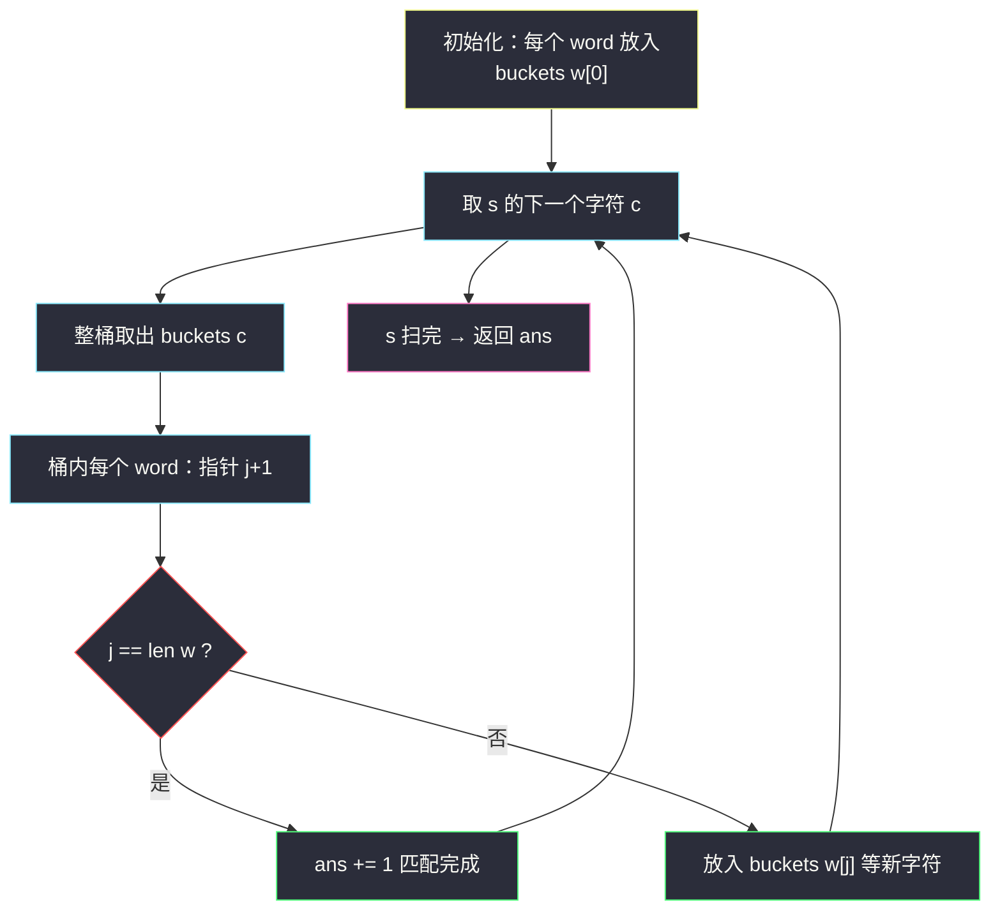

# 792. 匹配子序列的数（Number of Matching Subsequences）

> 题目来源：[https://leetcode.cn/problems/number-of-matching-subsequences/](https://leetcode.cn/problems/number-of-matching-subsequences/)
>
> 灵茶题单小节：§字符串/子序列判定

## 一、问题描述

给定字符串 `s` 和字符串数组 `words`，返回 `words` 中 **作为 `s` 的子序列** 的单词数目。

子序列不要求连续：`"acd"` 是 `"abcde"` 的子序列（跳过 `b`），而 `"bb"` 不是（`s` 中只有一个 `b`）。

**数据范围**：

- `1 <= len(s) <= 5 × 10⁴`
- `1 <= len(words) <= 5000`
- `1 <= len(words[i]) <= 10`
- 所有字符串仅由小写英文字母组成

**示例 1**：

```text
输入：s = "abcde", words = ["a","bb","acd","ace"]
输出：3
解释："a"、"acd"、"ace" 都是 "abcde" 的子序列；"bb" 不是（s 只有一个 'b'）。
```

**示例 2**：

```text
输入：s = "dsahjpjauf", words = ["ahjpjau","ja","ahbwzgqnuk","tnmlanowax"]
输出：2
```

**核心思考点**：对每个单词独立地双指针扫一遍 `s`，总代价 `O(len(s) × len(words))`，最坏 `2.5 × 10⁸` 次 Python 字符比较会超时。观察：`words` 里大量单词在等待 **同一个字符**（如都在等下一个 `a`）——把「等待同一字符」的单词放进同一个桶，扫 `s` 一趟，所有单词的指针同步前进，这就是 **分组桶** 技巧。

## 二、暴力解法

### 思路

对每个单词 `w` 用双指针在 `s` 上做子序列匹配：指针 `j` 指向 `w` 的下一个待匹配字符，从左到右扫 `s`，遇到 `s[i] == w[j]` 就 `j += 1`；扫完后 `j == len(w)` 即匹配成功。

### 代码

```python
def numMatchingSubseqBrute(s: str, words: list[str]) -> int:
    def is_subseq(w: str) -> bool:
        j = 0
        for ch in s:
            if j < len(w) and ch == w[j]:
                j += 1
        return j == len(w)

    return sum(is_subseq(w) for w in words)
```

### 复杂度

- 时间：`O(len(s) × len(words))`——每个单词都要完整扫一遍 `s`。最坏 `5 × 10⁴ × 5000 = 2.5 × 10⁸`，Python 下超时（C++ 勉强能过）。
- 空间：`O(1)`。

## 三、优化探索

### 3.1 浪费在哪

暴力解法里，`s` 的每个字符被「重新扫」了 5000 遍。但换一个视角：当扫描进行到 `s[i]` 时，每个未完成的单词都处于某个状态「正在等待字符 `c`」。**等待同一字符的单词完全同质**——它们关心的只有一件事：`s` 接下来何时出现 `c`。

### 3.2 分组桶：按「下一待匹配字符」分桶

建立 26 个桶 `buckets['a'..'z']`，桶 `c` 里存放「当前等待字符 `c`」的单词（连同已匹配进度）：

- 初始：所有单词放入 `buckets[w[0]]`；
- 扫描 `s` 的每个字符 `c`：把 `buckets[c]` **整桶取出**（先清空，桶内单词马上要换桶了），桶内每个单词指针前移一格；若已到末尾，计数 `+1`；否则放入新等待字符对应的桶。

### 3.3 为什么快

- 每个单词的每个字符只被「处理」一次：指针每前进一步，单词换一个桶，总换桶次数 = `Σ len(w) ≤ 5 × 10⁴`；
- 扫描 `s` 每个字符只做一次桶查找，`O(len(s))`。

两者相加即 `O(len(s) + Σ len(w))`，从「相乘」变成「相加」。



## 四、代码实现

### 主解：分组桶

```python
def numMatchingSubseq(s: str, words: list[str]) -> int:
    # buckets[c] = 等待字符 c 的单词迭代器列表（it = iter(word)，
    # 迭代器天然记录"下一个待匹配字符"的位置）
    buckets = [[] for _ in range(26)]
    for w in words:
        it = iter(w)
        buckets[ord(next(it)) - 97].append(it)   # 97 == ord('a')

    ans = 0
    for ch in s:
        c = ord(ch) - 97
        if not buckets[c]:                       # 快速跳过空桶
            continue
        waiting = buckets[c]                     # 整桶取出
        buckets[c] = []
        for it in waiting:
            nxt = next(it, None)                 # 指针前移一格
            if nxt is None:
                ans += 1                         # 单词走完：匹配成功
            else:
                buckets[ord(nxt) - 97].append(it)
    return ans
```

### 细节说明

- **用迭代器当指针**：`iter(w)` + `next(it)` 把「单词 + 当前进度」打包成一个对象，免去了手动维护 `(word, j)` 二元组；`next(it, None)` 返回 `None` 表示单词已匹配完。
- **整桶取出再清空**：处理 `buckets[c]` 时必须先取出旧桶并置空——因为桶内单词指针前移后，若新等待字符恰好还是 `c`，会被放回 **新桶**；不清空会导致同一轮重复处理。
- **快速跳过空桶**：`s` 中大量字符的桶是空的（尤其 `words` 较少时），先判空再进循环。
- **为什么可以中途丢弃单词**：`s` 按序扫描，单词等待的字符若永远不出现，它就永远躺在桶里，最后自然不计入 `ans`，无需显式判断失败。
- **同构改写（数组下标版）**：若不习惯迭代器，等价写法是桶里存 `(word, j)`，`next` 对应 `j + 1`，逻辑完全一致。

## 五、例子演示

用示例 1 `s = "abcde"`, `words = ["a", "bb", "acd", "ace"]` 端到端走一遍。

**初始桶状态**（按首字符分桶）：

| 桶 | 内容（下标 j 指向待匹配字符） |
|---|---|
| a | `"a"(j=0)`、`"acd"(j=0)`、`"ace"(j=0)` |
| b | `"bb"(j=0)` |
| 其余 | 空 |

**逐步扫描 `s`**：

| i | s[i] | 取出的桶 | 桶内处理 | 新桶状态变化 | ans |
|---|---|---|---|---|---|
| 0 | a | 桶 a：3 个单词 | `"a"`：j=1，走完 ✓ 计数；`"acd"`：j=1，等 'c' → 入桶 c；`"ace"`：j=1，等 'c' → 入桶 c | 桶 a 清空；桶 c 得 2 个 | 1 |
| 1 | b | 桶 b：1 个 | `"bb"`：j=1，等 'b' → 放回桶 b | 桶 b 仍 1 个 | 1 |
| 2 | c | 桶 c：2 个 | `"acd"`：j=2，等 'd' → 入桶 d；`"ace"`：j=2，等 'e' → 入桶 e | 桶 c 清空 | 1 |
| 3 | d | 桶 d：1 个 | `"acd"`：j=3，走完 ✓ 计数 | 桶 d 清空 | 2 |
| 4 | e | 桶 e：1 个 | `"ace"`：j=3，走完 ✓ 计数 | 桶 e 清空 | 3 |

`s` 扫描结束，**`ans = 3`** ✅（`"bb"` 直到最后还躺在桶 b 里等第二个 'b'，自然淘汰）。

注意第 1 步的精妙之处：一次桶操作同时推进了 3 个单词的进度——这就是「相加代替相乘」的直观体现。

```mermaid
flowchart LR
    subgraph T0["初始：按首字符分桶"]
        BA["桶 a : a acd ace"] --- BB["桶 b : bb"]
    end
    subgraph T4["s 扫描结束"]
        E1["匹配完成 ×3<br>a / acd / ace"] --- E2["桶 b : bb<br>（等待失败，被淘汰）"]
    end
    T0 -->|扫描 abcde 五步迁移| T4
    style T0 fill:#1e1f29,stroke:#6272a4
    style T4 fill:#1e1f29,stroke:#6272a4
    style BA fill:#2b2d3a,stroke:#8be9fd,color:#f8f8f2
    style BB fill:#2b2d3a,stroke:#8be9fd,color:#f8f8f2
    style E1 fill:#2b2d3a,stroke:#50fa7b,color:#f8f8f2
    style E2 fill:#2b2d3a,stroke:#ff5555,color:#f8f8f2
```



## 六、复杂度分析

设 `S = len(s)`，`W = Σ len(words[i])`（≤ `5000 × 10 = 5 × 10⁴`）：

- **时间复杂度：`O(S + W + |Σ|)`**（`|Σ| = 26` 为字符集大小）
  - 初始化分桶：`O(W)`；
  - 扫描 `s`：每个字符一次桶查找 `O(1)`，共 `O(S)`；
  - 桶内推进：每个单词的每个字符恰好被处理一次，共 `O(W)`。
  - 对比暴力 `O(S × len(words))`：乘法变加法。
- **空间复杂度：`O(W + |Σ|)`**
  - 所有桶合计存放的迭代器总数不超过 `len(words)`（每个单词任意时刻只在一个桶里），单词本身由调用方持有；26 个桶头为常数。

## 七、对比总结

| 维度 | 暴力（逐词双指针） | 主解（分组桶） |
|---|---|---|
| 时间 | `O(S × len(words))` | `O(S + W)` |
| 空间 | `O(1)` | `O(W + 26)` |
| s 的扫描次数 | 5000 次（每词一次） | 1 次 |
| 实现心智 | 简单直接 | 需要理解「整桶取出」 |
| 适用规模 | `S × len(words) ≤ 10⁷` 量级 | 本题满规模轻松通过 |

**套路归纳**：分组桶是「**多模式串等待同一条主串**」场景的通用加速器——本质是把所有模式串的匹配状态压缩成 26 类同质状态，让主串每走一步、全部模式串同步前进。它与多模式串匹配的 AC 自动机（字典树 + 失配指针）解决同一类问题：本题单词极短（≤ 10）用分组桶最划算；若单词很长且数量巨大，AC 自动机 `O(S + ΣW)` 更系统化。

## 八、举一反三

1. **[392. 判断子序列](https://leetcode.cn/problems/is-subsequence/)**：单对单的子序列判定（本题的最小单元），双指针即可。
2. **[522. 最长特殊序列 II](https://leetcode.cn/problems/longest-uncommon-subsequence-ii/)**：批量判断「谁是谁的子序列」，与本题共享逐词判定的骨架。
3. **[524. 通过删除字母匹配到字典里最长单词](https://leetcode.cn/problems/longest-word-in-dictionary-through-deleting/)**：s 与字典匹配 + 挑最优解，分组桶可直接套用。
4. **[1143. 最长公共子序列](https://leetcode.cn/problems/longest-common-subsequence/)**：通用双序列 DP 视角，理解「子序列匹配」的 DP 本质（本题贪心双指针是「s 只扫一遍」下的特例）。
5. **[139. 单词拆分](https://leetcode.cn/problems/word-break/)**：另一种「主串 × 字典」的批量匹配（子串版），对比记忆桶的用法差异。

**同族互引**：本篇是灵茶题单「字符串匹配」小节的批量子序列判定题，与 [392. 判断子序列](https://leetcode.cn/problems/is-subsequence/)（单串版）正反馈配对：先在 #392 吃透双指针贪心，再来本题看「分组桶」如何把 5000 次扫描合并成 1 次。
