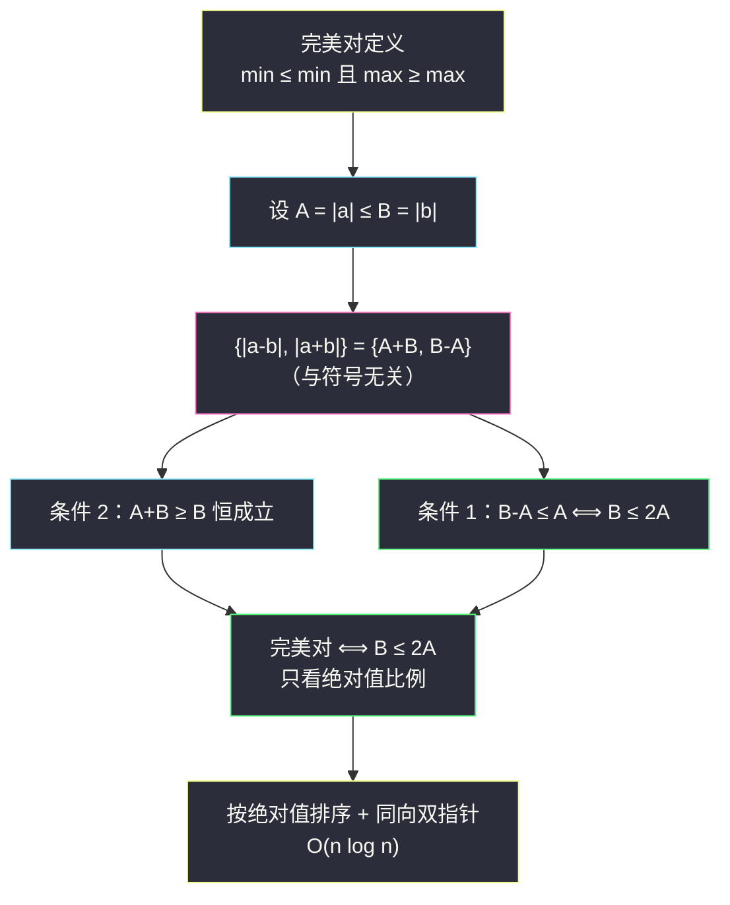
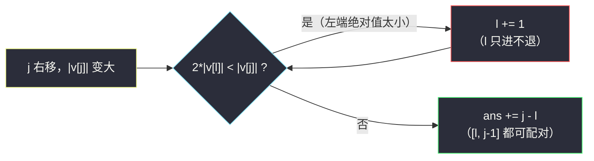

# 完美对的数目（排序 + 同向双指针 · 绝对值比例）

## 一、问题描述

给定一个整数数组 `nums`，下标从 `0` 开始。对于下标对 `(i, j)`（`i < j`），记 `a = nums[i]`、`b = nums[j]`，如果同时满足下面两个条件，则称 `(i, j)` 是一个**完美对**：

1. `min(|a-b|, |a+b|) <= min(|a|, |b|)`
2. `max(|a-b|, |a+b|) >= max(|a|, |b|)`

返回 `nums` 中完美对的总数。

> 🔗 LeetCode 3649：https://leetcode.cn/problems/number-of-perfect-pairs/
>
> 数据范围：`2 <= nums.length <= 10^5`，`-10^9 <= nums[i] <= 10^9`。注意答案最大可达 `n(n-1)/2 ≈ 5 * 10^9`，超过 32 位整数（Java 需 `long`）。

**示例 1**

```
输入：nums = [0,1,2,3]
输出：2
解释：完美对是 (1,2) 和 (2,3)：
     (1,2)：min(|1-2|,|1+2|) = 1 ≤ min(1,2) = 1，max = 3 ≥ 2 ✓
     (2,3)：min(|2-3|,|2+3|) = 1 ≤ min(2,3) = 2，max = 5 ≥ 3 ✓
     其余对（如 (1,3)：min(2,4) = 2 > 1 ✗）不满足条件一。
```

**直观理解**

条件里又是 `|a-b|` 又是 `|a+b|`，看上去和**符号**纠缠不清。但把两数按绝对值大小设为 `A ≤ B` 后会发现：无论同号异号，`|a-b|` 和 `|a+b|` 恰好就是 `A+B` 和 `B-A` 的某种排列——**符号根本不影响这一对值的集合**。于是两个条件都只跟绝对值有关，题目摇身一变成「绝对值比例」计数，排序后同向双指针一遍扫完。

---

## 二、暴力解法

枚举所有下标对，按定义直接判断。

```python
class Solution:
    def countPerfectPairs(self, nums: List[int]) -> int:
        n, ans = len(nums), 0
        for i in range(n):
            for j in range(i + 1, n):
                a, b = nums[i], nums[j]
                lo, hi = min(abs(a - b), abs(a + b)), max(abs(a - b), abs(a + b))
                if lo <= min(abs(a), abs(b)) and hi >= max(abs(a), abs(b)):
                    ans += 1
        return ans
```

### 复杂度

- **时间**：`O(n²)`。
- **空间**：`O(1)`。

### 🔴 瓶颈在哪里

`n = 10^5` 时约 `5 * 10^9` 次判断，远超时限。每个数对独立判断，没有利用任何结构——突破口是先把「判断条件」化简到一个只依赖绝对值排序序的形式。

---

## 三、优化探索（核心章节）

> 📚 本题在灵茶题单中挂在 **§3.3 同向双指针**。常见的数对计数套路：排序后固定一端，另一端指针只前进不后退（同向双指针），每步 `O(1)` 地累加贡献，总复杂度 `O(n log n)`。

### 3.1 关键引理：|a±b| 的取值与符号无关

设 `A = |a|`、`B = |b|`，不妨 `A <= B`。分两种情形验证：

| 情形 | \|a+b\| | \|a-b\| |
|------|---------|---------|
| a、b 同号（含其中之一为 0） | `A+B` | `B-A` |
| a、b 异号 | `B-A` | `A+B` |

两种情形只是把两个值**交换了位置**，集合恒为 `{A+B, B-A}`。（含 `0` 时两式都成立，可归入任一情形。）

于是：

- `min(|a-b|, |a+b|) = B-A`（因为 `A+B >= B-A` 恒成立）；
- `max(|a-b|, |a+b|) = A+B`。

**两个条件瞬间现出原形：**

1. `min <= min(|a|,|b|)` 即 `B-A <= A`，化简得 **`B <= 2A`**；
2. `max >= max(|a|,|b|)` 即 `A+B >= B`，即 `A >= 0`，**恒成立**。

### 3.2 等价条件

> **(i,j) 是完美对 ⟺ max(|a|,|b|) <= 2 * min(|a|,|b|)**

纯粹是「较大绝对值不超过较小绝对值的两倍」，与正负号完全无关。顺手验证两个特例：

- `(0, 0)`：`A = B = 0`，`0 <= 0` ✓，是完美对（直接按定义验证 `min(0,0) <= 0` 也成立）；
- `(0, x)`（`x ≠ 0`）：`B = |x| > 0 = 2A` ✗，不是完美对——**0 只和 0 互配**。

用示例 1 复核：`(1,2)`：`2 <= 2` ✓；`(2,3)`：`3 <= 4` ✓；`(1,3)`：`3 > 2` ✗；含 0 的对全 ✗。答案 `2` ✓，与定义逐对验证一致。



### 3.3 同向双指针计数

把数组按**绝对值升序**排序，记排序后为 `v`。固定右端 `j`（充当较大者 `B = |v[j]|`），能与它配对的左端 `i < j` 需满足 `2*|v[i]| >= |v[j]|`：

- `i` 越靠左绝对值越小，越不合法 → 合法的 `i` 是 `[l, j-1]` 这一段**后缀**；
- `j` 右移时 `|v[j]|` 不减，阈值 `|v[j]|/2` 不减 → 左边界 `l` **单调不减**。

这正是同向双指针的形状：`l` 和 `j` 都只前进，整体 `O(n)`（排序另计 `O(n log n)`）。



**边界说明**：`l` 最多推进到 `j` 自己（`2*|v[j]| >= |v[j]|` 恒真，循环自然停止），此时本轮贡献 `0`，例如全 0 数组或差距悬殊时，无需额外保护。

### 3.4 一句话核心

> **`|a±b|` 的集合只由绝对值决定；完美对 ⟺ 较大绝对值 ≤ 较小绝对值的 2 倍。按绝对值排序后双指针数后缀。**

---

## 四、代码实现

### Python（主解：绝对值排序 + 同向双指针）

```python
class Solution:
    def countPerfectPairs(self, nums: List[int]) -> int:
        nums.sort(key=abs)                    # 按绝对值升序，符号随意
        ans = l = 0
        for j, x in enumerate(nums):          # x 充当对中绝对值较大的一方
            while 2 * abs(nums[l]) < abs(x):  # 左端绝对值不够大，淘汰
                l += 1
            ans += j - l                      # [l, j-1] 共 j-l 个完美对
        return ans
```

**变量含义**

| 变量 | 含义 |
|------|------|
| `nums.sort(key=abs)` | 按绝对值升序，`|nums[j]|` 即窗口内最大绝对值 |
| `l` | 第一个满足 `2*|nums[l]| >= |nums[j]|` 的下标，单调不减 |
| `j - l` | 以 `j` 为较大一方的完美对个数（较小的取自 `[l, j-1]`） |

**循环不变式**：每轮累加前，`l` 是满足 `2*|nums[i]| >= |nums[j]|`（`i < j`）的最小下标。

### Java（最优解同款写法）

```java
class Solution {
    public long countPerfectPairs(int[] nums) {
        Integer[] v = new Integer[nums.length];
        for (int i = 0; i < nums.length; i++) v[i] = nums[i];
        Arrays.sort(v, (x, y) -> Integer.compare(Math.abs(x), Math.abs(y)));
        long ans = 0;
        int l = 0;
        for (int j = 0; j < v.length; j++) {
            while (2L * Math.abs(v[l]) < Math.abs(v[j])) {   // 2*10^9 用 long 比较
                l++;
            }
            ans += j - l;
        }
        return ans;
    }
}
```

注意 `2 * Math.abs(v[l])` 最大约 `2 * 10^9`，超出 `int` 上界，比较前先转 `long`；返回值同样用 `long`。

### 换个视角：二分也行

排序后对每个 `j`，`l` 等于「第一个绝对值 `>= ⌈|v[j]|/2⌉` 的位置」，二分查找同样 `O(n log n)`。双指针把重复的二分省掉，常数更小。

---

## 五、具体例子演示

以示例 1 `nums = [0,1,2,3]` 端到端走一遍。按绝对值排序后仍为 `[0,1,2,3]`（`0` 的绝对值最小排在最前）。

| j | x = v[j] | 收缩动作（2·\|v[l]\| < \|x\| ?） | l | 贡献 j-l | 对应完美对 | ans |
|---|----------|-----------------------------------|---|----------|------------|-----|
| 0 | 0 | 2·0 < 0 ? 否 | 0 | 0 | — | 0 |
| 1 | 1 | 2·\|v[0]\|=0 < 1 → l=1；2·1 < 1 ? 否 | 1 | 0 | — | 0 |
| 2 | 2 | 2·\|v[1]\|=2 < 2 ? 否 | 1 | 1 | (1,2) | 1 |
| 3 | 3 | 2·\|v[1]\|=2 < 3 → l=2；2·\|v[2]\|=4 < 3 ? 否 | 2 | 1 | (2,3) | **2** ✓ |

`j = 1` 和 `j = 3` 两轮里 `l` 的推进把「0」和「1」先后淘汰——0 因为绝对值为 0 永远配不上任何非零数，1 则是在 `B = 3` 时因 `3 > 2*1` 出局。

**再看一个含负数的例子**：`nums = [5,-2,1,-1,3]`。按绝对值排序后 `v = [1,-1,-2,3,5]`。

| j | x | 收缩动作 | l | 贡献 | 对应完美对 | ans |
|---|---|----------|---|------|------------|-----|
| 0 | 1 | 无 | 0 | 0 | — | 0 |
| 1 | -1 | 2·1 ≥ 1 | 0 | 1 | (1,-1) | 1 |
| 2 | -2 | 2·1=2 ≥ 2 | 0 | 2 | (1,-2)、(-1,-2) | 3 |
| 3 | 3 | 2·1=2 < 3 → l=1；2·1=2 < 3 → l=2；2·2=4 ≥ 3 | 2 | 1 | (-2,3) | 4 |
| 4 | 5 | 2·2=4 < 5 → l=3；2·3=6 ≥ 5 | 3 | 1 | (3,5) | **5** |

直接用定义抽查 `(1,-2)`：`min(|3|,|-1|) = 1 ≤ min(1,2) = 1` ✓、`max = 3 ≥ 2` ✓；`(-2,5)`：`min(3,7) = 3 > 2` ✗——正是 `l` 把 `-2` 淘汰的原因。负数全程与正数一视同仁，只认绝对值。✓

---

## 六、复杂度分析

| 方法 | 时间 | 空间 | 说明 |
|------|------|------|------|
| 暴力枚举数对 | `O(n²)` | `O(1)` | 每对独立判断 |
| 绝对值排序 + 同向双指针 | `O(n log n)` | `O(1)` | 排序占大头；`l`、`j` 合计至多前进 `2n` 次 |

（空间不计排序的辅助；Java 包装类型排序另需 `O(n)`。）

---

## 七、对比总结

**数对计数的三条路**

| 路线 | 适用 | 代表 |
|------|------|------|
| 排序 + 相向双指针（区间作差） | 「和 ≤ / ≥ 某 x」的有序对 | #2563 统计公平数对，见同目录 `count-the-number-of-fair-pairs.md` |
| 排序 + 同向双指针（数后缀） | 「一端充当基准，另一端单调淘汰」（本篇） | #3649 完美对 |
| 值域计数 / 枚举属性 | 值域小或条件可拆 | #825 适龄的朋友，见同目录 `friends-of-appropriate-ages.md` |

**易错点**

1. **化简方向别走偏**：不要按正负分组讨论「负×正全算」——用 `[0,1,2,3]` 的示例即可证伪（无非零负数照样有完美对，异号对如 `(-1,5)` 也不是完美对）。正确出路是引理「`{|a-b|, |a+b|} = {A+B, B-A}`」。
2. **排序 key 是 `abs`** 不是原值：`[-10, 1]` 里 `-10` 的绝对值最大应排最后。
3. **`2 * |v[l]|` 溢出**：`|v[l]| ≤ 10^9`，乘 2 超 `int`，Java 必须 `long`。
4. **答案用 `long`**：`n = 10^5` 时对数可达 `5 * 10^9`。
5. `l` 不需要 `l < j` 的保护：`2*|v[j]| >= |v[j]|` 恒真，指针自然停在 `l <= j`。

**模板（同向双指针数后缀，Python 版）**

```python
v = sorted(nums, key=abs)
ans = l = 0
for j, x in enumerate(v):
    while not_ok(v[l], x):   # 左端不满足配对条件就淘汰
        l += 1
    ans += j - l             # [l, j-1] 全部可配
```

---

## 八、举一反三

| 题目 | 关系 |
|------|------|
| [2563. 统计公平数对](https://leetcode.cn/problems/count-the-number-of-fair-pairs/) | 数对计数姊妹题（排序 + 相向双指针作差），见同目录 `count-the-number-of-fair-pairs.md` |
| [2824. 统计和小于目标的下标对数目](https://leetcode.cn/problems/count-pairs-whose-sum-is-less-than-target/) | 相向双指针入门版，与 2563 同族 |
| [825. 适龄的朋友](https://leetcode.cn/problems/friends-of-appropriate-ages/) | 把数对条件拆成可计数的单调关系，见同目录 `friends-of-appropriate-ages.md` |
| [923. 三数之和的多种可能](https://leetcode.cn/problems/3sum-with-multiplicity/) | 排序 + 双指针数组合数，进阶练习 |
| [948. 令牌放置](https://leetcode.cn/problems/bag-of-tokens/) | 同小节的同向双指针应用 |

**思想迁移**

- 见到 `min/max` 套 `|a±b|` 的条件，先固定「设 `A ≤ B`」做**代数化简**，往往能与符号脱钩。
- 「`i` 合法当且仅当某个关于 `nums[i]` 的阈值条件」+ 排序 → 同向双指针数连续段。
- 口诀：**「加减绝对值，集合 {和, 差}；符号是烟雾，两倍定乾坤。」**
