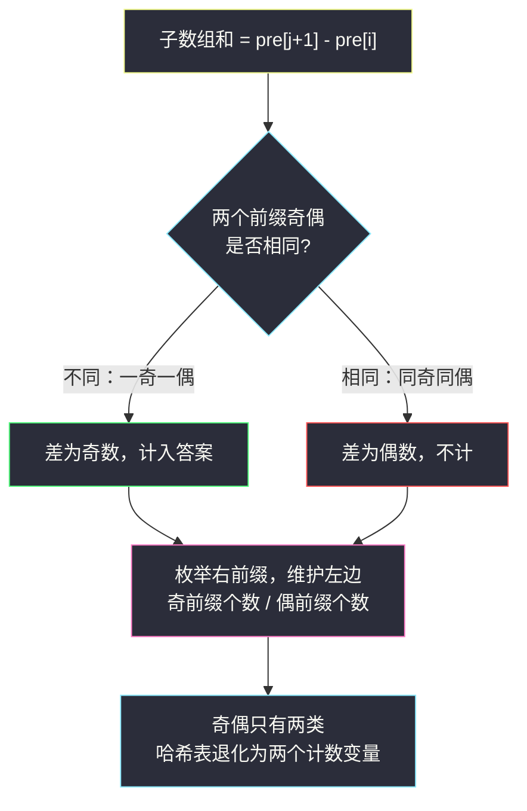
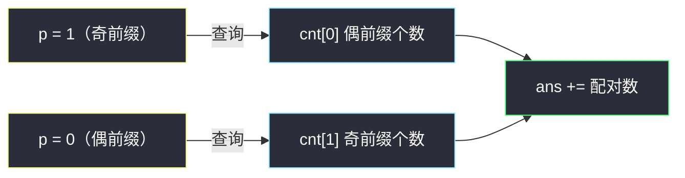

# 和为奇数的子数组数目（前缀和 + 哈希 · 奇偶分类配对）

## 一、问题描述

给你一个整数数组 `arr`。请你返回其中元素和为**奇数**的子数组数目。由于答案可能很大，请将结果对 `10^9 + 7` 取余后返回。

> 🔗 LeetCode 1524：https://leetcode.cn/problems/number-of-sub-arrays-with-odd-sum/
>
> 数据范围：`1 <= arr.length <= 10^5`，`1 <= arr[i] <= 100`。

**示例 1**

```
输入：arr = [1,3,5]
输出：4
解释：4 个奇数和子数组：[1]、[3]、[5]、[1,3,5]。
```

**示例 2**

```
输入：arr = [2,4,6]
输出：0
解释：所有子数组由偶数组成，和都是偶数。
```

**示例 3**

```
输入：arr = [1,2,3,4,5,6,7]
输出：16
```

**直观理解**

我们关心的不是「和是多少」，而是「和的奇偶性」。和的奇偶性只取决于组成元素奇偶性的**搭配**，这提示把前缀和按奇偶分成两类，数「一奇一偶」的配对数——这正是前缀和 + 哈希计数（灵神题单 §1.2）里最轻量的形态。

---

## 二、暴力解法

枚举所有子数组 `[i..j]`，边延伸右端点边累加，和为奇数就计数。

```python
class Solution:
    def numOfSubarrays(self, arr: List[int]) -> int:
        MOD = 10 ** 9 + 7
        n, ans = len(arr), 0
        for i in range(n):
            s = 0                        # 子数组 arr[i..j] 的和
            for j in range(i, n):
                s += arr[j]
                if s % 2 == 1:
                    ans += 1
        return ans % MOD
```

### 复杂度

- **时间**：`O(n²)`。
- **空间**：`O(1)`。

### 🔴 瓶颈在哪里

`n = 10^5` 时约 `5 * 10^9` 次运算，严重超时。每个起点都从零累加，和的奇偶信息没有任何复用——而奇偶性其实可以只看前缀和的奇偶搭配一步得到。

---

## 三、优化探索（核心章节）

> 📚 本题在灵茶题单中属于 **§1.2 前缀和与哈希表**（常用数据结构 A），套路是 **枚举右维护左**：从左往右枚举右端点，用计数结构维护左边出现过的信息，当前元素去查询之前的信息完成配对。

### 3.1 子数组和 → 前缀和之差

记 `pre[j]` 为前 `j` 个元素的和（`pre[0] = 0` 表示空前缀），则子数组 `arr[i..j]` 的和为：

```
sum(i..j) = pre[j+1] - pre[i]
```

于是「子数组和为奇数」变成了「**两个前缀和之差为奇数**」。

### 3.2 差的奇偶 = 两前缀奇偶是否相同

逐类讨论：

| pre[i] | pre[j+1] | 差的奇偶 | 是否计入答案 |
|--------|----------|----------|--------------|
| 偶 | 偶 | 偶 | ✗ |
| 奇 | 奇 | 偶 | ✗ |
| 奇 | 偶 | **奇** | ✓ |
| 偶 | 奇 | **奇** | ✓ |

结论：**和为奇数的子数组 ⟺ 左右两个前缀「一奇一偶」**。本质上是「前缀和模 2 同余配对」的否定版——模 2 余数**不同**才配对（同余配对版的姊妹题见 #974）。

### 3.3 枚举右维护左

从左往右枚举右前缀 `pre[j+1]`，维护「左边 `pre[0..j]` 中奇数、偶数各出现了多少个」。奇偶只有两类，哈希表退化成两个变量：

- 当前前缀是**偶**：与之前的**奇**前缀配对，累加奇前缀个数；
- 当前前缀是**奇**：与之前的**偶**前缀配对，累加偶前缀个数。

初始时左边只有空前缀 `pre[0] = 0`，是偶数：**偶计数从 1 起步**，奇计数从 0 起步。



### 3.4 不用真算前缀和：奇偶增量维护

前缀和的奇偶性不需要大数累加，逐个元素异或最低位即可：

```
p = p ^ (x & 1)
```

奇 + 奇 = 偶、偶 + 奇 = 奇——正是按位模 2 加法，异或一步到位，数值大小完全无关（`arr[i] <= 100` 也好、更大也罢）。

### 3.5 一句话核心

> **奇和子数组的个数 = 奇前缀的个数 × 偶前缀的个数**（含空前缀 `pre[0] = 0`）；单趟扫描、两个计数变量即可。

---

## 四、代码实现

### Python（主解：枚举右维护左，两个变量代替哈希表）

```python
class Solution:
    def numOfSubarrays(self, arr: List[int]) -> int:
        MOD = 10 ** 9 + 7
        cnt = [1, 0]                    # cnt[0] 偶前缀个数（含 pre[0]=0），cnt[1] 奇前缀个数
        ans = 0
        p = 0                           # 当前前缀和的奇偶（0 偶 1 奇）
        for x in arr:
            p ^= x & 1                  # 奇偶增量维护
            ans += cnt[p ^ 1]           # 与当前奇偶「相反」的前缀才能配出奇差
            cnt[p] += 1                 # 当前前缀加入左边
        return ans % MOD
```

**变量含义**

| 变量 | 含义 |
|------|------|
| `p` | 当前前缀和 `pre[j+1]` 的奇偶（0 偶 1 奇） |
| `cnt[0]` / `cnt[1]` | 左边前缀中偶/奇出现的次数，初始 `[1, 0]` |
| `cnt[p ^ 1]` | 与当前前缀奇偶相反的前缀个数 = 本轮新增答案 |

**循环不变式**：处理第 `j` 个元素前，`cnt` 恰好统计了 `pre[0..j]`（共 `j+1` 个前缀）的奇偶分布。

**细节**：先查询 `cnt[p ^ 1]` 再执行 `cnt[p] += 1`，顺序不能反——否则当前前缀会被算进「左边」，自己和自己配对出差 0（偶），倒不影响正确性，但「先查后加」是与 #974、#560 一致的安全习惯。

### Java（最优解同款）

```java
class Solution {
    public int numOfSubarrays(int[] arr) {
        final int MOD = 1_000_000_007;
        long ans = 0;                   // 最多 C(100001,2) ≈ 5*10^9，必须 long
        long[] cnt = {1, 0};
        int p = 0;
        for (int x : arr) {
            p ^= x & 1;
            ans += cnt[p ^ 1];
            cnt[p]++;
        }
        return (int) (ans % MOD);
    }
}
```

---

## 五、具体例子演示

### 例 1：arr = [1,3,5]

先列前缀和与奇偶（演示用，代码里不显式求出）：

| j | pre[j] | 奇偶 |
|---|--------|------|
| 0 | 0 | 偶 |
| 1 | 1 | 奇 |
| 2 | 4 | 偶 |
| 3 | 9 | 奇 |

逐步扫描（`cnt = [偶, 奇]`）：

| j | arr[j] | p（新前缀奇偶） | 查询 cnt[p^1] | 配对的前缀 | 新增 | ans | 更新后 cnt[偶]/cnt[奇] |
|---|--------|------------------|----------------|------------|------|-----|------------------------|
| 0 | 1 | 1（奇） | cnt[0] = 1 | pre[0]=0（偶） | 1 | 1 | 1 / 1 |
| 1 | 3 | 0（偶） | cnt[1] = 1 | pre[1]=1（奇） | 1 | 2 | 2 / 1 |
| 2 | 5 | 1（奇） | cnt[0] = 2 | pre[0]=0、pre[2]=4（偶） | 2 | 4 | 2 / 2 |

答案 `4` ✓，对应子数组 `[1]`、`[3]`、`[5]`、`[1,3,5]`。

**组合视角验证**：前缀奇偶分布为偶 2 个、奇 2 个，答案 = 2 × 2 = 4 ✓——每个「奇差对」恰由一奇一偶前缀组成。

### 例 2：arr = [1,2,3,4,5,6,7]（示例 3）

前缀和 `0,1,3,6,10,15,21,28`，奇偶为 `偶,奇,奇,偶,偶,奇,奇,偶`：偶前缀 4 个、奇前缀 4 个，答案 = 4 × 4 = **16** ✓。

### 例 3：arr = [2,4,6]（全偶，示例 2）

所有前缀都是偶数，`p` 恒为 0，每轮查询 `cnt[1] = 0`，答案 0 ✓。



---

## 六、复杂度分析

| 方法 | 时间 | 空间 | 说明 |
|------|------|------|------|
| 暴力枚举 | `O(n²)` | `O(1)` | 每个起点重新累加 |
| 奇偶配对 | `O(n)` | `O(1)` | 一趟扫描，两个计数变量 |

---

## 七、对比总结

**前缀和 + 哈希家族：统一框架**

把「子数组满足某性质」转成「右前缀与左前缀满足某关系」，枚举右维护左、查表配对：

| 题 | 前缀 | 配对关系 | 答案含义 |
|----|------|----------|----------|
| #560 和为 K 的子数组 | 前缀和 | `pre[i] == pre[j] - k` | 和恰为 k |
| #974 和可被 K 整除 | 前缀和 mod k | 余数相同 | 和是 k 的倍数 |
| **#1524 本篇** | 前缀和 mod 2 | **余数不同** | 和是奇数 |
| #2588 美丽子数组 | 异或前缀 | 前缀相等 | 异或和为 0 |

本题是框架里最简的：关系只有奇偶两类，连哈希表都不用，两个变量足矣。

**易错点**

1. **空前缀的偶计数初始为 1**：漏掉 `cnt[0] = 1` 会导致所有以 `arr[0]` 开头的奇和子数组丢失。
2. **取模 `10^9 + 7`**：`n = 10^5` 时真实答案可达约 `2.5 * 10^9`，Python 最后取模即可，Java 中间累加必须 `long`。
3. 奇偶用 `x & 1` 判断；本题元素全为正，若含负数，`& 1` 在补码下依然给出正确的奇偶（Python 中 `(-3) & 1 == 1`）。

**模板（枚举右维护左 · 计数配对，Python 版）**

```python
cnt = [1, 0]            # 预置空前缀
ans = p = 0
for x in arr:
    p ^= x & 1
    ans += cnt[p ^ 1]   # 先查左边
    cnt[p] += 1         # 再入表
return ans % MOD
```

---

## 八、举一反三

| 题目 | 关系 |
|------|------|
| [974. 和可被 K 整除的子数组](https://leetcode.cn/problems/subarray-sums-divisible-by-k/) | 本题的「模 2 推广到模 k」：余数相同的两个前缀配对，见同批 `subarray-sums-divisible-by-k.md` |
| [2588. 统计美丽子数组数目](https://leetcode.cn/problems/count-the-number-of-beautiful-subarrays/) | 前缀换成异或、关系换成「相等」，见同批 `count-the-number-of-beautiful-subarrays.md` |
| [560. 和为 K 的子数组](https://leetcode.cn/problems/subarray-sum-equals-k/) | 家族鼻祖：`pre[i] == pre[j] - k` 的哈希配对 |
| [930. 和相同的二元子数组](https://leetcode.cn/problems/binary-subarrays-with-sum/) | 同是「和恰好为 goal」的计数，滑窗路线（恰好 = 至多 − 至多），见 `binary-subarrays-with-sum.md` |
| [1248. 统计「优美子数组」](https://leetcode.cn/problems/count-number-of-nice-subarrays/) | 奇偶配对的滑窗变体，见 `count-number-of-nice-subarrays.md` |
| [1371. 每个元音包含偶数次的最长子字符串](https://leetcode.cn/problems/find-the-longest-substring-containing-vowels-in-even-counts/) | 奇偶性升级成 5 位 bitmask 的状态压缩前缀，同值配对求最长 |

**思想迁移**

- 凡是只关心**和的奇偶 / 余数**的子数组计数，直接上前缀和分类 + 配对，不要滑窗（含负数时滑窗也失效）。
- 配对计数的通用姿势：**枚举右端点，先查左边计数，再把当前前缀入表**。
- 口诀：**「奇偶两堆账，空前缀偶上；枚举右查询，反号即配对。」**
