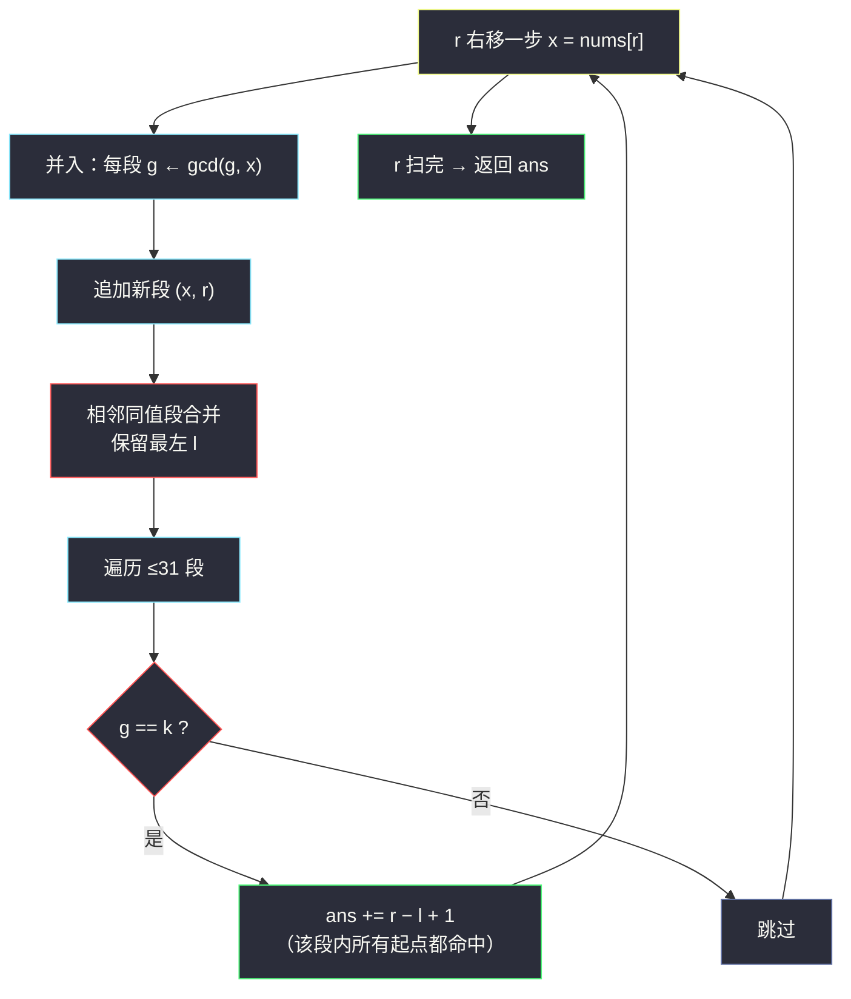

# 2447. 最大公因数等于 K 的子数组数目（Number of Subarrays With GCD Equal to K）

> 题目来源：[https://leetcode.cn/problems/number-of-subarrays-with-gcd-equal-to-k/](https://leetcode.cn/problems/number-of-subarrays-with-gcd-equal-to-k/)
>
> 灵茶题单小节定位：§四、GCD LogTrick（固定右端点的 GCD 值集合）

## 一、问题描述

给定一个正整数数组 `nums` 和一个整数 `k`，统计并返回 `nums` 中 **最大公因数（GCD）恰好等于 `k`** 的子数组数目。

子数组是数组中连续的非空整数序列。

**数据范围**：

- `1 <= nums.length <= 1000`
- `1 <= nums[i], k <= 10⁹`

**示例 1**：

```text
输入：nums = [9,3,1,2,6,3], k = 3
输出：4
解释：GCD 恰为 3 的子数组有 [3]（下标 1）、[9,3]、[6,3]、[3]（下标 5），共 4 个。
```

**示例 2**：

```text
输入：nums = [4], k = 7
输出：0
解释：唯一的子数组 GCD 是 4，不等于 7。
```

**核心思考点**：右端点固定时，子数组向左越长 GCD **只会变小或不变**（`gcd(g, x)` 是 `g` 的约数），而且每变化一次 **至少除以 2**——所以「以 r 结尾的所有子数组的 GCD 值」去重后只有 `⌊log₂(值域)⌋ + 1 ≈ 31` 个。这是灵神 **LogTrick** 家族在 GCD 上的标准应用，与 OR LogTrick（见本站 `shortest-subarray-with-or-at-least-k-ii.md`）骨架完全同构。

## 二、暴力解法

### 思路

枚举每个左端点 `l`，向右扩展 `r`，边扩边维护 `g = gcd(nums[l..r])`；`g == k` 时计数。

一个立刻可用的剪枝：`g` 随 `r` 右移 **单调不增**（新 g 是旧 g 的约数）。若 `g` 已经不是 `k` 的倍数（`g % k != 0`），那么它的所有约数（后续的 g）也都不是 `k` 的倍数，更不可能等于 `k`——直接 `break`。注意「是 k 的倍数」只是必要条件，不能用来计数，只用于提前终止。

### 代码

```python
from math import gcd

def subarrayGCDBrute(nums: list[int], k: int) -> int:
    n = len(nums)
    ans = 0
    for l in range(n):
        g = 0                                  # gcd(0, x) = x，作恒等元
        for r in range(l, n):
            g = gcd(g, nums[r])
            if g % k:                          # 约数链上再无 k 的倍数
                break
            if g == k:
                ans += 1
    return ans
```

### 复杂度

- 时间：`O(n² log V)`（每次 gcd 是 `O(log V)`），`n = 1000` 时约 `10⁶` 次 gcd 运算，本题可过；但把 `n` 放大到 `10⁵` 就必须换思路。
- 空间：`O(1)`。

## 三、优化探索

### 3.1 观察一：固定右端点，GCD 随左端点左移单调不增

对固定右端点 `r`，考察函数 `G(l) = gcd(nums[l..r])`：

- `G(l)` 是 `G(l+1)` 的约数（多并一个数，gcd 只能变小或不变）——按 `l` 从 `r` 到 `0`，GCD 值构成一条 **不增的约数链**。

### 3.2 观察二：链上每变化一次，值至少减半 ⭐

设链上相邻两个 **不同** 的值 `g > g'`（`g' | g` 且 `g' < g`）。因为 `g'` 是 `g` 的 **真约数**，而一个数除自身外最大的约数不超过它的一半（真约数 `d ≤ g/2`：若 `d > g/2` 且 `d | g`，则 `g/d < 2` 且为整数，只能 `d = g`，矛盾）。所以：

```text
g' ≤ g / 2        （每次值变化，至少缩小一半）
```

从初始值 `V ≤ 10⁹ < 2³⁰` 出发，链上 **互不相同的值** 至多 `30 + 1 = 31` 个。这与 OR LogTrick 的「每变化至少丢一位」如出一辙——OR 是位运算层面的减半，GCD 是数值层面的减半。

### 3.3 LogTrick：维护 (GCD 值, 最左起点) 段列表

对每个右端点 `r` 维护列表 `gs = [(g₁, l₁), (g₂, l₂), ...]`，按 `l` 从小到大（即 GCD 值从大到小）排列。语义：**对每个 `l ∈ [lᵢ, lᵢ₊₁)` 的左端点，`gcd(nums[l..r]) = gᵢ`**——同值的连续左端点被压成一个「段」，段只保留 **最左** 的 `l`。

右端点 `r → r+1`（新元素 `x`）的转移三步：

1. **并入**：每段 `gᵢ ← gcd(gᵢ, x)`（值只减不增，有序保持）；
2. **追加**：新段 `(x, r+1)`（单元素子数组）接到尾部；
3. **合并**：相邻同值段合并，保留 **最左** 的 `l`（计数需要最大范围）。

计数：若某个 `(g, l)` 满足 `g == k`，则所有起点 `l' ∈ [l, r]` 的子数组 GCD 都是 `k`，贡献 `r - l + 1` 个。



## 四、代码实现

### 主解：GCD LogTrick

```python
from math import gcd

def subarrayGCD(nums: list[int], k: int) -> int:
    ans = 0
    gs = []                        # [(g, l)]，l 从小到大 → g 从大到小
    for r, x in enumerate(nums):
        # 1) 并入：已有段全部与 x 求 gcd
        for seg in gs:
            seg[0] = gcd(seg[0], x)
        # 2) 追加：单元素子数组 (x, r)
        gs.append([x, r])
        # 3) 合并：相邻同值段保留最左 l
        merged = []
        for g, l in gs:
            if merged and merged[-1][0] == g:
                continue                       # 同值 → 保留先出现的更左 l
            merged.append([g, l])
        gs = merged
        # 4) 计数：段 (g, l) 覆盖起点 [l, 下一段的 l)；尾段覆盖到 r
        for i, (g, l) in enumerate(gs):
            if g == k:
                right = gs[i + 1][1] if i + 1 < len(gs) else r + 1
                ans += right - l                # 段宽 = 该值对应的起点个数
    return ans
```

### 细节说明

- **列表长度 ≤ 31**：由 3.2 的减半性质保证，故并入/合并/计数每步都是常数级，总时间 `O(n · log V)`。
- **合并保留最左 `l`**：与 OR LogTrick（求最短，保留最右）相反——本题 **计数**，同值段要压成覆盖最宽起点区间的段。
- **计数用段宽而非 `r - l + 1`（易错点 ⚠）**：段 `(g, l)` 的语义是「起点 `s ∈ [l, 下一段 l)` 的子数组 GCD 都是 `g`」，只有 **尾段**（值最小的段）才延伸到 `r`。若命中段是中间段，长度应取 `下一段的 l − l`；实现里用 `right = gs[i+1][1] if i+1 < len(gs) else r+1` 统一处理。无脑写 `r - l + 1` 会在中间段命中时多算（示例 1 的两个命中段恰好都是尾段，手推极易被蒙混过关——对拍随机用例才能抓出）。
- **`gcd` 单调性免排序**：并入只让值变小、追加的 `x` 是当前最小值（它是后面所有更长子数组 gcd 的约数），列表天然保持按 `g` 降序、按 `l` 升序，无需任何排序操作。

## 五、例子演示

用示例 1 `nums = [9, 3, 1, 2, 6, 3], k = 3` 端到端走一遍，下表列出每个右端点处理完后 `gs` 的全部 `(g, l)` 段与计数增量：

| r | x | 转移后的 gs（(g, l) 列表） | g==3 的段 | 本步计数 | 累计 |
|---|---|---|---|---|---|
| 0 | 9 | `[(9, 0)]` | 无 | 0 | 0 |
| 1 | 3 | 并入 `gcd(9,3)=3` → `[(3,0)]`；追加 `(3,1)` → `[(3,0),(3,1)]`；合并同值 → `[(3, 0)]` | `(3, 0)` | `1-0+1 = 2`（`[3]`、`[9,3]`） | 2 |
| 2 | 1 | 并入 `gcd(3,1)=1` → `[(1,0)]`；追加 `(1,2)` → 合并 → `[(1, 0)]` | 无 | 0 | 2 |
| 3 | 2 | 并入 `gcd(1,2)=1`；追加 `(2,3)` → `[(1,0),(2,3)]` | 无 | 0 | 2 |
| 4 | 6 | 并入 → `[(1,0),(2,3)]`；追加 `(6,4)` → `[(1,0),(2,3),(6,4)]` | 无 | 0 | 2 |
| 5 | 3 | 并入：`gcd(1,3)=1`、`gcd(2,3)=1` → `[(1,0),(1,3)]`；追加 `(3,5)`；合并：前两段同值 1 → `[(1,0)]`，尾部 `(3,5)` 单独；再看：`gcd(6,3)=3`（第 3 段）→ 与 `(3,5)` 同值合并保留最左 l=4 → `[(1,0),(3,4)]` | `(3, 4)` | `5-4+1 = 2`（`[3]`、`[6,3]`） | **4** |

两处合并值得细看：

- **r=1**：单元素段 `(3,1)` 与并入后的 `(3,0)` 同值——起点 0 和 1 的子数组（`[9,3]` 与 `[3]`）GCD 同为 3，压成一段 `(3,0)`，此时它是 **尾段**，贡献 2。
- **r=5**：`[(1,0),(2,3),(6,4)]` 并入 3 后变成 `[(1,0),(1,3),(3,4)]`，追加 `(3,5)` 得 `[(1,0),(1,3),(3,4),(3,5)]`——`g=1` 的两段合并、`g=3` 的两段合并，最终 `[(1,0),(3,4)]`。这步说明「向左越长 gcd 越小」的分层：起点 0~3 的 GCD 全是 1，起点 4~5 的 GCD 全是 3。命中段 `(3,4)` 是 **尾段**，贡献 `5-4+1 = 2`。

**易错点复盘 ⚠（中间段命中陷阱）**：示例 1 两处命中段恰好都是尾段，掩盖了一个大坑。看自造例子 `nums = [6,2,4], k = 2`：

| r | gs | 命中段 | 正确计数（段宽） | 错误计数（r−l+1） |
|---|---|---|---|---|
| 1 | `[(2,0)]` | `(2,0)` 尾段 | 2（`[2]`、`[6,2]`） | 2（碰巧同对） |
| 2 | `[(2,0),(4,2)]` | `(2,0)` **中间段** | **2**（起点 0、1：`[6,2,4]`、`[2,4]`） | **3**（多算 `[4,4]`？不——多算了起点 2，但 `gcd(4)=4 ≠ 2`！） |

r=2 时 `gcd(nums[0..2]) = gcd(6,2,4) = 2`、`gcd(nums[1..2]) = gcd(2,4) = 2`，但 `gcd(nums[2..2]) = 4`——起点 2 属于值更小的尾段 `(4,2)`，根本不该计入 `g=2` 的段宽。段宽公式 `下一段 l − l` 恰好把起点 2 切给尾段。此例总答案 = 2 + 2 = **4**（四个子数组：`[2]`、`[6,2]`、`[2,4]`、`[6,2,4]`）；用 `r−l+1` 的错误版会得 5。这个坑是随机对拍抓出来的（对拍中命中段落在中间的用例很常见）。

**最终答案 4** ✅ 与官方一致。

```mermaid
flowchart LR
    subgraph R5["r=5（x=3）的段演化"]
        S0["[(1,0),(2,3),(6,4)]<br>上一步的 gs"] --> S1["并入 gcd·3<br>[(1,0),(1,3),(3,4)]"]
        S1 --> S2["追加 (3,5)<br>[(1,0),(1,3),(3,4),(3,5)]"]
        S2 --> S3["合并同值<br>[(1,0),(3,4)]"]
        S3 --> S4["g==3 段 (3,4)<br>贡献 5−4+1 = 2"]
    end
    style R5 fill:#1e1f29,stroke:#6272a4
    style S0 fill:#2b2d3a,stroke:#8be9fd,color:#f8f8f2
    style S1 fill:#2b2d3a,stroke:#8be9fd,color:#f8f8f2
    style S2 fill:#2b2d3a,stroke:#ff5555,color:#f8f8f2
    style S3 fill:#2b2d3a,stroke:#ff79c6,color:#f8f8f2
    style S4 fill:#2b2d3a,stroke:#50fa7b,color:#f8f8f2
```



## 六、复杂度分析

设 `n = len(nums)`，`V` 为值域上界（`10⁹`）：

- **时间复杂度：`O(n log V)`**
  - 每个右端点：列表 ≤ `⌊log₂ V⌋ + 1 ≈ 31` 段，每段一次 gcd（`O(log V)`）+ 常数次比较。
  - 严谨记法是 `O(n · log²V)`（每段一次 gcd），但工程上直接称 `O(n log V)` 量级：`n = 1000` 时实际只跑几万次 gcd。
  - 对比暴力 `O(n² log V)`：把「每个左端点重复算」变成「段列表增量维护」。
- **空间复杂度：`O(log V)`**
  - `gs` 列表长度不超过 31，与 `n` 无关。

## 七、对比总结

| 维度 | 暴力（枚举左端点扩 gcd） | 主解（GCD LogTrick） |
|---|---|---|
| 时间 | `O(n² log V)`（剪枝后实际更快） | `O(n log V)` |
| 空间 | `O(1)` | `O(log V)` |
| 本题 n=1000 | 可过 | 可过（且 n=10⁵ 也能过） |
| 关键观察 | 约数链单调不增 → 剪枝 | 每变化至少减半 → 值集合 ≤ 31 |
| 通用性 | 仅小 n | LogTrick 家族通吃（GCD/OR/AND 同构） |

**套路归纳**：GCD 子数组问题的三板斧——①右端点固定时 GCD 随左端点左移 **单调不增**（约数链）；②链上 **互异值至多 `log V` 个**（真约数 ≤ 一半）；③按「(值, 最左起点) 段」增量维护，转移 = 并入 + 追加 + 合并。计数型保留最左 `l`，且命中段的宽度按「到下一段的 l」计（尾段才到 `r`）；最值型（如最短子数组）保留最右 `l`，同样要留意中间段/尾段的边界语义——方向与边界都由「问什么」决定，骨架不变。

## 八、举一反三

1. **[1819. 序列中不同最大公约数的数目](https://leetcode.cn/problems/number-of-different-subsequences-gcds/)**：本篇 LogTrick 的加强版——枚举 **所有** 子数组的 GCD 能取到多少个不同值（答案 ≤ 值域大小，但用 LogTrick 或「枚举约数」两种视角都能做）。
2. **[1071. 字符串的最大公因子](https://leetcode.cn/problems/greatest-common-divisor-of-strings/)**：GCD 概念在字符串上的妙用（`str1 + str2 == str2 + str1` 时有公因子）。
3. **[878. 第 N 个神奇数字](https://leetcode.cn/problems/nth-magical-number/)**：二分答案 + gcd/lcm 容斥计数，GCD 在「整除计数」中的经典搭档。
4. **[1497. 检查数组对是否可以被 k 整除](https://leetcode.cn/problems/check-if-array-pairs-are-divisible-by-k/)**：按 `k` 的余数配对计数，体会「整除」与「恰好等于」两种 gcd 条件的差异。
5. **[2863. 最大子序列的和平](https://leetcode.cn/problems/maximum-elegance-of-a-k-length-subsequence/)** 不对口，更贴切的是 **[2709. Greatest Common Divisor Traversal](https://leetcode.cn/problems/greatest-common-divisor-traversal/)**：把 gcd 关系建成图判连通，GCD 思维的图论化应用。

**同族互引**：本篇与 `shortest-subarray-with-or-at-least-k-ii.md`（#3097，OR LogTrick）是灵神「LogTrick」小节的一对双生题：完全同构的「并入 + 追加 + 合并」三步转移，差别只在单调性的来源（OR 是位只增不减，GCD 是约数链只减不增）与合并保留方向（求最短留最右 l，计数留最左 l）。两篇紧挨着刷，模板一次记牢。
