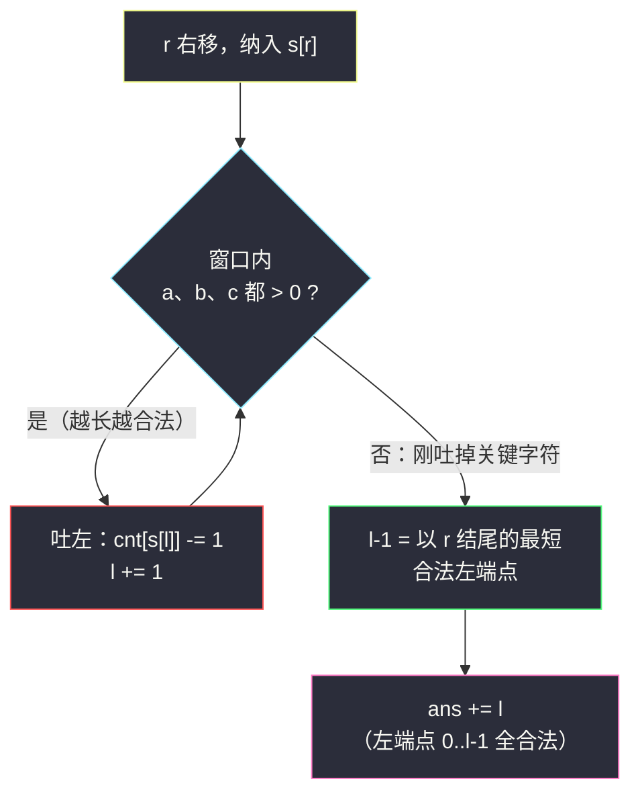
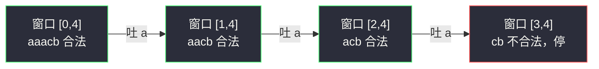

# 包含所有三种字符的子字符串数目（不定长滑窗 · 固定 r 数左边）

## 一、问题描述

给你一个字符串 `s`，它只包含字符 `a`、`b`、`c`。请你返回包含 `a`、`b`、`c` **各至少一次**的子字符串（连续）**数目**。

> 🔗 LeetCode 1358：https://leetcode.cn/problems/number-of-substrings-containing-all-three-characters/
>
> 数据范围：`3 <= s.length <= 5 * 10^4`，`s` 只由 `a`、`b`、`c` 组成。

**示例 1**

```
输入：s = "abcabc"
输出：10
解释：包含 a、b、c 各至少一次的子字符串共 10 个，如 "abc"、"abca"、"bca"、
"bcab"、"bcabc"、"cab"、"cabc"、"abca" 的下一段 "abcab"、"abcabc"、"cabc" 等。
```

**示例 2**

```
输入：s = "aaacb"
输出：3
解释：合法子字符串只有 "aaacb"、"aacb"、"acb"。
```

**直观理解**

这是**越长越合法**的窗口：子串越长，越容易把 `a`、`b`、`c` 三个都圈进来。计数套路与「恰好 = 至多 − 至多」不同——不需要做差，直接**固定右端点 `r`，数左边有多少个合法左端点**即可，这正是灵神求子数组个数框架的第二种形态。

---

## 二、暴力解法

枚举所有子字符串 `[i..j]`，逐一检查是否包含 `a`、`b`、`c`。

```python
class Solution:
    def numberOfSubstrings(self, s: str) -> int:
        n, ans = len(s), 0
        for i in range(n):
            seen = set()
            for j in range(i, n):
                seen.add(s[j])
                if len(seen) == 3:       # 从 j 到末尾的所有右端点都合法，一次加完
                    ans += n - j
                    break
        return ans
```

（小小优化：一旦 `[i..j]` 集齐三种字符，右端点 `j..n-1` 全部合法，可一次累加后 break，但整体仍是平方级。）

### 复杂度

- **时间**：`O(n²)`。
- **空间**：`O(1)`（集合最多 3 个字符）。

### 🔴 瓶颈在哪里

`n = 5 * 10^4` 时 `n² = 2.5 * 10^9`，超时。同样的问题：起点右移时窗口信息没复用。

---

## 三、优化探索（核心章节）

> 📚 本题在灵茶题单中属于 **§2.3 求子数组个数**（不定长滑动窗口 · 第三类），是「**越长越合法**」的计数形态。灵神（lyl）的框架：枚举右端点 `r`，维护窗口使其**恰好不合法**（刚刚差一点），则左端点 `0..l-1` 的子串全部合法，每轮累加 `l`。

### 3.1 观察特征

| 特征 | 说明 |
|------|------|
| 连续子串 | 滑动窗口 `[l..r]` |
| 合法条件「包含 a、b、c」 | 加长只会更合法、缩短只会更不合法 → **越长越合法** |
| 求合法子串**个数** | 固定 r，数合法左端点 |

### 3.2 关键结论：合法左端点是一段前缀

固定右端点 `r`：若 `[l..r]` 合法，则把左端点左移到 `l' < l` 后 `[l'..r]` 更长、只会更合法。所以以 `r` 结尾的合法子串的左端点恰好是 `0..L` 一整段，其中 `L` 是**最短的合法左端点**。个数就是 `L + 1`。

若我们能对每个 `r` 快速维护出「最短合法左端点」，答案就是对 `L + 1` 求和。

### 3.3 用滑窗维护「最短合法左端点」

`r` 每右移一格，窗口变长，之前不合法的窗口可能变合法；而合法之后 `l` 越大窗口越短。于是：

- 纳入 `s[r]`：`cnt[s[r]] += 1`；
- **只要窗口仍合法**（`a`、`b`、`c` 计数全 > 0），就吐左 `cnt[s[l]] -= 1; l += 1`——吐到**恰好不合法**为止；
- 此时 `l - 1` 就是最短合法左端点，本轮累加 `ans += l`（左端点 `0..l-1` 共 `l` 个）。

`l`、`r` 均单调右移，总复杂度 `O(n)`。



### 3.4 与「恰好 = 至多 − 至多」的关系

两者都是「固定 r 数左边的合法左端点个数」，只是合法左端点的形态不同：

| | #1248 / #930（恰好型） | 本题（包含型） |
|--|------------------------|----------------|
| 合法左端点形态 | 不连续（孤立点） | 前缀一段 `0..L` |
| 处理方式 | 转成「至多」两个连续区间做差 | 直接数 `L + 1` |

### 3.5 一句话核心

> **合法条件越长越满足 → 固定 r 把左端收缩到「恰好不合法」，左边 `l` 个左端点全部合法，`ans += l`。**

---

## 四、代码实现

### Python（主解：收缩到恰好不合法）

```python
class Solution:
    def numberOfSubstrings(self, s: str) -> int:
        cnt = {'a': 0, 'b': 0, 'c': 0}    # 窗口内三种字符的计数
        ans = l = 0
        for r, ch in enumerate(s):
            cnt[ch] += 1                  # 纳入 s[r]
            while cnt['a'] and cnt['b'] and cnt['c']:
                cnt[s[l]] -= 1            # 合法就继续吐左，找最短合法窗口
                l += 1
            ans += l                      # 左端点 0..l-1 都合法，共 l 个
        return ans
```

**变量含义**

| 变量 | 含义 |
|------|------|
| `cnt` | 窗口 `[l..r]` 内 `a/b/c` 的出现次数 |
| `l` / `r` | 窗口左右端；退出 while 时 `[l..r]` 恰好不合法 |
| `l`（累加量） | 以 `r` 结尾的合法子串个数 = 最短合法左端点 + 1 |

**循环不变式**：每轮 while 结束时，`[l..r]` 不包含全部三种字符，而 `[l-1..r]` 包含（`l = 0` 时表示还没有任何以 `r` 结尾的合法子串）。

### Python（等价写法：三字符最后出现位置）

```python
class Solution:
    def numberOfSubstrings(self, s: str) -> int:
        last = {'a': -1, 'b': -1, 'c': -1}
        ans = 0
        for r, ch in enumerate(s):
            last[ch] = r
            ans += min(last['a'], last['b'], last['c']) + 1
        return ans
```

**思路**：左端点 `l'` 合法 ⇔ `[l'..r]` 覆盖三个字符的最后出现位置，即 `l' <= min(三个 last)`。合法个数 = `min(last) + 1`（三个都出现过时）。两版完全等价，`last` 版少一层循环、更好写，但 `while` 收缩版与 #2962 等题共用一套模板，**建议以收缩版为主记忆**。

### Java（最优解：计数收缩版）

```java
// 包含所有三种字符的子字符串数目
// 测试链接 : https://leetcode.cn/problems/number-of-substrings-containing-all-three-characters/
class Solution {
    public int numberOfSubstrings(String str) {
        char[] s = str.toCharArray();
        int[] cnt = new int[3];               // 'a','b','c' -> 0,1,2
        int ans = 0;
        for (int l = 0, r = 0; r < s.length; r++) {
            cnt[s[r] - 'a']++;
            while (cnt[0] > 0 && cnt[1] > 0 && cnt[2] > 0) {
                cnt[s[l] - 'a']--;
                l++;
            }
            ans += l;                          // 左端点 0..l-1 全合法
        }
        return ans;
    }
}
```

---

## 五、具体例子演示

### 例一：`s = "abcabc"`，逐步跟踪

| r | s[r] | 进窗后 cnt (a,b,c) | while 收缩过程 | 退出时 l | 窗口 [l, r] | ans += l | ans |
|---|------|--------------------|----------------|----------|-------------|----------|-----|
| 0 | a | (1,0,0) | 不合法，不收缩 | 0 | [0,0] | 0 | 0 |
| 1 | b | (1,1,0) | 不合法，不收缩 | 0 | [0,1] | 0 | 0 |
| 2 | c | (1,1,1) | 吐 s[0]='a' → (0,1,1) 不合法 | 1 | [1,2] | 1 | 1 |
| 3 | a | (1,1,1) | 吐 s[1]='b' → (1,0,1) 不合法 | 2 | [2,3] | 2 | 3 |
| 4 | b | (1,1,1) | 吐 s[2]='c' → (1,1,0) 不合法 | 3 | [3,4] | 3 | 6 |
| 5 | c | (1,1,1) | 吐 s[3]='a' → (0,1,1) 不合法 | 4 | [4,5] | 4 | **10** |

以 `r = 5` 为例核对：窗口收缩到 `[4,5] = "bc"` 恰好不合法，最短合法左端点是 `l - 1 = 3`，即 `[3..5] = "abc"`；左端点 `0,1,2,3` 的四个子串 `"abcabc"、"bcabc"、"cabc"、"abc"` 都合法 ✓。

### 例二：`s = "aaacb"`，验证尾部爆发

| r | s[r] | 进窗后 cnt | while 收缩过程 | 退出时 l | ans += l | ans |
|---|------|------------|----------------|----------|----------|-----|
| 0 | a | (1,0,0) | 不收缩 | 0 | 0 | 0 |
| 1 | a | (2,0,0) | 不收缩 | 0 | 0 | 0 |
| 2 | a | (3,0,0) | 不收缩 | 0 | 0 | 0 |
| 3 | c | (3,0,1) | 不收缩 | 0 | 0 | 0 |
| 4 | b | (3,1,1) | 连吐 3 个 'a' → (0,1,1) 不合法 | 3 | 3 | **3** |

答案 `3` ✓，对应 `"aaacb"`、`"aacb"`、`"acb"`。注意 `r = 4` 一次进窗触发**连续三次吐左**——`while` 不可写成 `if`。



---

## 六、复杂度分析

| 方法 | 时间 | 空间 | 说明 |
|------|------|------|------|
| 暴力枚举 | `O(n²)` | `O(1)` | 每个起点重新收集字符 |
| 滑窗计数（收缩版） | `O(n)` | `O(1)` | `l`、`r` 各至多前进 n 次；计数数组大小 3 |
| last 位置版 | `O(n)` | `O(1)` | 每轮只做 O(1) 更新，无内层循环 |

---

## 七、对比总结

| | 计数收缩版 | last 位置版 |
|--|------------|-------------|
| 每轮动作 | while 吐左到恰好不合法 | 更新 3 个 last，取 min |
| 模板通用性 | 高（#2962、#2302 等同款） | 只适合「覆盖型」条件 |
| 代码量 | 稍长 | 极短 |

**易错点**

1. while 的条件是「**仍然合法**就吐」，吐到恰好不合法才停——与「不合法才收缩」（求最长窗口）方向相反，写反会把答案吐没。
2. 累加的是 `l` 而不是 `l + 1`：退出 while 后窗口 `[l..r]` 本身**不合法**，合法的是左端点 `0..l-1`。
3. 别忘了条件里三个计数都要 `> 0`，少写一个会多算。
4. `l = 0` 时 `ans += 0` 天然成立（尚无合法子串），无需特判。

**模板（求子数组个数 · 越长越合法型，对齐灵神 §2.3）**

```python
ans = l = 0
for r, x in enumerate(s):
    纳入(x)
    while 窗口合法():
        吐出(s[l]); l += 1     # 收缩到恰好不合法
    ans += l                   # 左端点 0..l-1 全合法
```

---

## 八、举一反三

| 题目 | 关系 |
|------|------|
| [2962. 统计最大元素出现至少 K 次的子数组](https://leetcode.cn/problems/count-subarrays-where-max-element-appears-at-least-k-times/) | **同款模板**：「至少 k 次」也是越长越合法，固定 r 数左边，见同批题解 `count-subarrays-where-max-element-appears-at-least-k-times.md` |
| [1248. 统计「优美子数组」](https://leetcode.cn/problems/count-number-of-nice-subarrays/) | 同小节「恰好型」，要转至多做差，见 `count-number-of-nice-subarrays.md` |
| [930. 和相同的二元子数组](https://leetcode.cn/problems/binary-subarrays-with-sum/) | 恰好型同构题，见 `binary-subarrays-with-sum.md` |
| [3297 / 3298. 统计重新排列后包含另一个字符串的子字符串数目 I / II](https://leetcode.cn/problems/count-substrings-that-can-be-rearranged-to-contain-a-string-ii/) | 「包含另一个字符串的任意排列」= 覆盖型推广到 26 字母，Hard 版练习 |
| [76. 最小覆盖子串](https://leetcode.cn/problems/minimum-window-substring/) | 同样「覆盖型」窗口，但求**最短长度**而非个数（求最短家族见 §2.2） |
| [713. 乘积小于 K 的子数组](https://leetcode.cn/problems/subarray-product-less-than-k/) | 「越长越不合法」形态的计数，累加 `r - l + 1`，方向与本篇相反 |

**思想迁移**

- 计数条件若「越长越合法」，答案往往落在 `ans += l` 或 `ans += l + 1` 上——**累加哪个取决于退出循环时窗口本身合不合法**。
- 「覆盖型」条件（包含某字符集/另一串的排列）优先想滑窗；求最短用「合法才收缩」，计数用「收缩到恰好不合法」。
- 口诀：**「越长越合法，收缩到破；破前左端，个个能选。」**
