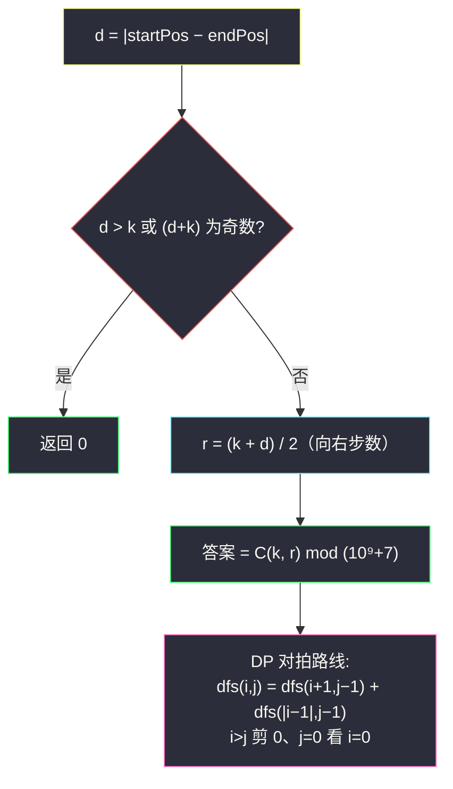

# 2400. 恰好移动 k 步到达某一位置的方法数目（Number of Ways to Reach a Position After Exactly k Steps）

> 题目来源：[https://leetcode.cn/problems/number-of-ways-to-reach-a-position-after-exactly-k-steps/](https://leetcode.cn/problems/number-of-ways-to-reach-a-position-after-exactly-k-steps/)
>
> 灵茶题单小节定位：§B 计数 DP（一维游走 / 组合数学）

## 一、问题描述

给你两个**正**整数 `startPos` 和 `endPos`。最初，你站在**无限**数轴上位置 `startPos` 处。在一步移动中，你可以向左或者向右移动一个位置。

给你一个正整数 `k`，返回从 `startPos` 出发、**恰好**移动 `k` 步并到达 `endPos` 的**不同**方法数目。由于答案可能会很大，返回对 `10⁹ + 7` 取余的结果。

如果所执行移动的顺序不完全相同，则认为两种方法不同。

注意：数轴包含负整数。

**数据范围**：

- `1 <= startPos, endPos, k <= 1000`

**示例 1**：

```text
输入：startPos = 1, endPos = 2, k = 3
输出：3
解释：1→2→3→2、1→2→1→2、1→0→1→2。
```

**示例 2**：

```text
输入：startPos = 2, endPos = 5, k = 10
输出：0
解释：不存在从 2 到 5 且恰好移动 10 步的方法。
```

**核心思考点**：每步 ±1，`k` 步后的净位移 = (右步数 − 左步数)。设 `d = |endPos − startPos|`，若向右 `r` 步则 `r − (k − r) = d` ⇒ `r = (k + d) / 2`——**必须为整数**（否则 0 种）。方案数 = 在 `k` 步里选出 `r` 步向右的组合数 `C(k, r)`。DP 路线：以「距目标的距离」为状态记忆化搜索，`dfs(i, j) = dfs(i+1, j−1) + dfs(|i−1|, j−1)`。

## 二、暴力解法

### 思路

递归枚举每步向左/向右，走满 `k` 步后检查是否落在 `endPos`。`2^k` 条路径。

### 代码

```python
def numberOfWaysBrute(startPos: int, endPos: int, k: int) -> int:
    def dfs(pos, step):
        if step == k:
            return 1 if pos == endPos else 0
        return dfs(pos - 1, step + 1) + dfs(pos + 1, step + 1)
    return dfs(startPos, 0)
```

### 复杂度

- 时间：`O(2^k)`——`k = 1000` 不可行，小样例对拍基准。
- 空间：`O(k)` 递归栈。

## 三、优化探索

### 3.1 平移不变性：只看距离 ⭐⭐

绝对坐标无意义——把终点平移到 0，起点变成 `d = |startPos − endPos|`（取绝对值：镜像对称，左右互换方案数相同）。状态 `(距目标 i, 剩 j 步)`：

- `i > j`：剩余步数不够，返回 0（**剪枝核心**，无此剪枝状态空间会到 `k²` 的两倍大）；
- `j == 0`：`i == 0` 时返回 1，否则 0；
- 否则 `dfs(i, j) = dfs(i+1, j−1) + dfs(|i−1|, j−1)`——远离一步或靠近一步（靠穿 0 变 −1，绝对值回到 1）。

记忆化后状态数 `O(k²)`、每个 `O(1)` 转移。

### 3.2 组合数学闭式：一步到位 ⭐⭐

净位移条件唯一确定右步数 `r = (k + d) / 2`：

- `k + d` 为奇数，或 `d > k`（`r > k` 或 `r < 0`）⇒ 答案 0；
- 否则答案 `C(k, r) = k! / (r!·(k−r)!)` mod p。

顺序不同的走法 ↔ 从 k 个位置里选 r 个放「右」——一一对应。`k ≤ 1000` 直接算三个阶乘（mod p 下用乘法逆元，或 Python 大数算完再 mod）。

### 3.3 两条路线怎么选 ⭐

| 路线 | 时间 | 通用性 |
|---|---|---|
| 记忆化搜索 | `O(k²)` | 直接推广到「每步 −m..+m」「带障碍」等变体 |
| 组合数学 | `O(k)`（算阶乘） | 只在「每步 ±1 且无约束」时成立 |

写题时先用 3.1 验证小样例，再上 3.2 秒杀；对拍互证。



## 四、代码实现

### 主解：组合数学（闭式）

```python
class Solution:
    def numberOfWays(self, startPos: int, endPos: int, k: int) -> int:
        MOD = 10 ** 9 + 7
        d = abs(startPos - endPos)
        if d > k or (k - d) % 2:
            return 0
        r = (k + d) // 2                 # 向右步数
        # C(k, r) mod p（Python 大数直接算再取模）
        num = den = 1
        for i in range(1, k + 1):
            num = num * i % MOD
        for i in range(1, r + 1):
            den = den * i % MOD
        for i in range(1, k - r + 1):
            den = den * i % MOD
        return num * pow(den, MOD - 2, MOD) % MOD   # 费马小节求逆元
```

（或偷懒 `math.comb(k, r) % MOD`——`k ≤ 1000` 时 `C(1000, 500)` 约 10²⁹⁹ 位，Python 大数乘法也毫秒级；竞赛写法用逆元。）

### 进阶：记忆化搜索（对拍/推广路线）

```python
from functools import cache

class Solution:
    def numberOfWays(self, startPos: int, endPos: int, k: int) -> int:
        MOD = 10 ** 9 + 7
        @cache
        def dfs(i: int, j: int) -> int:      # 距目标 i、剩 j 步
            if i > j:                        # 步数不够（含 j<0 哨兵）
                return 0
            if j == 0:
                return 1 if i == 0 else 0
            return (dfs(i + 1, j - 1) + dfs(abs(i - 1), j - 1)) % MOD
        return dfs(abs(startPos - endPos), k)
```

### 细节说明

- **`(k − d) % 2` 判奇偶**：`r = (k+d)/2` 为整数 ⇔ `k` 与 `d` 同奇偶 ⇔ `k − d` 为偶。三种写法等价。
- **`d > k` 早返回**：`r` 会超过 `k`（或等价地左步数为负），方案数 0。
- **`abs(i − 1)` 的妙处**：距目标 −1 与 +1 对称（目标在左或右方案数相同），把「穿过目标」折回非负半轴，状态空间减半。
- **`i > j` 剪枝兼做边界**：`j = 0` 时若 `i > 0` 已被上一条拦截返回 0，`i = 0` 落到 `j == 0` 分支返回 1——不需要单独的 `i < 0` 哨兵。
- **逆元 vs 大数**：`pow(den, MOD-2, MOD)` 是费马小节（p 为质数）求逆元的标准姿势；`math.comb` 在 `k ≤ 1000` 下可直接用，工程上更省心。

## 五、例子演示

**示例 1 端到端：startPos = 1, endPos = 2, k = 3**

`d = 1`，`d ≤ k` 且 `k − d = 2` 偶 → `r = (3+1)/2 = 2`：三步里选两步向右。

`C(3, 2) = 3` → 返回 **3** ✅。枚举对应（右=+）：

| 选择（向右的步） | 序列 | 轨迹 |
|---|---|---|
| {1,2} | 右右左 | 1→2→3→2 |
| {1,3} | 右左右 | 1→2→1→2 |
| {2,3} | 左右右 | 1→0→1→2 |

**记忆化路线抽查**：`dfs(1, 3) = dfs(2, 2) + dfs(0, 2)`；`dfs(2,2) = dfs(3,1) + dfs(1,1)`，`dfs(3,1)` 剪 0（3>1）；`dfs(0,2) = dfs(1,1) + dfs(1,1)`；`dfs(1,1) = dfs(2,0) + dfs(0,0) = 0 + 1 = 1`。汇总 `dfs(2,2) = 0 + 1 = 1`、`dfs(0,2) = 1 + 1 = 2`、`dfs(1,3) = 1 + 2 = 3` ✅——两条路线数值互证。

**示例 2：startPos = 2, endPos = 5, k = 10**：`d = 3`，`k − d = 7` 奇数 → 返回 **0** ✅。直觉：每走一步奇偶性翻转一次，10 步后必在偶坐标（与 2 同奇偶），5 是奇坐标——奇偶不变量一票否决。

**自造例子：startPos = 1, endPos = 1, k = 4**：`d = 0`，`r = 2`，`C(4,2) = 6`——绕一圈回来的六种顺序（右右左左、右左右左……）。

## 六、复杂度分析

- **主解（组合数学）时间：`O(k)`**（三个阶乘循环 + 快速幂 `O(log p)`）；**空间 `O(1)`**。
- **记忆化时间：`O(k²)`**——状态 `(i, j)` 至多 `(k+1)²` 个；**空间 `O(k²)`**（cache）。

## 七、对比总结

| 维度 | 暴力 | 记忆化 DP | 组合数学 |
|---|---|---|---|
| 时间 | `O(2^k)` | `O(k²)` | `O(k)` |
| 推广性 | 任意步型 | ±m、带障碍均可 | 仅无约束 ±1 |
| 实现长度 | 短 | 中 | 短（有逆元时） |
| 教学价值 | 认识对称性 | 状态平移+对称压缩 | 建模成「选哪几步向右」 |

**套路归纳**：一维 ±1 游走的三段式心法——①**平移不变**：坐标差 `d = |Δ|` 概括全部；②**奇偶不变量**：`k` 与 `d` 不同奇偶直接 0；③**闭式** `C(k, (k+d)/2)`（选右步）或 DP `dfs(i+1) + dfs(|i−1|)`（对称折叠）。凡是「恰好 k 步、每步 ±1」的到达计数都是这道题换皮；带约束（障碍、禁走)时退回 DP 路线。

## 八、举一反三

1. **[1155. 掷骰子等于目标和的方法数](https://leetcode.cn/problems/number-of-dice-rolls-with-target-sum/)**：本批姊妹篇——「±1 的两面临界版」推广为 k 面骰子，DP 骨架相同、组合路线消失（取值带上界）。
2. **[1269. 停在原地的方案数](https://leetcode.cn/problems/number-of-ways-to-stay-in-the-same-place-after-some-steps/)**：带「不越界 [0, arrLen−1]」的一维游走——组合闭式失效，纯 DP 路线。
3. **[62. 不同路径](https://leetcode.cn/problems/unique-paths/)**：二维版「右/下」游走，`C(m+n−2, m−1)` 闭式同型。
4. **[576. 出界的路径数](https://leetcode.cn/problems/out-of-boundary-paths/)**：四方向游走计数，纯记忆化 DP（无闭式）。
5. **[2416. 字符串中的最大值](https://leetcode.cn/problems/sum-of-prefix-scores-of-strings/)** 不对口；换 **[801. 使序列递增的最小交换次数](https://leetcode.cn/problems/minimum-swaps-to-make-sequences-increasing/)**：双序列 ±1 决策 DP，同款「每步两个选择」的状态机。

**同族互引**：灵茶题单计数 DP 的「游走」支线；与 `climbing-stairs`（base 工程）构成 ±1 游走的最小样例，本题是其「指定终点」版。
