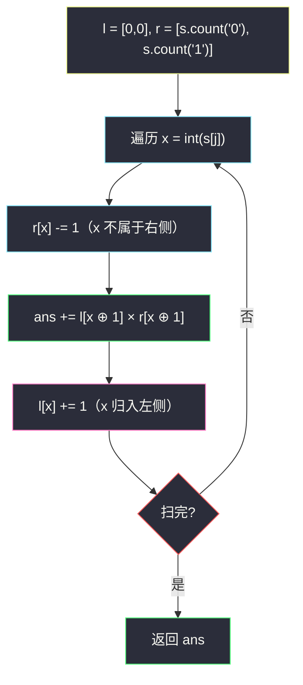

# 2222. 选择建筑的方案数（Number of Ways to Select Buildings）

> 题目来源：[https://leetcode.cn/problems/number-of-ways-to-select-buildings/](https://leetcode.cn/problems/number-of-ways-to-select-buildings/)
>
> 灵茶题单小节定位：§0.5 前缀和（计数型应用）

## 一、问题描述

给你一个下标从 0 开始的二进制字符串 `s`，它表示一条街沿途的建筑类型，其中：

- `s[i] = '0'` 表示第 `i` 栋建筑是一栋办公楼，
- `s[i] = '1'` 表示第 `i` 栋建筑是一间餐厅。

作为市政厅的官员，你需要随机选择 3 栋建筑。然而，为了确保多样性，选出来的 3 栋建筑**相邻**的两栋不能是同一类型。

- 比方说，给你 `s = "001101"`，我们不能选择第 `1`、`3`、`5` 栋建筑，因为得到的子序列是 `"011"`，有相邻两栋建筑是同一类型，所以不合题意。

请你返回可以选择 3 栋建筑的**有效方案数**。

**数据范围**：

- `3 <= s.length <= 10⁵`
- `s[i]` 要么是 `'0'`，要么是 `'1'`

**示例 1**：

```text
输入：s = "001101"
输出：6
解释：合法下标集合：[0,2,4], [0,3,4], [1,2,4], [1,3,4]（子序列 "010"）
以及 [2,4,5], [3,4,5]（子序列 "101"）。
```

**示例 2**：

```text
输入：s = "11100"
输出：0
解释：没有任何符合题意的选择。
```

**核心思考点**：三个位置两两相邻不同 ⇒ 整个子序列只能是 `"010"` 或 `"101"`——**中间字符被两侧夹住、两侧必然都与中间不同**。枚举中间字符 `x`，方案数 = 左边 `x⊕1` 的个数 × 右边 `x⊕1` 的个数。左边个数随扫描累加、右边个数从总数倒扣，正是「枚举右维护左」与前缀和计数的合体。

## 二、暴力解法

### 思路

枚举所有 `i < j < k`，检查 `s[i], s[j], s[k]` 是否两两相邻不同（等价于 `s[i] ≠ s[j]` 且 `s[j] ≠ s[k]`）。三重循环直译定义。

### 代码

```python
def numberOfWaysBrute(s: str) -> int:
    n = len(s)
    ans = 0
    for i in range(n):
        for j in range(i + 1, n):
            if s[i] == s[j]:
                continue
            for k in range(j + 1, n):
                if s[j] != s[k]:
                    ans += 1
    return ans
```

### 复杂度

- 时间：`O(n³)`——`n = 10⁵` 时天文数字，仅作对拍基准。
- 空间：`O(1)`。

## 三、优化探索

### 3.1 模式坍缩：只有 "010" 和 "101" ⭐

三个字符 `a, b, c` 满足 `a ≠ b` 且 `b ≠ c`（题面只约束**相邻**两栋，即选出的子序列相邻位）。二进制下 `a = c = b ⊕ 1` 被完全确定——所以合法方案的形式只有两种：

- 中间是 `'1'`：两侧取 `'0'`，即 `"010"`；
- 中间是 `'0'`：两侧取 `'1'`，即 `"101"`。

计数目标从「三个位置的组合」坍缩成「**中间位置**的独立贡献」。

### 3.2 枚举中间：左 × 右 乘法原理 ⭐⭐

固定中间下标 `j`（字符 `x`）：

- 左侧可选 = 下标 `< j` 中字符 `x⊕1` 的个数，记 `l[x⊕1]`；
- 右侧可选 = 下标 `> j` 中字符 `x⊕1` 的个数，记 `r[x⊕1]`；
- 贡献 = `l[x⊕1] × r[x⊕1]`（乘法原理，左右独立）。

`l` 随扫描从 `(0, 0)` 累加；`r` 初始化为全局计数 `(count('0'), count('1'))`，每到一个字符先倒扣自己——同一时刻 `(l, r)` 恰是「严格左侧 / 严格右侧」的字符计数。与 #1991/#2574 的 `l/r` 滚动是同一个动作，只是从「求和」换成「计数」。

### 3.3 前缀和视角的等价写法 ⭐

定义 `pre[i][c]` = 前 `i` 个字符中 `c` 的个数，则

```text
ans = Σⱼ (pre[j][x⊕1]) × (total[x⊕1] − pre[j+1][x⊕1])
```

滚动数组把 `pre` 压到 `O(1)` 空间即 3.2。另有一条 DP 路（灵神题单其它小节的「三状态机」）：`f010`、`f101` 边扫边传——见第四节进阶。



## 四、代码实现

### 主解：枚举中间 + 左右计数

```python
class Solution:
    def numberOfWays(self, s: str) -> int:
        l = [0, 0]                                  # 左侧 '0'/'1' 计数
        r = [s.count("0"), s.count("1")]            # 右侧计数（含自身，先扣）
        ans = 0
        for x in map(int, s):
            r[x] -= 1                               # x 不属于右侧
            ans += l[x ^ 1] * r[x ^ 1]              # 中间为 x，两侧取 x⊕1
            l[x] += 1                               # x 归入左侧
        return ans
```

### 进阶：三计数器状态机（无需数组）

维护三个计数器 `f1`（以当前字符结尾长度 1）、`f2`（结尾两位交替）、`f3`（结尾三位交替，即答案）。扫到字符 `x`：

```python
class Solution:
    def numberOfWays(self, s: str) -> int:
        f1 = [0, 0]        # 结尾字符为 0/1 的长度 1 子序列数
        f2 = [0, 0]        # 结尾字符为 0/1 的 "交替两位" 子序列数
        f3 = 0             # "交替三位" 子序列总数
        for x in map(int, s):
            f3 += f2[x ^ 1]     # 前面以 x⊕1 结尾的两位 + x
            f2[x] += f1[x ^ 1]  # 前面以 x⊕1 结尾的一位 + x
            f1[x] += 1
        return f3
```

更新顺序必须**先长后短**（`f3 → f2 → f1`），否则同一字符会被重复接龙。这个写法把「枚举中间」推广成「子序列 DP」，是 §0.5 与线性 DP 的过渡形态。

### 细节说明

- **`x ^ 1` 的巧用**：二进制下异或 1 即「另一个字符」，免去 if-else 分支。
- **`r` 初始化含全体**（含当前待扣元素），配合「先扣再算」维持「严格右侧」语义——与 #1991 完全同款三步节奏。
- **答案是 64 位量级**：`n = 10⁵` 全 `"0101…"` 时约 `n³/16 ≈ 6×10¹³`，Python 自动大整数；Java/C++ 需 `long`。
- **`f3 += f2[x^1]` 与乘法版的等价性**：`f2[x^1]` 累计的正是「左侧以 `x` 结尾的交替两位」数，接上当前 `x` 即三元组——两种计数殊途同归。
- **空侧自动为 0**：`j = 0` 时 `l[x⊕1] = 0`，`j = n−1` 时 `r[x⊕1] = 0`，乘积自然为零，无需特判。

## 五、例子演示

**示例 1 端到端：s = "001101"，total = ('0':3, '1':3)**

| j | s[j] | x | r 扣后 (0,1) | l (0,1) | 贡献 l[x⊕1]×r[x⊕1] | ans | l 加后 |
|---|---|---|---|---|---|---|---|
| 0 | '0' | 0 | (2,3) | (0,0) | l[1]×r[1] = 0×3 = 0 | 0 | (1,0) |
| 1 | '0' | 0 | (1,3) | (1,0) | l[1]×r[1] = 0×3 = 0 | 0 | (2,0) |
| 2 | '1' | 1 | (1,2) | (2,0) | l[0]×r[0] = 2×1 = 2 | 2 | (2,1) |
| 3 | '1' | 1 | (1,1) | (2,1) | l[0]×r[0] = 2×1 = 2 | 4 | (2,2) |
| 4 | '0' | 0 | (0,1) | (2,2) | l[1]×r[1] = 2×1 = 2 | 6 | (3,2) |
| 5 | '1' | 1 | (0,0) | (3,2) | l[0]×r[0] = 3×0 = 0 | 6 | (3,3) |

返回 **6** ✅。抽查 j=2（`'1'`，贡献 2）：左边 `x⊕1='0'` 有下标 0、1 两个；右边 `'0'` 只有下标 4 一个——对应官方列举的 `[0,2,4]`、`[1,2,4]`，正是 `"010"` 模式的一半；j=3 同理补出 `[0,3,4]`、`[1,3,4]`；j=4（`'0'`）贡献的 2 是 `[2,4,5]`、`[3,4,5]`（`"101"`）。六个方案在表格里各有其位。

**示例 2：s = "11100"**：`'1'` 只在左侧成群、`'0'` 只有两个且都在右端。任何中间字符要么一侧没有对方字符，要么模式凑不齐——逐位乘积全为 0，返回 **0** ✅（具体：j=2 的 `'1'`：r[0]=2, l[0]=0 → 0；j=3 的 `'0'`：l[1]=3, r[1]=0 → 0；j=4 的 `'0'`：r 全 0）。

**状态机版抽查（同一输入）**：扫到 j=4 的 `'0'` 时 `f2[1] = 2`（"01"、"11"→不对，交替两位仅 "01" 型结尾 1 的有两个："01"(0,3) 与 "01"(0,4 之前)……严格追踪：`f2` 在 j=3 时为 [0,2]（"01" 两种）），`f3 += f2[1] = 2` 累出 `"010"` 的最后一对——与主解 j=4 行的贡献 2 一致。

## 六、复杂度分析

设 `n = len(s)`：

- **时间复杂度：`O(n)`**——`count` 两次 + 一趟扫描，每轮 `O(1)`。
- **空间复杂度：`O(1)`**——四个计数器。

## 七、对比总结

| 维度 | 暴力三重循环 | 主解（枚举中间×左右计数） | 进阶（三计数器状态机） |
|---|---|---|---|
| 时间 | `O(n³)` | `O(n)` | `O(n)` |
| 空间 | `O(1)` | `O(1)` | `O(1)` |
| 泛化性 | 任意长度 | 仅 3 元（中间坍缩） | 任意长度 k（加计数器） |
| 思维量 | 零 | 需看破「模式坍缩」 | 需掌握子序列接龙 |

**套路归纳**：**「枚举中间 + 乘法原理」**是三元组计数的万能钥匙——条件只约束相邻两位时，中间元素是唯一的「枢纽」，两侧独立相乘即可，复杂度从组合数级降到线性。配套的两个基本功：①`l/r` 滚动（左侧累加、右侧倒扣），把「前缀/后缀统计量」压成常量空间；②`x ^ 1` 二值翻转。要推广到任意长度 k 时切换到「子序列 DP 接龙」形态。

## 八、举一反三

1. **[1930. 长度为 3 的不同回文子序列](https://leetcode.cn/problems/unique-length-3-palindromic-subsequences/)**：同为三元组枚举中间，但两侧只需「存在」（26 个字母的首末位置），是本题的回文镜像。
2. **[2063. 所有子字符串中的元音数](https://leetcode.cn/problems/vowels-of-all-substrings/)**：枚举每个字符被多少子串包含（左长度 × 右长度），乘法原理的又一应用。
3. **[940. 不同的子序列 II](https://leetcode.cn/problems/distinct-subsequences-ii/)**：子序列计数 DP 的通用形态（结尾字符分类 + 容斥），状态机写法的进阶。
4. **[795. 区间子数组个数](https://leetcode.cn/problems/number-of-subarrays-with-bounded-maximum/)** 不属前缀和计数；更贴的是 **[1248. 统计「优美子数组」](https://leetcode.cn/problems/count-number-of-nice-subarrays/)**：前缀和计数 + 哈希表，把「计数型前缀和」从字符域搬到奇偶域。
5. **[1991. 找到数组的中间位置](https://leetcode.cn/problems/find-the-middle-index-in-array/)** / **[2574. 左右元素和的差值](https://leetcode.cn/problems/left-and-right-sum-differences/)**：本批姊妹篇，同一个 `l/r` 滚动骨架的求和形态。

**同族互引**：灵茶题单 §0.5 前缀和的计数收官题；「枚举右维护左」的哈希计数进阶见同目录 `number-of-substrings-containing-all-three-characters.md`（双指针）与 `subarray-sums-divisible-by-k.md`（同余前缀和）。
