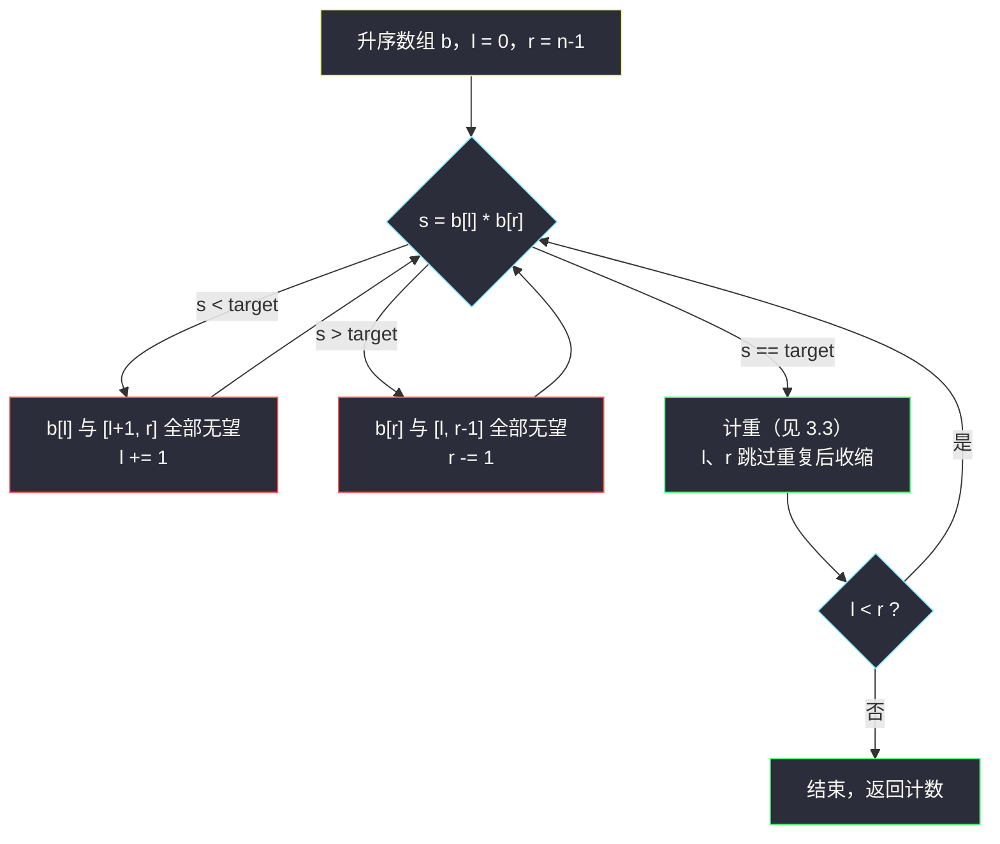
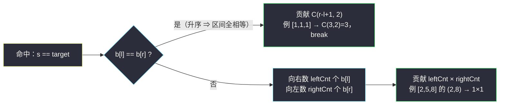

# 数的平方等于两数乘积的方法数（相向双指针 · 排序后数对计数）

## 一、问题描述

给你两个整数数组 `nums1` 和 `nums2`，请你统计满足下面两种类型的三元组数目，返回这个数目：

- **类型 1**：三元组 `(i, j, k)` 满足 `nums1[i]² == nums2[j] * nums2[k]`，其中 `0 <= i < nums1.length` 且 `0 <= j < k < nums2.length`；
- **类型 2**：三元组 `(i, j, k)` 满足 `nums2[i]² == nums1[j] * nums1[k]`，其中 `0 <= i < nums2.length` 且 `0 <= j < k < nums1.length`。

两个数组地位完全对称，各算一遍求和即可。

> 🔗 LeetCode 1577：https://leetcode.cn/problems/number-of-ways-where-square-of-number-is-equal-to-product-of-two-numbers/
>
> 数据范围：`1 <= nums1.length, nums2.length <= 1000`，`1 <= nums1[i], nums2[i] <= 10^5`。

**示例 1**

```
输入：nums1 = [7,4], nums2 = [5,2,8,9]
输出：1
解释：类型 1：(1,1,2)，nums1[1]² = 16 = nums2[1] * nums2[2] = 2 * 8。
```

**示例 2**

```
输入：nums1 = [1,1], nums2 = [1,1,1]
输出：9
解释：类型 1：6 个；类型 2：3 个，共 9 个。
```

**直观理解**

本质是一个「**两数之积等于目标值**」的计数问题：固定一边的某个数 `x`，问另一个数组里有多少对 `(j, k)` 乘起来恰好等于 `x²`。数组可以随意排序——我们数的是**数值对**的个数，与下标顺序无关（每对数值对 `(j, k)` 的下标组合 `j < k` 一一对应一个方案）。

---

## 二、暴力解法

三重循环：枚举 `nums1` 的每个数 `x`，再枚举 `nums2` 的所有二元组 `(j, k)`，判断 `x² == nums2[j] * nums2[k]`。

```python
class Solution:
    def numTriplets(self, nums1: List[int], nums2: List[int]) -> int:
        def brute(a: List[int], b: List[int]) -> int:
            # 数「a 中某数的平方 == b 中某对数乘积」的三元组个数
            ans = 0
            for x in a:
                t = x * x
                for j in range(len(b)):
                    for k in range(j + 1, len(b)):
                        if b[j] * b[k] == t:
                            ans += 1
            return ans
        return brute(nums1, nums2) + brute(nums2, nums1)
```

### 复杂度

- **时间**：`O(n * m²)`，`n = m = 1000` 时约 `10^9` 次乘法比较，超时。
- **空间**：`O(1)`。

### 🔴 瓶颈在哪里

内层两重循环在**无序**数组上盲目枚举所有对。有序数组有个美妙的性质：固定一端后，另一端该往哪边移是**唯一确定**的——这正是相向双指针的用武之地。

---

## 三、优化探索（核心章节）

> 📚 本题在灵茶题单中属于 **§3.2 相向双指针**。灵神处理「有序数组数两数之和/积满足某条件」的统一框架：`l` 从头、`r` 从尾向中间走，每看一眼 `b[l] op b[r]` 就能**安全扔掉一个端点**。本题是这个框架在「乘积恰好等于 target」上的直接应用。

### 3.1 先排序：为什么可以排序

答案只关心「`nums2` 中有多少对下标 `(j,k)` 乘积等于给定值」。对任意一对下标 `(j,k)`，无论数组怎么重排，它们是否乘积等于 `target` 不变。所以**对两个数组分别排序，答案不变**，排序后获得单调性。

### 3.2 相向双指针：为什么不会漏（正确性论证）

把问题抽出来：**升序数组 `b` 中，数乘积恰好等于 `target` 的对 `(l, r)`（`l < r`）有多少个。**

指针 `l = 0`、`r = len(b) - 1`，看 `s = b[l] * b[r]`（本题元素全为正数，乘积随任一因子增大而增大）：

| 情形 | 结论 | 动作 |
|------|------|------|
| `s < target` | `b[l]` 与区间 `[l+1, r]` 内**任何数**配对都 `< target`（因子只会更小） | `l` 作为左端点已无希望，`l += 1` |
| `s > target` | `b[r]` 与区间 `[l, r-1]` 内任何数配对都 `> target`（因子只会更大） | `r` 作为右端点已无希望，`r -= 1` |
| `s == target` | 计数，然后两边一起去重收缩 | 见 3.3 |

**为什么不会漏**：每一步扔掉的端点，都以「它与当前区间内所有可能搭档的组合都已判定为无望」为前提——扔掉的是**整段不可能的组合**，而不是一个候选。又因为每个候选对 `(l, r)` 只有当 `l` 或 `r` 其中之一被扔掉时才离开考察范围，而离开前必然经历过一次「以它为端点的判定」，所以没有对被跳过、也没有对被重复计数。



### 3.3 命中后的计重技巧（本题灵魂）

`s == target` 时，`b[l]` 和 `b[r]` 可能各自带着一串重复值，要**一次算清**而不是一格一格挪：

1. **`b[l] == b[r]`**：数组升序 → 区间 `[l, r]` 内**全部相等**。任取两两组合都命中，贡献 `C(r-l+1, 2) = c*(c-1)/2`，直接 `break`。
2. **`b[l] != b[r]`**：向右数等于 `b[l]` 的个数 `leftCnt`，向左数等于 `b[r]` 的个数 `rightCnt`，贡献 `leftCnt * rightCnt`，然后 `l`、`r` 跳过重复后各收缩一步。

计重后为什么能安全收缩：剩下的组合里，`b[l]`（那个值）与任何新搭档的乘积要么已数过、要么必然偏离 `target`（因为新搭档严格大于 `b[r]` 或严格小于 `b[l]`）。

### 3.4 整体流程

- 排序 `nums2`，枚举 `nums1` 的每个 `x`，在排序后的 `nums2` 上数乘积 `== x²` 的对；
- 排序 `nums1`，对称地再来一遍；
- 两个方向结果相加。

（顺带一提：由于值域只有 `10^5`，本题也可以用哈希表存「乘积 → 对数」做 `O(n + m²)`，思路同样正；但相向双指针版空间 `O(1)`（不计排序）、模板与 [#167 两数之和 II](https://leetcode.cn/problems/two-sum-ii-input-array-is-sorted/) 一脉相承，是灵神 §3.2 想练的骨架。）

### 3.5 一句话核心

> **排序换来单调性；相向双指针每步扔掉一整段无望组合；命中时按「全相等 → 组合数 / 部分相等 → 个数相乘」一次算清重复贡献。**

---

## 四、代码实现

### Python（主解：排序 + 相向双指针数对）

```python
class Solution:
    def numTriplets(self, nums1: List[int], nums2: List[int]) -> int:
        def count_pairs(b: List[int], target: int) -> int:
            """升序数组 b 中，b[l] * b[r] == target 的对数（元素均为正数）"""
            l, r = 0, len(b) - 1
            cnt = 0
            while l < r:
                s = b[l] * b[r]
                if s < target:               # l 这边全无望，扔掉
                    l += 1
                elif s > target:             # r 这边全无望，扔掉
                    r -= 1
                else:                        # 命中：计重
                    if b[l] == b[r]:         # 区间 [l, r] 全相等
                        c = r - l + 1
                        cnt += c * (c - 1) // 2
                        break
                    left_cnt = 1             # 向右数 b[l] 的重复个数
                    while b[l] == b[l + 1]:
                        l += 1
                        left_cnt += 1
                    right_cnt = 1            # 向左数 b[r] 的重复个数
                    while b[r] == b[r - 1]:
                        r -= 1
                        right_cnt += 1
                    cnt += left_cnt * right_cnt
                    l += 1
                    r -= 1
            return cnt

        nums1.sort()
        nums2.sort()
        ans = 0
        for x in nums1:                      # 类型 1：x² == nums2 对乘积
            ans += count_pairs(nums2, x * x)
        for y in nums2:                      # 类型 2：y² == nums1 对乘积
            ans += count_pairs(nums1, y * y)
        return ans
```

**变量含义**

| 变量 | 含义 |
|------|------|
| `b` | 已排序的「被数对」数组 |
| `target` | 目标乘积（某个数的平方） |
| `l` / `r` | 相向指针，各自只朝中间前进 |
| `left_cnt` / `right_cnt` | 命中时 `b[l]`、`b[r]` 各自的重复个数 |

**循环不变式**：每一轮判定前，尚未被排除的对恰好是 `[l, r]` 内部的对（两端点都在闭区间内、且 `l < r`）。

### Java（最优解同款）

```java
// 数的平方等于两数乘积的方法数
// 测试链接 : https://leetcode.cn/problems/number-of-ways-where-square-of-number-is-equal-to-product-of-two-numbers/
class Solution {
    public int numTriplets(int[] nums1, int[] nums2) {
        Arrays.sort(nums1);
        Arrays.sort(nums2);
        int ans = 0;
        for (int x : nums1) {
            ans += countPairs(nums2, (long) x * x);
        }
        for (int y : nums2) {
            ans += countPairs(nums1, (long) y * y);
        }
        return ans;
    }

    // 升序数组 b 中 b[l]*b[r] == target 的对数
    private int countPairs(int[] b, long target) {
        int l = 0, r = b.length - 1, cnt = 0;
        while (l < r) {
            long s = (long) b[l] * b[r];
            if (s < target) {
                l++;
            } else if (s > target) {
                r--;
            } else {
                if (b[l] == b[r]) {              // 区间内全相等
                    int c = r - l + 1;
                    cnt += c * (c - 1) / 2;
                    break;
                }
                int leftCnt = 1;
                while (b[l] == b[l + 1]) { l++; leftCnt++; }
                int rightCnt = 1;
                while (b[r] == b[r - 1]) { r--; rightCnt++; }
                cnt += leftCnt * rightCnt;
                l++;
                r--;
            }
        }
        return cnt;
    }
}
```

注意 Java 里 `x * x` 与 `b[l] * b[r]` 最大 `10^5 * 10^5 = 10^10`，**必须用 `long`**，否则溢出后答案错乱。

---

## 五、具体例子演示

以 `nums1 = [7,4]`、`nums2 = [5,2,8,9]` 端到端走一遍。排序后 `nums1 = [4,7]`、`nums2 = [2,5,8,9]`。

**类型 1 第一轮：`x = 7`，`target = 49`，在 `nums2 = [2,5,8,9]` 上数对**

| 轮次 | l | r | b[l] * b[r] | 与 49 比较 | 动作 | 累计 cnt |
|------|---|---|-------------|-----------|------|----------|
| 1 | 0 (2) | 3 (9) | 18 | < 49 | l = 1 | 0 |
| 2 | 1 (5) | 3 (9) | 45 | < 49 | l = 2 | 0 |
| 3 | 2 (8) | 3 (9) | 72 | > 49 | r = 2 | 0 |
| — | l = 2 | r = 2 | — | l == r | 结束 | **0** |

**类型 1 第二轮：`x = 4`，`target = 16`**

| 轮次 | l | r | b[l] * b[r] | 与 16 比较 | 动作 | 累计 cnt |
|------|---|---|-------------|-----------|------|----------|
| 1 | 0 (2) | 3 (9) | 18 | > 16 | r = 2 | 0 |
| 2 | 0 (2) | 2 (8) | 16 | == 16，`b[l]=2 != b[r]=8` | leftCnt=1（5≠2），rightCnt=1（5≠8），贡献 1×1，l=1, r=1 | **1** |
| — | l = 1 | r = 1 | — | l == r | 结束 | **1** |

类型 1 合计 `0 + 1 = 1`。

**类型 2：`nums1 = [4,7]` 上只有一对 `(4,7)`，乘积 28；`nums2` 各数的平方为 `4, 25, 64, 81`**

| target（y²） | 过程 | 贡献 |
|--------------|------|------|
| 25 | 4*7=28 > 25 → r=0，l==r 结束 | 0 |
| 4 | 28 > 4 → r=0，结束 | 0 |
| 64 | 28 < 64 → l=1，l==r 结束 | 0 |
| 81 | 同上 | 0 |

类型 2 合计 0。**总答案 = 1 + 0 = 1** ✓

**再看示例 2 的计重场景**：`nums1 = [1,1]`、`nums2 = [1,1,1]`。
类型 1：枚举 `x=1`（两次），`target = 1`，`l=0, r=2`：`1*1 == 1` 且 `b[l] == b[r]` → 区间 `[0,2]` 全是 1，贡献 `C(3,2) = 3`，break。两次共 6。
类型 2：枚举 `y=1`（三次），`target = 1`，`nums1 = [1,1]` 上 `l=0, r=1` 命中且相等，贡献 `C(2,2) = 1`，三次共 3。
**总答案 = 6 + 3 = 9** ✓



---

## 六、复杂度分析

| 方法 | 时间 | 空间 | 说明 |
|------|------|------|------|
| 暴力三重循环 | `O(n * m²)` | `O(1)` | 无序数组盲目枚举，10^9 超时 |
| 排序 + 相向双指针 | `O(n log n + m log m + n * m)` | `O(1)`（不计排序栈） | 排序后每个 `x` 一趟 `O(m)` 扫描，`n=m=1000` 时约 10^6 |
| 哈希乘积计数 | `O(n + m²)` | `O(min(m², 值域²))` | 中转站思路，同样能过 |

本题 `n * m` 与 `m²` 同阶，双指针版胜在 **O(1) 额外空间**与模板普适。

---

## 七、对比总结

**同族模板（有序数组数对）**

| 题 | 数的条件 | 判定分支 | 命中时 |
|----|----------|----------|--------|
| #167 两数之和 II | 和 == target | 命中即返回 | 只找一个 |
| #1577（本篇） | 积 == target | < → l++，> → r-- | 计重（组合数/乘积） |
| #2563 公平数对 | 和 ∈ [lower, upper] | ≤ x → 贡献 r-l, l++ | 见同批 `count-the-number-of-fair-pairs.md` |

**易错点**

1. **计重不是逐格挪**：命中后一格一格 `l++/cnt++` 会把 `O(m)` 退化成 `O(m²)`（全相等数组直接卡爆），必须用组合数/个数乘积一次算清。
2. `b[l] == b[r]` 时**区间内全部相等**（升序保证），此时 `break` 而不是继续。
3. Java 中乘积用 `long`：`10^5 * 10^5` 超 int。
4. 别忘了答案要**两个方向各算一遍**（类型 1 + 类型 2）。
5. 本模板依赖元素全为正（题目保证 ≥ 1）；若有 0 或负数，乘积不再随下标单调，需换思路。

**模板（有序数组数「积恰好为 target」的对数，Python 版）**

```python
def count_pairs(b, target):          # b 升序，元素为正
    l, r, cnt = 0, len(b) - 1, 0
    while l < r:
        s = b[l] * b[r]
        if s < target: l += 1
        elif s > target: r -= 1
        else:
            if b[l] == b[r]:
                c = r - l + 1
                return cnt + c * (c - 1) // 2   # 全相等，收工
            lc = rc = 1
            while b[l] == b[l+1]: l += 1; lc += 1
            while b[r] == b[r-1]: r -= 1; rc += 1
            cnt += lc * rc
            l += 1; r -= 1
    return cnt
```

---

## 八、举一反三

| 题目 | 关系 |
|------|------|
| [167. 两数之和 II - 输入有序数组](https://leetcode.cn/problems/two-sum-ii-input-array-is-sorted/) | 同框架最简形态：命中即返回，先默写它 |
| [2824. 统计和小于目标的下标对数目](https://leetcode.cn/problems/count-pairs-whose-sum-is-less-than-target/) | 「和 < target」版，判定只有两分支，适合入门 |
| [923. 三数之和的多种可能](https://leetcode.cn/problems/3sum-with-multiplicity/) | 本模板 + 枚举首数，计重技巧同款，见同批 `3sum-with-multiplicity.md` |
| [2563. 统计公平数对的数目](https://leetcode.cn/problems/count-the-number-of-fair-pairs/) | 「和落在区间」版 = 至多 − 至多，见同批 `count-the-number-of-fair-pairs.md` |
| [611. 有效三角形的个数](https://leetcode.cn/problems/valid-triangle-number/) | 「a+b > c」版，同样排序 + 相向双指针计数 |
| [15. 三数之和](https://leetcode.cn/problems/3sum/) | 同框架的去重枚举（判存在不去重），面试必练 |

**思想迁移**

- 计数题先问：**能不能排序？** 排序改变下标但答案只依赖数值关系时，放心排。
- 相向双指针的本质：单调性让「扔端点」是安全的——每步排除一整段组合。
- 口诀：**「排序生单调，端点定去留；相等先看全，组合数解愁。」**
