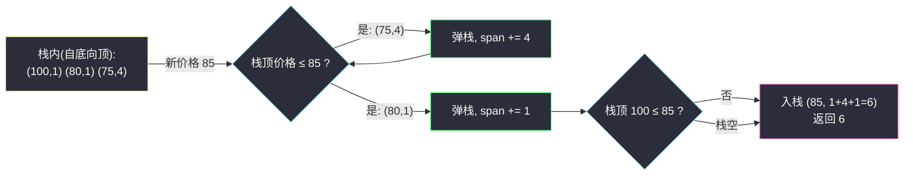
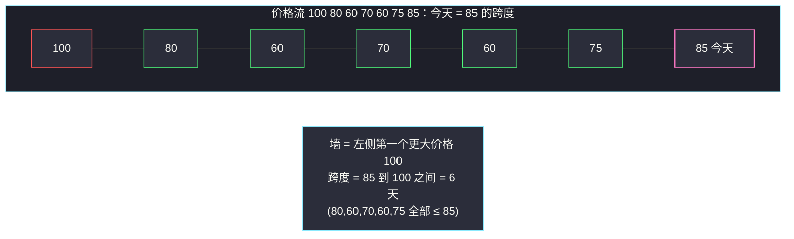

# 股票价格跨度（单调栈 · 跳表式跨度累加）

## 一、问题描述

编写一个 `StockSpanner` 类，它收集某些股票的**每日报价**（今天的价格），并返回该股票当日价格的**跨度**。

对今天的报价 `price`，跨度定义为：**从今天开始往回数（含今天）**，连续满足「价格小于等于今天价格」的天数。

形式化地，设今天是第 `i` 天（从 0 开始，`i` 天之前已依次给出 `price_0..price_i`），跨度等于最大的 `s`，使得 `price_{i-s+1}, ..., price_i` 全部 `<= price_i`。

> 🔗 LeetCode 901：https://leetcode.cn/problems/online-stock-span/
>
> 数据范围：`1 <= price <= 10^5`；最多调用 `next` 方法 `10^4` 次。

**示例**

```
输入：["StockSpanner","next","next","next","next","next","next","next"]
      [[],[100],[80],[60],[70],[60],[75],[85]]
输出：[null,1,1,1,2,1,4,6]

解释（第 1 天是 100）：
- 100 → 1：只有今天（100 <= 100）
- 80  → 1：昨天 100 > 80，挡住
- 60  → 1：昨天 80 > 60，挡住
- 70  → 2：今天 70，昨天 60 <= 70；前天 80 > 80? 不，80 > 70 挡住
- 60  → 1：昨天 70 > 60，挡住
- 75  → 4：75 >= 75 天(60,70,60)，更前面的 80 > 75 挡住
- 85  → 6：85 >= 85 天(60,70,60,75,80)，再往前 100 > 85 挡住
```

**直观理解**

「往回连续 ≤ 今天」——往前看能延伸多远，被**第一个严格大于今天价格**的「墙」挡住。这是典型的「**左侧第一个更大元素**」问题：跨度 = `i - (左侧第一个 > price_i 的下标)`，没有墙则到 0。而「一边来新元素、一边要在历史里找左侧第一个更大」正是灵茶题单 **§1.1 基础** 里单调栈的第一课。

---

## 二、暴力解法

把所有历史价格存进列表，每次 `next` 从尾部往前扫，数出连续 `<= price` 的个数：

```python
class StockSpanner:
    def __init__(self):
        self.prices = []

    def next(self, price: int) -> int:
        self.prices.append(price)
        span = 0
        for p in reversed(self.prices):   # 从今天往回数
            if p <= price:
                span += 1
            else:
                break                      # 第一面"墙"挡住
        return span
```

### 复杂度

- **时间**：单次最坏 `O(n)`（价格单调不增时每次都扫到底），总调用 `n` 次最坏 `O(n^2) = 10^8`，本题 `n <= 10^4` 勉强能过，但数据放大十倍就崩。
- **空间**：`O(n)`。

### 🔴 瓶颈在哪里

同一批「矮个子」天数被**反复扫描**：第 6 天 75 来的时候，把 60、70、60 又数了一遍；第 7 天 85 来的时候，这些天数连同 75、80 **再**数一遍。观察：一旦某天的价格 `p <= 今天`，它被「吸收」进今天的跨度后，**今后任何一天都不需要单独再看 p**——因为把 p 挡在跨度外面的墙，也必然把今天挡在外面（传递性）。这就是单调栈弹栈合法性的来源。

---

## 三、优化探索（核心章节）

> 📚 本题在灵茶题单中属于 **§1.1 单调栈基础**。灵神模板要点：栈存关键信息，新元素入栈前把「不合格」的栈顶弹出，并在**弹栈瞬间**把答案结算掉。本题是「找左侧第一个更大元素」的在线版。

### 3.1 关键观察：跨度可以「打包跳转」

维护一个栈，栈中存放 `(价格, 跨度)` 二元组，**价格从栈底到栈顶严格递减**。

来一个新价格 `price` 时，栈顶那些 `价格 <= price` 的记录被新价格「覆盖」：它们的天数**连同自己的跨度**都 `<= price`，可以合并成新记录的跨度。弹出时把它们的跨度累加，就像**跳表**一样一步跨过一整段：



### 3.2 为什么弹掉的天数永远不用回看（不变量）

- **栈内价格严格递减**：任何时刻，栈里从底到顶价格严格变小。若不满足，小的栈顶早被后来的大价格弹掉了。
- **被弹出的天数不会再被需要**：设弹出的记录是 `(p, s)`（因 `p <= price` 弹出）。未来某天价格 `q` 若满足 `q >= price`，则今天这条 `(price, 新跨度)` 记录（已包含那 `s` 天）会代替 `(p, s)` 被弹掉；若 `q < price`，则 `q < price` 与 `p <= price` 无先后保证，但 `(p, s)` 早就不在栈里——而 `(price, ...)` 顶在前面挡住了，`q` 的跨度根本到不了 `(p, s)` 的地盘。**归纳到底：每条记录被弹出一次、被合并一次，永不重复访问。**
- 于是每个价格**入栈一次、出栈至多一次**，`n` 次 `next` 的总代价是 `O(n)`，均摊每次 `O(1)`。

### 3.3 统一模板（找左侧第一个更大元素）

灵神单调栈模板的四种变体里，本题是「新元素弹出所有 `<=` 自身的栈顶」，留下的栈顶就是**左侧第一个严格更大**的价格：

```
next(price):
    span = 1                                  # 先算上今天自己
    while 栈非空 且 栈顶价格 <= price:           # 不合格 → 弹出并吸收其跨度
        span += 弹出记录的跨度
    栈.push((price, span))                     # 入栈，保持严格递减
    return span
```

等价的**下标版**（不存跨度存下标，跨度现算）：栈存下标，弹完后 `span = i - st[-1]`（栈空则 `span = i + 1`）。两版逻辑同构，`(价格, 跨度)` 版把「减法」换成了「加法合并」，更突出跳表直觉；下标版更通用（见 `maximum-width-ramp.md`、`count-bowl-subarrays.md`）。

### 3.4 「墙」与跨度的几何图景

把价格画成柱子，跨度就是「从今天柱子向左延伸、碰到第一根**更高**柱子为止」的宽度——那根更高的柱子就是「墙」：



红色是「墙」（严格更大，弹不掉），绿色是会被吸收的天，粉色是今天。栈里存着的永远是「红色塔」序列——它们都还没遇到自己的墙。

### 3.5 一句话核心

> **栈存 `(价格, 跨度)` 且价格严格递减；新价格弹掉所有 `<=` 自己的栈顶并累加其跨度，弹不掉的那个就是挡住自己的「墙」。**

---

### 3.6 错误写法对照：`<` 还是 `<=`？

若把弹栈条件写成严格 `<`（相等不弹），价格流 `[70, 70]`：

| 步 | 输入 price | 弹栈（严格 `<`，错误版） | 栈 | 返回 | 期望 |
|----|-----------|---------------------------|-----|------|------|
| 1 | 70 | 栈空 | `(70,1)` | 1 | 1 ✓ |
| 2 | 70 | `70 < 70`? 假，不弹 | `(70,1) (70,1)` | 1 | **2** ✗ |

第二天和第一天价格相等，按题意「小于等于今天价格」应算进跨度，返回 2；错误版把相等价格也当成「墙」，只返回 1。弹栈条件必须与跨度的比较方向一致：跨度吸收的是 `<=`，弹的也是 `<=`。

---

## 四、代码实现

### Python（主解：跳表式跨度累加）

```python
class StockSpanner:
    def __init__(self):
        self.st = []          # (价格, 跨度)，价格自底向顶严格递减

    def next(self, price: int) -> int:
        span = 1                                  # 含今天
        while self.st and self.st[-1][0] <= price:
            span += self.st.pop()[1]              # 吸收整段天数
        self.st.append((price, span))
        return span
```

**变量含义**

| 变量 | 含义 |
|------|------|
| `self.st` | `(价格, 跨度)` 栈，价格严格递减，即「还没被更晚价格覆盖的天」 |
| `span` | 累加器：今天 + 被弹出记录覆盖的所有天数 |
| `st[-1][0]` | 当前挡路的价格（弹出结束后即左侧第一个更大价格） |

等价的**下标版**（栈存 `(下标, 价格)`，跨度 = 今天下标减左侧第一个更大元素的下标）：

```python
class StockSpanner:
    def __init__(self):
        self.st = [(-1, float("inf"))]    # 哨兵：虚拟第 -1 天价格无穷大

    def next(self, price: int) -> int:
        i = self.st[-1][0] + 1             # 今天的天数编号（0 开始）
        while self.st[-1][1] <= price:     # 弹掉所有 <= 今天的价格
            self.st.pop()                  # 哨兵永远弹不掉
        self.st.append((i, price))
        return i - self.st[-2][0]          # 左侧第一个更大元素在 st[-2]
```

哨兵 `( -1, +inf )` 消掉了「栈空」分支，是下标版单调栈的通用起手式（后面 `maximum-width-ramp.md`、`count-bowl-subarrays.md` 都用得上）。

### Java（最优解同款写法）

```java
class StockSpanner {
    private final Deque<int[]> st = new ArrayDeque<>(); // [价格, 跨度]

    public int next(int price) {
        int span = 1;
        while (!st.isEmpty() && st.peek()[0] <= price) {
            span += st.pop()[1];
        }
        st.push(new int[]{price, span});
        return span;
    }
}
```

---

## 五、具体例子演示

以示例 1 端到端走一遍：价格流 `[100, 80, 60, 70, 60, 75, 85]`。表格里「栈（底→顶）」写成 `(价格,跨度)` 序列，「结算」是本次 `next` 的返回值：

| 步 | 输入 price | 弹栈过程（吸收跨度） | 栈（底→顶） | 返回跨度 | 说明 |
|----|-----------|----------------------|-------------|----------|------|
| 1 | 100 | 栈空，不弹 | `(100,1)` | **1** | 第一天，只含自己 |
| 2 | 80 | `100 <= 80`? 否 | `(100,1) (80,1)` | **1** | 100 是墙 |
| 3 | 60 | `80 <= 60`? 否 | `(100,1) (80,1) (60,1)` | **1** | 80 是墙 |
| 4 | 70 | `60 <= 70` 吸收 1 → `80 <= 70`? 否 | `(100,1) (80,1) (70,2)` | **2** | 跨过 60，被 80 挡住 |
| 5 | 60 | `70 <= 60`? 否 | `(100,1) (80,1) (70,2) (60,1)` | **1** | 70 是墙 |
| 6 | 75 | `60<=75` 吸收 1 → `70<=75` 吸收 2 → `80<=75`? 否 | `(100,1) (80,1) (75,4)` | **4** | 一步跳过 (60,1)+(70,2)，被 80 挡住 |
| 7 | 85 | `75<=85` 吸收 4 → `80<=85` 吸收 1 → `100<=85`? 否 | `(100,1) (85,6)` | **6** | 4+1+自己=6，被 100 挡住 |

对照期望输出 `[1,1,1,2,1,4,6]` ✓。

每一步结束后的栈都是「当前还活着的价格塔」——它们价格严格递减、且每座塔的跨度都覆盖着已消失的矮个子们。整个流的栈规模峰值出现在价格单调下跌的阶段（本例第 5 步后栈长 4）。

顺手复核 3.6 节的错误写法（严格 `<` 弹栈）在第 4 步就会暴露：`70` 来时栈顶 `(60,1)` 满足 `60 <= 70` 应当吸收；若误写成 `60 < 70` 看似也弹，但对 `[70,70]` 这种流就错了——差别只在相等的一瞬间，做题时拿相等用例一验便知。

**重点看第 7 步**：85 没有逐天数 60、70、60、75、80，而是把 `(75,4)` 整包吸收、再把 `(80,1)` 吸收——两步走完 5 天，加上自己得 6。**每个元素只被「吸收」进某个包一次**，这就是总代价 `O(n)` 的来源。

第 6 步之后，60、70、60 这三天的原始信息彻底消失（被合并进 `(75,4)`），此后再大的价格来了也只需弹 `(75,4)` 一条记录——空间随之省下来，最坏 `O(n)`（价格严格递减流）。

---

## 六、复杂度分析

| 方法 | 单次调用（最坏） | 单次调用（均摊） | n 次总时间 | 空间 |
|------|------------------|------------------|------------|------|
| 暴力回扫 | `O(n)` | `O(n)` | `O(n^2)` | `O(n)` |
| 单调栈（跳表式） | `O(n)` | `O(1)` | `O(n)` | `O(n)` |

- **时间**：每个 `(价格, 跨度)` 记录入栈一次、出栈至多一次，总弹栈次数 ≤ 总入栈次数 = 调用次数，故总计 `O(n)`，均摊 `O(1)`。注意单次调用最坏仍可弹 `O(n)` 条（如长时间递减后来个最大值），**均摊**才是 `O(1)`。
- **空间**：栈最坏保留全部记录（价格单调递减的流），`O(n)`。

---

## 七、对比总结

**两版实现对照**（同一个小节模板的两种落地）：

| 版本 | 栈内存 | 答案怎么来 | 优点 |
|------|--------|-----------|------|
| `(价格, 跨度)` 跳表式 | 二元组 | 弹栈时跨度相加 | 直觉最直接，在线流式接口天然契合 |
| 下标版 | 下标 | `i - st[-1]`（配哨兵） | 通用，换题只改比较方向（见 `maximum-width-ramp.md`） |

**复杂度再强调**：`(价格, 跨度)` 版的吸收合并让「跨度」随记录整体退场，即使未来价格再波动，也不需要回放历史——这是它与暴力版在 `10^4` 调用规模下拉开 4 个数量级的原因（`O(n)` vs `O(n^2)`）。

**易错点**

1. **弹栈条件是 `<=` 不是 `<`**：题目定义「小于等于今天价格」的天数都算进跨度，所以 `<= price` 的栈顶必须被吸收。若写成 `<`，`[70,70]` 第二天会错误地返回 1（正确是 2）。
2. **跨度初值是 1**（含今天自己），别从 0 开始累加。
3. **均摊 ≠ 单次**：面试说复杂度时要点明「均摊 `O(1)`，单次最坏 `O(n)`」。
4. 栈空时跨度是 `i + 1`（下标版），用 `inf` 哨兵可消掉这个分支。
5. 这是「左侧第一个更大」；「求每天温度之后第一个更高温度」则是「右侧第一个更大」（#739），扫描方向和结算时机不同，但栈的单调方向一致。

---

## 八、举一反三

| 题目 | 关系 |
|------|------|
| [739. 每日温度](https://leetcode.cn/problems/daily-temperatures/) | 姊妹篇：找**右侧**第一个更大元素，下标版单调栈的标准入门 |
| [496. 下一个更大元素 I](https://leetcode.cn/problems/next-greater-element-i/) | 右侧第一个更大 + 哈希表映射，模板进一步复用 |
| [503. 下一个更大元素 II](https://leetcode.cn/problems/next-greater-element-ii/) | 循环数组的右侧第一个更大，取余翻倍小技巧 |
| [1944. 队列中可见的人数](https://leetcode.cn/problems/number-of-visible-people-in-a-queue/) | 左侧/右侧第一个更大的综合计数，单调栈进阶 |
| [962. 最大宽度坡](https://leetcode.cn/problems/maximum-width-ramp/) | 同族（本批姊妹篇）：下标版单调栈 + 从右往左结算，见 `maximum-width-ramp.md` |
| [3676. 碗子数组的数目](https://leetcode.cn/problems/count-bowl-subarrays/) | 同族（本批姊妹篇）：弹栈瞬间结算子数组计数，见 `count-bowl-subarrays.md` |
| [1673. 找出最具竞争力的子序列](https://leetcode.cn/problems/find-the-most-competitive-subsequence/) | 同为单调栈模板题（字典序方向），见 `find-the-most-competitive-subsequence.md` |

**思想迁移**

- 「被覆盖的信息可以打包合并」是单调栈均摊高效的本质：弹出的元素**永久退场**，不再参与任何后续比较。识别这种「一次性消耗」结构，就能从暴力 `O(n^2)` 降到 `O(n)`。
- 在线（数据流）接口题先想「我需要历史里的什么」——本题只需要「还没被覆盖的价格及其覆盖宽度」，正好是栈的全部。
- 口诀：**「递减栈存活口，来大吃小并跨度；弹到墙上停一手，墙差下标即答案。」**
