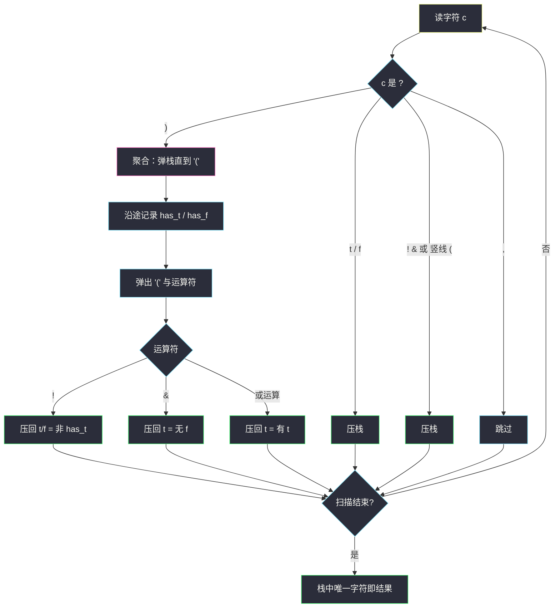
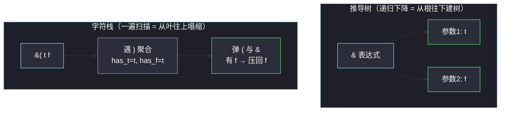

# 解析布尔表达式（递归下降 × 栈式一遍扫描）

## 一、问题描述

给定一个字符串 `expression` 表示一个布尔表达式，返回该式的**求值结果**。表达式的语法元素只有：

| 记号 | 含义 |
|------|------|
| `t` / `f` | 字面量 `true` / `false` |
| `!(...)` | 非运算，**恰好一个**操作数 |
| `&(...)` | 与运算，**一个或多个**操作数，逗号分隔 |
| `|(...)` | 或运算，**一个或多个**操作数，逗号分隔 |

> 🔗 LeetCode 1106：https://leetcode.cn/problems/parsing-a-boolean-expression/
>
> 数据范围：`1 <= expression.length <= 2 * 10^4`，`expression` 由 `t`、`f`、`!`、`&`、`|`、`(`、`)`、`,` 组成，是合法表达式；`&` 和 `|` 的操作数个数 ≥ 1，`!` 的操作数个数 = 1。

**示例**

| 输入 | 输出 | 说明 |
|------|------|------|
| `"!(f)"` | `true` | 非 `false` |
| `"|(f,t)"` | `true` | 或 |
| `"&(t,f)"` | `false` | 与 |
| `"|(&(t,f,t),!(t))"` | `false` | 嵌套：`(t∧f∧t)=f`，`¬t=f`，`f∨f=f` |

**直观理解**

这是一道**语法分析**题：输入不是数据，是「按文法写出来的程序」，求值前得先正确理解它的结构。灵神题单 **§3.5 表达式解析** 给了两套标准武器——**递归下降**（按文法逐层展开）与**栈式一遍扫描**（遇 `)` 弹到 `(` 聚合）。两套都会在本文实现，这也是本篇 Hard 的意义：把「解析」这件事第一次完整走通。

---

## 二、暴力解法

最朴素：**反复找最内层括号，原地求值替换**。每次扫描定位第一个不含括号的 `(...)`（其内部只有 `t`/`f`/`,`，一眼可算），把整段替换成 `t` 或 `f`，字符串缩短，重复直到只剩单字符：

```python
class Solution:
    def parseBoolExpr(self, expression: str) -> bool:
        s = expression
        while len(s) > 1:
            r = s.index(')')                    # 第一个 ')' 必属于最内层
            l = s.rindex('(', 0, r)             # 与之配对的 '(' 就在运算符后
            inner = s[l + 1:r]                  # 内部形如 "t,f,t" 或 "t"
            op = s[l - 1]
            if op == '!':
                val = 't' if inner == 'f' else 'f'
            elif op == '&':
                val = 't' if 'f' not in inner else 'f'
            else:                               # '|'
                val = 't' if 't' in inner else 'f'
            s = s[:l - 1] + val + s[r + 1:]     # op+(...) 整段替换为一个字面量
        return s == 't'
```

一个小观察：第一个 `)` 的配对 `(` 就是它左侧最近的 `(`，且最内层括号内不会再有括号，因此 `"f" in inner` 直接判断即可。

### 复杂度

- **时间**：`O(n^2)`——每消掉一层括号就整体重建一次字符串，嵌套深度可达 `O(n)` 量级（`!!!!!…(t)`），总代价平方级。
- **空间**：`O(n)` 字符串拷贝。

### 🔴 瓶颈在哪里

「算掉一层、重建一次整串」完全无视了结构：外层根本不需要内层的括号原文，只需要内层的**值**。一次从左到右的扫描中，值算出来的瞬间就应该把「`( 值 运算符`」三件套聚合成新值——这正是栈的用武之地。

---

## 三、优化探索（核心章节）

> 📚 本题在灵茶题单中属于 **§3.5 表达式解析**，是同小节 [#1006 笨阶乘](https://leetcode.cn/problems/clumsy-factorial/)（见同目录 [clumsy-factorial.md](clumsy-factorial.md)）的进阶：从「无括号四则」升级为「前缀运算符 + 不定长参数 + 括号嵌套」的完整文法。

### 3.1 先把文法写清楚

递归下降的前提是文法。本题语法用两条产生式就能描述（`expr` 是开始符号）：

```text
expr   →  't' | 'f'
       |  '!' '(' expr ')'
       |  '&' '(' expr (',' expr)* ')'
       |  '|' '(' expr (',' expr)* ')'
```

读法：一个表达式，要么是字面量；要么是 `!` 带恰好一个括起来的子表达式；要么是 `&` / `|` 带一个逗号分隔的子表达式列表。**输入串就是这个文法的一棵推导树的线性化**，解析 = 重建这棵树，求值 = 在树上自底向上算。

### 3.2 解法一：递归下降（按文法直译）

给一个全局读指针 `i`，写函数 `expr()`：看到什么记号，就走哪条产生式，并把指针推过已消费的部分：

- `t` / `f`：消费 1 个字符，返回 `True` / `False`；
- 运算符：消费「运算符 + `(`」，然后循环调 `expr()` 收集参数（逗号分隔）直到 `)`，按运算符聚合返回。

代码几乎是文法的逐行翻译，可读性极佳。**但有一个 Python 专属陷阱**：嵌套深度可达约 `6600` 层（每个 `!` 至少消耗 3 个字符，`2*10^4 / 3`），超过默认递归限制 `1000`，必须 `sys.setrecursionlimit(1 << 20)` 放宽，否则直接 `RecursionError`。

### 3.3 解法二：栈式一遍扫描（遇 `)` 弹到 `(` 聚合）

把「递归的函数调用栈」显式成一个字符栈 `st`，从左到右扫，规则只有三条：

| 读到 | 动作 |
|------|------|
| `t` / `f` / `!` / `&` / `\|` / `(` | 直接压栈 |
| `,` | 跳过（参数分隔符不进栈） |
| `)` | **弹出直到 `(`**：沿途统计 `has_t` / `has_f`；弹出 `(` 后再弹一个运算符，聚合出 `t`/`f` 压回 |

聚合规则（注意参数个数对结果无影响，只看集合里有没有 `t` / `f`）：

- `!x` → `x` 里有 `t` 就得 `f`，否则 `t`；
- `&…` → 有 `f` 即 `f`（全 `t` 才 `t`）；
- `|…` → 有 `t` 即 `t`（全 `f` 才 `f`）。

聚合完压回一个字面量，外层括号将来读到自己的 `)` 时，看到的子表达式已经「塌缩」成一个 `t`/`f`——**级联求值免费获得**，与递归下降的自底向上语义完全等价，但没有递归深度问题。

### 3.4 为什么 `)` 一定能让括号里的东西「塌缩干净」

归纳：读到某个 `)` 时，它配对的 `(` 之内若有嵌套括号，那些内层括号早已被更早出现的 `)` 聚合掉（内层的 `)` 一定先于外层出现）。所以栈上从该 `(` 到栈顶之间只剩 `t`/`f`（逗号被跳过），聚合条件永远成立。

### 3.5 结构图与流程



`"&(t,f)"` 的「递归下降视角」与「栈视角」对照（同一棵推导树，两种遍历）：



### 3.6 短路讨论

真实编译器对 `&&` / `||` 做短路求值，本题**不需要也无法短路**：`&(...)` 的参数个数不定，必须读完整个输入才能确认没有更多参数——所以「读到 `)` 时整段已全量就位」，聚合时顺带把所有参数都看过，这正是栈法能够只记 `has_t`/`has_f` 两个布尔的原因（连参数个数都不用数）。

### 3.7 一句话核心

> **递归下降：文法两条产生式直译，读指针推进；栈法：除 `,` 全压栈，遇 `)` 弹到 `(` 聚合、连同前面运算符压回单字面量。聚合只看 `has_t`/`has_f`，嵌套自底向上自动塌缩。**

---

## 四、代码实现

### Python（主解：栈式一遍扫描）

```python
class Solution:
    def parseBoolExpr(self, expression: str) -> bool:
        st = []
        for c in expression:
            if c == ')':
                has_t = has_f = False
                while st[-1] != '(':          # 弹出本层全部参数
                    ch = st.pop()
                    if ch == 't':
                        has_t = True
                    else:                     # 'f'
                        has_f = True
                st.pop()                      # 弹出 '('
                op = st.pop()                 # 弹出紧邻的运算符 ! & |
                if op == '!':
                    st.append('f' if has_t else 't')
                elif op == '&':
                    st.append('f' if has_f else 't')
                else:                         # '|'
                    st.append('t' if has_t else 'f')
            elif c != ',':                    # 逗号是纯分隔符，不进栈
                st.append(c)
        return st[-1] == 't'
```

### Python（对照：递归下降）

```python
import sys

class Solution:
    def parseBoolExpr(self, expression: str) -> bool:
        sys.setrecursionlimit(1 << 20)        # 嵌套最深约 6600 层，默认 1000 会爆
        s = expression

        def expr(i: int) -> tuple[bool, int]:
            c = s[i]
            if c == 't':
                return True, i + 1            # 消费 1 个字符
            if c == 'f':
                return False, i + 1
            op = c                            # '!' / '&' / '|'
            i += 2                            # 跳过 运算符 与 '('
            vals = []
            while s[i] != ')':
                v, i = expr(i)                # 子表达式：递归下降
                vals.append(v)
                if s[i] == ',':
                    i += 1                    # 跳过逗号
            return (not vals[0] if op == '!'
                    else all(vals) if op == '&'
                    else any(vals)), i + 1    # 跳过 ')'

        return expr(0)[0]
```

### Java（最优解同款：栈法）

```java
class Solution {
    public boolean parseBoolExpr(String expression) {
        Deque<Character> st = new ArrayDeque<>();
        for (char c : expression.toCharArray()) {
            if (c == ')') {
                boolean hasT = false, hasF = false;
                while (st.peek() != '(') {          // 弹出本层参数
                    char ch = st.pop();
                    if (ch == 't') hasT = true;
                    else hasF = true;
                }
                st.pop();                           // '('
                char op = st.pop();                 // ! & |
                if (op == '!')      st.push(hasT ? 'f' : 't');
                else if (op == '&') st.push(hasF ? 'f' : 't');
                else                st.push(hasT ? 't' : 'f');
            } else if (c != ',') {
                st.push(c);
            }
        }
        return st.peek() == 't';
    }
}
```

**变量含义**

| 变量 | 含义 |
|------|------|
| `st` | 字符栈：字面量、运算符、`(` 混存，`)` 是唯一的聚合触发器 |
| `has_t` / `has_f` | 本层参数集合的摘要（**个数无关紧要**） |
| `expr(i)` 返回值 | `(子表达式的值, 消费结束后的下标)`——递归下降的标准签名 |

---

## 五、具体例子演示

以 `"|(&(t,f,t),!(t))"` 端到端跟踪栈法（左为栈底，右为栈顶）：

| 读到 | 动作 | 栈（底 → 顶） |
|------|------|----------------|
| `\|` | 压栈 | `\|` |
| `(` | 压栈 | `\| (` |
| `&` | 压栈 | `\| ( &` |
| `(` | 压栈 | `\| ( & (` |
| `t` | 压栈 | `\| ( & ( t` |
| `,` | 跳过 | 不变 |
| `f` | 压栈 | `\| ( & ( t f` |
| `,` | 跳过 | 不变 |
| `t` | 压栈 | `\| ( & ( t f t` |
| `)` | 弹 `t,f,t` → `has_t=T, has_f=T`；弹 `(`、`&` → 有 `f` 得 `f`，压回 | `\| ( f` |
| `,` | 跳过 | 不变 |
| `!` | 压栈 | `\| ( f !` |
| `(` | 压栈 | `\| ( f ! (` |
| `t` | 压栈 | `\| ( f ! ( t` |
| `)` | 弹 `t` → `has_t=T`；弹 `(`、`!` → 非 `t` 得 `f`，压回 | `\| ( f f` |
| `)` | 弹 `f,f` → `has_t=F, has_f=T`；弹 `(`、`\|` → 无 `t` 得 `f`，压回 | `f` |

栈中只剩 `f`，返回 `false` ✓。

**递归下降视角回放同一输入**：`expr(0)` 见 `|` → 消费 `|(` → 循环调 `expr(2)`：见 `&` → 消费 `&(` → `expr(4)` 得 `(True,5)`、跳 `,`、`expr(6)` 得 `(False,7)`、跳 `,`、`expr(8)` 得 `(True,9)` → 见 `)` → 聚合 `all([T,F,T]) = False`，返回 `(False,10)`；跳 `,`；`expr(11)`：见 `!` → 消费 `!(` → `expr(13)` 得 `(True,14)` → 见 `)` → 非 `True` = `False`，返回 `(False,15)`；外层见 `)` → `any([False, False]) = False` ✓。两条路径的「自底向上」时刻完全一致。

---

## 六、复杂度分析

| 解法 | 时间 | 空间 |
|------|------|------|
| 暴力最内层替换 | `O(n^2)` | `O(n)` |
| 递归下降 | `O(n)` | `O(n)`（递归栈深度 = 嵌套深度，可达约 `n/3`） |
| 栈式一遍扫描（主解） | `O(n)` | `O(n)`（显式栈同样深，但无系统栈限制） |

- **时间 `O(n)`**：每个字符至多压栈一次、出栈一次；聚合内弹出的字符总数 ≤ 压入总数。
- **空间 `O(n)`**：最坏输入如 `!!!!!…(t)`，栈要同时容纳全部运算符与括号。
- 递归下降在 Python 下要调 `setrecursionlimit`；Java 默认栈深通常足够，但极端嵌套同样以栈法更稳。

---

## 七、对比总结

**两套武器怎么选**：递归下降胜在**文法直译、易扩展**（语法稍一变，比如加一元 `~`、中缀运算符，改产生式即可）；栈法胜在**实现短、无递归深度顾虑**。面试中建议先讲文法（体现「会用解析的眼光看输入」），再写栈法落地。本题与同小节的 [#1006 笨阶乘](https://leetcode.cn/problems/clumsy-factorial/)（同目录 [clumsy-factorial.md](clumsy-factorial.md)）共享「自左向右扫 + 栈上聚合」的骨架，差异只在聚合触发条件：笨阶乘按运算符触发（乘除改栈顶），本题按 `)` 触发（弹到 `(`）。

**易错点**

1. **逗号不进栈**：它只是参数分隔符，进栈会污染「弹到 `(`」的循环条件。
2. **聚合顺序**：先弹参数到 `(`，再弹 `(`，**最后弹运算符**——运算符紧贴在 `(` 左边，这个位置关系是文法保证的。
3. **`!` 只有一个参数**但代码不必特判个数：`has_t`/`has_f` 对 1 个参数同样正确。
4. **递归下降忘记推进指针**：`i += 2`（跳过 `运算符+(`）与结尾的 `i + 1`（跳过 `)`）漏一处就死循环。
5. Python 递归版必须 `sys.setrecursionlimit`，这是本题 WA 之外的另一种「翻车姿势」（`RecursionError`）。

---

## 八、举一反三

| 题目 | 关系 |
|------|------|
| [224. 基本计算器](https://leetcode.cn/problems/basic-calculator/) | 中缀 + 括号的表达式解析正主，栈法/递归下降双解通吃 |
| [726. 原子的数量](https://leetcode.cn/problems/number-of-atoms/) | 「遇 `)` 弹栈聚合 + 后缀数字」的化学式版，栈法姊妹题 |
| [394. 字符串解码](https://leetcode.cn/problems/decode-string/) | 嵌套括号展开，同款「弹到分隔符聚合」骨架 |
| [591. 标签验证器](https://leetcode.cn/problems/tag-validator/) | 纯语法合法性判断（不求值），文法思维进阶 |
| [1006. 笨阶乘](https://leetcode.cn/problems/clumsy-factorial/) | §3.5 同小节入门：无括号表达式的栈式求值（同目录 [clumsy-factorial.md](clumsy-factorial.md)） |
| 同目录 [remove-all-adjacent-duplicates-in-string-ii.md](remove-all-adjacent-duplicates-in-string-ii.md) | 「弹到分隔符」思想的计数栈近亲 |

**思想迁移**

- 遇到「输入是按文法组织的字符串」，先**写出产生式**再动手：递归下降是文法的机械翻译，写错文法比写错代码更致命。
- 栈法与递归下降**语义等价**：显式栈就是函数调用栈的手工版；递归爆栈时，翻写成栈法是标准逃生通道。
- 聚合参数列表时问自己：**结果依赖参数的哪些信息？** 本题只需「有无 `t`、有无 `f`」两个布尔，于是参数个数、顺序都不必保存——识别这种「摘要不变量」能大幅简化代码。
