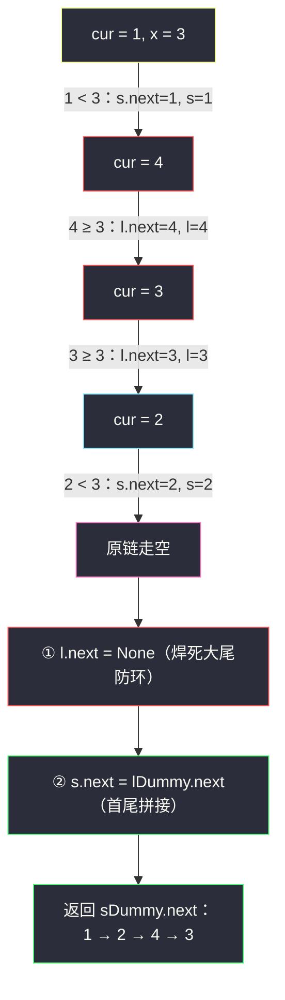

# 86. 分隔链表（Partition List）

> 题目来源：[https://leetcode.cn/problems/partition-list/](https://leetcode.cn/problems/partition-list/)
>
> 灵茶题单小节定位：§链表·分隔链表

## 一、问题描述

给你一个链表的头节点 `head` 和一个特定值 `x`，请你对链表进行分隔，使得所有**小于 `x` 的节点**都出现在**大于或等于 `x` 的节点**之前。

你应当**保留**两个分区中每个节点的初始相对位置。

**数据范围**：

- 链表中节点的数目在范围 `[0, 200]` 内
- `-100 <= Node.val <= 100`
- `-200 <= x <= 200`

**示例 1**：

```text
输入：head = [1,4,3,2,5,2], x = 3
输出：[1,2,2,4,3,5]
解释：小于 3 的 1,2,2 排前，大于等于 3 的 4,3,5 排后，两段内部相对顺序不变。
```

**示例 2**：

```text
输入：head = [2,1], x = 2
输出：[1,2]
解释：2 不小于 x=2，属于后段；1 属于前段。
```

**核心思考点**：这是链表版的「**稳定划分**」（stable partition）。数组上做稳定划分要么额外开数组、要么 `O(n²)` 挪元素；链表天然优势就是**摘节点、接尾巴都是 `O(1)`**——把原链拆成「小链 + 大链」两条，最后首尾相接，一遍扫描完事。难点不在思路在**指针细节**：两条链各自的 dummy 头 + 尾指针推进 + 大链尾巴**必须置 `None`** 防环。

## 二、暴力解法

### 思路

把链表值抄进数组，按定义分成 `small`（`< x`）与 `large`（`≥ x`）两个子数组（各自保持原相对顺序），再重建链表。

功能上正确、也满足「稳定」要求，但依然是**改值/重建**路线：节点对象全部作废重造。若节点上挂着业务数据或外部引用（别的结构还指着这些节点），重建即失效——链表题考察的「摘接指针」能力被完全绕开。

### 代码

```python
class ListNode:
    def __init__(self, val=0, next=None):
        self.val = val
        self.next = next

def partitionBrute(head: ListNode, x: int) -> ListNode:
    # 1) 抄值
    vals, node = [], head
    while node:
        vals.append(node.val)
        node = node.next
    # 2) 稳定划分（顺序遍历天然稳定）
    small = [v for v in vals if v < x]
    large = [v for v in vals if v >= x]
    # 3) 重建链表
    dummy = cur = ListNode()
    for v in small + large:
        cur.next = ListNode(v)
        cur = cur.next
    return dummy.next
```

### 复杂度

- 时间：`O(n)`。
- 空间：`O(n)`（数组 + 重建的新节点）。
- 能过但浪费：原节点一个没用上，`O(n)` 额外分配毫无必要。

## 三、优化探索

### 3.1 关键观察：一遍扫描，两条队列

遍历原链，每个节点按 `val < x` 分派到两条链之一：

- **small 链**：装所有小于 `x` 的节点；
- **large 链**：装所有大于等于 `x` 的节点。

「分派」= 把节点**尾插**到对应链——尾插保证了每条链内部相对顺序与原链一致（稳定性免费获得）。最后 `small_tail.next = large_head` 拼接，一趟完成。

### 3.2 双 dummy：两条链都要虚拟头

small 链与 large 链的**第一个节点都不确定**（可能全是大的、可能全是小的、可能空链）——和 #24 同一个困境，同一个解法：各配一个 dummy：

```text
sDummy → (small 节点们…)
lDummy → (large 节点们…)
```

尾指针 `s / l` 从各自 dummy 出发，每摘一个节点 `cur`：

```text
if cur.val < x:  s.next = cur;  s = cur     # 尾插 small
else:            l.next = cur;  l = cur     # 尾插 large
```

### 3.3 致命细节：大链尾巴置空

原链最后一个节点如果是 large 段的尾，它心里还念着 `cur.next = None`（原链结尾）？**不一定**——我们只是逐个摘节点，从没动过它们的 `next`。拼接后若 `l` 链尾节点的 `next` 还指向原链中的某个后续节点（那节点现已在 small 链里），链表就**成环**了。

构造一个必翻车的例子：`head = 1 → 4 → 3 → 2`，`x = 3`：

- 摘 `1` → small；摘 `4` → large（`4.next` 仍指 `3`）；摘 `3` → large；摘 `2` → small；
- large 链尾 `3` 的 `next` **从未清空**，而 `3` 原本指向的 `2` 现在是 small 链尾；
- 拼接 `small尾(2).next = large头(4)` 后：`1 → 2 → 4 → 3 → (2)`——**环！**

所以拼接前必须 `l.next = None` 把大链尾巴焊死。这一步是本题最高频的 WA 点。



**易错点小结**：

- 忘 `l.next = None` → 环（见上例，序列化死循环）；
- 拼接写成 `s.next = l`（接的是 large 的 **dummy 哨兵**，多出一个假节点）→ 必须是 `lDummy.next`；
- 用「交换值」的思路排序 → 破坏稳定性，与题意「保留初始相对位置」冲突。

## 四、代码实现

```python
class ListNode:
    def __init__(self, val=0, next=None):
        self.val = val
        self.next = next

def partition(head: ListNode, x: int) -> ListNode:
    # 两条链各配 dummy：头节点归属不确定，哨兵免特判
    sDummy = ListNode()                  # small 链虚拟头（< x）
    lDummy = ListNode()                  # large 链虚拟头（>= x）
    s, l = sDummy, lDummy                # 两条链的尾指针

    cur = head
    while cur:
        nxt = cur.next                  # 先记住后继（摘节点不依赖它，但习惯性保存更稳）
        if cur.val < x:
            s.next = cur                # 尾插 small 链
            s = cur
        else:
            l.next = cur                # 尾插 large 链
            l = cur
        cur = nxt

    l.next = None                       # ★ 焊死大链尾巴：否则残留 next 成环
    s.next = lDummy.next                # ★ 拼接：small 尾接 large 真头（不是 dummy！）
    return sDummy.next                  # small 为空时自动返回 large 头，零特判


# ------- 验证辅助：数组 ⇄ 链表 -------
def build_list(vals: list) -> ListNode:
    dummy = cur = ListNode()
    for v in vals:
        cur.next = ListNode(v)
        cur = cur.next
    return dummy.next

def list_to_vals(head: ListNode) -> list:
    vals = []
    node = head
    while node:
        vals.append(node.val)
        node = node.next
    return vals
```

### 细节说明

- **为什么 `nxt = cur.next` 提前保存**：本解在循环里并没有破坏 `cur.next`（尾插不改它），保存 `nxt` 是防御式习惯——若后续改成「头插」或就地改链，这行就是保命的；留着也让代码语义更清晰（摘下 cur，其余不动）。
- **`s.next = lDummy.next` 而非 `lDummy`**：dummy 是哨兵不是数据节点。接错会输出一个多余节点（值为 0 的假头），判题直接错。
- **small 为空的兜底是免费的**：`s` 停在 `sDummy`，`sDummy.next = lDummy.next` 直接让答案头 = large 头。同理 large 为空时 `l.next = None` 作用在 `lDummy` 上无害，`s.next = None` 恰好封住 small 尾。**两种极端一个分支都不用加**。
- **稳定性来源**：严格按原链顺序逐个尾插，两条链内部顺序天然保持——「稳定划分」四个字在这一遍扫描里被无声满足。

## 五、例子演示

以 `head = 1 → 4 → 3 → 2 → 5 → 2`，`x = 3` 为例（官方示例 1）：

| 步骤 | cur | 判定 | small 链 | large 链 |
|---|---|---|---|---|
| 初始 | — | — | `sDummy` | `lDummy` |
| 1 | 1 | `1 < 3` 尾插 small | `D₁ → 1` | `D₂` |
| 2 | 4 | `4 ≥ 3` 尾插 large | `D₁ → 1` | `D₂ → 4` |
| 3 | 3 | `3 ≥ 3` 尾插 large | `D₁ → 1` | `D₂ → 4 → 3` |
| 4 | 2 | `2 < 3` 尾插 small | `D₁ → 1 → 2` | `D₂ → 4 → 3` |
| 5 | 5 | `5 ≥ 3` 尾插 large | `D₁ → 1 → 2` | `D₂ → 4 → 3 → 5` |
| 6 | 2 | `2 < 3` 尾插 small | `D₁ → 1 → 2 → 2` | `D₂ → 4 → 3 → 5` |
| 焊尾 | — | `l.next = None` | 同上 | `D₂ → 4 → 3 → 5 → ∅` |
| 拼接 | — | `s.next = lDummy.next` | `1 → 2 → 2 → 4 → 3 → 5` | — |

返回 `sDummy.next`，即 `1 → 2 → 2 → 4 → 3 → 5`，与官方输出完全一致 ✅。

```mermaid
flowchart LR
    subgraph TWO["扫描结束后：两条独立链"]
        D1((D₁)) --> S1((1)) --> S2((2)) --> S2b((2))
        D2((D₂)) --> L4((4)) --> L3((3)) --> L5((5))
    end
    S2b -->|"① 焊尾 l.next=None<br>② 拼接 s.next = 大链真头"| FIN
    FIN["答案：1 → 2 → 2 → 4 → 3 → 5"]
    style D1 fill:#2b2d3a,stroke:#f1fa8c,color:#f8f8f2
    style D2 fill:#2b2d3a,stroke:#f1fa8c,color:#f8f8f2
    style S1 fill:#2b2d3a,stroke:#8be9fd,color:#f8f8f2
    style S2 fill:#2b2d3a,stroke:#8be9fd,color:#f8f8f2
    style S2b fill:#2b2d3a,stroke:#8be9fd,color:#f8f8f2
    style L4 fill:#2b2d3a,stroke:#ff5555,color:#f8f8f2
    style L3 fill:#2b2d3a,stroke:#ff5555,color:#f8f8f2
    style L5 fill:#2b2d3a,stroke:#ff5555,color:#f8f8f2
    style FIN fill:#2b2d3a,stroke:#50fa7b,color:#f8f8f2
    style TWO fill:#1e1f29,stroke:#6272a4
```



**边界演示**：

- `head = []`：循环不进，`lDummy.next = None` 无害，`sDummy.next = None`——返回空链 ✅。
- 全小于：`[1,2], x = 5` → large 空，答案 `1 → 2`（`s.next = lDummy.next = None` 封尾）✅。
- 全大于等于：`[5,4], x = 3` → small 空，`sDummy.next = lDummy.next = 5`，答案 `5 → 4` ✅。
- 等于边界：`[2,1], x = 2` → `2 ≥ 2` 进 large，答案 `1 → 2` ✅（官方示例 2；「小于」是严格比较）。

**环构造全程复盘**（3.3 节预告的 `1 → 4 → 3 → 2`，`x = 3`，若漏写 `l.next = None`）：

| 步骤 | 状态 | 隐患 |
|---|---|---|
| 扫描完 | small: `1 → 2`；large: `4 → 3`，但 `3.next` 仍指原链中的 `2` | 大尾带残留 |
| 拼接 | `2.next = 4` | `2` 现在有俩入度 |
| 序列化 | `1 → 2 → 4 → 3 → 2 → 4 → …` 无限循环 | `3.next` 的残留边成环 |
| 修复 | 拼接前 `l.next = None` | 焊死大尾，一劳永逸 |

## 六、复杂度分析

设 `n` 为链表长度：

- **时间复杂度：`O(n)`**
  - 单趟扫描，每个节点一次比较 + 一次尾插（各 `O(1)`）。
- **空间复杂度：`O(1)`**
  - 所有节点都是**原链节点**，只改 `next` 指针；额外只有两个 dummy 和四个指针变量。

## 七、对比总结

| 维度 | 暴力（数组划分重建） | 主解（双链尾插拼接） |
|---|---|---|
| 时间 | `O(n)` | `O(n)` |
| 空间 | `O(n)` | `O(1)` |
| 节点身份 | 全部重建，原节点作废 | 原节点保留（业务场景友好） |
| 稳定性 | 数组顺序遍历，稳定 | 尾插天然稳定 |
| 出错点 | 重建漏尾 | `l.next=None` 漏写成环 / 接到 dummy |
| 延伸 | 数组稳定划分要 `O(n)` 空间 | 链表 `O(1)` 空间是其独有优势 |

**套路归纳**：链表上的「分类重排」通用骨架——**双 dummy 双尾指针，逐节点尾插分流，最后焊尾 + 拼接**。「焊尾」一步普适于一切「拆链重组」题：只要节点是从原链摘下来重挂的，**原链的尾巴信息就不可信**，必须显式置空。记住这句话，#328 奇偶链表、#725 分隔成 k 段都是同一个模子。

## 八、举一反三

**为什么不能原地单链一次扫完成交换**：分隔要求「小于段整体在前」，扫描到第一个大节点后再遇到小节点时，它必须插到**大段起点之前**——而单链只能往后找、不能回头插；要么缓存断点指针（就是双链法干的事），要么每张大牌重扫一遍（`O(n²)`）。双 dummy 双尾指针正是在「只能单向走」的约束下对「回头插」的模拟。

1. **[328. 奇偶链表](https://leetcode.cn/problems/odd-even-linked-list/)**：把本题的「按值 `< x`」换成「按下标奇偶」，双 dummy 分流模板原地复用，热身首选。
2. **[725. 分隔链表](https://leetcode.cn/problems/split-linked-list-in-parts/)**：把一条链切成 k 段，段数不止两条——「焊尾 + 拼接」推广为「多链收尾」的练手题。
3. **[21. 合并两个有序链表](https://leetcode.cn/problems/merge-two-sorted-lists/)**：反向操作——两条链合成一条，dummy + 尾指针推进完全同构。
4. **[148. 排序链表](https://leetcode.cn/problems/sort-linked-list/)**：分治合并的终点站，其中 merge 步骤就是 #21 的翻版；本题的双链分流是它的「一刀」切分器。
5. **[2164. 对奇偶下标排序](https://leetcode.cn/problems/sort-even-and-odd-indices/)**：数组版的双队列分流，对照体会「数组要额外空间、链表原地摘接」的结构差异。

**同族互引**：本篇与 `swap-nodes-in-pairs.md`（#24）、`rotate-list.md`（#61）同属灵神题单链表小节的重排三部曲：#24 练「组内三指针翻转」，本篇练「双链分流焊尾」，#61 练「成环断点几何」——三篇连刷，链表重排的指针功力一次成型。数组版稳定划分思想另见 `divide-intervals-into-minimum-number-of-groups.md` 中的分组套路。
