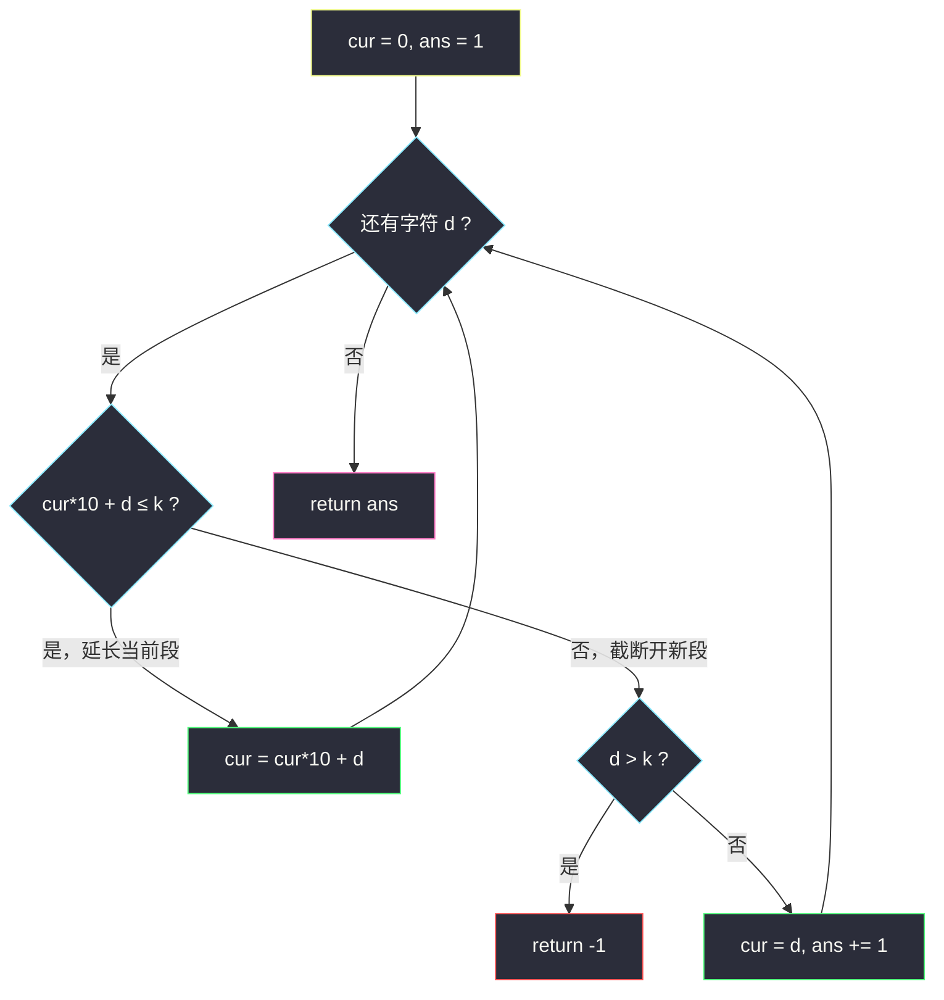

# 将字符串分割成值不超过 K 的子字符串（划分型贪心 · 每段尽量长）

## 一、问题描述

给你一个字符串 `s`，它每一位都是 `1` 到 `9` 之间的数字；同时给你一个整数 `k`。

如果 `s` 的一个分割满足以下条件，称之为**好分割**：

1. `s` 中每个数位**恰好**属于一个子字符串；
2. 每个子字符串的**值**（该子串对应的十进制整数，如 `"123"` 的值为 `123`）都 **≤ k**。

请返回好分割中子字符串的**最少**数目；若不存在好分割，返回 `-1`。

> 🔗 LeetCode 2522：https://leetcode.cn/problems/partition-string-into-substrings-with-values-at-most-k/
>
> 数据范围：`1 <= s.length <= 10^5`，`s[i]` 是 `'1'` 到 `'9'`，`1 <= k <= 10^9`。

**示例 1**

```
输入：s = "165462", k = 60
输出：4
解释：分割成 "16","54","6","2"，每段值 16,54,6,2 都 <= 60；
不存在少于 4 段的好分割。
```

**示例 2**

```
输入：s = "238182", k = 5
输出：-1
解释：首字符 '2' 单独成段值 2 > 5，任何包含它的段值只会更大，无解。
```

**直观理解**

把 `s` 切成若干刀，每段当作一个整数，要求都 ≤ k，问最少几段。这是灵茶题单 **§1.5 划分型贪心** 的代表题：**从左到右，每一段在不违规的前提下尽量延长**——段数自然最少。关键在于"尽量长"为什么不会吃亏，以及无解如何判定。

---

## 二、暴力解法

### 2.1 枚举所有切法

在 `n-1` 个相邻字符之间，每个缝隙可切可不切，共 `2^(n-1)` 种分割。逐种检查每段值 ≤ k：

```python
class Solution:
    def minimumPartition(self, s: str, k: int) -> int:
        n = len(s)
        ans = n + 1
        for mask in range(1 << (n - 1)):        # 每个缝隙切/不切
            pieces, cur, ok = [], 0, True
            start = 0
            for i in range(n - 1):
                if mask >> i & 1:
                    pieces.append(s[start:i + 1]); start = i + 1
            pieces.append(s[start:])
            if all(int(p) <= k for p in pieces):
                ans = min(ans, len(pieces))
        return ans if ans <= n else -1
```

- **时间**：`O(2^(n-1) * n)`，`n = 10^5` 时天文数字。
- **空间**：`O(n)`。

### 2.2 区间动态规划

设 `dp[i]` 为前 `i` 个字符的最少段数，则 `dp[i] = min(dp[j] + 1)`，其中子串 `s[j..i)` 的值 ≤ k。由于 `k <= 10^9`（至多 10 位），合法的 `j` 只有约 10 个：

```python
class Solution:
    def minimumPartition(self, s: str, k: int) -> int:
        n = len(s)
        INF = float('inf')
        dp = [0] + [INF] * n
        for i in range(1, n + 1):
            val, p = 0, i
            while p >= 1:                        # 从右往左拼出 s[p-1..i)
                val = val + int(s[p - 1]) * 10 ** (i - p)
                if val > k: break
                if dp[p - 1] != INF:
                    dp[i] = min(dp[i], dp[p - 1] + 1)
                p -= 1
        return dp[n] if dp[n] != INF else -1
```

### 🔴 瓶颈在哪里

DP 是 `O(10n)`，已经能过，但它没有利用本题的结构：**段值 ≤ k 这个约束是"纯数值"的**，与前后段的划分互相独立——从某个起点出发，能延伸到多远是确定的，根本不需要回头比较多种 `j`。贪心可以直接消掉"取 min"的决策。

---

## 三、优化探索（核心章节）

> 📚 本题在灵茶题单中属于 **§1.5 划分型贪心**：从左到右构造划分，每段在合法前提下**尽量延伸**；无解在扫描中用 `O(1)` 判出。

### 3.1 贪心规则

维护当前段的数值 `cur`（初值 0），从左到右扫描字符 `d`：

- 尝试把 `d` 接到当前段末尾，得候选值 `cur * 10 + d`；
- 若 `cur * 10 + d <= k`：接受，`cur = cur * 10 + d`（当前段延长一位）；
- 否则：当前段在此截断，`d` 开启新段：`cur = d`，段数 +1；
- 若此时 `d > k`：单个字符都无法成段，直接返回 `-1`（后面的段只会更长更无解）。

段长天然有上限：`k <= 10^9` 是 10 位数，任何 11 位段的值至少 `10^10 > k`，所以 `cur * 10 + d` 超界后立刻截断，`cur` 的量级始终 ≤ `10^10`（Python 无溢出问题，其他语言用长整型或及时截断即可）。

### 3.2 为什么"每段尽量长"是最优的（切点归纳 + 交换论证）

设贪心的第 `i` 个切点（第 `i` 段的结束位置，右开）为 `G_i`，任意合法方案 OPT 的第 `i` 个切点为 `O_i`。**归纳证明 `O_i <= G_i`（贪心切得更靠右）**：

- **基础**：`G_1` 是从位置 0 出发的最长合法段终点，故 `O_1 <= G_1`。
- **归纳步**：设 `O_i <= G_i`，比较两方案第 `i+1` 段的起点：OPT 的起点 `q = O_i <= G_i = p`（贪心起点）。OPT 的第 `i+1` 段是 `s[q..q+ell)`，其值 ≤ k。注意这段包含子串 `s[p..q+ell)`（若 `p >= q`），而十进制下"去掉高位前缀"必然让值变小：


  （关键点：`s` 只含 `1..9`，子串去掉若干最高位后值严格变小，仍 ≤ k。）于是 `G_{i+1} >= p + (ell - (p - q)) = q + ell = O_{i+1}`，归纳成立。

既然贪心每一步切点都不比 OPT 靠左，贪心的段数 ≤ OPT 的段数，即贪心最优。这就是划分型贪心的**交换论证**：任何"提前截断"的方案，都可以把截掉的字符还给前一段而不违规，段数不增。

### 3.3 算法流程图



### 3.4 一句话核心

> **从左到右扫，当前段能接就接，接爆就开新段；单字符超界即无解。** 归纳保证贪心切点永远不早于任何合法方案，段数最少。

---

## 四、代码实现

### Python（主解：一遍扫描贪心）

```python
class Solution:
    def minimumPartition(self, s: str, k: int) -> int:
        ans = 1
        cur = 0                          # 当前段的数值
        for d in map(int, s):
            if cur * 10 + d <= k:        # 能接就接：每段尽量长
                cur = cur * 10 + d
            else:                        # 接爆：截断，开新段
                if d > k:                # 单字符都超界 -> 无解
                    return -1
                cur = d
                ans += 1
        return ans
```

**变量含义**

| 变量 | 含义 |
|------|------|
| `cur` | 当前正在构建的段的十进制值 |
| `cur * 10 + d` | 把字符 d 追加到当前段末尾后的候选值 |
| `ans` | 目前开出的段数（含当前段） |
| `d > k` | 无解判定：该字符无论单独成段还是并入段都超界 |

### Java（最优解同款写法）

```java
class Solution {
    public int minimumPartition(String s, int k) {
        int ans = 1;
        long cur = 0;                        // cur*10+d 可能到 10^10，用 long
        for (int i = 0; i < s.length(); i++) {
            int d = s.charAt(i) - '0';
            if (cur * 10 + d <= k) {
                cur = cur * 10 + d;
            } else {
                if (d > k) return -1;
                cur = d;
                ans++;
            }
        }
        return ans;
    }
}
```

---

## 五、具体例子演示

以示例 1 端到端走一遍：`s = "165462"`，`k = 60`。

| 步 | 读到字符 `d` | 候选值 `cur*10+d` | 决策 | 当前段 | 已定段 | 剩余未读 |
|----|--------------|--------------------|------|--------|--------|-----------|
| 1 | `1` | `1` ≤ 60 | 接受，延长 | `1` | 0 段 | `65462` |
| 2 | `6` | `16` ≤ 60 | 接受，延长 | `16` | 0 段 | `5462` |
| 3 | `5` | `165` > 60 | 截断！`5` 开新段 | `5` | `"16"` | `462` |
| 4 | `4` | `54` ≤ 60 | 接受，延长 | `54` | `"16"` | `62` |
| 5 | `6` | `546` > 60 | 截断！`6` 开新段 | `6` | `"16","54"` | `2` |
| 6 | `2` | `62` > 60 | 截断！`2` 开新段 | `2` | `"16","54","6"` | （空） |

扫描结束，共 `4` 段：`"16" / "54" / "6" / "2"`，输出 **4** ✓。

注意第 6 步：虽然 `6` 和 `2` 拼成 `62` 超界，但贪心只是在 `2` 处开新段，绝不动已经截好的段——**贪心从不回看**，这正是它 `O(n)` 的来源。

**无解演示（示例 2）**：`s = "238182"`，`k = 5`。

| 步 | 字符 | 候选值 | 决策 |
|----|------|--------|------|
| 1 | `2` | `2` > 5 | 截断分支 → 检查 `d > k`：`2 > 5` 成立 → **return -1** ✓ |

首字符即被"单字符超界"判死；事实上任何包含 `'2'` 的段值 ≥ 2 > 5，全串无解，`O(1)` 提前退出。

---

## 六、复杂度分析

| 方法 | 时间 | 空间 |
|------|------|------|
| 枚举切法 | `O(2^n * n)` | `O(n)` |
| 区间 DP | `O(10n)` | `O(n)` |
| **划分贪心** | **`O(n)`** | **`O(1)`** |

- **时间**：每个字符只读一次，做一次乘加与比较，`O(n)`；`n = 10^5` 毫无压力。
- **空间**：只用 `cur`、`ans` 两个变量，`O(1)`。
- 段长上限为 `⌊log10(k)⌋ + 1 <= 10` 位，`cur` 的峰值约 `10^10`，Python 天然大整数，Java/C++ 需 `long`/`long long`。

---

## 七、对比总结

**方法演进**：枚举切法（指数）→ 区间 DP（`O(10n)`，已可过）→ 划分贪心（`O(n)`，`O(1)` 空间）。DP 把所有划分方案压缩到"从每个起点出发的最长段"，而贪心发现**只需要从贪心起点出发的那一条链**。

**易错点**

1. **无解判定放在截断分支里**：只有开新段时才可能出现 `d > k`；写成"先判断 `int(s[0]) > k` 再扫"会漏掉中途的更大数字。
2. **溢出**：`cur * 10 + d` 在 32 位下会溢出（`cur` 可达 `10^10` 量级），Java 用 `long`；Python 无此忧。
3. **不要用"整段转 int 再比较"**：`int(s[i:j])` 每次重构字符串是 `O(段长)` 的，外层再套二分/DP 会退化；滚动计算 `cur = cur*10 + d` 才是 `O(1)` 摊还。
4. **本题 `s` 只含 `1..9`，天然无前导零问题**。若做变体（允许 `0`），"每段尽量长"仍成立，但段值比较需加"长度 > 1 且以 `0` 开头的段非法"约束——贪心截断条件从"值超界"扩为"值超界或出现前导零"。
5. 贪心**不回溯**：截断一旦发生不可撤销，归纳证明保证这不损最优性；若约束变成"每段值恰好……"这类等式约束，贪心即失效，须回退 DP。

---

## 八、举一反三

| 题目 | 关系 |
|------|------|
| [410. 分割数组的最大值](https://leetcode.cn/problems/split-array-largest-sum/) | 镜像题：二分枚举"每段和的上限"，`check` 里用的正是本题"每段尽量长"的贪心 |
| [2478. 完美分割的方案数](https://leetcode.cn/problems/number-of-beautiful-partitions/) | 同为"划分子串满足约束"，约束带前缀性质，用计数 DP——贪心与 DP 的分水岭 |
| [1013. 将数组分成和相等的三个部分](https://leetcode.cn/problems/partition-array-into-three-parts-with-equal-sum/) | 固定段数、固定段和的划分，一遍扫描找切点 |
| [1509. 三次操作后最大值和最小值的最小差](https://leetcode.cn/problems/minimum-difference-between-largest-and-smallest-value-in-three-moves/) | 同属灵茶题单贪心篇（§1.1），"从最左/最右开始贪"的姊妹思想 |

**思想迁移**

- 划分型贪心的通用句式：**"约束逐段独立、只看数值量级" ⟹ 每段尽量延伸**；正确性靠"截断可还给前段"的交换论证。
- 先问自己"提前切一刀会不会更优？"——若答案是否（本题因去掉高位前缀值变小而不可能），贪心即成立；否则老老实实 DP。
- 口诀：**"能接就接，接爆断段；单爆无解，一路向东。"**
