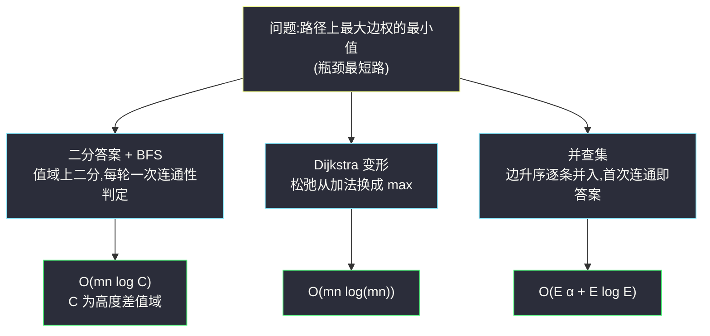

# 最小体力消耗路径(二分答案 + BFS · 最小化最大值三解对比)

## 一、问题描述

给你一个 `rows x cols` 的矩阵 `heights`,`heights[row][col]` 表示格子 `(row, col)` 的高度。你从**左上角** `(0,0)` 出发,打算走到**右下角** `(rows-1, cols-1)`(注意起点和终点是固定格子),每一步可以走到**上下左右**相邻的格子。

一条路径的**体力消耗**是路径上**相邻格子高度差绝对值的最大值**(整条路径只取最大的那一步,其余步不计);路径长度任意。

返回从左上角走到右下角的**最小体力消耗**。

> 🔗 LeetCode 1631:https://leetcode.cn/problems/path-with-minimum-effort/
>
> 数据范围:`1 <= rows, cols <= 100`,`1 <= heights[i][j] <= 10^6`。

**示例 1**(官方)

```text
heights = [[1,2,2],
           [3,8,2],
           [5,3,5]]
输出:2
解释:路径 [1,3,5,3,5] 的最大单步差 = max(2,2,2,2) = 2;
    路径 [1,2,2,2,5] 的最大单步差 = max(1,0,0,3) = 3。取 2。
```

**示例 2**(官方)

```text
heights = [[1,2,3],
           [3,8,4],
           [5,3,5]]
输出:1
```

**示例 3**(官方)

```text
heights = [[1,2,1,1,1],
           [1,2,1,2,1],
           [1,2,1,2,1],
           [1,2,1,2,1],
           [1,1,1,2,1]]
输出:0
解释:存在一条路径,每一步高度差都是 0(平地绕行)。
```

**直观理解**

普通最短路求的是「步数和」最小;本题把代价函数换成「**路径上最大的一条边**」——这类问题叫**瓶颈最短路**(minimax path):在所有路径中,让最坏的那一步尽量好。它有一个非常关键的性质:**答案具有单调性**,于是「二分答案 + 可行性判定」「Dijkstra 换松弛方式」「并查集逐边合并」三种经典武器全部适用——是一道把「最小化最大值」思想一次讲透的综合题。

---

## 二、暴力解法

DFS 回溯枚举起点到终点的**所有路径**,对每条路径取最大高度差,再全局取最小:

```python
class Solution:
    def minimumEffortPath(self, heights: List[List[int]]) -> int:
        rows, cols = len(heights), len(heights[0])
        self.ans = float('inf')

        def dfs(x, y, cur_max):
            if (x, y) == (rows - 1, cols - 1):
                self.ans = min(self.ans, cur_max)
                return
            for nx, ny in ((x+1, y), (x-1, y), (x, y+1), (x, y-1)):
                if 0 <= nx < rows and 0 <= ny < cols and (nx, ny) not in seen:
                    seen.add((nx, ny))
                    dfs(nx, ny, max(cur_max, abs(heights[x][y] - heights[nx][ny])))
                    seen.remove((nx, ny))

        seen = {(0, 0)}
        dfs(0, 0, 0)
        return self.ans
```

### 复杂度

- **时间**:`O(4^(rows*cols))`——网格路径数是指数级的,`100 x 100` 完全不可行。
- **空间**:`O(rows * cols)` 递归栈。

### 🔴 瓶颈在哪里

**路径太多,但答案的取值范围很小**。高度差落在 `[0, 10^6]` 内——与其问「哪条路径最好」,不如反过来问「**限值为 x 时走不走得通**」:这一问把指数级的搜索空间压进了对数次的判定里。

---

## 三、优化探索(核心章节)

> 📚 本题出自灵茶题单一期 **§五、综合应用**,模板要点:**「最小化最大值」综合题**——二分答案 + BFS 可行性判定为主解,辅以 Dijkstra、并查集两种解法对比,一次吃透瓶颈路径问题。

### 3.1 观察特征

| 特征 | 说明 |
|------|------|
| 代价 = 路径上最大边权 | minimax / 瓶颈路径,不是步数和 |
| 答案关于限值单调 | 允许的边越多,越可能连通(见 3.2) |
| 高度差范围 `[0, 10^6]` | 二分只需要约 20 轮 |
| 无负权、边的代价可预计算 | Dijkstra 与并查集都有天然切入点 |

### 3.2 主解:二分答案 + BFS 可行性判定

**判定问题**:给定限值 `limit`,只允许走「高度差 ≤ limit」的边,问从 `(0,0)` 能否到达 `(rows-1, cols-1)`?这是纯粹的**连通性判定**,一次 BFS `O(rows*cols)` 即可。

**单调性**:若 `limit` 可行,则任何 `limit' ≥ limit` 也可行(边集只增不减)。可行域是 `[ans, +∞)`,对答案这一维二分:

```text
lo = 0, hi = 高度差上界(如 max(heights) - min(heights))
while lo < hi:
    mid = (lo + hi) / 2
    if 可达(mid): hi = mid      # mid 可行,尝试更小
    else:        lo = mid + 1   # mid 不可行,只能更大
答案 = lo
```

### 3.3 解法二:Dijkstra 换一种松弛

把「距离」定义为**沿途最大边权的最小值**:`dist[v] = min over paths (路径上最大边权)`。Dijkstra 框架完全不变,只把松弛公式从「加法」换成「取 max」:

```text
nd = max(dist[u], |heights[u] - heights[v]|)     # 走到 v 的新瓶颈
if nd < dist[v]: dist[v] = nd; 入堆
```

优先队列每次弹出的就是「当前瓶颈最小」的格子,终点第一次出队时 `dist` 即答案。正确性同样来自贪心:瓶颈更小的状态永远先被扩展。

### 3.4 解法三:并查集,边按权升序逐条合并

把所有**相邻格之间的边**收集起来(每条边带权 = 高度差),升序排序后逐条加入并查集;**起点与终点首次连通的瞬间,当前边权就是答案**:

- 此前加入的边权都 ≤ 当前边权 → 存在一条最大边恰为当前值的路径;
- 再小一点的任何边集合都无法连通(排序保证了从低到高尝试)。

这就是「最小瓶颈生成树」的经典求法:答案 = 起终点在最小瓶颈生成树上的路径最大边。

### 3.5 三解的关系



三者本质都在利用**单调性**:二分是对答案值域折半,Dijkstra 是对瓶颈值贪心推进,并查集是对边权从小到大扫描。面试给出任意一种即可,能横向对比是加分项。

### 3.6 一句话核心

> **「最小化路径最大边」自带单调性:二分限值判连通是通解,Dijkstra 换 max 松弛是特化,并查集升序并边是极简。**

---

## 四、代码实现

### Python(主解:二分答案 + BFS)

```python
class Solution:
    def minimumEffortPath(self, heights: List[List[int]]) -> int:
        rows, cols = len(heights), len(heights[0])

        def reach(limit: int) -> bool:            # 只走高度差 <= limit 的边
            q = deque([(0, 0)])
            vis = [[False] * cols for _ in range(rows)]
            vis[0][0] = True
            while q:
                x, y = q.popleft()
                if x == rows - 1 and y == cols - 1:
                    return True
                for nx, ny in ((x+1, y), (x-1, y), (x, y+1), (x, y-1)):
                    if 0 <= nx < rows and 0 <= ny < cols and not vis[nx][ny] \
                            and abs(heights[x][y] - heights[nx][ny]) <= limit:
                        vis[nx][ny] = True
                        q.append((nx, ny))
            return False

        lo, hi = 0, 10 ** 6                      # 高度差值域上界
        while lo < hi:
            mid = (lo + hi) // 2
            if reach(mid):
                hi = mid                          # mid 可行,往小试
            else:
                lo = mid + 1                      # mid 不可行,必须更大
        return lo
```

**变量含义**

| 变量 | 含义 |
|------|------|
| `reach(limit)` | 可行性判定:限值 limit 下起点能否连通终点 |
| `lo/hi` | 二分区间,收缩到「最小可行限值」 |
| `mid` | 候选体力消耗 |

**循环不变式**:`[lo, hi]` 始终包含答案,且 `hi` 一侧只进可行值、`lo - 1` 一侧(越过界后)恒不可行。

### Python(对比实现一:Dijkstra,松弛取 max)

```python
class Solution:
    def minimumEffortPath(self, heights: List[List[int]]) -> int:
        rows, cols = len(heights), len(heights[0])
        dist = [[float('inf')] * cols for _ in range(rows)]
        dist[0][0] = 0
        h = [(0, 0, 0)]                           # (瓶颈, x, y)
        while h:
            d, x, y = heapq.heappop(h)
            if (x, y) == (rows - 1, cols - 1):
                return d                          # 终点首次出队即最优
            if d > dist[x][y]:
                continue                          # 过期状态
            for nx, ny in ((x+1, y), (x-1, y), (x, y+1), (x, y-1)):
                if 0 <= nx < rows and 0 <= ny < cols:
                    nd = max(d, abs(heights[x][y] - heights[nx][ny]))
                    if nd < dist[nx][ny]:
                        dist[nx][ny] = nd
                        heapq.heappush(h, (nd, nx, ny))
        return 0
```

### Python(对比实现二:并查集,边升序合并)

```python
class Solution:
    def minimumEffortPath(self, heights: List[List[int]]) -> int:
        rows, cols = len(heights), len(heights[0])
        if rows == 1 and cols == 1:
            return 0
        fa = list(range(rows * cols))

        def find(a: int) -> int:
            while fa[a] != a:
                fa[a] = fa[fa[a]]                 # 路径压缩
                a = fa[a]
            return a

        edges = []
        for x in range(rows):
            for y in range(cols):
                if x + 1 < rows:                  # 竖向边
                    edges.append((abs(heights[x][y] - heights[x+1][y]),
                                  x * cols + y, (x + 1) * cols + y))
                if y + 1 < cols:                  # 横向边
                    edges.append((abs(heights[x][y] - heights[x][y+1]),
                                  x * cols + y, x * cols + y + 1))
        edges.sort()
        target = rows * cols - 1
        for w, a, b in edges:
            ra, rb = find(a), find(b)
            if ra != rb:
                fa[ra] = rb
            if find(0) == find(target):           # 首次连通
                return w
        return -1
```

---

## 五、具体例子演示

用官方示例 1 端到端走主解。`heights = [[1,2,2],[3,8,2],[5,3,5]]`,先画出带权边图(相邻格之间的高度差):

```text
格值与全部边权(格间数字 = 高度差):
        1 --1-- 2 --0-- 2
        |       |       |
        2       6       0
        |       |       |
        3 --5-- 8 --6-- 2
        |       |       |
        2       5       3
        |       |       |
        5 --2-- 3 --2-- 5
```

**二分判定过程表**(`lo = 0, hi = 10^6` 起步,展示时用实际值域上界 8 便于观察;判定 = 只走边权 ≤ mid 的边做 BFS):

| 轮次 | lo | hi | mid | BFS 只走 ≤ mid 的边 | 可达? | 动作 |
|------|----|----|-----|----------------------|-------|------|
| 1 | 0 | 8 | 4 | 除权 5、6 的两条边外全放行,`1→3→5→3→5` 打通 | ✓ | `hi = 4` |
| 2 | 0 | 4 | 2 | 走下方 `1→3→5→3→5`,每步差恰为 2 | ✓ | `hi = 2` |
| 3 | 0 | 2 | 1 | 只有上排小边 {1,0,0} 连通,到不了终点 | ✗ | `lo = 2` |
| 收敛 | 2 | 2 | — | — | — | **返回 2** |

**第 3 轮 `limit = 1` 的 BFS 轨迹**(失败的判定,看连通块怎么被卡住):

| 层 | 弹出 | 尝试邻居(边权 ≤ 1 才通过) | 新入队 |
|----|------|------------------------------|--------|
| 0 | (0,0) | 下 (1,0) 边权 2 ✗;右 (0,1) 边权 1 ✓ | (0,1) |
| 1 | (0,1) | 下 (1,1) 边权 6 ✗;右 (0,2) 边权 0 ✓ | (0,2) |
| 2 | (0,2) | 下 (1,2) 边权 0 ✓;左 已访问 | (1,2) |
| 3 | (1,2) | 下 (2,2) 边权 3 ✗;左 (1,1) 边权 6 ✗ | — |

队列耗尽,连通块只有 `{(0,0),(0,1),(0,2),(1,2)}`,终点 `(2,2)` 未被碰到 → 不可达 ✓。

**第 2 轮 `limit = 2` 的 BFS 轨迹**(成功的判定):

| 层 | 弹出 | 通过的邻居 | 新入队 |
|----|------|------------|--------|
| 0 | (0,0) | 下 边权2;右 边权1 | (1,0),(0,1) |
| 1 | (1,0) | 下 边权2 | (2,0) |
| 1 | (0,1) | 右 边权0 | (0,2) |
| 2 | (2,0) | 右 边权2 | (2,1) |
| 2 | (0,2) | 下 边权0 | (1,2) |
| 3 | (2,1) | 右 边权2 | **(2,2) = 终点入队,下一轮弹出即判可达 ✓** |
| 3 | (1,2) | 下 (2,2) 边权3 ✗且已入队 | — |

两轮对比正是单调性的具象:`limit` 从 1 升到 2,恰好把下方四条权 2 的边放进来,连通块瞬间「跨过」中央高地 `(1,1)`(它差值太大,`limit=2` 时依然孤立,根本不需要经过)。

**最终输出**:`2` ✓,与官方一致。

---

## 六、复杂度分析

| 方法 | 时间 | 空间 | 说明 |
|------|------|------|------|
| DFS 枚举全部路径 | `O(4^(mn))` | `O(mn)` | 指数级,不可行 |
| 二分 + BFS(主解) | `O(mn log C)`,`C = 10^6` | `O(mn)` | 约 20 轮判定,每轮 `O(mn)` |
| Dijkstra 变形 | `O(mn log(mn))` | `O(mn)` | 堆操作 `O(mn)` 次 |
| 并查集升序合并 | `O(E log E + E α)`,`E ≈ 2mn` | `O(mn)` | 排序占大头,路径压缩近似线性 |

`100 x 100` 规模下三种方法都在毫秒级,差距主要在常数与代码量。

---

## 七、对比总结

**同构链**——「最小化最大值」家族,套路完全同构,只是判定/合并的载体不同:

| 题 | 被最小化的最大值 | 可行性判定 |
|----|------------------|------------|
| #875 爱吃香蕉的珂珂 | 吃完所需小时数 | 能否在限速下按时吃完 |
| #410 分割数组的最大值 | 各段和的最大值 | 能否切成 ≤ k 段 |
| #1631 本篇 | 路径上最大边权 | 限值下起点终点是否连通 |

**易错点**

1. **二分区间从 `lo = 0` 开始**:单格矩阵或全平路径答案就是 0,`lo` 初值给 1 会错。
2. **`hi` 用值域上界**(`10^6` 或 `max - min`),别用 `max(heights)`——上界是「高度差」不是「高度」,不过两者都能正确工作,语义上前者更准。
3. Dijkstra 的松弛是 `max(d, w)` **不是** `d + w`,堆里存的是「当前瓶颈」。
4. 并查集必须**先判连通再返回**:判断要在并完当前边之后(这条边可能正是打通者)。
5. 判定 BFS 与主 BFS 不同点:这里**不需要分层计数**,只要可达;但 visited 一样不能省。
6. 别把「步数最少」当目标——绕远路但平坦的路可能更优(示例 1 直线穿过 8 就是反例)。

**模板(二分答案 + 网格连通性判定,Python)**

```python
def min_effort():
    lo, hi = 0, 值域上界
    while lo < hi:
        mid = (lo + hi) // 2
        if bfs_can_reach(mid):     # 只走满足条件的边
            hi = mid
        else:
            lo = mid + 1
    return lo                      # 收敛:最小可行限值即答案
```

---

## 八、举一反三

| 题目 | 关系 |
|------|------|
| [778. 水位上升的泳池游泳](https://leetcode.cn/problems/swim-in-rising-water/) | 同一模板换皮:最小化路径最大高度,二分/Dijkstra/并查集三解全适用 |
| [1102. 得分最高的路径中的最小值](https://leetcode.cn/problems/path-with-maximum-minimum-value/) | 镜像问题:最大化路径最小值,把判定条件反过来 |
| [407. 接雨水 II](https://leetcode.cn/problems/trapping-rain-water-ii/) | 网格 + 优先队列(瓶颈思想的 Dijkstra 亲戚) |
| [875. 爱吃香蕉的珂珂](https://leetcode.cn/problems/koko-eating-bananas/) | 同目录 `koko-eating-bananas.md`:二分答案判定入门,无网格版 |
| [410. 分割数组的最大值](https://leetcode.cn/problems/split-array-largest-sum/) | 同目录 `capacity-to-ship-packages-within-d-days.md` 的姊妹:最小化最大值在数组上的经典 |

**思想迁移**

- **「最小化最大值」三部曲**:值域小时二分答案;需要具体路径代价时 Dijkstra 换松弛;只关心连通时并查集逐边并——遇到 minimax 先想想三件套哪个最顺手。
- **判定通常比求解便宜**:本题把「找最优路径」转成「给定限值判连通」,搜索空间从路径集合(指数)变成值域(对数次),这是二分答案威力的根源。
- **瓶颈路径不经过高地**:答案边的两端往往绕开极端格子——直觉上「贪最平的路」,形式化后就是瓶颈最短路。
