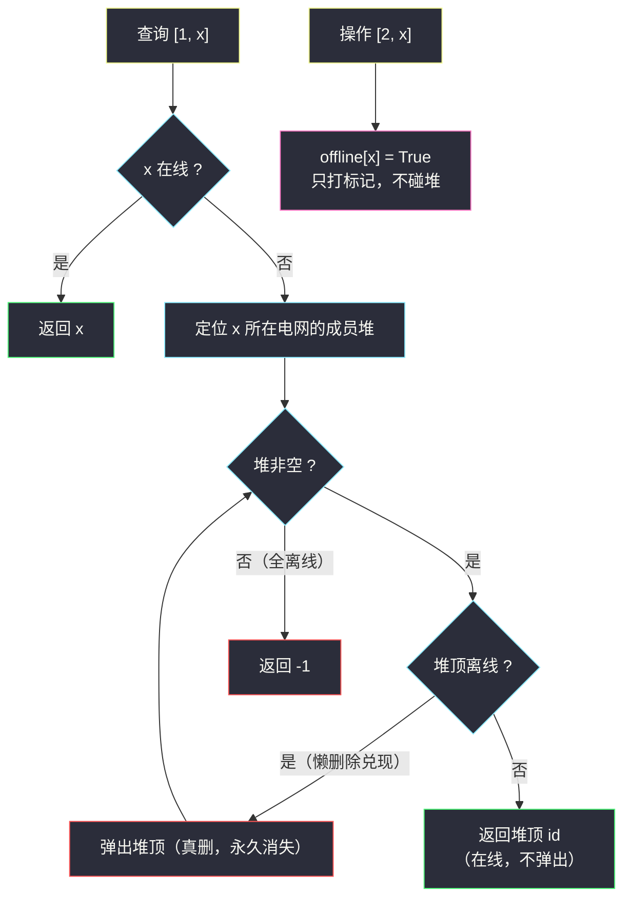

# 电网维护（懒删除堆 · 连通块小根堆 + 离线标记）

## 一、问题描述

有 `c` 个电站，编号从 `1` 到 `c`，通过 `n` 条双向电缆 `connections[i] = [u, v]` 连接——直接或间接相连的电站组成同一个**电网**。初始时**全部在线**。

给定查询数组 `queries`，每条是两种操作之一：

- `[1, x]` **维护检查**：
  - 若电站 `x` 在线，返回 `x`；
  - 若 `x` 离线，由与 `x` 同一电网中**编号最小的在线电站**响应（返回其 id）；
  - 若该电网已无任何在线电站，返回 `-1`。
- `[2, x]`：电站 `x` 离线。

按**出现顺序**返回所有 `[1, x]` 的结果。注意：电网结构**固定**，电站离线**不改变**连通性。

> 🔗 LeetCode 3607（新题）：https://leetcode.cn/problems/power-grid-maintenance/
>
> 数据范围（新题题面）：约 `c, q ≤ 10^5`，`n ≤ 2 * 10^5` 量级。

**示例（自编演示）**

```
输入：c = 5, connections = [[1,2],[2,3],[3,4],[4,5]],
     queries = [[1,3],[2,3],[1,3],[2,1],[2,5],[1,5]]
输出：[3, 1, 2]
解释：[1,3] 时 3 在线答 3；[2,3] 后 3 离线；[1,3] 时同网最小在线为 1；
     [2,1]、[2,5] 之后；[1,5] 时同网最小在线为 2。
```

**直观理解**

五个电站连成一条链，就是一个电网。查询问的是「`x` 所在电网里还活着的最小编号是谁」。电网不变、成员只会「死去」（离线）不会「复活」——这是**只删不增**的动态集合求最小值问题：排序好的数组/小根堆天然有序，难点只剩「删除」怎么高效。

---

## 二、暴力解法

先用 DFS 把每个电站标记所属连通块；每次 `[1, x]` 且 `x` 离线时，从 `1` 到 `c` 线性扫描，找第一个同电网且在线的电站：

```python
class Solution:
    def processQueries(self, c: int, connections: List[List[int]],
                       queries: List[List[int]]) -> List[int]:
        adj = defaultdict(list)
        for u, v in connections:
            adj[u].append(v)
            adj[v].append(u)

        comp = [0] * (c + 1)                    # 电站 -> 连通块编号
        cid = 0
        for s in range(1, c + 1):
            if comp[s] == 0:
                cid += 1
                comp[s] = cid
                stack = [s]
                while stack:
                    u = stack.pop()
                    for w in adj[u]:
                        if comp[w] == 0:
                            comp[w] = cid
                            stack.append(w)

        online = [True] * (c + 1)
        ans = []
        for op, x in queries:
            if op == 2:
                online[x] = False
            elif online[x]:
                ans.append(x)
            else:
                best = -1
                for v in range(1, c + 1):        # 每次查询全量扫描
                    if comp[v] == comp[x] and online[v]:
                        best = v
                        break
                ans.append(best)
        return ans
```

### 复杂度

- **时间**：`O(n + c + q·c)`，最坏 `10^5 * 10^5 = 10^10` 次扫描，严重超时。
- **空间**：`O(n + c)`。

### 🔴 瓶颈在哪里

每次查询都**从头**找「最小在线」，而离线电站反复挡路。如果每个电网预先把成员放进**小根堆**，「最小」就在堆顶；真正要做好的只有一件事——**别真删**。

---

## 三、优化探索（核心章节）

> 📚 本题在灵茶题单中属于 **§5.6 懒删除堆**（数据结构 · 堆 B 路）：删除只打标记，弹堆顶时跳过已删元素，均摊恢复性能。

### 3.1 观察特征

| 特征 | 说明 |
|------|------|
| 电网结构固定 | 连通块只需预处理一次（DFS / 并查集） |
| 只会离线，不会上线 | 「在线集合」单调缩小——被跳过的离线电站**永远不用再看** |
| 查询是「同网最小在线」 | 每个电网一个成员 id 小根堆，答案就在堆顶 |

### 3.2 懒删除：标记代替搬运

普通堆不支持高效删除任意元素（只能删堆顶）。但本题的删除有个妙处：**离线电站一旦被查询撞见，就可以顺手永久弹出**——因为它永远不会再上线，弹掉它不影响任何后续答案。

于是：

- `[2, x]`：只做 `offline[x] = True`，**不碰堆**（`O(1)`）；
- `[1, x]`：`x` 在线直接答 `x`；否则看 `x` 所在电网的堆——
  - 堆顶离线 → `heappop` 弹出（真删），继续看新堆顶；
  - 堆顶在线 → **返回堆顶，但不弹出**（它还在线，下次查询可能还是它）；
  - 堆被弹空 → 返回 `-1`。



### 3.3 均摊分析：为什么「懒」反而快

弹出的每一个元素都对应一个**已经离线**的电站，且电站不会复活——所以整个运行过程中，**每个电站至多被弹出一次**。全部弹出成本合计 `O(c log c)`，摊到 `q` 次查询上每次均摊 `O(log c)`。加上并查集预处理 `O(n·α)`，总复杂度 `O((n + c) + (q + c)·log c)`，量级即 `O((n + q) log n)`。

这就是懒删除堆的全部威力：**删除从「随机位置的搬运」降级为「打标记」**，真正的清理发生在「堆顶恰好露出尸体」的时刻，而每次清理都是一锤子买卖。

### 3.4 一句话核心

> **每网一个成员小根堆；[2,x] 只打 offline 标记；[1,x] 弹堆顶跳过尸体，见活即答（不弹出），弹空答 -1。**

---

## 四、代码实现

### Python（主解：并查集 + 懒删除小根堆）

```python
class Solution:
    def processQueries(self, c: int, connections: List[List[int]],
                       queries: List[List[int]]) -> List[int]:
        # 1) 并查集划分电网
        parent = list(range(c + 1))

        def find(x: int) -> int:
            while parent[x] != x:
                parent[x] = parent[parent[x]]      # 路径减半
                x = parent[x]
            return x

        for u, v in connections:
            parent[find(u)] = find(v)

        # 2) 每个电网建成员 id 小根堆（按 id 升序 append，天然有序）
        heaps = defaultdict(list)
        for x in range(1, c + 1):
            heaps[find(x)].append(x)               # 升序数组本身就是合法小根堆

        # 3) 查询：离线只打标记，查询时懒删除
        offline = [False] * (c + 1)
        ans = []
        for op, x in queries:
            if op == 2:
                offline[x] = True                  # 只打标记，不碰堆
                continue
            if not offline[x]:
                ans.append(x)                      # 在线：直接答自己
                continue
            h = heaps[find(x)]
            while h and offline[h[0]]:             # 堆顶是尸体 → 真弹出
                heapq.heappop(h)
            ans.append(h[0] if h else -1)          # 活堆顶即答案（不弹出）
        return ans
```

**变量含义**

| 变量 | 含义 |
|------|------|
| `parent / find` | 并查集；`find(x)` 即 `x` 的电网代表元 |
| `heaps[rep]` | 电网 `rep` 的成员 id 小根堆（初始化时升序追加，无需 heapify） |
| `offline[x]` | 离线标记；`True` 后永不恢复 |
| `h[0]` | 当前堆顶 = 该电网最小存活 id（弹出尸体后保证） |

**不变式**：查询 `[1, x]` 的 while 循环结束后，`h` 为空或 `h[0]` 在线——堆中「先于答案」的离线成员已被永久清除。被返回的在线堆顶**不出堆**，下次查询仍可直接命中。

---

## 五、具体例子演示

以示例 `c = 5`，`connections = [[1,2],[2,3],[3,4],[4,5]]`（五站一链，全网一个电网），`queries = [[1,3],[2,3],[1,3],[2,1],[2,5],[1,5]]` 走主解。初始堆 `[1,2,3,4,5]`。

**逐步跟踪（懒删除轨迹：堆的物理内容 / 离线集合 / 弹出动作）**

| 步 | 查询 | 动作 | 堆（物理） | offline 集合 | 弹出轨迹 | 输出 |
|----|-------|------|------------|--------------|----------|------|
| 1 | [1,3] | 3 在线 | [1,2,3,4,5] | {} | — | **3** |
| 2 | [2,3] | 打标记 | [1,2,3,4,5] | {3} | — | — |
| 3 | [1,3] | 3 离线 → 弹堆顶 | [1,2,3,4,5] → [1,2,4,5] | {3} | 弹 3（尸体，弃）→ 顶 1 在线，停 | **1** |
| 4 | [2,1] | 打标记 | [1,2,4,5] | {3,1} | — | — |
| 5 | [2,5] | 打标记 | [1,2,4,5] | {3,1,5} | — | — |
| 6 | [1,5] | 5 离线 → 弹堆顶 | [1,2,4,5] → [2,4] | {3,1,5} | 弹 1（尸体，弃）→ 顶 2 在线，停 | **2** |

最终输出 `[3, 1, 2]` ✓。

两处关键观察：

- 步 3 弹出的 `3` 与步 6 弹出的 `1` 都是**永久消失**——它们是尸体，弹一次就少一个，绝不会重复劳动；
- 步 3 返回的 `1` 与步 6 返回的 `2` 都**留在堆里**——它们还在线，步 6 里 `1` 露头后才被（因为离线）清掉。


---

## 六、复杂度分析

| 方法 | 时间 | 空间 | 说明 |
|------|------|------|------|
| 暴力扫描 | `O(n + c + q·c)` | `O(n + c)` | 每次离线查询全量扫 |
| 懒删除堆（主解） | `O((n + c)·α + (q + c)·log c)` | `O(n + c)` | 均摊每次查询 `O(log c)` |

- 预处理：建图合并 `O(n·α)`，建堆 `O(c)`；
- 查询：在线判定 `O(1)`；离线查询中每次 `heappop` 都在消耗一个「再也不会回来」的电站，全局至多 `c` 次，故总弹出成本 `O(c log c)`；
- 综合量级 `O((n + q) log n)`。

---

## 七、对比总结

**「删除」的三种姿势**

| 姿势 | 做法 | 代价 | 适用 |
|------|------|------|------|
| 真删除（数组） | `list.remove(v)` / 重建 | `O(c)` 每次 | 删除极少 |
| 有序集合 | `SortedList` / 平衡树 erase | `O(log c)` 每次 | 通用但要额外结构 |
| **懒删除堆（本篇）** | 打标记 + 弹顶时跳过 | 均摊 `O(log c)`，代码极短 | 元素**不会复活**、只需最值 |

**易错点**

1. **在线堆顶不能弹出**：返回的是「仍在线」的电站，弹掉它下次数组就少人；只有离线（尸体）才弹出。
2. `[2, x]` 重复离线同一电站：标记幂等，无副作用；但别把它当成「弹出指令」。
3. 查询 `[1, x]` 且 `x` 在线时**即使堆顶另有其人也答 x**——题目规定在线直接返回自身。
4. 初始化堆时按 `x` 升序 `append` 得到的数组天然满足堆序（父下标小、值也小），可省一次 `heapify`；若不放心加一行 `heapify` 也无妨。
5. 连通块划分用 DFS/并查集皆可；查询中要 `find(x)` 定位电网，用路径压缩保证近似 `O(1)`。

**模板（懒删除堆 · 只删不增求最值，Python）**

```python
dead = [False] * (n + 1)          # 删除标记
def query_top(h):                 # 查询堆中最小存活元素
    while h and dead[h[0]]:
        heapq.heappop(h)          # 尸体出堆，一次性成本
    return h[0] if h else None    # 活堆顶不出堆
```

---

## 八、举一反三

| 题目 | 关系 |
|------|------|
| [2349. 设计数字容器系统](https://leetcode.cn/problems/design-a-number-container-system/) | 懒删除堆最经典落地：`change` 换下标时旧堆顶若已被覆盖，查询时弹出 |
| [1845. 座位预约管理系统](https://leetcode.cn/problems/seat-reservation-manager/) | 小根堆维护最小可用座位，`unreserve` 直接入堆 |
| [547. 省份数量](https://leetcode.cn/problems/number-of-provinces/) | 本篇预处理部分的连通块划分（并查集入门） |
| [1971. 寻找图中是否存在路径](https://leetcode.cn/problems/find-if-path-exists-in-graph/) | 并查集判连通，同款 `find` 写法 |
| [1801. 积压订单中的订单总数](https://leetcode.cn/problems/number-of-orders-in-the-backlog/) | 双堆 + 匹配即删，对照本篇「标记延迟删」的取舍 |

同批姊妹篇：[#1642 可以到达的最远建筑](furthest-building-you-can-reach.md)（反悔堆）、[#2653 滑动子数组的美丽值](sliding-subarray-beauty.md)（对顶堆 + 懒删除）；同目录 [implement-router.md](implement-router.md) 则是「有序列表 + 头指针懒删除」的姊妹实现。

**思想迁移**

- 集合**只删不增**且只问最值 → 小根堆 + 懒标记，删除零成本、清理均摊。
- 懒删除的通用形态有两类：**堆版**（打标记、弹顶时跳过，本篇）与**序列版**（头指针右移，`implement-router.md`），本质都是「把随机位置的删除改造成端点的消费」。
- 口诀：**「离线只盖章，查询再验尸；顶上见活口，答案即返回。」**
