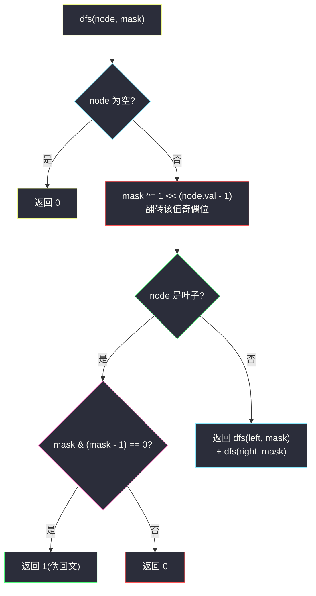
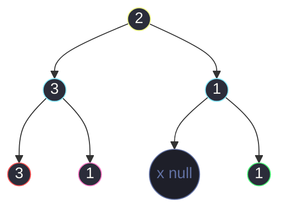

# 1457. 二叉树中的伪回文路径(Pseudo-Palindromic Paths in a Binary Tree)

> 🔗 LeetCode 1457:https://leetcode.cn/problems/pseudo-palindromic-paths-in-a-binary-tree/
>
> 📚 灵茶题单小节:§「根到叶路径 + 状态压缩」练习(DFS 状态合并经典题)

## 一、问题描述

给你一棵二叉树,每个节点的值为 `1` 到 `9`。我们称二叉树中的一条路径是**「伪回文」**的,当它满足:路径经过的所有节点值的**排列**中,存在一个回文序列。

请你返回从**根到叶子节点**的所有路径中,伪回文路径的数目。

**示例 1**

```text
输入:root = [2,3,1,3,1,null,1]
输出:2
解释:共 3 条根到叶路径:红色路径 [2,3,3]、绿色路径 [2,1,1] 与路径 [2,3,1]。
只有前两条是伪回文的:[2,3,3] 可重排为 [3,2,3],[2,1,1] 可重排为 [1,2,1]。
```

**示例 2**

```text
输入:root = [2,1,1,1,3,null,null,null,null,null,1]
输出:1
```

**示例 3**

```text
输入:root = [9]
输出:1
```

> 数据范围:树中节点数目在 `[1, 10^5]` 内,`1 <= Node.val <= 9`。

**直观理解**

"重排后能变回文"与"出现次数为奇数的值**至多一个**"是等价的——回文的对称结构要求除正中间位置外,其余字符两两配对;正中间至多容纳一个"落单"的值。于是问题从"枚举排列"坍缩成"数奇数":每往深处走一个节点,该值的出现次数奇偶性翻转一次,走到叶子时检查是否 ≤ 1 个值是奇数次。

## 二、暴力解法

DFS 收集每条根到叶路径的完整序列,对每条路径用计数表数出"出现奇数次的值"的个数:

```python
class Solution:
    def pseudoPalindromicPaths(self, root: Optional[TreeNode]) -> int:
        def dfs(node, path):
            if node is None:
                return 0
            path.append(node.val)             # 进入节点,记录
            if node.left is None and node.right is None:
                cnt = Counter(path)           # 统计每个值的出现次数
                odd = sum(1 for v in cnt.values() if v % 2 == 1)
                ans = 1 if odd <= 1 else 0    # 奇数值个数 ≤ 1 才能重排成回文
            else:
                ans = dfs(node.left, path) + dfs(node.right, path)
            path.pop()                        # 回溯,撤销记录
            return ans

        return dfs(root, [])
```

### 复杂度

- 时间:`O(n * L)`,其中 `L` 是路径平均长度——每片叶子都要 `O(路径长)` 重数一遍计数;最坏(链形树)`L = n`,总 `O(n^2)`,`n = 10^5` 时会超时。
- 空间:`O(n)` 递归栈 + 路径数组。

## 三、优化探索

### 观察 1:不需要保存路径,只需要奇偶状态

判定只关心每个值出现次数的**奇偶性**——一个布尔量。值域 `1..9` 共 9 个值,9 个布尔量正好装进一个 int 的低 9 位:**第 `v-1` 位为 1 表示值 `v` 出现奇数次**。进入节点时 `mask ^= 1 << (node.val - 1)`,把该值的奇偶性翻转。

### 观察 2:奇数值个数 ≤ 1 ⟺ mask 是 0 或 2 的幂

"恰好一个值为奇数次"= `mask` 的二进制里恰好一个 1 = 2 的幂;"零个奇数次"= `mask = 0`。而 **`mask & (mask - 1)` 恰好抹掉最低位的 1**:若 `mask` 只有一位 1,结果为 0;若有多位 1,结果非 0。于是判定一行搞定:

```text
mask == 0                → 全部偶数次,可回文(如 [1,2,1] → 121)
mask & (mask - 1) == 0   → 恰一位为 1,可回文(如 [2,3,3] → 323)
其余                     → 不可回文
```

两个条件统一为 `mask & (mask - 1) == 0`(0 也满足)。

从 Counter 到掩码的推导对照:

| 维度 | Counter 版(暴力) | 掩码版(本文) |
|---|---|---|
| 状态表示 | 字典 {值: 次数} | int 的低 9 位 |
| 状态大小 | `O(路径长)` | `O(1)`(≤ 512) |
| 进入节点 | `cnt[v] += 1` | `mask ^= 1 << (v-1)` |
| 离开节点 | `cnt[v] -= 1`(回溯) | 无需(参数副本) |
| 叶子判定 | 数奇数个数 `O(9)` | 位技巧 `O(1)` |

关键一步是"次数 → 奇偶"的有损压缩:回文判定只依赖奇偶,不依赖具体次数——把不关心的信息丢掉,状态就从线性缩到常数。

### 观察 3:mask 作为参数传递,天然免回溯

Python 的 int 不可变,`dfs(node, mask ^ bit)` 在递归调用处生成新值,返回后父层自己的 `mask` 原封不动——**传参代替全局状态,就没有显式的回溯步骤**,比"数组 + push/pop"既短又不易错。



### 迭代写法(防递归爆栈)

`n` 最大 `10^5`,链形树递归深度可达 `10^5`,Python 默认递归上限 1000,必须**显式提升上限**或改用显式栈的迭代版。下文主解给出递归版(简洁,配合 `sys.setrecursionlimit`),细节说明里给迭代版思路:栈存 `(node, mask)`,弹出时若为叶子就地判定,否则压入孩子与新 mask——状态随栈元素走,同样无回溯。

顺带一提栈序的无妨性:压栈先左后右或先右后左都不影响计数——每条根到叶路径终会被走到,`ans` 只做累加。若题目改成"返回字典序最小的伪回文路径",才需要控制访问次序并在首个命中处剪枝。

## 四、代码实现

```python
class Solution:
    def pseudoPalindromicPaths(self, root: Optional[TreeNode]) -> int:
        sys.setrecursionlimit(300000)         # 链形树深度可达 1e5,提升递归上限

        def dfs(node: Optional[TreeNode], mask: int) -> int:
            if node is None:                  # 空节点不计入
                return 0
            mask ^= 1 << (node.val - 1)       # 翻转该值的出现奇偶位(1..9 → 位 0..8)
            if node.left is None and node.right is None:   # 叶子:路径定型
                return 1 if mask & (mask - 1) == 0 else 0  # 至多一个奇数值
            return dfs(node.left, mask) + dfs(node.right, mask)

        return dfs(root, 0)
```

**细节说明**

- **`mask & (mask - 1) == 0` 同时覆盖 `mask = 0` 与 2 的幂两种情形**,无需再写 `mask == 0 or ...`;注意运算符优先级,按位与要加括号再比较。
- **位编号从 0 开始**:值 `v` 对应第 `v - 1` 位,`1 << (node.val - 1)`;写成 `1 << node.val` 会浪费最高位且 `v = 9` 时移到第 9 位仍正确(只是判定逻辑同样成立),但从 0 起编号更紧凑也更符合直觉。
- **`mask` 作为形参传入,无需 `mask ^= ...` 的撤销**——子调用收到的是副本,父层继续用旧值。若把 `mask` 写成外层可变变量,就必须在递归返回后翻回来(显式回溯),两种写法等价,传参版更不易漏。
- **递归深度**:`10^5` 深的链形树会触发 Python 默认 `RecursionError`,`sys.setrecursionlimit` 必不可少;线上若禁止改全局,可换显式栈迭代(见下)。

### 常见错误清单

- **`mask & (mask - 1)` 忘加括号**:`mask & mask - 1` 会解析成 `mask & (mask) - 1`?不——Python 中 `&` 优先级低于 `-`,`mask & mask - 1` 实为 `(mask & mask) - 1 = mask - 1`,条件水远为 `mask - 1 == 0` 即 `mask == 1`,恰漏掉 `mask = 0` 与其它 2 的幂。必须写全括号。
- **在非叶节点判定**:中途就查 `mask & (mask - 1) == 0` 会把"恰好路过"的路径误计——判定只属于叶子(路径定型处)。只有叶子的奇偶状态才对应完整路径。
- **把 `node.left is None and node.right is None` 写成 `not node.left or not node.right`**:后者把"半叶"(只有一个孩子)也当叶子,路径没走到底就计数,答案偏大。
- **回溯写法漏撤销**:若用可变容器(数组/字典)存状态,递归前后必须成对翻转;用 int 参数传掩码则天然免疫(见细节说明)。

```python
class Solution:
    def pseudoPalindromicPaths(self, root: Optional[TreeNode]) -> int:
        ans = 0
        stack = [(root, 0)]                   # (节点, 从根到它的 mask)
        while stack:
            node, mask = stack.pop()
            mask ^= 1 << (node.val - 1)
            if node.left is None and node.right is None:
                ans += 1 if mask & (mask - 1) == 0 else 0
            else:
                if node.left:                 # 空孩子不入栈,天然当作 0
                    stack.append((node.left, mask))
                if node.right:
                    stack.append((node.right, mask))
        return ans
```

## 五、例子演示

用**示例 1** `root = [2,3,1,3,1,null,1]` 端到端走一遍。树形结构:



三条根到叶路径的 `mask` 演进(用 9 位二进制展示,右侧第 1 位代表值 1):

| 步骤 | 走到节点 | 动作 | mask(二进制,位 9..1) | 说明 |
|---|---|---|---|---|
| 路径一 | 2 | 翻转第 2 位 | `000000010` | 值 2 出现 1 次(奇) |
| | 3 | 翻转第 3 位 | `000000110` | 值 3 出现 1 次(奇) |
| | 3(叶) | 翻转第 3 位 | `000000010` | 值 3 出现 2 次(偶) |
| | 判定 | `010 & 001` | `000` → **1** | 恰一个奇数值,[2,3,3] 可排成 323 ✅ |
| 路径二 | 2 → 1 | | `000000011` | 值 1、2 各奇数次 |
| | 1(叶) | 翻转第 1 位 | `000000010` | 值 1 出现 2 次(偶) |
| | 判定 | | 值 2 奇 → **1** | [2,1,1] 可排成 121 ✅ |
| 路径三 | 2 → 3 | | `000000110` | |
| | 1(叶) | 翻转第 1 位 | `000000111` | 三个值全奇 |
| | 判定 | `111 & 110` | `110` ≠ 0 → **0** | [2,3,1] 无论怎么排都对称不了 ❌ |

合计 `1 + 1 + 0 = 2`,与官方输出一致。顺带验证示例 3:单节点 `[9]`,`mask = 100000000`,`mask & (mask - 1) = 0`,返回 1。

**示例 2** `root = [2,1,1,1,3,null,null,null,null,null,1]`(层序展开:根 2;左 1、右 1;左 1 的孩子是 1、3;右 1 无孩子;节点 3 的右孩子是 1)的三条根到叶路径:

| 路径 | 依次经过 | 值计数 | 奇数次值的个数 | mask 判定 | 计入 |
|---|---|---|---|---|---|
| 一 | 2 → 1(左) → 1(叶) | {2:1, 1:2} | 1(仅 2) | `010` & `001` = 0 | ✅ 1 |
| 二 | 2 → 1(左) → 3 → 1(叶) | {2:1, 1:2, 3:1} | 2(2 与 3) | `110` & `101` ≠ 0 | ❌ 0 |
| 三 | 2 → 1(右,叶) | {2:1, 1:1} | 2(1 与 2) | `011` & `010` ≠ 0 | ❌ 0 |

合计 `1 + 0 + 0 = 1`,与官方输出一致。警示:层序数组含 null 占位时,孩子归属必须按"队列消费、null 节点不产生孩子占位"的层序规则展开,凭直觉或简单索引公式找节点极易错位;这也是本文验证全部用程序对拍而非手算的原因。

边界用例速查:

| 用例 | 输入 | 期望 | 考点 |
|---|---|---|---|
| 单节点 | `[9]` | 1 | mask 单位幂判定 |
| 值各异长链 | 五节点链值互不相同 | 0 | 奇数值个数超过 1 |
| 末尾成对 | 如 [2,1,1] 形链 | 1 | 偶次抵消后恰一奇 |
| 深链 10^5 | 递归深度压力 | — | `setrecursionlimit` 或迭代版 |

## 六、复杂度分析

- 时间:`O(n)`。每个节点恰好访问一次,每次只做常数次位运算;叶子判定 `mask & (mask - 1)` 为 `O(1)`——这正是用位掩码取代"叶子处重新计数"的收益(暴力在叶子处是 `O(路径长)`)。
- 空间:`O(n)`。递归栈深度最坏为树高 `h`(链形 `h = n`);`mask` 本身是 `O(1)` 大小的整数(≤ 512),与路径长度无关。

## 七、对比总结

| 解法 | 时间 | 空间 | 判定时机 | 备注 |
|---|---|---|---|---|
| 收集路径 + Counter(暴力) | `O(n * L)` | `O(n)` | 叶子处重数 | 写起来最直白,链形树超时 |
| 数组计数 + 奇偶翻转 | `O(n)` | `O(n + 值域)` | 叶子处扫值域 | 每叶扫 9 个值,常数偏大 |
| 位掩码传参(本文) | `O(n)` | `O(n)` | 叶子处 `O(1)` 位技巧 | 状态随参数走,免回溯 |
| 位掩码 + 迭代栈 | `O(n)` | `O(n)` | 同上 | 免 `setrecursionlimit`,工程上更稳 |

"状态压缩 + 免回溯传参"是树上路径统计的通用骨架:把"路径内容"压缩成一个可 `O(1)` 判定的状态量,整条路径的信息就免费搭在递归参数里了。

### 常见问答

**问:为什么迭代版先压右孩子后压左孩子,结果不受影响?** 计数类问题与遍历次序无关——每条根到叶路径都会被走到,`ans` 只是累加,先算哪条都一样;若题目改成"字典序最小的路径",次序才有讲究。

**问:若节点值域变成 1 到 10^9 还能用掩码吗?** 不能直接用(掩码位数随值域爆炸),需换"哈希表计数 + 回溯"或离线把值离散化到 1..n 再用 `n` 位掩码——离散化后掩码法依然成立。

**问:mask 判定为什么不用 `bit_count() <= 1`?** `mask.bit_count() <= 1` 同样正确且更直观(Python 3.10+),`mask & (mask - 1)` 是跨语言通用的老技巧;两者效率同级,选熟悉即可。

## 八、举一反三

- [112. 路径总和](https://leetcode.cn/problems/path-sum/):最简的"参数携带路径信息"入门——路径和随递归累减,到叶判定,与本文的 mask 参数同构。
- [437. 路径总和 III](https://leetcode.cn/problems/path-sum-iii/):路径信息升级为前缀和哈希,处理"任意起点的路径";对照体会"根到叶"与"任意路径"的状态设计差异。
- [1915. 最美子字符串](https://leetcode.cn/problems/number-of-wonderful-substrings/):把"至多一个字符出现奇数次"的奇偶前缀掩码搬到字符串上,`mask & (mask - 1)` 判定一字不差——同一技巧在串与树上的双生。
- [1448. 统计二叉树中好节点的数目](https://leetcode.cn/problems/count-good-nodes-in-binary-tree/):参数携带"路径最大值"的姊妹题,比本文少一步奇偶压缩,适合先做再回看。
- 本站延伸阅读:[删点成林](./delete-nodes-and-return-forest.md) 与 [具有所有最深节点的最小子树](./smallest-subtree-with-all-the-deepest-nodes.md)——同为"后序 DFS 自底向上合并信息"一族:一个在叶子处判定,一个在子树根处合并,组合起来就是树上路径/子树统计的完整工具箱。
