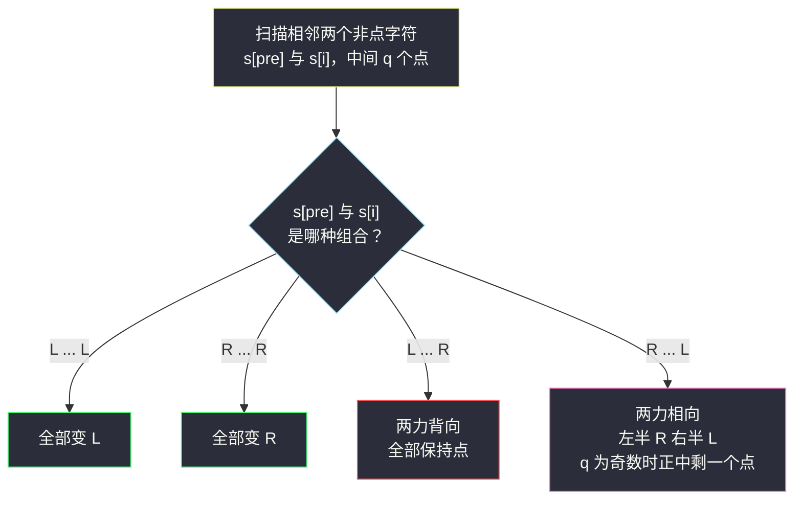
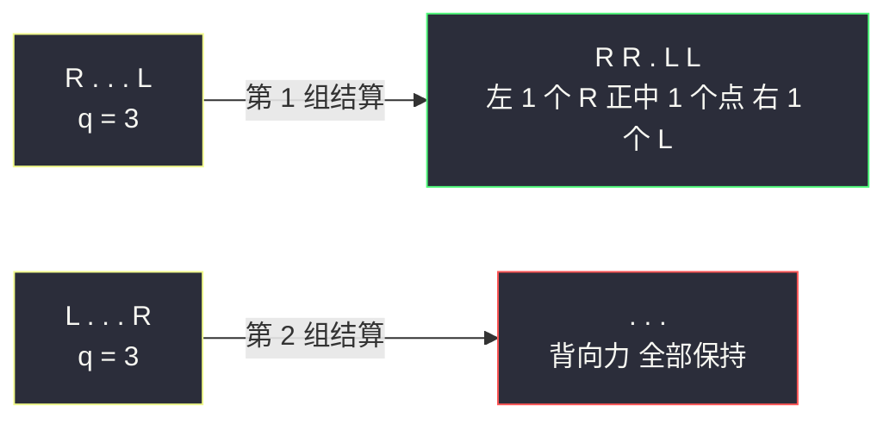

# 推多米诺（分组循环 · 哨兵 + 非点字符分段）

## 一、问题描述

`n` 张多米诺骨牌排成一行竖立。开始时同时推倒一些：`'L'` 向左倒、`'R'` 向右倒、`'.'` 仍竖立。每一秒，倒下的骨牌会把力传给相邻的竖立骨牌；若一张竖立骨牌**左右两侧同时**被推，则受力平衡保持竖立。一张骨牌一旦倒下就不再受力。求最终状态字符串。

> 🔗 LeetCode 838：https://leetcode.cn/problems/push-dominoes/

**示例 1**

```
输入: dominoes = "RR.L"
输出: "RR.L"
解释: 第一张 R 右边是已经倒下的 R，不再施力；第三张 L 左边是 R 但
      L 已倒下，不受额外力。状态不变。
```

**示例 2**

```
输入: dominoes = ".L.R...LR..L.."
输出: "LL.RR.LLRRLL.."
```

**直观理解**

一个 `'.'` 最终倒向哪边，只取决于它**左右两侧最近的非 `'.'` 字符**是谁：`L` 与 `L` 之间的点全变 `L`；`R` 与 `R` 之间全变 `R`；`L` 与 `R`「背靠背」互不侵犯，点保持原样；`R` 与 `L`「面对面」，两股力在中点相遇，偶数个点平分，奇数个点中间留一个竖立。

## 二、暴力解法（逐秒模拟）

### 直观思路

严格按题意一秒一秒推：每秒扫一遍字符串，对每个 `'.'` 判断左右邻居（注意左右**同时**受力则保持），直到整串不再变化。

```python
class Solution:
    def pushDominoes(self, dominoes: str) -> str:
        s = list(dominoes)
        n = len(s)
        while True:
            nxt = s[:]                       # 本秒之后的状态
            for i in range(n):
                if s[i] != '.':
                    continue
                left = s[i - 1] if i > 0 else '.'
                right = s[i + 1] if i + 1 < n else '.'
                if left == 'R' and right != 'L':
                    nxt[i] = 'R'
                elif right == 'L' and left != 'R':
                    nxt[i] = 'L'
            if nxt == s:                     # 不再变化：到达最终状态
                return ''.join(s)
            s = nxt
```

### 复杂度

- **时间**：`O(n²)` 最坏。`"R....L"` 这类输入每秒只「吃掉」两格点，要推进 `n/2` 秒，每秒 `O(n)`。
- **空间**：`O(n)`。

### 🔴 瓶颈在哪里

每个 `'.'` 的命运其实**一开始就已注定**——由它左右最近的非点字符唯一决定，根本不需要一秒一秒等。逐秒模拟把「传播过程」当成了计算单位，而这层过程可以被整体跳过。

## 三、优化探索（核心章节）

> 本题属于 **灵茶题单 · 六、分组循环** 的经典应用（双向力）。讲法对齐灵神的分组循环模板：把字符串按「非 `'.'` 字符」分段，**组内（两个非点字符之间的点段）一次性定型，组间互不影响**。

### 3.1 关键观察

最终状态里，所有信息都浓缩在**相邻两个非 `'.'` 字符**之间。设左边是 `s[pre]`、右边是 `s[i]`，中间夹着 `q` 个点，则只有四种情形：

| 情形 | 中间 q 个点的结局 | 原因 |
|------|------------------|------|
| `L ... L` | 全变 `L` | 左边的 L 把推力一路传到底 |
| `R ... R` | 全变 `R` | 右边的 R 的力反向传到底 |
| `L ... R` | 保持 `.` | 两力背向而行，谁也够不着中间 |
| `R ... L` | 左半 `R`、右半 `L`，`q` 为奇数时中间留 1 个 `.` | 两力相向，在中点相遇抵消 |

### 3.2 首尾两端怎么办：哨兵技巧

开头一段点（第一个非点字符之前）与结尾一段点（最后一个非点字符之后）没有配对的左/右字符。给两边各加一个**哨兵**：

```python
s = 'L' + dominoes + 'R'
```

- 开头段变成 `L ... X`：若 `X` 是 `L` 则全变 `L`（正确——真实中开头的点确实会被左边的 L 推倒）；若 `X` 是 `R` 则保持 `.`（正确）。
- 结尾段变成 `X ... R`：若 `X` 是 `R` 则全变 `R`（正确）；若 `X` 是 `L` 则保持 `.`（正确）。

两个哨兵都在「够不着中间」的安全方向上，四种情形的表格无需任何特判，首尾被统一吞进循环里。

### 3.3 分组循环怎么写

外层 `for` 找到下一个非 `'.'` 字符 `i`，与上一个非点字符 `pre` 配成一组，一次性输出「`s[pre]` 本身 + 中间 `q` 个点的结局」；`pre` 更新为 `i`。**组内（点段）一次定型，组间（非点字符本身）原样保留**。



### 3.4 为什么「一秒一秒」可以整体跳过（不变式）

模拟的每一步都是**局部的**，而四种情形的结局正是这些局部规则的**不动点**。以 `"R...L"`（`q = 3`）为例逐秒推演：第 1 秒，`R` 右邻的点被推向右、`L` 左邻的点被推向左，得 `"RR.LL"`；第 2 秒，中间那个点左右两侧同时受力，保持竖立 → 结束。最终「左右各 `q // 2 = 1` 个倒下、中间 `q % 2 = 1` 个保持」，与分组结算公式完全一致。逐秒传播的收敛结果恰好等于按段一次性结算，因此结算式计算与逐秒模拟得到同一答案，可以放心跳过全部中间步骤。

### 3.5 一句话核心

> **首尾加哨兵 `L`、`R`，按相邻两个非点字符分组，四种组合一次性定型中间的点段。**

## 四、代码实现详解

### Python（主解：分组循环 + 哨兵）

```python
class Solution:
    def pushDominoes(self, dominoes: str) -> str:
        s = 'L' + dominoes + 'R'        # 左右哨兵：都在"够不着"的安全方向
        ans = []
        pre = 0                          # 上一个非 '.' 字符的下标
        for i in range(1, len(s)):
            if s[i] == '.':              # 只在非点字符处分组结算
                continue
            q = i - pre - 1              # pre 与 i 之间点的个数
            if pre > 0:                  # 哨兵本身不写入答案
                ans.append(s[pre])
            if s[pre] == s[i]:           # L...L 或 R...R：一边倒
                ans.append(s[pre] * q)
            elif s[pre] == 'L':          # L...R：背向，互不侵犯
                ans.append('.' * q)
            else:                        # R...L：相向，对半分
                ans.append('R' * (q // 2) + '.' * (q % 2) + 'L' * (q // 2))
            pre = i                      # 组间推进：i 成为新的 pre
        return ''.join(ans)
```

**变量含义**

| 变量 | 含义 |
|------|------|
| `s` | 加了首尾哨兵的字符串 |
| `pre` | 上一个非 `'.'` 字符的下标（上一组的右边界） |
| `i` | 当前非 `'.'` 字符的下标（本组右边界） |
| `q` | 本组内 `'.'` 的个数 = `i - pre - 1` |

**循环不变式**：每次执行到分组结算时，`s[pre+1..i-1]` 全是 `'.'`，且 `ans` 恰好等于原字符串 `dominoes[0..pre-1]` 的最终状态（哨兵段已折算进开头部分）。

### Java（最优解同款）

```java
class Solution {
    public String pushDominoes(String dominoes) {
        char[] s = ("L" + dominoes + "R").toCharArray();
        StringBuilder ans = new StringBuilder();
        int pre = 0;
        for (int i = 1; i < s.length; i++) {
            if (s[i] == '.') continue;
            int q = i - pre - 1;
            if (pre > 0) ans.append(s[pre]);
            if (s[pre] == s[i]) {
                for (int t = 0; t < q; t++) ans.append(s[pre]);
            } else if (s[pre] == 'L') {
                for (int t = 0; t < q; t++) ans.append('.');
            } else {                       // R...L 对半分
                for (int t = 0; t < q / 2; t++) ans.append('R');
                if (q % 2 == 1) ans.append('.');
                for (int t = 0; t < q / 2; t++) ans.append('L');
            }
            pre = i;
        }
        return ans.toString();
    }
}
```

## 五、具体例子演示

**示例 2**：`dominoes = ".L.R...LR..L.."`，加哨兵后 `s = "L.L.R...LR..L..R"`（下标 0~15，非点字符在 0、2、4、8、9、12、15）。逐组结算：

| 组 | s[pre] | s[i] | 中间点 q | 本组输出（pre 字符 + 点段结局） | 拼接结果 |
|----|--------|------|----------|--------------------------------|----------|
| 1 | L（哨兵） | L（2） | 1 | `"L"`（L...L 全变 L） | `L` |
| 2 | L（2） | R（4） | 1 | `"L" + "."` | `L.` |
| 3 | R（4） | L（8） | 3 | `"R" + "R.L"`（q=3 奇数，正中留点） | `L.RR.L` |
| 4 | L（8） | R（9） | 0 | `"L"` | `L.RR.LL` |
| 5 | R（9） | L（12） | 2 | `"R" + "RL"`（q=2 平分） | `L.RR.LLRRL` |
| 6 | L（12） | R（哨兵） | 2 | `"L" + ".."`（L...R 保持） | `L.RR.LLRRLL..` |

最终输出 `"LL.RR.LLRRLL.."`，与预期一致。注意组 1：哨兵 `L` 与第一个 `L` 之间的开头点变 `L`；组 6：结尾两个点因左边是 `L`、右边哨兵是 `R` 而保持原样。



## 六、复杂度分析

| 方法 | 时间 | 空间 | 说明 |
|------|------|------|------|
| 逐秒模拟 | `O(n²)` 最坏 | `O(n)` | `"R....L"` 型输入要推进 n/2 秒 |
| 分组循环（主解） | `O(n)` | `O(n)` | 每个字符恰好结算一次 |
| 力叠加双扫描（见下） | `O(n)` | `O(n)` | 两遍线性扫描 |

## 七、方法对比与总结

| | 逐秒模拟 | 分组循环（主解） | 力叠加 |
|--|----------|------------------|--------|
| 思路 | 忠实复现传播 | 按非点字符分段结算 | 双向扫描算合力 |
| 分支 | 无需分类 | 四种组合，一次定型 | 无分支，靠力大小比较 |
| 时间 | `O(n²)` | `O(n)` | `O(n)` |

**力叠加法（另一等价 O(n) 解法，对照用）**

给每个位置一个力的数值：从左往右，遇到 `R` 力置为 `n`，之后每格衰减 1，遇到 `L` 立即归零；从右往左对称地施加负的力。最终力为正倒 `R`、为负倒 `L`、为零保持：

```python
class Solution:
    def pushDominoes(self, dominoes: str) -> str:
        n = len(dominoes)
        forces = [0] * n
        f = 0
        for i in range(n):              # 向右的力：n 起步每格衰减 1
            f = n if dominoes[i] == 'R' else 0 if dominoes[i] == 'L' else max(f - 1, 0)
            forces[i] = f
        f = 0
        for i in range(n - 1, -1, -1):  # 向左的力：以负数记入
            f = n if dominoes[i] == 'L' else 0 if dominoes[i] == 'R' else max(f - 1, 0)
            forces[i] -= f
        return ''.join('.' if x == 0 else 'R' if x > 0 else 'L' for x in forces)
```

**易错点**

1. `R...L` 段 `q` 为**奇数**时正中必须留一个 `.`，`'.' * (q % 2)` 别漏。
2. 哨兵方向不能反：必须左 `L` 右 `R`（各自「背向」中间），换成 `R...` 会把开头点错误地推倒。
3. `pre > 0` 的判断别漏：左哨兵本身不是答案的一部分。
4. 非点字符 `L`、`R` 本身永远不会再变化，结算时要**原样输出** `s[pre]`。

**模板（分组循环按非点字符分段）**

```python
# s = 'L' + dominoes + 'R'
# pre = 0
# for i in 1..len(s)-1:
#     if s[i] == '.': continue        # 跳过组内点
#     q = i - pre - 1                  # 组内点数
#     按 (s[pre], s[i]) 四情形一次性定型 q 个点
#     pre = i                          # 组间推进
```

## 八、举一反三

| 题目 | 关系 |
|------|------|
| [1446. 连续字符](https://leetcode.cn/problems/consecutive-characters/) | 分组循环最简形态：同字符连续段 |
| [821. 字符的最短距离](https://leetcode.cn/problems/shortest-distance-to-a-character/) | 力叠加法的姊妹：双向扫描取距离 |
| [1529. 灯泡开关 IV](https://leetcode.cn/problems/bulb-switcher-iv/) | 字符串状态翻转的最少操作，同款「看相邻差异」思维 |
| [42. 接雨水](https://leetcode.cn/problems/trapping-rain-water/) | 双向力/左右最近信息的另一经典应用 |

**思想迁移**

- 「按段整体结算」思想：当逐格传播的最终效果能被**闭式**描述时，用分组循环直接写出不动点，跳过全部中间步骤。
- 哨兵技巧通用性极强：首尾特判懒得写，就加一个「方向安全」的哨兵统一进主循环。
- 同批姊妹篇：`adjacent-increasing-subarrays-detection-ii.md`（切段 + 跨段拼接）、`count-valid-word-occurrences.md`（按分隔符分段匹配计数）。
